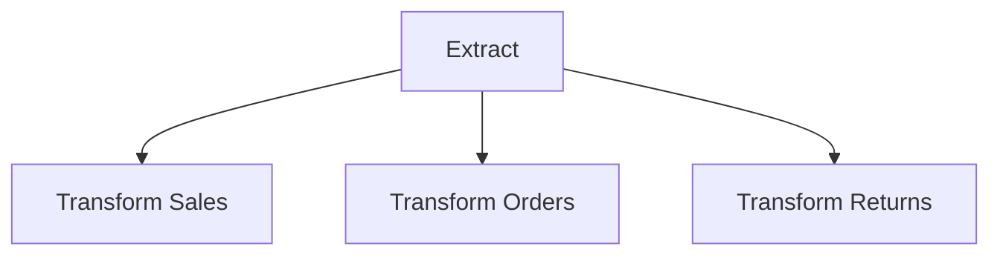
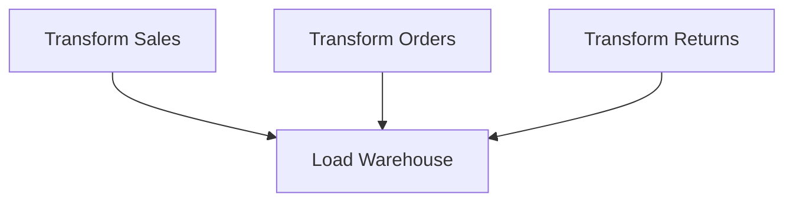
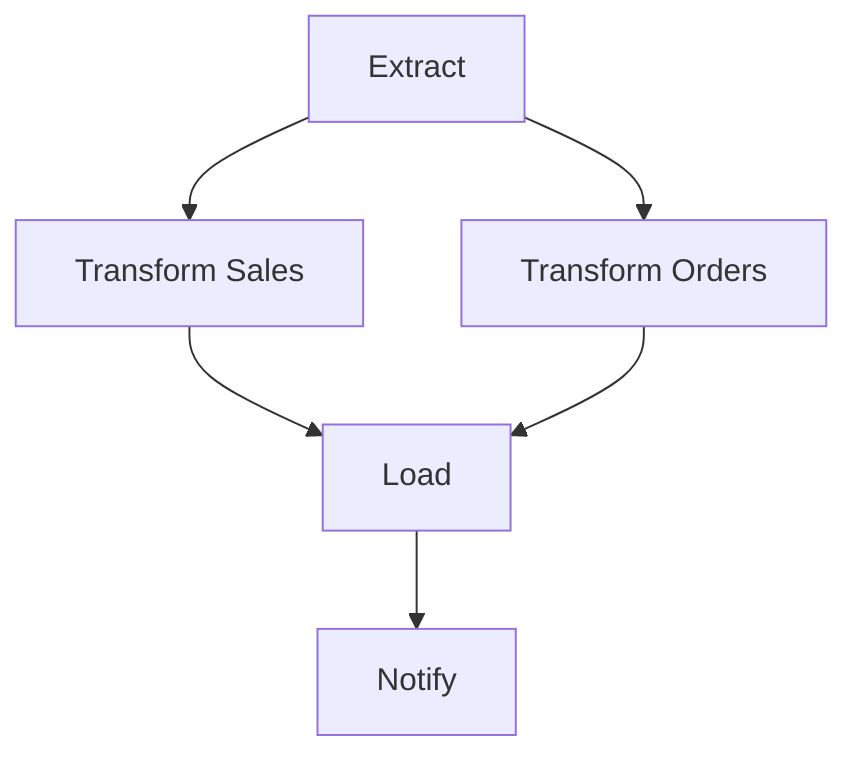
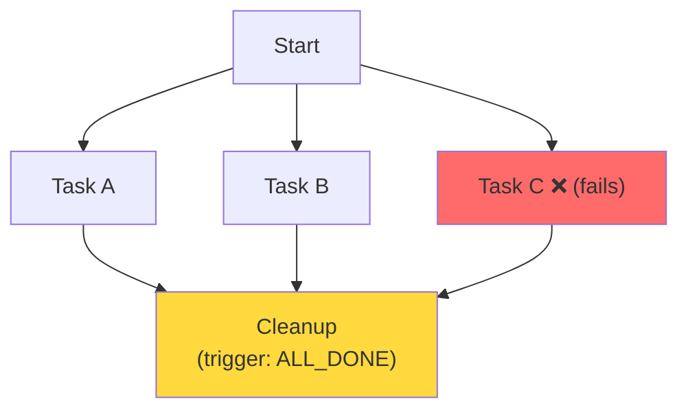
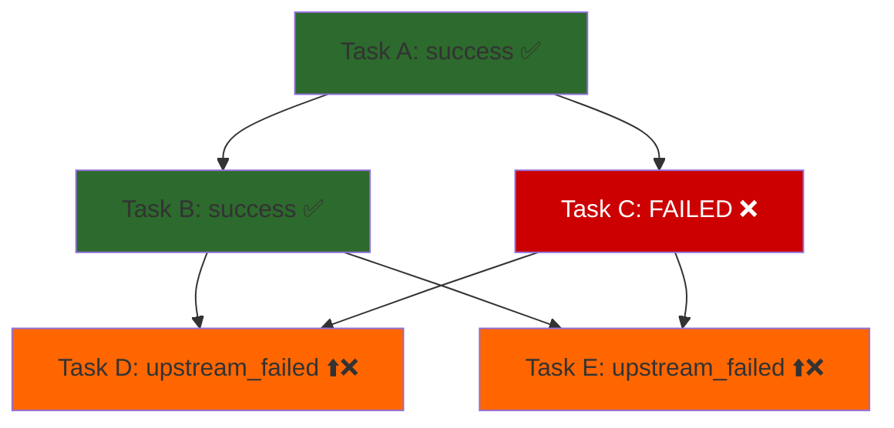

# Airflow Task Dependencies — Fundamentals

## What Are Task Dependencies?

In Airflow, **task dependencies** define the execution order of tasks within a DAG. They answer the question: "Before task B can start, which other tasks must complete, and in what state?"

Dependencies turn a collection of individual tasks into a coordinated pipeline. Without them, all tasks would run simultaneously with no guaranteed order.

> **Key Insight:** Airflow tracks not just *which* tasks run, but *the state of each task* as it runs. Dependencies are evaluated based on these states — giving you fine-grained control over what triggers what.

---

## Setting Dependencies: Three Equivalent Approaches

```python
from airflow import DAG
from airflow.operators.python import PythonOperator
from airflow.operators.empty import EmptyOperator
from datetime import datetime

with DAG('dependency_demo', start_date=datetime(2024, 1, 1), catchup=False) as dag:
    a = EmptyOperator(task_id='task_a')
    b = EmptyOperator(task_id='task_b')
    c = EmptyOperator(task_id='task_c')

# Approach 1: Bitshift operators (most common, most readable)
a >> b >> c         # a → b → c (a must succeed before b, b before c)
a << b              # b → a (b must succeed before a) — less common

# Approach 2: set_upstream / set_downstream methods
b.set_upstream(a)   # equivalent to a >> b
b.set_downstream(c) # equivalent to b >> c

# Approach 3: Lists for parallel dependencies
a >> [b, c]         # a → b AND a → c (b and c run in parallel after a)
[b, c] >> d         # both b AND c must complete before d starts
```

> **Recommendation:** Always use bitshift operators (`>>` and `<<`). They read left-to-right like a timeline and are universally understood in the Airflow community.

---

## Fan-Out and Fan-In Patterns

### Fan-Out (Parallel Execution)

One task spawns multiple parallel tasks. Use when independent work can run simultaneously.

```python
extract >> [transform_sales, transform_orders, transform_returns]
```



**When to use:** Transforming multiple independent tables in parallel after a single extraction step.

### Fan-In (Join / Convergence)

Multiple parallel tasks converge into one task that requires all predecessors to succeed.

```python
[transform_sales, transform_orders, transform_returns] >> load_warehouse
```



**When to use:** A final load step that depends on all preparation steps completing.

### Diamond (Fan-Out + Fan-In)

The most common production pattern:

```python
extract >> [transform_sales, transform_orders]
[transform_sales, transform_orders] >> load >> notify
```



---

## Trigger Rules

By default, a task only runs if **all upstream tasks succeeded**. But Airflow offers 8 trigger rules for different scenarios:

| Trigger Rule | Task runs when... | Common Use |
|-------------|------------------|-----------|
| `all_success` | All upstream tasks succeeded | Default — normal ETL pipelines |
| `all_failed` | All upstream tasks failed | Send failure alert |
| `all_done` | All upstream tasks completed (any state) | Cleanup / teardown |
| `one_success` | At least one upstream task succeeded | First result wins |
| `one_failed` | At least one upstream task failed | Alert on any failure |
| `none_failed` | No upstream tasks failed (some may be skipped) | Branches with optional steps |
| `none_failed_min_one_success` | No failures AND at least one success | Post-branching convergence |
| `always` | Unconditionally — regardless of upstream state | Cleanup/notification always needed |

### Setting a Trigger Rule

```python
from airflow.utils.trigger_rule import TriggerRule

cleanup = PythonOperator(
    task_id='cleanup_temp_files',
    python_callable=cleanup_fn,
    trigger_rule=TriggerRule.ALL_DONE,  # runs even if upstream tasks fail
)

alert_on_failure = PythonOperator(
    task_id='send_failure_alert',
    python_callable=alert_fn,
    trigger_rule=TriggerRule.ONE_FAILED,  # runs as soon as any upstream fails
)
```

---

## Trigger Rules in Practice: Common Patterns

### Pattern 1: Cleanup Always Runs

```python
start >> [task_a, task_b, task_c] >> cleanup

cleanup = PythonOperator(
    task_id='cleanup',
    python_callable=cleanup_fn,
    trigger_rule=TriggerRule.ALL_DONE,  # runs whether tasks succeed or fail
)
```



**What this shows:** Even when Task C fails, Cleanup still runs because `ALL_DONE` doesn't require success — just completion.

### Pattern 2: Failure Notification

```python
with dag:
    task_a = PythonOperator(task_id='run_etl', ...)
    
    success_notify = PythonOperator(
        task_id='notify_success',
        trigger_rule=TriggerRule.ALL_SUCCESS,  # default
    )
    
    failure_notify = PythonOperator(
        task_id='notify_failure',
        trigger_rule=TriggerRule.ONE_FAILED,
    )
    
    task_a >> [success_notify, failure_notify]
    # Only one of these will actually run, depending on task_a's outcome
```

### Pattern 3: None Failed (Post-Branch Convergence)

```python
from airflow.operators.python import BranchPythonOperator

def choose_path(**context):
    if context['execution_date'].weekday() == 0:  # Monday
        return 'full_refresh'
    return 'incremental_load'

branch = BranchPythonOperator(task_id='choose_load_type', python_callable=choose_path)
full_refresh = PythonOperator(task_id='full_refresh', ...)
incremental = PythonOperator(task_id='incremental_load', ...)

# After branching, one task will be SKIPPED. Use NONE_FAILED to allow the
# final task to run even when one branch was skipped.
notify = PythonOperator(
    task_id='notify_complete',
    trigger_rule=TriggerRule.NONE_FAILED_MIN_ONE_SUCCESS,
)

branch >> [full_refresh, incremental] >> notify
```

---

## EmptyOperator: Structure Without Work

`EmptyOperator` (formerly `DummyOperator`) is a no-op task — it does nothing but provides structural anchors in your DAG.

```python
from airflow.operators.empty import EmptyOperator

# Use as start/end markers for clarity
start = EmptyOperator(task_id='pipeline_start')
end = EmptyOperator(task_id='pipeline_end')

# Use to fan-in multiple branches before a single downstream task
join = EmptyOperator(
    task_id='join_all_branches',
    trigger_rule=TriggerRule.NONE_FAILED_MIN_ONE_SUCCESS,
)

start >> [branch_a, branch_b, branch_c]
[branch_a, branch_b, branch_c] >> join >> end
```

**When to use EmptyOperator:**
- Start/end anchors to visually delimit the pipeline in the UI
- Join point after branching (set the trigger rule on the join task)
- Placeholder during development before real task logic is written
- Group coordination in complex DAGs

---

## Task State Flow

Understanding how states flow through the dependency graph is essential:



**What this shows:** When Task C fails, Tasks D and E both get `upstream_failed` automatically. They never execute. The cascade stops here — if D had downstream tasks, they'd also become `upstream_failed`.

### State Propagation Rules

| Upstream State | Downstream Behavior (default: all_success) |
|---------------|-------------------------------------------|
| `success` | Eligible to run |
| `failed` | Becomes `upstream_failed`, does not run |
| `skipped` | Becomes `upstream_failed` (!) unless you use `none_failed` |
| `upstream_failed` | Cascades — also becomes `upstream_failed` |

> **Gotcha:** A `skipped` task propagates as `upstream_failed` to the next task when `trigger_rule=all_success`. This surprises many people when using BranchPythonOperator. Use `trigger_rule=NONE_FAILED_MIN_ONE_SUCCESS` after branches.

---

## Visualizing Dependencies in the DAG Graph

Airflow's UI provides two dependency views:

1. **Graph view** — shows task nodes and dependency arrows, color-coded by state
2. **Grid view** — shows task states across multiple DAG runs as a matrix

Use the Graph view when debugging dependency issues — you can see exactly which task caused a cascade of `upstream_failed` states.

---

## Quick Reference

```python
# Simple linear chain
a >> b >> c >> d

# Parallel execution
a >> [b, c, d]

# Fan-in (join)
[b, c, d] >> e

# Full diamond
a >> [b, c] >> d

# Conditional (branching)
from airflow.utils.trigger_rule import TriggerRule
branch >> [left, right]
[left, right] >> join  # join needs trigger_rule if one branch is skipped

# Cleanup task that always runs
cleanup = EmptyOperator(
    task_id='cleanup',
    trigger_rule=TriggerRule.ALL_DONE
)
[a, b, c] >> cleanup

# Task that runs only on failure
alert = PythonOperator(
    task_id='alert',
    trigger_rule=TriggerRule.ONE_FAILED
)
[a, b, c] >> alert
```

---

## Interview Tips

> **Tip 1:** "What's the difference between `>>` and `set_downstream()`?" — "They're identical — `>>` is syntactic sugar for `set_downstream()`. `a >> b` means 'a must complete before b starts.' I always use `>>` because it reads left-to-right like a timeline and is what the community expects."

> **Tip 2:** "What trigger_rule would you use for a notification task that should always run, even if the pipeline failed?" — "`TriggerRule.ALL_DONE` runs the task when all upstream tasks have reached a terminal state (success, failed, or skipped) — regardless of which state. For a cleanup or always-notify pattern, this is the correct choice."

> **Tip 3:** "Why do tasks after a BranchPythonOperator become `upstream_failed`?" — "When a branch is not chosen, that branch task becomes `skipped`. The default trigger rule (`all_success`) treats skipped as equivalent to failed for propagation purposes. The fix is to use `trigger_rule=NONE_FAILED_MIN_ONE_SUCCESS` on the convergence task, which says 'run as long as nothing actually failed — skipped is okay.'"
