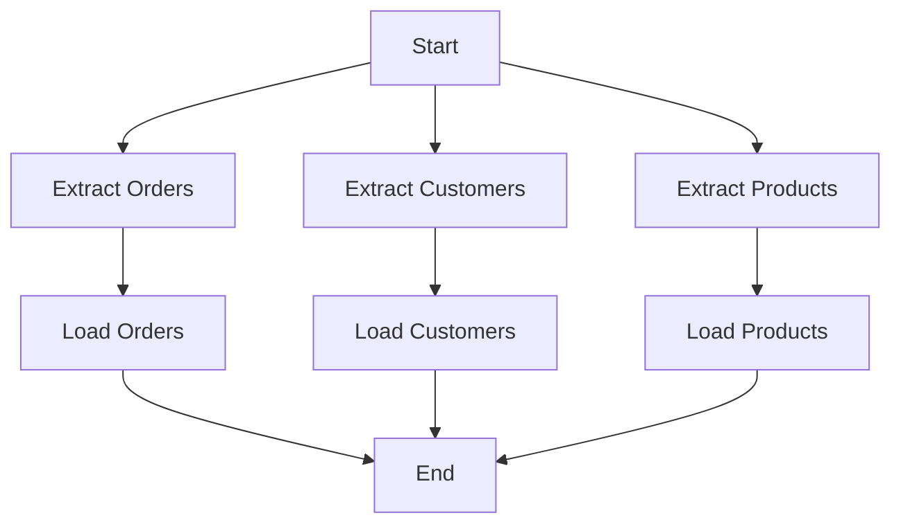
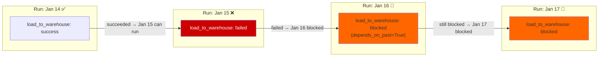

# Airflow Task Dependencies — Intermediate

## Cross-DAG Dependencies

Real-world data platforms have dozens of DAGs. Often, DAG B should only run after DAG A completes. Airflow offers two primary mechanisms for cross-DAG dependencies.

---

## ExternalTaskSensor

An `ExternalTaskSensor` pauses execution until a task in **another DAG** reaches a specified state. The sensor polls the Airflow metadata database — not the external system itself.

```python
from airflow import DAG
from airflow.sensors.external_task import ExternalTaskSensor
from airflow.operators.python import PythonOperator
from datetime import datetime, timedelta

with DAG(
    dag_id='downstream_dag',
    start_date=datetime(2024, 1, 1),
    schedule_interval='0 8 * * *',   # runs at 8 AM
    catchup=False,
) as dag:

    # Wait for upstream DAG to complete
    wait_for_upstream = ExternalTaskSensor(
        task_id='wait_for_upstream_etl',
        external_dag_id='upstream_etl_dag',     # which DAG to watch
        external_task_id='final_load_task',     # which task to watch (None = whole DAG run)
        execution_date_fn=lambda dt: dt,        # map this DAG's execution date to upstream's
        mode='reschedule',                      # releases slot between polls
        poke_interval=60,                       # poll every 60 seconds
        timeout=3600,                           # fail after 1 hour if not found
        allowed_states=['success'],             # what state to look for
        failed_states=['failed', 'skipped'],    # if upstream hits this state, fail sensor immediately
    )

    process_downstream = PythonOperator(
        task_id='process_data',
        python_callable=process_fn,
    )

    wait_for_upstream >> process_downstream
```

### execution_date_fn — Handling Schedule Offsets

The most common ExternalTaskSensor bug: the two DAGs don't run on the same schedule, so `execution_date` values don't align.

```python
# Scenario: upstream runs hourly, downstream runs daily at 8 AM
# When downstream runs for 2024-01-15, it needs upstream's last run
# from 2024-01-14 at 23:00

from datetime import timedelta

# Option 1: Offset — upstream ran 9 hours before downstream
wait_for_upstream = ExternalTaskSensor(
    task_id='wait_for_upstream',
    external_dag_id='hourly_upstream',
    execution_delta=timedelta(hours=9),  # look 9 hours back in upstream's history
    ...
)

# Option 2: Lambda function for complex mapping
def map_execution_date(logical_date):
    """For daily DAG running at 8 AM, find last night's upstream run."""
    return logical_date.replace(hour=23, minute=0)

wait_for_upstream = ExternalTaskSensor(
    task_id='wait_for_upstream',
    external_dag_id='hourly_upstream',
    execution_date_fn=map_execution_date,
    ...
)
```

> **Always use `mode='reschedule'`** for ExternalTaskSensor in production. The default `poke` mode holds a worker slot for the entire wait duration, which can starve other tasks.

---

## TriggerDagRunOperator

Instead of waiting for an upstream DAG to finish, you can actively **trigger another DAG to run**. Use this when DAG A should kick off DAG B as part of its pipeline.

```python
from airflow.operators.trigger_dagrun import TriggerDagRunOperator

with DAG('orchestrator_dag', start_date=datetime(2024, 1, 1), catchup=False) as dag:

    run_ingestion = PythonOperator(
        task_id='run_ingestion',
        python_callable=ingestion_fn,
    )

    # Trigger the transformation DAG after ingestion completes
    trigger_transform = TriggerDagRunOperator(
        task_id='trigger_transformation_dag',
        trigger_dag_id='transformation_dag',
        conf={'date': '{{ ds }}', 'source': 'api'},  # pass context to triggered DAG
        wait_for_completion=True,       # block until triggered DAG completes
        poke_interval=30,               # poll every 30s when waiting
        reset_dag_run=False,            # don't reset if a run already exists
        execution_date='{{ ds }}T00:00:00',
    )

    run_ingestion >> trigger_transform
```

### ExternalTaskSensor vs TriggerDagRunOperator

| Aspect | ExternalTaskSensor | TriggerDagRunOperator |
|--------|-------------------|----------------------|
| **Direction** | Downstream pulls (waits) | Upstream pushes (triggers) |
| **Coupling** | Downstream knows about upstream | Upstream knows about downstream |
| **Use when** | You own the downstream DAG | You own the upstream DAG |
| **Best for** | Team boundary dependencies | Orchestrator/sub-DAG pattern |
| **Schedule alignment** | Requires careful `execution_date_fn` | Less schedule-sensitive |

---

## Dynamic Dependencies in Loops

When you need to create dependencies programmatically:

```python
from airflow import DAG
from airflow.operators.python import PythonOperator
from datetime import datetime

tables = ['orders', 'customers', 'products', 'inventory', 'returns']

with DAG('dynamic_dependencies', start_date=datetime(2024, 1, 1), catchup=False) as dag:

    start = EmptyOperator(task_id='start')
    end = EmptyOperator(task_id='end')

    # Generate tasks dynamically
    extract_tasks = []
    load_tasks = []

    for table in tables:
        extract = PythonOperator(
            task_id=f'extract_{table}',
            python_callable=extract_fn,
            op_kwargs={'table': table},
        )

        load = PythonOperator(
            task_id=f'load_{table}',
            python_callable=load_fn,
            op_kwargs={'table': table},
        )

        # Sequential within each table's pipeline
        extract >> load

        extract_tasks.append(extract)
        load_tasks.append(load)

    # All extracts run in parallel after start
    start >> extract_tasks

    # End waits for all loads to complete
    load_tasks >> end
```



> **Caution:** Generating tasks in a Python loop is simple but creates a static DAG with a fixed structure at parse time. For truly dynamic DAG structures that change per run, use dynamic task mapping (covered in the dynamic-dags topic).

---

## depends_on_past

`depends_on_past=True` on a task means: "don't run this task unless the same task from the **previous DAG run** succeeded."

```python
# This task will only run if yesterday's load_to_warehouse succeeded
load_to_warehouse = PythonOperator(
    task_id='load_to_warehouse',
    python_callable=load_fn,
    depends_on_past=True,   # ← gates this task on its previous run
)
```

**Use cases:**
- Incremental loads that build on previous state (can't run today if yesterday's load failed)
- Cumulative aggregations that require previous periods to be complete
- Sequential file processing where each file depends on the previous

**Risks:**
- If a run fails, all subsequent runs of that task are blocked until cleared
- Can cause "dependency chains" of blocked runs during extended outages
- The very first run (no previous run exists) still proceeds normally



---

## wait_for_downstream

A related parameter — `wait_for_downstream=True` means: "don't start a new run of this task until the PREVIOUS run's downstream tasks have all completed."

```python
extract = PythonOperator(
    task_id='extract',
    python_callable=extract_fn,
    wait_for_downstream=True,   # wait for transform + load from prev run to finish
)

transform = PythonOperator(task_id='transform', python_callable=transform_fn)
load = PythonOperator(task_id='load', python_callable=load_fn)

extract >> transform >> load
```

**Use case:** When you have fast-running DAGs (e.g., every 5 minutes) and tasks that take longer than the interval. `wait_for_downstream` prevents the new run from starting until the previous run's full pipeline completes.

---

## Complex DAG Shapes

### Conditional Chains with Task Groups

```python
from airflow.utils.task_group import TaskGroup

with DAG('complex_pipeline', start_date=datetime(2024, 1, 1), catchup=False) as dag:

    start = EmptyOperator(task_id='start')

    with TaskGroup('ingestion', tooltip='Data ingestion tasks') as ingestion_group:
        extract_api = PythonOperator(task_id='extract_api', ...)
        extract_db = PythonOperator(task_id='extract_db', ...)

    with TaskGroup('transformation', tooltip='Data transformation') as transform_group:
        clean = PythonOperator(task_id='clean', ...)
        enrich = PythonOperator(task_id='enrich', ...)
        validate = PythonOperator(task_id='validate', ...)
        clean >> enrich >> validate

    with TaskGroup('loading', tooltip='Load to warehouse') as load_group:
        load_fact = PythonOperator(task_id='load_fact', ...)
        load_dim = PythonOperator(task_id='load_dim', ...)

    end = EmptyOperator(task_id='end')

    start >> ingestion_group >> transform_group >> load_group >> end
```

### Multi-Source Convergence

```python
# Multiple independent source DAGs, one downstream consumer
from airflow.sensors.external_task import ExternalTaskSensor

with DAG('consolidated_reporting', start_date=datetime(2024, 1, 1), catchup=False) as dag:

    wait_for_sales = ExternalTaskSensor(
        task_id='wait_sales_etl',
        external_dag_id='sales_etl',
        external_task_id=None,   # wait for entire DAG run
        mode='reschedule',
    )

    wait_for_marketing = ExternalTaskSensor(
        task_id='wait_marketing_etl',
        external_dag_id='marketing_etl',
        external_task_id=None,
        mode='reschedule',
    )

    wait_for_finance = ExternalTaskSensor(
        task_id='wait_finance_etl',
        external_dag_id='finance_etl',
        external_task_id=None,
        mode='reschedule',
    )

    # Only run report when ALL three source ETLs are done
    build_consolidated_report = PythonOperator(
        task_id='build_consolidated_report',
        python_callable=build_report_fn,
    )

    [wait_for_sales, wait_for_marketing, wait_for_finance] >> build_consolidated_report
```

---

## Priority Weight + Dependencies Interaction

Priority weights interact with dependencies: a task can't run until its upstream tasks succeed, regardless of priority. Priority only matters when choosing between tasks that are *ready to run* simultaneously.

```python
# Even though task_b has priority 100, it cannot start until task_a finishes
task_a >> task_b  # dependency enforced
task_b = PythonOperator(priority_weight=100)   # priority has no effect here
                                                # until task_a completes
```

---

## Interview Tips

> **Tip 1:** "When would you use ExternalTaskSensor vs TriggerDagRunOperator?" — "ExternalTaskSensor is pull-based: the downstream DAG watches for the upstream to complete. Use it when teams own different DAGs and the downstream team wants to declare a dependency without modifying the upstream. TriggerDagRunOperator is push-based: the upstream DAG actively kicks off the downstream. Use it in an orchestrator pattern where one master DAG coordinates multiple child DAGs."

> **Tip 2:** "What's the risk of `depends_on_past=True`?" — "If a run fails, every subsequent run of that task is blocked until the failure is manually cleared. During an extended outage, you can end up with a chain of blocked runs spanning days. I use it selectively — only for tasks that genuinely can't run if the previous run failed (like incremental loads that build state). I also make sure to document the recovery procedure for the team."

> **Tip 3:** "How do you handle different schedules between upstream and downstream DAGs in ExternalTaskSensor?" — "Using `execution_date_fn`. If upstream runs hourly and downstream runs daily, the daily DAG's `execution_date` won't match any hourly run. I use `execution_date_fn` to map the downstream's logical date to the correct upstream run's date — for example, `lambda dt: dt.replace(hour=23, minute=0)` to look for the last hourly run of the day."
