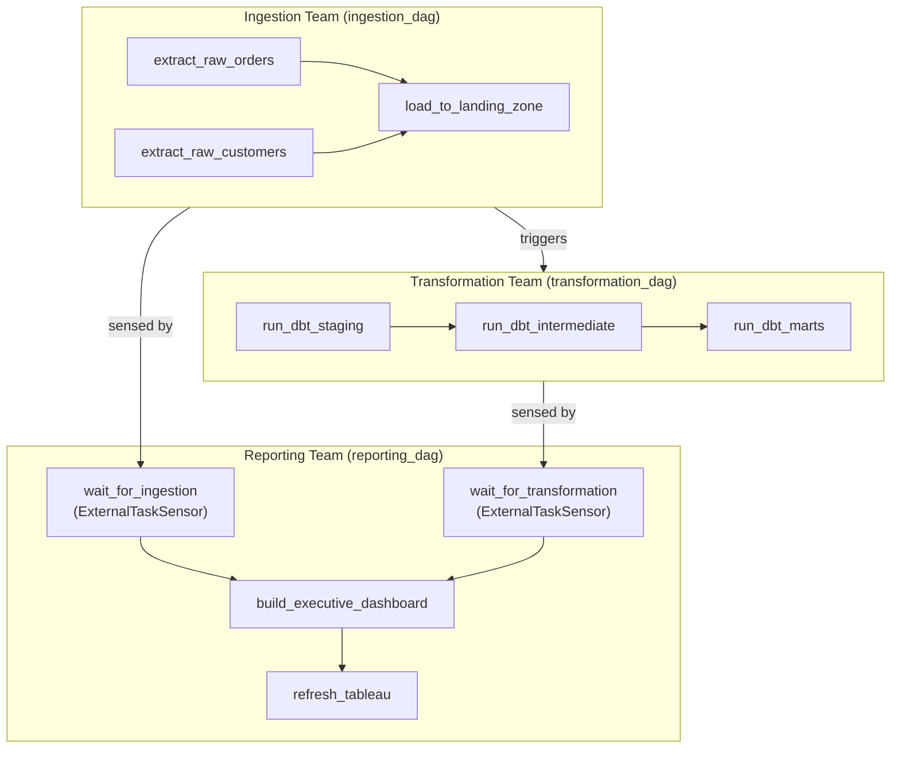

# Airflow Task Dependencies — Real-World Scenarios

## Scenario 1: Multi-Team DAG with Complex Dependencies

### Context

A retail company has three data teams: Ingestion (raw data loading), Transformation (dbt models), and Reporting (BI layer). Each team owns their DAGs independently. The reporting team's dashboard DAG must only run after both the ingestion and transformation DAGs complete successfully — but the teams deploy independently and can't modify each other's DAGs.

### Solution: ExternalTaskSensor with Robust Configuration



### Full Implementation

```python
# ingestion_dag.py — owned by Ingestion team
from airflow import DAG
from airflow.operators.python import PythonOperator
from airflow.operators.trigger_dagrun import TriggerDagRunOperator
from airflow.operators.empty import EmptyOperator
from datetime import datetime, timedelta

with DAG(
    dag_id='ingestion_dag',
    start_date=datetime(2024, 1, 1),
    schedule_interval='0 5 * * *',   # 5 AM UTC
    catchup=False,
    max_active_runs=1,
    tags=['ingestion', 'raw'],
) as ingestion_dag:

    extract_orders = PythonOperator(
        task_id='extract_raw_orders',
        python_callable=extract_orders_fn,
        retries=3,
        retry_delay=timedelta(minutes=5),
    )

    extract_customers = PythonOperator(
        task_id='extract_raw_customers',
        python_callable=extract_customers_fn,
        retries=3,
    )

    load_landing = PythonOperator(
        task_id='load_to_landing_zone',
        python_callable=load_fn,
    )

    # Ingestion team triggers the transformation DAG as the last step
    trigger_transform = TriggerDagRunOperator(
        task_id='trigger_transformation',
        trigger_dag_id='transformation_dag',
        conf={'triggered_by': 'ingestion_dag', 'date': '{{ ds }}'},
        wait_for_completion=False,     # fire and forget — don't block ingestion DAG
        execution_date='{{ logical_date }}',
    )

    [extract_orders, extract_customers] >> load_landing >> trigger_transform
```

```python
# reporting_dag.py — owned by Reporting team
from airflow import DAG
from airflow.sensors.external_task import ExternalTaskSensor
from airflow.operators.python import PythonOperator
from airflow.operators.empty import EmptyOperator
from datetime import datetime, timedelta

def build_dashboard():
    """Build executive dashboard tables in Snowflake."""
    pass

def refresh_tableau():
    """Trigger Tableau workbook refresh via REST API."""
    import requests
    # Tableau Server REST API call
    pass

with DAG(
    dag_id='reporting_dag',
    start_date=datetime(2024, 1, 1),
    schedule_interval='0 7 * * *',   # 7 AM — after ingestion + transform expected to finish
    catchup=False,
    max_active_runs=1,
    tags=['reporting', 'bi', 'sla'],
) as reporting_dag:

    # Wait for ingestion to complete (same execution date)
    wait_ingestion = ExternalTaskSensor(
        task_id='wait_for_ingestion',
        external_dag_id='ingestion_dag',
        external_task_id='load_to_landing_zone',  # specific task — not entire DAG
        execution_date_fn=lambda dt: dt.replace(hour=5, minute=0),  # map to 5 AM run
        mode='reschedule',           # critical: don't hold worker slot
        poke_interval=120,           # poll every 2 minutes
        timeout=7200,                # fail if not done within 2 hours
        allowed_states=['success'],
        failed_states=['failed', 'skipped'],
        soft_fail=False,             # fail hard if ingestion failed
    )

    # Wait for transformation to complete
    wait_transform = ExternalTaskSensor(
        task_id='wait_for_transformation',
        external_dag_id='transformation_dag',
        external_task_id='run_dbt_marts',
        execution_date_fn=lambda dt: dt.replace(hour=5, minute=0),
        mode='reschedule',
        poke_interval=120,
        timeout=7200,
        allowed_states=['success'],
        failed_states=['failed'],
        soft_fail=False,
    )

    build = PythonOperator(
        task_id='build_executive_dashboard',
        python_callable=build_dashboard,
        sla=timedelta(hours=1),      # must complete within 1 hour of starting
    )

    refresh = PythonOperator(
        task_id='refresh_tableau',
        python_callable=refresh_tableau,
        retries=2,
        retry_delay=timedelta(minutes=5),
    )

    # Both sensors must complete before building the report
    [wait_ingestion, wait_transform] >> build >> refresh
```

---

## Scenario 2: Dataset-Driven Scheduling Replacing Sensors

### Context

The same retail company migrates from ExternalTaskSensor to Airflow 2.4+ Datasets. The team wants to eliminate polling overhead, get built-in data lineage, and decouple teams via data contracts instead of DAG/task IDs.

### Before: Polling-Based

```python
# Old approach: consumer polls producer every 2 minutes
wait_for_ingestion = ExternalTaskSensor(
    external_dag_id='ingestion_dag',
    external_task_id='load_to_landing_zone',
    poke_interval=120,    # 120 polls per day per sensor
    mode='reschedule',
)
```

### After: Dataset-Based (Event-Driven)

```python
# datasets.py — shared contract between teams (stored in shared library)
from airflow import Dataset

LANDING_ZONE_ORDERS = Dataset('s3://datalake/landing/orders/')
LANDING_ZONE_CUSTOMERS = Dataset('s3://datalake/landing/customers/')
SNOWFLAKE_MARTS = Dataset('snowflake://warehouse/marts/executive_summary')
```

```python
# ingestion_dag.py — producer declares outlets
from airflow import DAG, Dataset
from airflow.operators.python import PythonOperator
from datasets import LANDING_ZONE_ORDERS, LANDING_ZONE_CUSTOMERS

with DAG(
    dag_id='ingestion_dag',
    start_date=datetime(2024, 1, 1),
    schedule_interval='0 5 * * *',
    catchup=False,
) as dag:

    extract_orders = PythonOperator(
        task_id='extract_raw_orders',
        python_callable=extract_orders_fn,
        outlets=[LANDING_ZONE_ORDERS],      # ← "I produce this dataset"
    )

    extract_customers = PythonOperator(
        task_id='extract_raw_customers',
        python_callable=extract_customers_fn,
        outlets=[LANDING_ZONE_CUSTOMERS],   # ← "I produce this dataset"
    )

    extract_orders >> extract_customers     # still sequential within DAG
```

```python
# transformation_dag.py — consumes ingestion datasets, produces marts dataset
from airflow import DAG, Dataset
from airflow.operators.bash import BashOperator
from datasets import LANDING_ZONE_ORDERS, LANDING_ZONE_CUSTOMERS, SNOWFLAKE_MARTS

with DAG(
    dag_id='transformation_dag',
    # Triggered automatically when BOTH landing zone datasets are updated
    schedule=[LANDING_ZONE_ORDERS, LANDING_ZONE_CUSTOMERS],
    start_date=datetime(2024, 1, 1),
    catchup=False,
) as dag:

    run_dbt = BashOperator(
        task_id='run_dbt_models',
        bash_command='dbt run --target prod --models marts.executive_summary',
        inlets=[LANDING_ZONE_ORDERS, LANDING_ZONE_CUSTOMERS],
        outlets=[SNOWFLAKE_MARTS],          # ← "I produce this dataset"
    )
```

```python
# reporting_dag.py — triggered when marts dataset is ready
from airflow import DAG, Dataset
from airflow.operators.python import PythonOperator
from datasets import SNOWFLAKE_MARTS

with DAG(
    dag_id='reporting_dag',
    schedule=[SNOWFLAKE_MARTS],             # ← triggered when marts dataset updated
    start_date=datetime(2024, 1, 1),
    catchup=False,
) as dag:

    build_report = PythonOperator(
        task_id='build_executive_dashboard',
        python_callable=build_dashboard_fn,
        inlets=[SNOWFLAKE_MARTS],
    )

    refresh_tableau = PythonOperator(
        task_id='refresh_tableau',
        python_callable=refresh_fn,
    )

    build_report >> refresh_tableau
```

### Benefits Realized

| Metric | Before (Sensors) | After (Datasets) |
|--------|-----------------|-----------------|
| Worker slots consumed waiting | ~3 per day per sensor | 0 |
| Polling calls to metadata DB | 360/day (every 2 min × 3 sensors) | 0 (event-driven) |
| Data lineage visibility | None | Full producer→consumer graph in Airflow UI |
| Cross-team coupling | Sensor knows DAG ID + task ID | Teams share dataset URIs only |

---

## Scenario 3: Debugging a Stuck Pipeline Caused by Trigger Rule Misconfiguration

### Context

A pipeline processes data from 5 regional databases. After adding a "send final report" notification task, the notification never fires. The team can't figure out why — some regional tasks succeed, some are skipped (the region is empty), but the notification task stays stuck.

### The Bug

```python
# BUGGY VERSION — notification never fires when any region is empty

regions = ['us', 'eu', 'apac', 'latam', 'mena']

region_tasks = [
    PythonOperator(
        task_id=f'process_{region}',
        python_callable=process_region,
        op_kwargs={'region': region},
    )
    for region in regions
]

# BUG: default trigger_rule=all_success
# If ANY region task is skipped (empty region), this never fires
send_report = PythonOperator(
    task_id='send_final_report',
    python_callable=send_report_fn,
    # trigger_rule not set → defaults to all_success
)

region_tasks >> send_report
```

### Diagnosis

```
Task states after run:
  process_us:    success ✅
  process_eu:    success ✅
  process_apac:  skipped ⏭️  (region had no data — BranchPythonOperator skipped it)
  process_latam: success ✅
  process_mena:  skipped ⏭️

send_final_report: upstream_failed ❌
  → Reason: all_success trigger rule, but 2 upstream tasks are 'skipped'
  → 'skipped' propagates as failure to all_success tasks
```

### The Fix

```python
from airflow.utils.trigger_rule import TriggerRule

# FIXED VERSION — runs as long as no actual failures occur
send_report = PythonOperator(
    task_id='send_final_report',
    python_callable=send_report_fn,
    trigger_rule=TriggerRule.NONE_FAILED_MIN_ONE_SUCCESS,
    # "Run if: no failures AND at least one upstream succeeded"
    # Skipped tasks are acceptable — won't block this task
)
```

### Extended Pattern: Full Pipeline with Correct Trigger Rules

```python
from airflow import DAG
from airflow.operators.python import BranchPythonOperator, PythonOperator
from airflow.operators.empty import EmptyOperator
from airflow.utils.trigger_rule import TriggerRule
from datetime import datetime

def check_region_has_data(region: str, **context) -> str:
    """Return task_id to execute based on data availability."""
    has_data = check_data_api(region, context['ds'])
    if has_data:
        return f'process_{region}'
    return f'skip_{region}'

with DAG('multi_region_pipeline', start_date=datetime(2024, 1, 1), catchup=False) as dag:

    start = EmptyOperator(task_id='start')

    region_end_tasks = []

    for region in ['us', 'eu', 'apac', 'latam', 'mena']:

        # Branch: check if region has data
        branch = BranchPythonOperator(
            task_id=f'check_{region}',
            python_callable=check_region_has_data,
            op_kwargs={'region': region},
        )

        # Process path
        process = PythonOperator(
            task_id=f'process_{region}',
            python_callable=process_region_fn,
            op_kwargs={'region': region},
        )

        # Skip path (explicit EmptyOperator for the "no data" branch)
        skip = EmptyOperator(task_id=f'skip_{region}')

        # Join: region-level join after branch
        # NONE_FAILED_MIN_ONE_SUCCESS: succeeds if process ran, OR if skip ran (not failure)
        region_join = EmptyOperator(
            task_id=f'join_{region}',
            trigger_rule=TriggerRule.NONE_FAILED_MIN_ONE_SUCCESS,
        )

        start >> branch >> [process, skip]
        [process, skip] >> region_join
        region_end_tasks.append(region_join)

    # Final report: runs after all regions complete (success OR skip — no failures)
    send_report = PythonOperator(
        task_id='send_final_report',
        python_callable=send_report_fn,
        trigger_rule=TriggerRule.NONE_FAILED_MIN_ONE_SUCCESS,
    )

    # Cleanup always runs, even if report fails
    cleanup = EmptyOperator(
        task_id='cleanup',
        trigger_rule=TriggerRule.ALL_DONE,
    )

    region_end_tasks >> send_report >> cleanup
```

### Key Lessons

| Mistake | Symptom | Fix |
|---------|---------|-----|
| `all_success` after BranchPythonOperator | Downstream never runs (skipped branch propagates as failure) | Use `NONE_FAILED_MIN_ONE_SUCCESS` |
| `all_success` on cleanup | Cleanup skipped when pipeline fails | Use `ALL_DONE` |
| Not setting trigger_rule on join after optional steps | Pipeline appears to fail but no error message | Always explicitly set trigger_rule on convergence tasks |
| Using `none_failed` when you need at least one success | Join runs even if all branches were skipped | Use `NONE_FAILED_MIN_ONE_SUCCESS` not `NONE_FAILED` |
