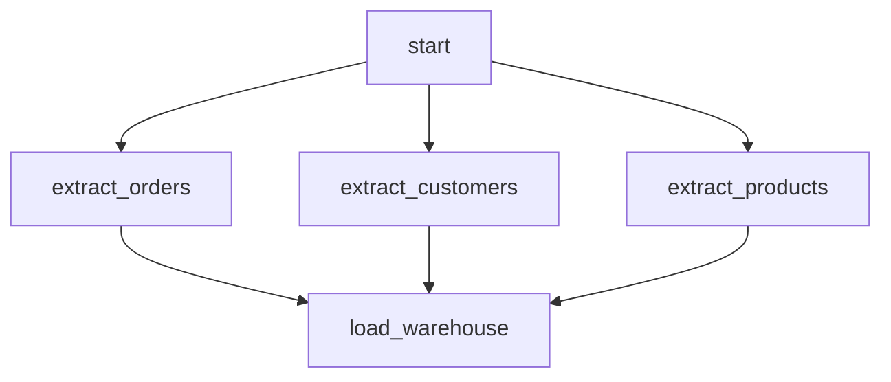

# Airflow Task Dependencies — Scenario Questions

<article data-difficulty="junior">

## 🟢 Question 1: Set Up a Fan-Out and Fan-In Dependency Pattern

You're building a daily ETL pipeline that extracts data from three sources (orders, customers, products) in parallel, then loads all results into a data warehouse once all three extractions are complete. Draw the dependency structure and write the code.

<details>
<summary>💡 Hint</summary>

Think about which operator runs first, which three run in parallel, and what must happen before the final step. Use lists with the `>>` operator to express parallel execution.

</details>

<details>
<summary>✅ Solution</summary>

### The Diamond Pattern: Fan-Out then Fan-In



```python
from airflow import DAG
from airflow.operators.python import PythonOperator
from airflow.operators.empty import EmptyOperator
from datetime import datetime

with DAG(
    dag_id='parallel_etl',
    start_date=datetime(2024, 1, 1),
    schedule_interval='@daily',
    catchup=False,
) as dag:

    start = EmptyOperator(task_id='start')

    # Three extractions — will run in parallel
    extract_orders = PythonOperator(
        task_id='extract_orders',
        python_callable=lambda: print("Extracting orders"),
    )

    extract_customers = PythonOperator(
        task_id='extract_customers',
        python_callable=lambda: print("Extracting customers"),
    )

    extract_products = PythonOperator(
        task_id='extract_products',
        python_callable=lambda: print("Extracting products"),
    )

    # Final load — waits for ALL three extractions
    load = PythonOperator(
        task_id='load_warehouse',
        python_callable=lambda: print("Loading to warehouse"),
    )

    # Fan-out: start → [3 parallel tasks]
    start >> [extract_orders, extract_customers, extract_products]

    # Fan-in: [3 parallel tasks] → load
    [extract_orders, extract_customers, extract_products] >> load
```

**Key points:**
- `start >> [a, b, c]` makes a, b, c run in parallel after start
- `[a, b, c] >> load` means load waits for ALL three (default `all_success` trigger rule)
- If any extraction fails, `load` gets `upstream_failed` and doesn't run
- The three extractions have no dependency on each other — they run simultaneously

</details>
</article>

---

<article data-difficulty="junior">

## 🟢 Question 2: Use Trigger Rules for Cleanup and Failure Notification

You have a pipeline with three processing tasks. You need: (1) a cleanup task that always runs regardless of whether the pipeline succeeded or failed, and (2) a notification task that only sends an alert when something fails. Write the task structure and trigger rules.

<details>
<summary>💡 Hint</summary>

Different trigger rules evaluate upstream states differently. Think: what state combination should trigger cleanup? What state combination should trigger failure notification?

</details>

<details>
<summary>✅ Solution</summary>

### Two Parallel Exit Paths with Different Trigger Rules

```python
from airflow import DAG
from airflow.operators.python import PythonOperator
from airflow.operators.empty import EmptyOperator
from airflow.utils.trigger_rule import TriggerRule
from datetime import datetime

def send_failure_alert(**context):
    """Send PagerDuty alert when pipeline fails."""
    failed_tasks = context.get('failed_tasks', [])
    print(f"ALERT: Pipeline failed! Tasks: {failed_tasks}")

def cleanup_temp_files(**context):
    """Remove temporary files regardless of pipeline outcome."""
    print("Cleaning up temp files and staging tables...")

with DAG('pipeline_with_notifications', start_date=datetime(2024, 1, 1), catchup=False) as dag:

    extract = PythonOperator(task_id='extract', python_callable=lambda: None)
    transform = PythonOperator(task_id='transform', python_callable=lambda: None)
    load = PythonOperator(task_id='load', python_callable=lambda: None)

    # Only runs if something failed — ONE_FAILED: at least one upstream failed
    failure_alert = PythonOperator(
        task_id='send_failure_alert',
        python_callable=send_failure_alert,
        trigger_rule=TriggerRule.ONE_FAILED,     # ← triggers if any upstream fails
    )

    # Always runs — ALL_DONE: all upstream reached terminal state (any state)
    cleanup = PythonOperator(
        task_id='cleanup',
        python_callable=cleanup_temp_files,
        trigger_rule=TriggerRule.ALL_DONE,       # ← runs regardless of success/failure
    )

    extract >> transform >> load
    [extract, transform, load] >> failure_alert  # alert if any of these fails
    [extract, transform, load] >> cleanup        # cleanup always

# Result:
# Happy path: extract✅ → transform✅ → load✅ → cleanup✅ (failure_alert skipped)
# Failure:    extract✅ → transform❌ → load upstream_failed
#             → failure_alert fires (ONE_FAILED)
#             → cleanup fires (ALL_DONE)
```

**Trigger rule summary:**
- `ALL_DONE` = "all upstream tasks finished" (success, failed, or skipped) — use for cleanup
- `ONE_FAILED` = "at least one upstream task failed" — use for failure notifications
- `ALL_SUCCESS` = default — normal task execution requiring all upstream to succeed

</details>
</article>

---

<article data-difficulty="mid-level">

## 🟡 Question 3: Set Up Cross-DAG Dependency with ExternalTaskSensor

DAG A runs at 6 AM daily and loads raw data. DAG B runs at 8 AM daily and builds a report — but only after DAG A's `load_raw_data` task completes. The two DAGs are owned by different teams. Implement this dependency.

<details>
<summary>💡 Hint</summary>

Since the DAGs run on different schedules but the same day, you need to map DAG B's execution time to DAG A's execution time using `execution_date_fn`.

</details>

<details>
<summary>✅ Solution</summary>

### ExternalTaskSensor with Execution Date Mapping

```python
# dag_b.py — Report DAG that waits for DAG A
from airflow import DAG
from airflow.sensors.external_task import ExternalTaskSensor
from airflow.operators.python import PythonOperator
from datetime import datetime, timedelta

def map_to_dag_a_execution_date(logical_date):
    """
    DAG B runs at 8 AM. DAG A runs at 6 AM on the same day.
    Map DAG B's logical_date (8 AM) to DAG A's logical_date (6 AM).
    """
    return logical_date.replace(hour=6, minute=0, second=0, microsecond=0)

with DAG(
    dag_id='reporting_dag_b',
    start_date=datetime(2024, 1, 1),
    schedule_interval='0 8 * * *',   # 8 AM
    catchup=False,
) as dag:

    wait_for_dag_a = ExternalTaskSensor(
        task_id='wait_for_raw_data_load',
        external_dag_id='ingestion_dag_a',          # which DAG to watch
        external_task_id='load_raw_data',           # specific task to watch
        execution_date_fn=map_to_dag_a_execution_date,  # map 8 AM → 6 AM
        mode='reschedule',          # IMPORTANT: release slot between polls
        poke_interval=120,          # check every 2 minutes
        timeout=7200,               # fail if not done within 2 hours (by 10 AM)
        allowed_states=['success'],
        failed_states=['failed'],   # fail immediately if DAG A failed
        soft_fail=False,            # propagate failure, don't skip
    )

    build_report = PythonOperator(
        task_id='build_report',
        python_callable=build_report_fn,
    )

    wait_for_dag_a >> build_report
```

**Critical parameters explained:**

| Parameter | Value | Why |
|-----------|-------|-----|
| `mode='reschedule'` | Required | Without this, sensor holds a worker slot for up to 2 hours |
| `execution_date_fn` | Maps 8 AM → 6 AM | Without this, sensor looks for a DAG A run with execution_date=8 AM, which doesn't exist |
| `timeout=7200` | 2 hours | Prevents infinite wait if DAG A never completes |
| `failed_states=['failed']` | Alert list | Fail the sensor (not just time out) if DAG A explicitly failed |

**Common mistake:** Omitting `execution_date_fn` when the two DAGs run at different times. The sensor looks for an upstream run with the exact same `execution_date` — if it doesn't find one (because the schedules don't align), it waits until timeout.

</details>
</article>

---

<article data-difficulty="mid-level">

## 🟡 Question 4: Fix a BranchPythonOperator Downstream Task That Never Runs

A pipeline uses BranchPythonOperator to choose between `full_refresh` and `incremental_load` based on the day of the week. After either branch, a `send_summary` task should run. But `send_summary` never executes. What's wrong and how do you fix it?

```python
branch = BranchPythonOperator(task_id='choose_load_type', ...)
full_refresh = PythonOperator(task_id='full_refresh', ...)
incremental = PythonOperator(task_id='incremental_load', ...)
send_summary = PythonOperator(task_id='send_summary', ...)  # never runs!

branch >> [full_refresh, incremental] >> send_summary
```

<details>
<summary>💡 Hint</summary>

BranchPythonOperator skips the non-chosen branch. Think about what a `skipped` state means to a downstream task using the default `all_success` trigger rule.

</details>

<details>
<summary>✅ Solution</summary>

### Root Cause

`BranchPythonOperator` skips the non-chosen branch task. With the default `trigger_rule=all_success`, `send_summary` requires ALL upstream tasks to succeed. Since one branch is always skipped:

```
Monday run (full_refresh chosen):
  full_refresh:   success ✅
  incremental:    skipped ⏭️
  send_summary:   upstream_failed ❌  ← skipped propagates as failure to all_success
```

### Fix: Use NONE_FAILED_MIN_ONE_SUCCESS

```python
from airflow.utils.trigger_rule import TriggerRule

branch = BranchPythonOperator(
    task_id='choose_load_type',
    python_callable=choose_fn,
)

full_refresh = PythonOperator(task_id='full_refresh', python_callable=full_refresh_fn)
incremental = PythonOperator(task_id='incremental_load', python_callable=incremental_fn)

send_summary = PythonOperator(
    task_id='send_summary',
    python_callable=summary_fn,
    trigger_rule=TriggerRule.NONE_FAILED_MIN_ONE_SUCCESS,
    # "Run if: no tasks actually failed AND at least one succeeded"
    # Skipped tasks are not failures → this task runs
)

branch >> [full_refresh, incremental] >> send_summary
```

**Why `NONE_FAILED_MIN_ONE_SUCCESS` and not `NONE_FAILED`?**

- `NONE_FAILED` would run even if ALL upstream tasks were skipped (edge case with nested branches)
- `NONE_FAILED_MIN_ONE_SUCCESS` requires at least one success + no failures — exactly what post-branch convergence needs

**Alternative using an explicit join EmptyOperator (cleaner for complex cases):**

```python
join = EmptyOperator(
    task_id='join_after_branch',
    trigger_rule=TriggerRule.NONE_FAILED_MIN_ONE_SUCCESS,
)
branch >> [full_refresh, incremental] >> join >> send_summary
# send_summary can now use default all_success (join handles the trigger_rule)
```

</details>
</article>

---

<article data-difficulty="senior">

## 🔴 Question 5: Design a Dataset-Driven Pipeline Replacing Polling Sensors

You manage a data platform where 8 consumer DAGs all use ExternalTaskSensor to wait for 3 producer DAGs. The system has 24 sensor tasks polling every 2 minutes, consuming worker slots and adding 48 × 720 = 34,560 metadata DB queries per day. Redesign this using Airflow 2.4+ Datasets to eliminate polling, add data lineage, and decouple teams via data contracts.

<details>
<summary>💡 Hint</summary>

Datasets allow producer tasks to declare `outlets` (what data they produce) and consumer DAGs to declare `schedule=[dataset]` (what data triggers them). Consider how to define datasets as shared contracts between teams.

</details>

<details>
<summary>✅ Solution</summary>

### Migration Architecture

**Step 1: Define shared dataset contracts**

```python
# shared/datasets.py — version-controlled shared library
# All teams import from here — this is the "data contract"
from airflow import Dataset

# Producer: ingestion team
RAW_ORDERS = Dataset('s3://datalake/raw/orders/')
RAW_CUSTOMERS = Dataset('s3://datalake/raw/customers/')
RAW_PRODUCTS = Dataset('s3://datalake/raw/products/')

# Producer: transformation team
ORDERS_MART = Dataset('snowflake://warehouse/marts/orders_summary')
CUSTOMER_MART = Dataset('snowflake://warehouse/marts/customer_360')
PRODUCT_MART = Dataset('snowflake://warehouse/marts/product_catalog')

# Producer: ML team
RECOMMENDATION_SCORES = Dataset('s3://ml-artifacts/recommendations/latest/')
```

**Step 2: Update producer DAGs to declare outlets**

```python
# ingestion_dag.py
from airflow import DAG, Dataset
from shared.datasets import RAW_ORDERS, RAW_CUSTOMERS, RAW_PRODUCTS

with DAG('ingestion_dag', schedule_interval='0 5 * * *', ...) as dag:

    load_orders = PythonOperator(
        task_id='load_orders',
        python_callable=load_orders_fn,
        outlets=[RAW_ORDERS],          # ← event emitted when this task succeeds
    )
    load_customers = PythonOperator(
        task_id='load_customers',
        python_callable=load_customers_fn,
        outlets=[RAW_CUSTOMERS],
    )
    load_products = PythonOperator(
        task_id='load_products',
        python_callable=load_products_fn,
        outlets=[RAW_PRODUCTS],
    )
```

**Step 3: Update consumer DAGs to use dataset schedules**

```python
# transformation_dag.py — triggered when ALL raw datasets are ready
from airflow import DAG, Dataset
from shared.datasets import RAW_ORDERS, RAW_CUSTOMERS, RAW_PRODUCTS
from shared.datasets import ORDERS_MART, CUSTOMER_MART

with DAG(
    dag_id='transformation_dag',
    schedule=[RAW_ORDERS, RAW_CUSTOMERS, RAW_PRODUCTS],  # triggered when all updated
    catchup=False,
) as dag:
    run_dbt = BashOperator(
        task_id='run_dbt',
        bash_command='dbt run --target prod',
        inlets=[RAW_ORDERS, RAW_CUSTOMERS, RAW_PRODUCTS],
        outlets=[ORDERS_MART, CUSTOMER_MART],
    )
```

```python
# reporting_dag_1.py — only needs orders mart
from shared.datasets import ORDERS_MART

with DAG(
    dag_id='orders_report',
    schedule=[ORDERS_MART],   # triggered only when orders mart is updated
    catchup=False,
) as dag:
    build = PythonOperator(task_id='build_orders_report', ...)
```

**Impact Assessment:**

| Metric | Before (Sensors) | After (Datasets) |
|--------|-----------------|-----------------|
| Worker slots holding sensors | 24 concurrent | 0 |
| Metadata DB queries/day | ~34,560 | ~50 (event notifications only) |
| Trigger latency | Up to 2 min (poke interval) | <5 seconds (event-driven) |
| Data lineage | None | Full graph: raw→mart→report |
| Cross-team coupling | Consumer knows producer's DAG_ID + task_ID | Teams share dataset URIs only |

**Migration considerations:**
1. Datasets require all producers and consumers to be on Airflow 2.4+
2. Dataset URIs are strings — agree on naming conventions across teams (`s3://bucket/path/`, `snowflake://db/schema/table`)
3. Dataset-triggered DAGs don't have a `logical_date` by default — use `{{ data_interval_start }}` for context
4. Mixed schedules (time + dataset) are possible: `schedule=[dataset, timedelta(hours=1)]` — triggers on dataset update OR hourly, whichever comes first

**When to stick with ExternalTaskSensor:**
- Airflow version < 2.4
- Need to wait for a specific number of upstream runs (not just one)
- Need to watch a task that isn't a direct dataset producer (e.g., a validation task)

</details>
</article>

---

## ⚡ Quick-fire Q&A

**Q: How do you define task dependencies in Airflow and what are the two main syntaxes?**
A: Use the bitshift operators `>>` and `<<` (e.g., `task_a >> task_b` means task_a must succeed before task_b runs), or the `set_upstream`/`set_downstream` methods. The bitshift syntax is preferred for readability. Both produce the same DAG graph structure.

**Q: What is `trigger_rule` and what are the most commonly used values?**
A: `trigger_rule` defines when a task is eligible to run based on its upstream tasks' states. Common values: `all_success` (default — all upstreams must succeed), `all_done` (all upstreams must be done regardless of state), `one_failed` (trigger if any upstream fails — for alerting tasks), `none_failed` (all upstreams succeeded or were skipped).

**Q: What happens to downstream tasks when an upstream task fails with the default trigger_rule?**
A: With `trigger_rule='all_success'` (default), any downstream task whose upstream failed transitions to `upstream_failed` state and is skipped — it does not run. This cascades through the entire downstream dependency chain.

**Q: What is the difference between `depends_on_past` and using `ExternalTaskSensor` for cross-DAG dependencies?**
A: `depends_on_past=True` creates a self-dependency within the same DAG — a task won't run unless the same task in the *previous DagRun* of the same DAG succeeded. `ExternalTaskSensor` waits for a task in a *different* DAG to complete — enabling explicit cross-DAG dependency management without code coupling.

**Q: How do you create a fan-out and fan-in pattern in Airflow?**
A: Fan-out: one upstream task sets downstream dependencies to multiple parallel tasks (`task_a >> [task_b, task_c, task_d]`). Fan-in: multiple tasks converge on a single downstream task (`[task_b, task_c, task_d] >> task_e`). The fan-in task uses `trigger_rule` to determine when to proceed given its multiple upstreams.

**Q: What is a task group and how does it improve DAG organization?**
A: Task groups (Airflow 2.x) are a visual and organizational grouping of related tasks within a DAG. They create a collapsible section in the UI graph view and allow setting shared dependencies at the group level. They replace the older SubDAG pattern, which had performance and deadlock issues.

**Q: Why are SubDAGs discouraged in modern Airflow and what replaced them?**
A: SubDAGs ran as separate DAGs with their own scheduler interactions, causing deadlocks, scheduling delays, and worker slot contention (SubDAGs used SequentialExecutor by default, ignoring the main executor). Task Groups in Airflow 2.x provide the same visual grouping without these architectural problems.

**Q: How do you handle a scenario where you want Task C to run even if Task A fails but Task B succeeds?**
A: Set `trigger_rule='none_failed_min_one_success'` or `trigger_rule='all_done'` on Task C, depending on the exact requirement. `none_failed` allows C to run if all upstreams either succeeded or were skipped. `all_done` allows C to run regardless of upstream states. The choice depends on whether you want C to receive the failure information or proceed despite it.

---

## 💼 Interview Tips

- `trigger_rule` is one of the most common advanced Airflow interview topics — go beyond the default `all_success` and explain 3-4 rules with concrete use cases (alerting tasks using `one_failed`, cleanup tasks using `all_done`).
- Task Groups vs. SubDAGs is a must-know distinction — if you say SubDAG in an interview without acknowledging its deprecation, interviewers familiar with Airflow 2.x will flag it.
- `depends_on_past` is frequently misunderstood — clearly articulate that it creates sequential execution across time (DagRun intervals), not within a single DagRun.
- Show awareness of the fan-in trigger_rule subtlety: if you fan-in with `all_success` and one branch was skipped (not failed), the fan-in task still won't run — `none_failed` is often the right choice for fan-in after branching.
- Senior interviewers often present a DAG dependency scenario and ask you to reason about what state each task will end up in given various upstream outcomes — practice walking through these mental models.
- Avoid complex nested dependency chains in DAG design — mention that flat, readable DAGs with clear task names and grouping are more maintainable, which signals engineering maturity beyond just "making it work."
