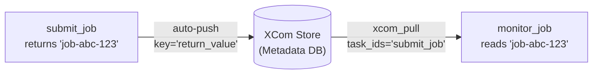

# Airflow XCom — Fundamentals

## What Is XCom?

**XCom** (short for **Cross-Communication**) is Airflow's built-in mechanism for tasks to share small pieces of data with each other. By default, tasks are isolated — they run in separate processes and can't directly share variables. XCom solves this by providing a lightweight key-value store backed by the Airflow metadata database.

> **Analogy:** Think of XCom like a message board in an office. Task A writes a note ("the file had 1,523 rows") and pins it to the board under a label ("row_count"). Task B, which runs later, reads the note from the board. They never talk directly — they communicate asynchronously through the shared board.

XCom is designed for **small metadata** — file paths, row counts, job IDs, status strings — not for actual data payloads.

---

## Push and Pull Mechanics

XCom works through two operations: **push** (write) and **pull** (read).

### Pushing (Writing) to XCom

```python
from airflow.operators.python import PythonOperator

def extract_and_count(**context):
    # Simulate extracting data and getting a row count
    records = [{"id": 1}, {"id": 2}, {"id": 3}]   # Pretend we loaded this
    row_count = len(records)

    # Push to XCom — accessible by other tasks in this DAG run
    context['ti'].xcom_push(key='row_count', value=row_count)
    context['ti'].xcom_push(key='source_file', value='/data/sales_2024-01-15.csv')

    return records   # The RETURN VALUE is also automatically pushed as key='return_value'
```

**Two ways to push:**
1. `ti.xcom_push(key, value)` — explicit push with a custom key
2. `return value` from the Python callable — automatically stored with key `'return_value'`

### Pulling (Reading) from XCom

```python
def transform_data(**context):
    ti = context['ti']

    # Pull by task_id and key
    row_count = ti.xcom_pull(task_ids='extract', key='row_count')
    source_file = ti.xcom_pull(task_ids='extract', key='source_file')

    # Pull the return value (pushed automatically)
    records = ti.xcom_pull(task_ids='extract')   # key defaults to 'return_value'

    print(f"Transforming {row_count} records from {source_file}")
```

**`xcom_pull` parameters:**
- `task_ids` — which task's XCom to read (required; can be a string or list)
- `key` — which key to read (default: `'return_value'`)
- `dag_id` — cross-DAG XCom (advanced; defaults to current DAG)

---

## Automatic XCom from Return Values

When a `PythonOperator` callable returns a value, that value is **automatically pushed** to XCom with `key='return_value'`:

```python
def get_job_id(**context):
    # Submit a job and return its ID
    return "job-abc-123"   # Automatically pushed as key='return_value'

submit_job = PythonOperator(
    task_id='submit_job',
    python_callable=get_job_id,
    dag=dag,
)

def monitor_job(**context):
    # Pull the return value from the previous task
    job_id = context['ti'].xcom_pull(task_ids='submit_job')   # Gets 'return_value'
    print(f"Monitoring job: {job_id}")

monitor = PythonOperator(
    task_id='monitor_job',
    python_callable=monitor_job,
    dag=dag,
)
```



**What this shows:** The return value flows through the metadata database, not directly between tasks. Both tasks could run on different workers in different processes — XCom is the communication bridge.

---

## XCom in the TaskFlow API

Airflow 2.0 introduced the **TaskFlow API** (`@task` decorator), which makes XCom usage much cleaner by hiding the push/pull boilerplate:

```python
from airflow.decorators import dag, task
from datetime import datetime

@dag(schedule_interval='@daily', start_date=datetime(2024, 1, 1), catchup=False)
def sales_pipeline():

    @task
    def extract() -> dict:
        """Return value is automatically pushed to XCom."""
        return {
            'row_count': 1523,
            'source_file': '/data/sales_2024-01-15.csv',
            'checksum': 'abc123',
        }

    @task
    def transform(extracted: dict) -> list:
        """Receives the return value of extract() directly."""
        print(f"Processing {extracted['row_count']} rows")
        # TaskFlow handles the xcom_pull automatically
        return [{'id': i, 'processed': True} for i in range(extracted['row_count'])]

    @task
    def load(records: list) -> int:
        """Receives the return value of transform()."""
        print(f"Loading {len(records)} records")
        return len(records)   # Returns row count loaded

    # Wire tasks together — TaskFlow infers XCom dependencies
    extracted = extract()
    transformed = transform(extracted)
    load(transformed)

dag_instance = sales_pipeline()
```

**What TaskFlow does behind the scenes:**
1. `extract()` return value → XCom push (key='return_value')
2. `transform(extracted)` → Airflow injects an `xcom_pull` for the `extracted` argument
3. The function argument names map to XCom pulls from upstream tasks

This looks like a normal Python function call chain, but each `@task` function runs as a separate Airflow task with XCom passing values between them.

---

## XCom Size Limits

XCom stores data in the Airflow metadata database (PostgreSQL or MySQL). This has important implications:

| Database | XCom Size Limit |
|----------|-----------------|
| SQLite (dev only) | 2 GB (TEXT column) |
| PostgreSQL | 1 GB (BYTEA/TEXT column) |
| MySQL | 64 KB (MEDIUMBLOB → ~16 MB with config) |

**In practice, XCom should be treated as limited to ~48 KB** in production because:
1. The metadata DB is not designed for large blobs — large XComs slow down all DB operations
2. Every scheduler, worker, and UI query touches this DB
3. XCom rows are never automatically deleted unless you configure `xcom_backend` cleanup

> **The golden rule: XCom is for METADATA, not DATA.** Pass file paths, row counts, job IDs, and configuration — not DataFrames, CSV contents, or large JSON payloads.

---

## What XCom Stores

XCom values are serialized to bytes before storage. Airflow handles serialization automatically:

| Python type | Serialization | Notes |
|-------------|--------------|-------|
| `str`, `int`, `float`, `bool` | JSON | Always safe |
| `list`, `dict` | JSON | Safe if JSON-serializable |
| `datetime` | JSON (ISO string) | Auto-handled by Airflow |
| `None` | JSON | Stored as null |
| Custom class | Pickle (if enabled) | Risky — version mismatch issues |
| `pandas.DataFrame` | **Don't do this** | Too large; use S3 + path XCom |

```python
# GOOD: Pass a file path
def extract(**context):
    df = fetch_data()
    path = f"s3://my-bucket/temp/sales_{context['ds']}.parquet"
    df.to_parquet(path)
    return path   # XCom this small string

# BAD: Pass the DataFrame itself
def extract_bad(**context):
    df = fetch_data()
    return df   # Could be hundreds of MB — NEVER DO THIS
```

---

## XCom in Jinja Templates

You can reference XCom values directly in Jinja-templated fields without writing Python:

```python
from airflow.operators.bash import BashOperator

# Reference XCom from submit_job task's return_value
run_spark = BashOperator(
    task_id='run_spark',
    bash_command="""
        spark-submit \
            --job-id {{ ti.xcom_pull(task_ids='submit_job') }} \
            --date {{ ds }} \
            /path/to/job.py
    """,
    dag=dag,
)
```

```python
from airflow.providers.amazon.aws.operators.glue import GlueJobOperator

run_glue = GlueJobOperator(
    task_id='run_glue',
    job_name='my_glue_job',
    script_args={
        '--input-path': "{{ ti.xcom_pull(task_ids='get_input_path') }}",
        '--date': "{{ ds }}",
    },
    dag=dag,
)
```

---

## Viewing XCom in the Airflow UI

XCom values are visible in the Airflow UI:
1. Go to **Admin → XComs** in the top menu
2. Filter by DAG ID and execution date
3. Each row shows: dag_id, task_id, key, value, execution_date

This is extremely useful for debugging — you can see exactly what data was passed between tasks.

---

## Complete Working Example

```python
from airflow import DAG
from airflow.operators.python import PythonOperator
from datetime import datetime, timedelta

default_args = {
    'owner': 'data-engineering',
    'retries': 1,
}

def extract_data(**context):
    """Extract data and communicate metadata downstream."""
    # Simulate extraction
    records_processed = 4821
    output_path = f"s3://my-bucket/raw/dt={context['ds']}/data.parquet"

    context['ti'].xcom_push(key='record_count', value=records_processed)
    context['ti'].xcom_push(key='output_path', value=output_path)

    print(f"Extracted {records_processed} records → {output_path}")
    return output_path   # Also pushed as 'return_value'


def validate_data(**context):
    """Validate the extracted data using XCom metadata."""
    ti = context['ti']

    record_count = ti.xcom_pull(task_ids='extract', key='record_count')
    output_path = ti.xcom_pull(task_ids='extract', key='output_path')
    # OR: output_path = ti.xcom_pull(task_ids='extract')  # via 'return_value'

    if record_count < 1000:
        raise ValueError(f"Too few records: {record_count}. Expected > 1000.")

    print(f"Validation passed: {record_count} records at {output_path}")
    return {'valid': True, 'path': output_path}


def load_data(**context):
    """Load validated data into the warehouse."""
    validation_result = context['ti'].xcom_pull(task_ids='validate')
    print(f"Loading from: {validation_result['path']}")


with DAG(
    dag_id='xcom_demo_pipeline',
    default_args=default_args,
    schedule_interval='@daily',
    start_date=datetime(2024, 1, 1),
    catchup=False,
    tags=['demo', 'xcom'],
) as dag:

    extract = PythonOperator(task_id='extract', python_callable=extract_data)
    validate = PythonOperator(task_id='validate', python_callable=validate_data)
    load = PythonOperator(task_id='load', python_callable=load_data)

    extract >> validate >> load
```

---

## Interview Tips

> **Tip 1:** "What is XCom and what are its limitations?" — "XCom is Airflow's cross-task communication mechanism, stored in the metadata database. It's designed for small metadata like file paths, row counts, and job IDs. The key limitation is size — treat it as limited to ~48 KB in practice. Passing large data like DataFrames through XCom is an anti-pattern that slows down the metadata database and can cause memory issues."

> **Tip 2:** "What's the difference between xcom_push and return value?" — "Both achieve the same result — they write to XCom in the metadata DB. Returning a value from a PythonOperator callable auto-pushes with key='return_value'. xcom_push() lets you push multiple values with different keys. The TaskFlow API (@task decorator) uses return values automatically and injects xcom_pull as function arguments."

> **Tip 3:** "How do you share data between tasks in Airflow?" — "For small metadata (paths, counts, IDs): XCom. For actual data payloads: write to S3/GCS/HDFS and XCom the path. Never pass DataFrames or large objects through XCom — it bloats the metadata DB and can cause serious performance issues at scale."
