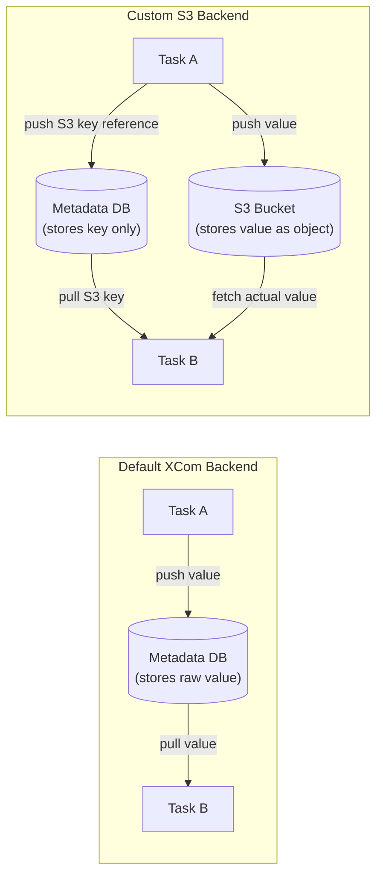

# Airflow XCom — Intermediate

## Custom XCom Backends

The default XCom backend stores values in the Airflow metadata database. For production systems with larger payloads or high concurrency, you can replace this with a custom backend — typically S3 or GCS — that stores the actual data remotely while only keeping a reference pointer in the database.

### How Custom Backends Work



**What this shows:** The metadata DB always stores something (even with custom backends), but with a custom backend it only stores a small pointer/key. The actual payload lives in S3 or GCS.

### Implementing a Custom S3 XCom Backend

```python
# plugins/custom_xcom_backend.py
from typing import Any
import json
import uuid
import boto3
from airflow.models.xcom import BaseXCom
from airflow.utils.session import provide_session

XCOM_BUCKET = "my-airflow-xcom-bucket"
XCOM_S3_PREFIX = "xcom/"

class S3XComBackend(BaseXCom):
    """
    Custom XCom backend that stores values in S3.
    Large values go to S3; small values stay in the DB.
    """

    PREFIX = "s3://"
    SIZE_THRESHOLD = 48 * 1024   # 48 KB threshold

    @staticmethod
    def serialize_value(
        value: Any,
        *,
        key: str,
        task_id: str,
        dag_id: str,
        run_id: str,
        map_index: int = -1,
    ) -> bytes:
        serialized = json.dumps(value).encode("utf-8")

        if len(serialized) > S3XComBackend.SIZE_THRESHOLD:
            # Large value: store in S3, return the S3 key as the XCom value
            s3_key = (
                f"{XCOM_S3_PREFIX}{dag_id}/{run_id}/{task_id}/{key}"
                f"_{uuid.uuid4().hex}.json"
            )
            s3 = boto3.client("s3")
            s3.put_object(
                Bucket=XCOM_BUCKET,
                Key=s3_key,
                Body=serialized,
                ContentType="application/json",
            )
            # Store the S3 URI in the DB instead of the actual value
            return json.dumps(f"{S3XComBackend.PREFIX}{XCOM_BUCKET}/{s3_key}").encode()

        # Small value: store directly in DB as before
        return serialized

    @staticmethod
    def deserialize_value(result: "S3XComBackend") -> Any:
        value = json.loads(result.value)

        if isinstance(value, str) and value.startswith(S3XComBackend.PREFIX):
            # Value is an S3 pointer — fetch from S3
            s3_uri = value[len(S3XComBackend.PREFIX):]
            bucket, key = s3_uri.split("/", 1)

            s3 = boto3.client("s3")
            response = s3.get_object(Bucket=bucket, Key=key)
            return json.loads(response["Body"].read())

        return value
```

**Configure in `airflow.cfg`:**
```ini
[core]
xcom_backend = plugins.custom_xcom_backend.S3XComBackend
```

**Or via environment variable:**
```bash
AIRFLOW__CORE__XCOM_BACKEND=plugins.custom_xcom_backend.S3XComBackend
```

### Using the Official S3 XCom Backend (Airflow 2.4+)

The `apache-airflow-providers-amazon` package includes a production-ready S3 XCom backend:

```bash
pip install apache-airflow-providers-amazon
```

```ini
[core]
xcom_backend = airflow.providers.amazon.aws.xcom_backends.s3.S3XComBackend

[aws]
xcom_bucket = my-airflow-xcom
xcom_key_prefix = airflow/xcom/
```

---

## XCom with TaskFlow API — Advanced Patterns

### Multiple Return Values

```python
from airflow.decorators import task, dag
from typing import Tuple

@dag(schedule_interval='@daily', start_date=datetime(2024, 1, 1))
def advanced_taskflow():

    @task(multiple_outputs=True)   # Unpack dict into separate XCom keys
    def extract() -> dict:
        return {
            'row_count': 1523,
            'file_path': 's3://bucket/data.parquet',
            'checksum': 'abc123',
        }
        # With multiple_outputs=True, each key becomes a separate XCom entry
        # Pull individually: ti.xcom_pull(task_ids='extract', key='row_count')

    @task
    def validate(row_count: int, file_path: str) -> bool:
        # TaskFlow unpacks each named output automatically
        if row_count < 100:
            raise ValueError("Too few rows")
        return True

    @task
    def load(file_path: str, is_valid: bool):
        if is_valid:
            print(f"Loading from {file_path}")

    extracted = extract()
    valid = validate(extracted['row_count'], extracted['file_path'])
    load(extracted['file_path'], valid)

dag = advanced_taskflow()
```

### XCom with Dynamic Task Mapping

```python
from airflow.decorators import task

@dag(...)
def dynamic_pipeline():

    @task
    def get_regions() -> list:
        return ['us-east-1', 'eu-west-1', 'ap-southeast-1']

    @task
    def process_region(region: str) -> dict:
        # Runs once per region — each instance has its own XCom
        records = fetch_data_for_region(region)
        return {'region': region, 'count': len(records)}

    @task
    def aggregate(results: list) -> int:
        # results is a list of all process_region return values
        total = sum(r['count'] for r in results)
        print(f"Total across all regions: {total}")
        return total

    regions = get_regions()
    results = process_region.expand(region=regions)   # Dynamic task mapping
    aggregate(results)
```

---

## Cross-DAG XCom

XCom can be read from a different DAG using `dag_id` parameter:

```python
# In downstream_dag.py — reading XCom from upstream_dag
def read_upstream_result(**context):
    ti = context['ti']
    
    # Pull from a different DAG
    upstream_count = ti.xcom_pull(
        dag_id='upstream_etl_dag',
        task_ids='final_load',
        key='records_loaded',
        include_prior_dates=False,   # Only current execution date
    )
    
    print(f"Upstream loaded {upstream_count} records")
```

**Limitations of cross-DAG XCom:**
- Execution date must align between DAGs (or use `include_prior_dates=True`)
- Creates tight coupling between DAGs — changing one can break the other
- No dependency enforcement — downstream can read before upstream has written
- Better alternatives: shared database tables, S3 state files, or `ExternalTaskSensor` + regular XCom

---

## XCom Cleanup

XCom entries are NOT automatically deleted. Over time they accumulate in the metadata DB, slowing down queries.

### Manual Cleanup

```python
# In a maintenance DAG or Python script
from airflow.models import XCom
from airflow.utils.session import create_session
from datetime import datetime, timedelta

def cleanup_old_xcoms(days_to_keep: int = 30):
    """Delete XCom entries older than N days."""
    cutoff_date = datetime.utcnow() - timedelta(days=days_to_keep)
    
    with create_session() as session:
        deleted = (
            session.query(XCom)
            .filter(XCom.execution_date < cutoff_date)
            .delete(synchronize_session=False)
        )
        session.commit()
    
    print(f"Deleted {deleted} XCom entries older than {days_to_keep} days")
```

### Automated Cleanup via Airflow Config

```ini
[core]
# Keep only the last N XCom entries per task instance
# (Does not exist natively — use a maintenance DAG)

[scheduler]
# Airflow 2.x: DAG run retention
max_dagruns_per_dag_for_triggered_runs = 16
```

### Maintenance DAG

```python
from airflow import DAG
from airflow.operators.python import PythonOperator
from datetime import datetime, timedelta

with DAG(
    dag_id='airflow_xcom_cleanup',
    schedule_interval='0 1 * * *',   # Nightly
    start_date=datetime(2024, 1, 1),
    catchup=False,
    tags=['maintenance'],
) as dag:

    PythonOperator(
        task_id='cleanup_xcoms',
        python_callable=cleanup_old_xcoms,
        op_kwargs={'days_to_keep': 7},   # Keep 1 week of XCom data
    )
```

---

## Serialization Limits and JSON Safety

XCom serializes values to JSON by default (in Airflow 2.x with `enable_xcom_pickling=False`). This means not all Python objects can be XCommed:

```python
# SAFE: JSON-serializable types
ti.xcom_push(key='count', value=1523)
ti.xcom_push(key='path', value='s3://bucket/key')
ti.xcom_push(key='data', value={'a': 1, 'b': [1, 2, 3]})
ti.xcom_push(key='flag', value=True)

# UNSAFE: Not JSON-serializable by default
import numpy as np
import pandas as pd
from datetime import datetime

ti.xcom_push(key='array', value=np.array([1, 2, 3]))    # Fails
ti.xcom_push(key='df', value=pd.DataFrame())             # Fails (and bad idea anyway)
ti.xcom_push(key='dt', value=datetime.utcnow())          # Airflow handles this one
```

**Workaround for non-JSON types:**

```python
# Convert to JSON-safe representation before pushing
import numpy as np

def extract(**context):
    data = np.array([1.2, 3.4, 5.6])
    
    # Convert to list for JSON serialization
    context['ti'].xcom_push(key='values', value=data.tolist())

def use_values(**context):
    values_list = context['ti'].xcom_pull(task_ids='extract', key='values')
    data = np.array(values_list)   # Reconstruct on the other side
```

**Enable pickle serialization (not recommended for production):**

```ini
[core]
enable_xcom_pickling = True   # Allows arbitrary Python objects
# Risk: pickle is not secure and version-sensitive
```

---

## XCom for Conditional Logic

A common pattern is using XCom results to drive branching decisions:

```python
from airflow.operators.python import BranchPythonOperator

def decide_load_path(**context):
    """Choose between fast path and slow path based on record count."""
    record_count = context['ti'].xcom_pull(task_ids='extract', key='record_count')
    
    if record_count > 1_000_000:
        return 'load_via_bulk'      # task_id of the large-load branch
    else:
        return 'load_via_api'       # task_id of the small-load branch

branch = BranchPythonOperator(
    task_id='decide_load_path',
    python_callable=decide_load_path,
    dag=dag,
)
```

---

## Interview Tips

> **Tip 1:** "How would you handle XCom when data payloads are larger than 48 KB?" — "Use a custom XCom backend. The S3 backend from the Amazon provider package stores the actual data in S3 and keeps only an S3 key reference in the metadata DB. This is transparent to the DAG code — push and pull work the same way. Alternatively, store data in S3 manually and XCom just the path."

> **Tip 2:** "What is `multiple_outputs=True` in TaskFlow?" — "It tells Airflow to unpack the returned dict into individual XCom keys, one per dict key. Without it, the whole dict is stored as a single XCom entry with key='return_value'. With multiple_outputs, you can pull individual keys: ti.xcom_pull(task_ids='my_task', key='row_count') rather than deserializing the whole dict."

> **Tip 3:** "How do you clean up XCom data?" — "XCom doesn't auto-expire. Build a maintenance DAG that runs nightly and deletes XCom entries older than N days using the XCom model's query interface. Set N to match your debugging needs — 7–30 days is typical. The metadata DB will thank you."
