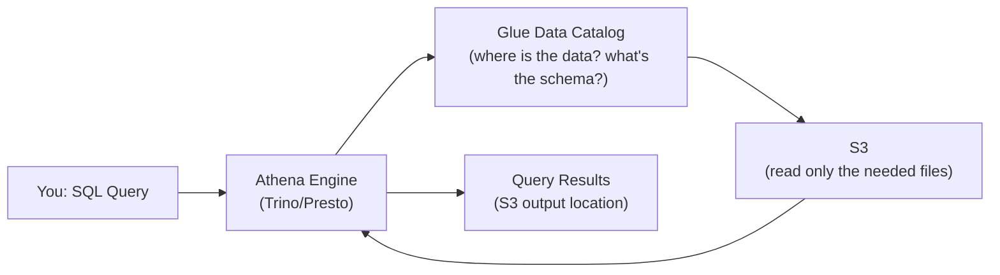

# AWS Athena — Fundamentals


## 🎯 Analogy

Think of Athena like a query layer on top of your S3 data lake: you define a table schema pointing at S3 files (Parquet, CSV, JSON), and run SQL without moving any data — pay per query, not per cluster.

---
## What Is Amazon Athena?

Amazon Athena is a **serverless, interactive query service** that lets you analyze data directly in S3 using standard SQL. No infrastructure to manage, no data to load — just point at your S3 data and query.

**The analogy:** If S3 is your filing cabinet, Athena is the ability to ask questions about the contents without removing any files — you just query them in place.

> **Why Athena matters for DE:** It's the fastest way to query a data lake. No cluster setup, no ETL into a warehouse. Pay $5 per TB scanned. Integrates with Glue Catalog for schema management.

---

## How Athena Works



**What this shows:**
- You submit SQL (via console, CLI, JDBC, or SDK)
- Athena uses the Glue Data Catalog to find table locations and schemas
- Athena reads data directly from S3 (never copies it)
- Results are written to an S3 output location
- You pay only for data scanned ($5/TB)

---

## Creating Tables (External Tables)

Athena tables are **metadata pointers** to S3 data — they don't store data themselves:

```sql
-- Create a table pointing to Parquet data on S3
CREATE EXTERNAL TABLE fact_orders (
    order_id STRING,
    customer_id STRING,
    amount DOUBLE,
    order_date DATE
)
PARTITIONED BY (year INT, month INT)
STORED AS PARQUET
LOCATION 's3://data-lake/curated/orders/'
TBLPROPERTIES ('parquet.compression' = 'SNAPPY');

-- Register existing partitions
MSCK REPAIR TABLE fact_orders;
-- This discovers all year=*/month=*/ directories in S3 and registers them

-- Or add manually:
ALTER TABLE fact_orders ADD PARTITION (year=2024, month=1)
LOCATION 's3://data-lake/curated/orders/year=2024/month=1/';
```

---

## Querying Data

```sql
-- Standard ANSI SQL
SELECT 
    customer_id,
    SUM(amount) AS total_spent,
    COUNT(*) AS order_count
FROM fact_orders
WHERE year = 2024 AND month = 1  -- Partition pruning! Only scans Jan 2024 files
GROUP BY customer_id
ORDER BY total_spent DESC
LIMIT 100;
```

**Key cost note:** Athena charges $5 per TB of data SCANNED. The less data you scan, the cheaper the query.

---

## Supported Data Formats

| Format | Query Speed | Compression | Cost Efficiency | Best For |
|--------|:-----------:|:-----------:|:---------------:|----------|
| **Parquet** | Fast | High (4-5x) | Excellent | Analytics (columnar) |
| **ORC** | Fast | High | Excellent | Hive ecosystem |
| **JSON** | Slow | None/low | Poor | Raw event logs (read once) |
| **CSV** | Slow | None | Poor | Small files, quick imports |
| **Avro** | Medium | Medium | Good | Schema evolution needs |

> **Rule:** Always convert data to Parquet or ORC for Athena. A 1 TB CSV file costs $5 to scan. The same data as Parquet (~200 GB compressed + columnar pruning) costs ~$0.50 to scan — 10x cheaper!

---

## Partitioning — The #1 Cost Optimization

Partitioning physically separates data into directories by key values. Athena skips entire partitions that don't match your query:

```
s3://data-lake/curated/orders/
├── year=2023/month=01/  (100 files, 5 GB)
├── year=2023/month=02/  (100 files, 5 GB)
├── ...
├── year=2024/month=01/  (100 files, 5 GB)  ← Only this is scanned!
└── year=2024/month=02/  (100 files, 5 GB)

Query: WHERE year = 2024 AND month = 1
Scans: 5 GB (one partition)
Skips: 115 GB (23 other partitions)
Cost: $0.025 instead of $0.60
```

**Partition design rules:**
- Partition on columns used in WHERE clauses (almost always date)
- Don't over-partition (millions of tiny directories = slow LIST operations)
- Ideal partition size: 128 MB–1 GB of data per partition

---

## CTAS — Create Table As Select

Transform data using SQL and write the result as a new table:

```sql
-- Convert messy CSV to optimized Parquet with partitioning
CREATE TABLE curated.orders
WITH (
    format = 'PARQUET',
    external_location = 's3://data-lake/curated/orders/',
    partitioned_by = ARRAY['year', 'month'],
    parquet_compression = 'SNAPPY'
) AS
SELECT 
    order_id,
    customer_id,
    CAST(amount AS DOUBLE) AS amount,
    order_date,
    YEAR(order_date) AS year,
    MONTH(order_date) AS month
FROM raw.orders_csv
WHERE order_date IS NOT NULL;
```

> **CTAS use case:** One-time data format conversion. Read raw CSV/JSON, apply transforms, output as partitioned Parquet. Dramatically reduces future query costs.

---

## Cost Optimization Summary

| Technique | Impact | How |
|-----------|--------|-----|
| Use Parquet/ORC | 5-10x cheaper queries | Convert from CSV/JSON |
| Partition on date | 10-100x less data scanned | Hive-style partitioning |
| Select specific columns | 2-10x less data scanned | `SELECT col1, col2` not `SELECT *` |
| Compress data | 3-5x smaller files | Snappy/gzip compression |
| Use larger files | Fewer S3 requests | Compact small files to 128 MB+ |
| Workgroups with limits | Budget control | Set per-query/per-workgroup scan limits |

```sql
-- Set a query scan limit (fail if query would scan too much)
-- Configured in Athena Workgroup settings:
-- "Per-query data usage control" = 10 GB
-- Any query scanning more than 10 GB automatically fails (prevents accidental full scans)
```

---

## Athena vs Redshift vs Spark

| Aspect | Athena | Redshift | Spark (EMR/Glue) |
|--------|--------|----------|------------------|
| Setup | Zero (serverless) | Provision cluster | Provision cluster or Glue |
| Data location | Stays in S3 | Loaded into Redshift | Read from S3 |
| Best query type | Ad-hoc, exploratory | Repeated dashboards | Complex transforms, ML |
| Concurrency | Moderate (DML limits) | High (dedicated compute) | High (dedicated cluster) |
| Cost model | $5/TB scanned | Per-node-hour | Per-DPU/instance-hour |
| Latency | Seconds (small), minutes (large) | Sub-second (cached) | Seconds-minutes |
| ETL capability | Basic (CTAS, INSERT INTO) | Stored procedures | Full PySpark |

---


## ▶️ Try It Yourself

```python
import boto3
import time

athena = boto3.client("athena", region_name="us-east-1")

# Run a query on S3 data (no cluster needed)
query = (
    "SELECT region, SUM(amount) AS revenue "
    "FROM orders_external "
    "WHERE year = '2024' "
    "GROUP BY region"
)

resp = athena.start_query_execution(
    QueryString=query,
    QueryExecutionContext={"Database": "datalake"},
    ResultConfiguration={"OutputLocation": "s3://my-bucket/athena-results/"},
)
qid = resp["QueryExecutionId"]

# Poll until complete
while True:
    status = athena.get_query_execution(QueryExecutionId=qid)["QueryExecution"]["Status"]["State"]
    if status in ("SUCCEEDED", "FAILED", "CANCELLED"):
        break
    time.sleep(2)

print("Status:", status)
if status == "SUCCEEDED":
    results = athena.get_query_results(QueryExecutionId=qid)
    for row in results["ResultSet"]["Rows"][1:]:  # Skip header
        print([c.get("VarCharValue") for c in row["Data"]])
```

> **Run it:** Copy the snippet into a REPL or file and run it — no external services needed for the basic example.

---
## Interview Tips

> **Tip 1:** "What is Athena?" — "A serverless query engine (based on Trino/Presto) that queries S3 data directly using SQL. No infrastructure management, pay-per-query ($5/TB scanned). Uses the Glue Data Catalog for schema management. Best for ad-hoc analytics and data exploration on a data lake."

> **Tip 2:** "How do you reduce Athena costs?" — "Three things: (1) Use columnar formats (Parquet/ORC) — 5-10x less data scanned vs CSV. (2) Partition by date — skip irrelevant time ranges entirely. (3) Select only needed columns (columnar = only reads requested columns). A query that costs $5 on CSV can cost $0.05 on partitioned Parquet."

> **Tip 3:** "Athena vs Redshift — when to use which?" — "Athena for: ad-hoc queries, infrequent access, data exploration, data that's already in S3. Redshift for: frequent dashboard queries, sub-second latency, complex joins, high concurrency. Many teams use both: Athena for exploration, Redshift for production dashboards."
