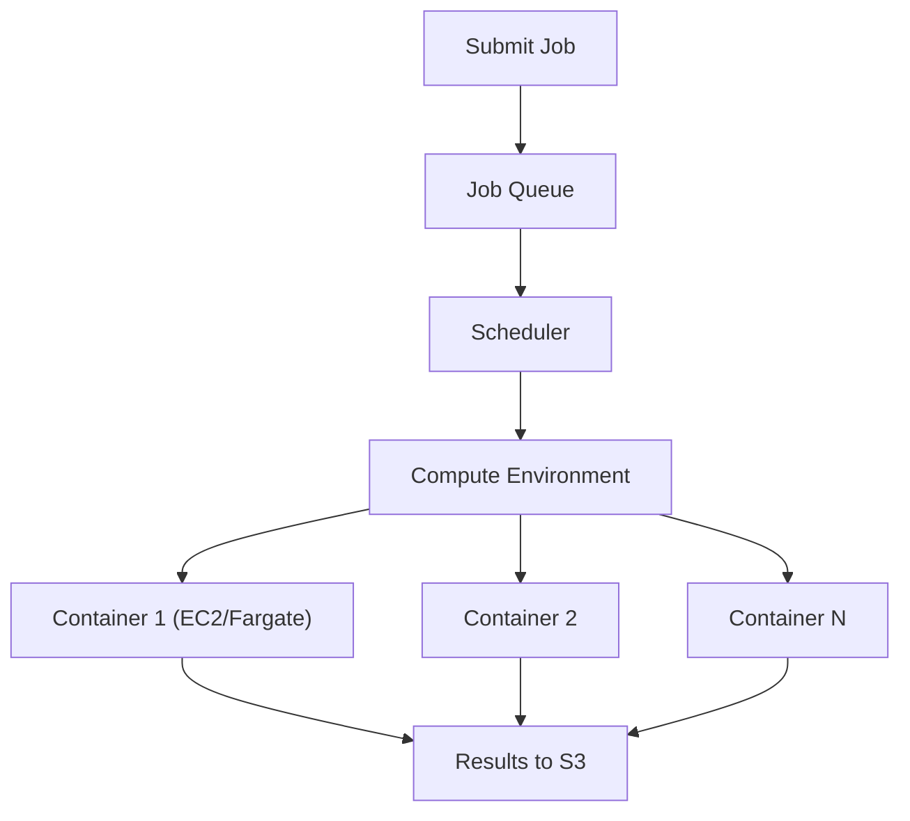

# AWS Batch — Fundamentals

## What Is AWS Batch?

AWS Batch is a **fully managed batch processing service** that runs containerized workloads at any scale. You define jobs as Docker containers, submit them, and Batch handles scheduling, compute provisioning, and execution.

**The analogy:** If Lambda is a microwave (small, instant, limited), and EMR is a full kitchen (powerful but complex), AWS Batch is a professional catering service — you hand them the recipe (Docker image) and the ingredients (input data), and they handle the cooking at whatever scale you need.

> **Why Batch matters for DE:** For non-Spark workloads (Python scripts, R processing, custom binaries), Batch provides serverless-like simplicity with container flexibility. Process 10,000 files in parallel without managing any infrastructure.

---

## When to Use AWS Batch

| Use Case | AWS Batch | Better Alternative |
|----------|:-:|---|
| Process 10,000 files in parallel | ✅ | — |
| Run custom Python/R/Go ETL (non-Spark) | ✅ | — |
| ML batch inference on 1M images | ✅ | — |
| Heavy compute with custom libraries | ✅ | — |
| Spark-based ETL | ❌ | Glue or EMR |
| Sub-second response time | ❌ | Lambda |
| Simple file validation (<15 min) | ❌ | Lambda |
| SQL-based transforms | ❌ | Athena CTAS |
| Event-driven per-record processing | ❌ | Lambda or Kinesis |

---

## Core Components



This diagram shows the flow of a submitted job: it waits in a job queue, the scheduler matches it to an available compute environment, and one or more containers run in parallel and write their results to S3.

**Components explained:**

| Component | What It Does |
|-----------|-------------|
| **Job Definition** | Blueprint: which Docker image, how much CPU/memory, command to run |
| **Job Queue** | Where submitted jobs wait until compute is available |
| **Compute Environment** | The infrastructure that runs jobs (EC2, Fargate, or Spot) |
| **Scheduler** | Matches queued jobs to available compute (priority-based) |

---

## Job Definition

```python
import boto3
batch = boto3.client('batch')

# Define a job (the "recipe")
batch.register_job_definition(
    jobDefinitionName='process-files-job',
    type='container',
    containerProperties={
        'image': '123456789.dkr.ecr.us-east-1.amazonaws.com/etl-processor:latest',
        'vcpus': 4,
        'memory': 8192,  # 8 GB
        'command': ['python', 'process.py', '--input', 'Ref::input_path'],
        'environment': [
            {'name': 'OUTPUT_BUCKET', 'value': 's3://processed-data/'}
        ],
        'jobRoleArn': 'arn:aws:iam::123:role/BatchJobRole',
    },
    retryStrategy={'attempts': 3},
    timeout={'attemptDurationSeconds': 3600},  # 1 hour max
)
```

---

## Compute Environments

### Fargate (Serverless — Recommended for Most Cases)

```python
batch.create_compute_environment(
    computeEnvironmentName='fargate-env',
    type='MANAGED',
    computeResources={
        'type': 'FARGATE',
        'maxvCpus': 256,           # Max total vCPUs across all jobs
        'subnets': ['subnet-a', 'subnet-b'],
        'securityGroupIds': ['sg-batch'],
    }
)
# No EC2 instances to manage! Jobs run in ephemeral Fargate containers.
# Pay per second of vCPU + memory used.
```

### EC2 (More Control, Spot Savings)

```python
batch.create_compute_environment(
    computeEnvironmentName='spot-env',
    type='MANAGED',
    computeResources={
        'type': 'SPOT',            # Use Spot for 60-80% savings
        'allocationStrategy': 'SPOT_CAPACITY_OPTIMIZED',
        'minvCpus': 0,             # Scale to zero when idle
        'maxvCpus': 1024,
        'instanceTypes': ['m5.large', 'm5.xlarge', 'c5.large', 'r5.large'],
        'subnets': ['subnet-a', 'subnet-b'],
        'securityGroupIds': ['sg-batch'],
        'instanceRole': 'arn:aws:iam::123:instance-profile/BatchInstanceRole',
        'spotIamFleetRole': 'arn:aws:iam::123:role/AmazonEC2SpotFleetRole',
    }
)
```

| Type | Cost | Startup | Best For |
|------|------|---------|----------|
| Fargate | Higher per-vCPU | 30-60s | Variable workloads, no instance management |
| EC2 On-Demand | Medium | 2-5 min | Predictable, needs specific instance features |
| EC2 Spot | 60-80% cheaper | 2-5 min | Cost-optimized, fault-tolerant workloads |

---

## Submitting Jobs

```python
# Submit a single job
response = batch.submit_job(
    jobName='process-file-001',
    jobQueue='main-queue',
    jobDefinition='process-files-job',
    parameters={
        'input_path': 's3://raw-data/files/file_001.csv'
    }
)
job_id = response['jobId']

# Submit an ARRAY job (process 1000 files in parallel!)
response = batch.submit_job(
    jobName='process-all-files',
    jobQueue='main-queue',
    jobDefinition='process-files-job',
    arrayProperties={'size': 1000},  # Creates 1000 child jobs (index 0-999)
    parameters={
        'input_path': 's3://raw-data/files/'  # Each child uses AWS_BATCH_JOB_ARRAY_INDEX
    }
)
# Batch runs up to 1000 containers in parallel (limited by compute environment maxvCpus)
```

**In your container script:**
```python
import os

# Array jobs: each container gets a unique index
array_index = int(os.environ.get('AWS_BATCH_JOB_ARRAY_INDEX', 0))

# Use index to determine which file to process
files = list_s3_files('s3://raw-data/files/')
my_file = files[array_index]
process_file(my_file)
```

---

## Job Dependencies

```python
# Job B runs only after Job A succeeds
job_a = batch.submit_job(jobName='extract', jobQueue='queue', jobDefinition='extract-job')

job_b = batch.submit_job(
    jobName='transform',
    jobQueue='queue',
    jobDefinition='transform-job',
    dependsOn=[{'jobId': job_a['jobId'], 'type': 'SEQUENTIAL'}]
)

# Types: SEQUENTIAL (wait for all), N_TO_N (array job: child B[i] waits for child A[i])
```

---

## AWS Batch vs Alternatives

| Feature | AWS Batch | Lambda | Glue | ECS (manual) |
|---------|:-:|:-:|:-:|:-:|
| Max runtime | Unlimited | 15 min | 48 hours | Unlimited |
| Max memory | Instance-based (EC2) / 120 GB (Fargate) | 10 GB | 100 DPUs | Instance-based |
| Custom Docker image | ✅ | ✅ (container image) | Limited | ✅ |
| Parallel array jobs | ✅ (built-in) | ❌ (manual fan-out) | ❌ | ❌ (manual) |
| Spot instance support | ✅ | N/A | ❌ | ✅ |
| Auto-scaling to zero | ✅ | ✅ | ✅ | Manual |
| Spark support | ❌ | ❌ | ✅ | ✅ (with install) |
| Built-in job queuing | ✅ | N/A | N/A | N/A |
| Cost for heavy compute | Cheapest (Spot) | Expensive at scale | DPU-hour pricing | Instance-based |

---

## Cost Example

```
Scenario: Process 10,000 CSV files (each takes 2 minutes, needs 2 vCPU + 4 GB)

Fargate:
  10,000 jobs × 2 min × (2 vCPU × $0.04048/hr + 4 GB × $0.004445/hr)
  = 10,000 × 0.033 hr × ($0.081 + $0.018) = 10,000 × $0.0033
  = $33 total

EC2 Spot:
  Peak: 256 vCPUs (128 jobs running simultaneously)
  Duration: 10,000 / 128 × 2 min = 156 min = 2.6 hours of cluster time
  Cost: 128 × m5.large Spot ($0.03/hr) × 2.6 hr = $10 total

Lambda (for comparison, if possible):
  10,000 invocations × 2 min × 2 GB = 10,000 × 120s × 2 GB × $0.0000166667/GB-s
  = $40 total (more expensive AND limited to 15 min max!)
```

> **Batch with Spot is often the cheapest option** for heavy parallel processing that doesn't fit Lambda's constraints.

---

## Interview Tips

> **Tip 1:** "When would you use AWS Batch?" — "For containerized batch workloads that don't fit Lambda (>15 min, >10 GB memory) and don't need Spark (Glue/EMR). Examples: processing 10K files in parallel, ML batch inference, heavy data validation, video/image processing. The key value: array jobs that auto-scale — submit 10K jobs and Batch handles the parallelism."

> **Tip 2:** "Batch vs Glue?" — "Glue for: Spark-based ETL, catalog integration, PySpark transforms. Batch for: non-Spark workloads in any language (Python, R, Go, Java), custom Docker images, GPU workloads, or when you need Spot instances for 60-80% cost savings. Batch gives full container flexibility; Glue gives managed Spark."

> **Tip 3:** "How do array jobs work?" — "You submit one job with `arrayProperties.size=N`. Batch creates N child containers, each with a unique `AWS_BATCH_JOB_ARRAY_INDEX` environment variable (0 to N-1). Each container uses its index to determine which slice of work to process. Batch runs as many simultaneously as your compute environment allows (limited by maxvCpus)."
