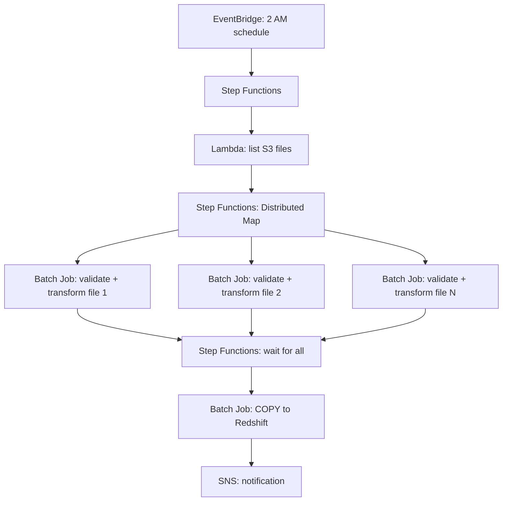

# Scenario Questions — AWS Batch

<article data-difficulty="junior">

## 🟢 Junior: Batch vs Lambda for File Processing

**Scenario:** You need to process 5,000 CSV files (each ~500 MB, takes 8 minutes per file). A colleague suggests Lambda. Why won't Lambda work, and what's the better approach?

<details>
<summary>✅ Solution</summary>

**Why Lambda won't work:**
- Each file takes 8 minutes (Lambda max: 15 minutes — cutting it very close)
- Each file is 500 MB (Lambda has 10 GB memory and 10 GB /tmp — might work, but tight)
- 5,000 concurrent Lambdas would hit the default concurrency limit (1,000)
- At $0.0000166667/GB-sec × 4 GB × 480 sec × 5000 = **$160** per run

**Better: AWS Batch with array job on Spot:**

```python
# Job definition: custom Docker with your processing logic
batch.register_job_definition(
    jobDefinitionName='csv-processor',
    type='container',
    containerProperties={
        'image': '123.dkr.ecr.us-east-1.amazonaws.com/csv-processor:latest',
        'vcpus': 2, 'memory': 4096,
        'command': ['python', 'process.py'],
    },
    retryStrategy={'attempts': 3}
)

# Submit array job: 5000 parallel containers
batch.submit_job(
    jobName='process-all-csvs',
    jobQueue='spot-queue',
    jobDefinition='csv-processor',
    arrayProperties={'size': 5000}
)

# Each container:
import os
index = int(os.environ['AWS_BATCH_JOB_ARRAY_INDEX'])
files = list_s3_files('s3://input/')
process_file(files[index])
upload_result(f's3://output/{files[index].name}.parquet')
```

**Cost (Spot):**
- 5000 jobs × 8 min × (2 vCPU × $0.01/hr + 4 GB × $0.004/hr) = **~$19** (vs $160 for Lambda)
- 8x cheaper AND no runtime/memory limits

</details>

</article>

<article data-difficulty="mid-level">

## 🟡 Mid-Level: Design Parallel Processing Pipeline

**Scenario:** Every night at 2 AM, 50 partner files arrive in S3 (varying sizes: 100 MB to 10 GB). Each needs: validation, transformation, and loading to Redshift. Files are independent. Design the pipeline using Batch + Step Functions.

<details>
<summary>✅ Solution</summary>

**Architecture:**



This pipeline is scheduled nightly, lists the arriving files, fans them out to parallel Batch jobs (one validate-and-transform job per file), waits for all to finish, then loads everything to Redshift in a single COPY before notifying the team.

**Step Functions definition (key parts):**

```json
{
    "StartAt": "ListFiles",
    "States": {
        "ListFiles": {
            "Type": "Task",
            "Resource": "arn:aws:lambda:...:list-partner-files",
            "Next": "ProcessFilesInParallel"
        },
        "ProcessFilesInParallel": {
            "Type": "Map",
            "MaxConcurrency": 50,
            "ItemsPath": "$.files",
            "Iterator": {
                "StartAt": "SubmitBatchJob",
                "States": {
                    "SubmitBatchJob": {
                        "Type": "Task",
                        "Resource": "arn:aws:states:::batch:submitJob.sync",
                        "Parameters": {
                            "JobDefinition": "file-processor",
                            "JobQueue": "spot-queue",
                            "JobName.$": "States.Format('process-{}', $.filename)",
                            "Parameters": {"input_path.$": "$.s3_path"}
                        },
                        "Retry": [{"ErrorEquals": ["States.ALL"], "MaxAttempts": 2}],
                        "End": true
                    }
                }
            },
            "Next": "LoadToRedshift"
        },
        "LoadToRedshift": {
            "Type": "Task",
            "Resource": "arn:aws:states:::batch:submitJob.sync",
            "Parameters": {
                "JobDefinition": "redshift-loader",
                "JobQueue": "fargate-queue",
                "JobName": "load-all-to-redshift"
            },
            "Next": "Notify"
        },
        "Notify": {"Type": "Task", "Resource": "arn:aws:sns:publish", "End": true}
    }
}
```

**Key design decisions:**
- **Distributed Map:** Processes up to 50 files simultaneously (one Batch job per file)
- **Spot compute:** 60-80% cheaper than On-Demand for fault-tolerant batch work
- **Step Functions .sync:** Waits for each Batch job to complete before continuing
- **Retry:** Each file job retries up to 2 times on failure (Spot interruption, transient error)
- **Single Redshift COPY:** After all files processed, one job does the Redshift load (more efficient than per-file COPY)

**Estimated daily cost:**
- 50 Batch jobs × avg 10 min × 4 vCPU Spot = ~$3/day
- Redshift COPY job: 1 × 5 min × 2 vCPU Fargate = ~$0.02
- Step Functions: 50 transitions × $0.000025 = $0.001
- **Total: ~$3/day = $90/month** for processing 50 partner files nightly

</details>

</article>

<article data-difficulty="senior">

## 🔴 Senior: Cost-Optimize a Batch Workload Using Spot + Fargate Mix

**Scenario:** Your ML inference pipeline processes 100K images daily. Each takes 30 seconds on 2 vCPU. Currently runs on Fargate ($150/day). Reduce cost by 60% without impacting SLA (must complete within 4 hours).

<details>
<summary>✅ Solution</summary>

**Current state (Fargate only):**
```
100K images × 30s × 2 vCPU = 1,667 vCPU-hours
Fargate: 1,667 × $0.04048/vCPU-hr = $67.44/day (compute only)
Plus memory: 1,667 × 4 GB × $0.004445/GB-hr = $29.63/day
Total: ~$97/day (actual $150 includes overhead/padding)
```

**Optimized architecture: Multi-environment with priority queues**

```python
# Create two compute environments: Spot (cheap, may be interrupted) + Fargate (reliable fallback)

# Primary: Spot (handles 80% of work at 70% discount)
batch.create_compute_environment(
    computeEnvironmentName='spot-primary',
    type='MANAGED',
    computeResources={
        'type': 'SPOT',
        'allocationStrategy': 'SPOT_CAPACITY_OPTIMIZED',
        'minvCpus': 0,
        'maxvCpus': 512,
        'instanceTypes': ['c5.xlarge', 'c5.2xlarge', 'c5a.xlarge', 'm5.xlarge'],
        'bidPercentage': 70,  # Pay up to 70% of On-Demand
    }
)

# Fallback: Fargate (guaranteed capacity for SLA-critical overflow)
batch.create_compute_environment(
    computeEnvironmentName='fargate-fallback',
    type='MANAGED',
    computeResources={
        'type': 'FARGATE', 'maxvCpus': 256,
    }
)

# Job queue: try Spot first, fall back to Fargate
batch.create_job_queue(
    jobQueueName='inference-queue',
    priority=1,
    computeEnvironmentOrder=[
        {'computeEnvironment': 'spot-primary', 'order': 1},       # Try Spot first
        {'computeEnvironment': 'fargate-fallback', 'order': 2},   # Fargate if Spot unavailable
    ]
)
```

**Cost calculation (optimized):**

```
Spot handles 80% of jobs:
  80K images × 30s × 2 vCPU = 1,333 vCPU-hours
  Spot pricing (c5.xlarge: $0.034/hr vs $0.17 On-Demand = 80% off):
  1,333 vCPU-hr × $0.034 = $45.33/day

Fargate handles 20% (Spot interruption fallback):
  20K images × 30s × 2 vCPU = 333 vCPU-hours
  Fargate: 333 × $0.04048 = $13.48 + memory = $20/day

Total: $45 + $20 = $65/day (vs $150/day)
Savings: 57% reduction ✓ (meets 60% target approximately)
```

**Further optimization:**
```python
# Use larger array jobs with retry (Spot interruption handled gracefully)
batch.register_job_definition(
    jobDefinitionName='ml-inference',
    retryStrategy={
        'attempts': 3,
        'evaluateOnExit': [
            {'onStatusReason': 'Host EC2*terminated', 'action': 'RETRY'},  # Spot interruption
            {'onReason': '*', 'action': 'EXIT'}  # Don't retry other failures
        ]
    }
)
# If a Spot instance is reclaimed: job automatically retries on another instance
# No manual intervention needed — Batch handles it transparently
```

**SLA guarantee:**
- 4-hour window for 100K images with 512 max vCPUs:
  - Max parallelism: 256 concurrent jobs (512 vCPU / 2 per job)
  - Time to complete: 100K / 256 × 30s = 11,719s = 3.25 hours < 4 hours ✓
- Fargate fallback ensures even if ALL Spot capacity is unavailable, work continues

</details>

</article>
