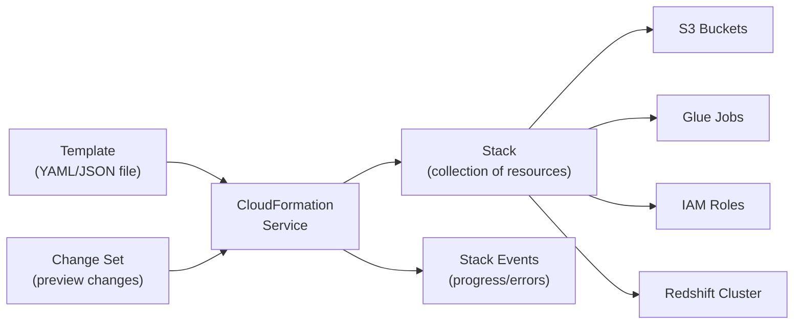

# AWS CloudFormation — Fundamentals

## What Is AWS CloudFormation?

AWS CloudFormation is an **Infrastructure as Code (IaC) service** that lets you define AWS resources in YAML/JSON templates and provision them as repeatable, version-controlled stacks. Instead of clicking through the console, you describe your infrastructure in code and CloudFormation creates/updates/deletes resources for you.

**The analogy:** CloudFormation is like a blueprint for a building. Instead of telling each contractor individually what to build (click-click in the console), you hand them a complete blueprint (template) and they construct the entire building (stack) exactly as designed. Need another identical building? Hand them the same blueprint. Need to modify it? Update the blueprint and they renovate accordingly.

> **Why CloudFormation matters for DE:** Data infrastructure is complex — Glue jobs, S3 buckets, Redshift clusters, IAM roles, VPCs, and their interconnections. CloudFormation ensures you can recreate your entire pipeline infrastructure consistently across dev/staging/prod environments, track changes in Git, and roll back when deployments go wrong.

---

## How CloudFormation Works



**What this shows:**
- You write a template describing desired resources
- CloudFormation creates a "stack" — a logical grouping of related resources
- Change Sets let you preview what will be modified before applying
- Stack Events show real-time progress and error details
- Deleting a stack removes all its resources (clean teardown)

---

## Core Concepts

| Concept | Description | DE Example |
|---------|-------------|------------|
| **Template** | YAML/JSON file defining resources | `data-pipeline-infra.yaml` |
| **Stack** | Instance of a template (live resources) | `prod-data-pipeline` stack |
| **Resource** | Individual AWS component in a template | S3 bucket, Glue job, IAM role |
| **Parameter** | Input variables (customizable per environment) | Environment name, bucket name, instance size |
| **Output** | Values exported from the stack | Redshift endpoint, S3 bucket ARN |
| **Change Set** | Preview of planned modifications | "Will modify Glue job, add new S3 bucket" |
| **Drift Detection** | Detect manual changes vs template | Someone modified a resource outside CFN |
| **Nested Stack** | Stack that references other stacks | Network stack + Data stack + Pipeline stack |
| **Rollback** | Automatic revert on failure | If Redshift creation fails, delete all created resources |

---

## Template Structure

```yaml
AWSTemplateFormatVersion: '2010-09-09'
Description: Data Pipeline Infrastructure

# --- Input parameters (customizable per environment) ---
Parameters:
  Environment:
    Type: String
    AllowedValues: [dev, staging, prod]
    Default: dev
  GlueWorkerCount:
    Type: Number
    Default: 5

# --- Resources to create ---
Resources:
  # S3 Bucket for data lake
  DataLakeBucket:
    Type: AWS::S3::Bucket
    Properties:
      BucketName: !Sub "${Environment}-data-lake-${AWS::AccountId}"
      VersioningConfiguration:
        Status: Enabled
      LifecycleConfiguration:
        Rules:
          - Id: MoveToGlacier
            Status: Enabled
            Transitions:
              - StorageClass: GLACIER
                TransitionInDays: 90

  # IAM Role for Glue
  GlueETLRole:
    Type: AWS::IAM::Role
    Properties:
      RoleName: !Sub "${Environment}-glue-etl-role"
      AssumeRolePolicyDocument:
        Version: '2012-10-17'
        Statement:
          - Effect: Allow
            Principal:
              Service: glue.amazonaws.com
            Action: sts:AssumeRole
      ManagedPolicyArns:
        - arn:aws:iam::aws:policy/service-role/AWSGlueServiceRole
      Policies:
        - PolicyName: DataLakeAccess
          PolicyDocument:
            Version: '2012-10-17'
            Statement:
              - Effect: Allow
                Action:
                  - s3:GetObject
                  - s3:PutObject
                  - s3:ListBucket
                Resource:
                  - !GetAtt DataLakeBucket.Arn
                  - !Sub "${DataLakeBucket.Arn}/*"

  # Glue Job
  DailyETLJob:
    Type: AWS::Glue::Job
    Properties:
      Name: !Sub "${Environment}-daily-etl"
      Role: !GetAtt GlueETLRole.Arn
      Command:
        Name: glueetl
        ScriptLocation: !Sub "s3://${DataLakeBucket}/scripts/daily_etl.py"
        PythonVersion: '3'
      DefaultArguments:
        "--job-language": python
        "--TempDir": !Sub "s3://${DataLakeBucket}/temp/"
        "--enable-metrics": "true"
      GlueVersion: '4.0'
      NumberOfWorkers: !Ref GlueWorkerCount
      WorkerType: G.1X
      Timeout: 120

# --- Outputs (export values for other stacks/reference) ---
Outputs:
  DataLakeBucketArn:
    Description: Data lake S3 bucket ARN
    Value: !GetAtt DataLakeBucket.Arn
    Export:
      Name: !Sub "${Environment}-data-lake-arn"
  
  GlueRoleArn:
    Description: Glue ETL role ARN
    Value: !GetAtt GlueETLRole.Arn
    Export:
      Name: !Sub "${Environment}-glue-role-arn"
```

---

## Deploying Stacks

```bash
# Create a new stack
aws cloudformation create-stack \
  --stack-name prod-data-pipeline \
  --template-body file://data-pipeline-infra.yaml \
  --parameters ParameterKey=Environment,ParameterValue=prod \
               ParameterKey=GlueWorkerCount,ParameterValue=10 \
  --capabilities CAPABILITY_NAMED_IAM

# Preview changes before applying (Change Set)
aws cloudformation create-change-set \
  --stack-name prod-data-pipeline \
  --change-set-name increase-workers \
  --template-body file://data-pipeline-infra.yaml \
  --parameters ParameterKey=Environment,ParameterValue=prod \
               ParameterKey=GlueWorkerCount,ParameterValue=20

# Review the change set
aws cloudformation describe-change-set \
  --stack-name prod-data-pipeline \
  --change-set-name increase-workers

# Apply the change set
aws cloudformation execute-change-set \
  --stack-name prod-data-pipeline \
  --change-set-name increase-workers

# Delete stack (removes ALL resources!)
aws cloudformation delete-stack --stack-name dev-data-pipeline
```

---

## Intrinsic Functions (Template Helpers)

| Function | Purpose | Example |
|----------|---------|---------|
| `!Ref` | Reference parameter or resource ID | `!Ref Environment` → "prod" |
| `!Sub` | String substitution | `!Sub "${Environment}-bucket"` → "prod-bucket" |
| `!GetAtt` | Get attribute of a resource | `!GetAtt DataLakeBucket.Arn` |
| `!Join` | Join strings | `!Join ["-", [!Ref Environment, "etl"]]` |
| `!Select` | Select from list | `!Select [0, !GetAZs ""]` |
| `!If` | Conditional value | `!If [IsProd, 10, 2]` |
| `!ImportValue` | Import from another stack's exports | `!ImportValue prod-data-lake-arn` |

---

## DE-Specific Template: Complete Pipeline Infrastructure

```yaml
AWSTemplateFormatVersion: '2010-09-09'
Description: Complete Data Pipeline - Redshift + Glue + S3

Parameters:
  Environment:
    Type: String
    Default: dev

Resources:
  # --- Redshift Cluster ---
  RedshiftCluster:
    Type: AWS::Redshift::Cluster
    Properties:
      ClusterIdentifier: !Sub "${Environment}-analytics"
      DBName: analytics
      MasterUsername: admin
      MasterUserPassword: !Sub "{{resolve:secretsmanager:${Environment}/redshift/password}}"
      NodeType: ra3.xlplus
      NumberOfNodes: 2
      ClusterSubnetGroupName: !Ref RedshiftSubnetGroup
      VpcSecurityGroupIds:
        - !Ref RedshiftSecurityGroup
      IamRoles:
        - !GetAtt RedshiftS3Role.Arn

  # --- Glue Catalog Database ---
  GlueDatabase:
    Type: AWS::Glue::Database
    Properties:
      CatalogId: !Ref AWS::AccountId
      DatabaseInput:
        Name: !Sub "${Environment}_analytics"
        Description: Analytics database for curated data

  # --- Glue Crawler ---
  DataLakeCrawler:
    Type: AWS::Glue::Crawler
    Properties:
      Name: !Sub "${Environment}-datalake-crawler"
      Role: !GetAtt GlueETLRole.Arn
      DatabaseName: !Sub "${Environment}_analytics"
      Targets:
        S3Targets:
          - Path: !Sub "s3://${DataLakeBucket}/curated/"
      Schedule:
        ScheduleExpression: "cron(0 6 * * ? *)"
```

---

## Key DE Use Cases

1. **Provision Data Infrastructure** — S3 buckets, Glue jobs, Redshift clusters, IAM roles as code
2. **Environment Replication** — Same template for dev/staging/prod with different parameters
3. **Pipeline Deployment** — Deploy pipeline changes via CI/CD (git push → CloudFormation update)
4. **Disaster Recovery** — Recreate entire infrastructure in another region from templates
5. **Cost Control** — Delete dev/staging stacks nights/weekends, recreate Monday morning

---

## CloudFormation vs Alternatives

| Aspect | CloudFormation | Terraform | CDK | SAM |
|--------|---------------|-----------|-----|-----|
| **Language** | YAML/JSON | HCL | Python/TypeScript/Java | YAML (extended CFN) |
| **Provider** | AWS only | Multi-cloud | AWS only (generates CFN) | AWS (serverless focus) |
| **State management** | AWS-managed | Remote state file (you manage) | AWS-managed (via CFN) | AWS-managed |
| **Learning curve** | Medium | Medium | Low (if you know the language) | Low (serverless) |
| **DE preference** | Standard for AWS-only shops | Standard for multi-cloud | Growing (programmatic templates) | Lambda-heavy pipelines |
| **Drift detection** | Built-in | `terraform plan` | Via CFN | Via CFN |
| **Ecosystem** | AWS-only | Huge provider ecosystem | Constructs library | Serverless patterns |

> **DE decision:** CloudFormation if you're AWS-only and want native support. Terraform if multi-cloud or team prefers HCL. CDK if you want to define infrastructure in Python alongside your pipeline code.

---

## Interview Tips

> **Tip 1:** "What is CloudFormation and why use it for data pipelines?" — "CloudFormation is AWS's IaC service — you define infrastructure in YAML templates and deploy as stacks. For DE, it ensures pipeline infrastructure (S3, Glue, Redshift, IAM roles) is version-controlled, repeatable across environments, and deployable via CI/CD. No more 'it works in dev but not prod' because someone forgot a manual step."

> **Tip 2:** "How do you manage different environments?" — "Same template, different parameters. Use Parameters for values that change (Environment=dev/prod, WorkerCount=2/10, InstanceType=dc2.large/ra3.xlplus). Use Conditions for resources that only exist in certain environments (e.g., only create read replicas in prod). Stack naming convention: `{env}-{component}` (prod-data-pipeline)."

> **Tip 3:** "What happens when a CloudFormation deployment fails?" — "By default, CloudFormation rolls back — if any resource fails to create, it deletes all previously created resources in that update (atomic deployment). You can disable rollback for debugging. For updates, Change Sets let you preview exactly what will be modified/replaced/deleted before applying. Resources marked with DeletionPolicy: Retain won't be deleted even if the stack is removed (critical for S3 buckets with data)."
