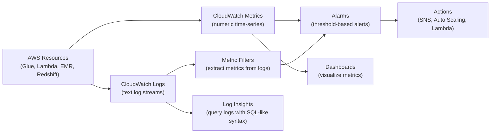

# AWS CloudWatch — Fundamentals

## What Is Amazon CloudWatch?

Amazon CloudWatch is AWS's **monitoring and observability service** that collects metrics, logs, and events from AWS resources and applications. It provides dashboards, alarms, and automated actions to help you understand system health and troubleshoot issues.

**The analogy:** CloudWatch is the instrument panel in your car — speedometer (metrics), check engine light (alarms), trip computer (dashboards), and the black box recorder (logs). You might not look at it every second, but when something goes wrong, it tells you exactly what happened and when.

> **Why CloudWatch matters for DE:** Every data pipeline produces logs and metrics. CloudWatch is where you monitor Glue job durations, Lambda errors, EMR cluster health, and Redshift query performance. It's also where you set up alerts for pipeline failures and cost anomalies.

---

## CloudWatch Components



This diagram shows how CloudWatch ingests metrics and logs from AWS resources, then feeds them into alarms, dashboards, and Log Insights. Metric Filters bridge logs to metrics so that text patterns (like ERROR counts) can drive the same threshold-based alarms as numeric metrics.

---

## Core Concepts

| Concept | Description | DE Example |
|---------|-------------|------------|
| **Metric** | Numeric time-series data point | Glue job duration, Lambda invocations |
| **Namespace** | Container for metrics (per service) | `AWS/Glue`, `AWS/Lambda`, `AWS/Redshift` |
| **Dimension** | Key-value pair to filter metrics | `JobName=daily-etl`, `FunctionName=transform` |
| **Alarm** | Threshold-based trigger | Alert if Glue job runs > 2 hours |
| **Log Group** | Collection of log streams | `/aws/glue/jobs/daily-etl` |
| **Log Stream** | Sequence of log events from one source | One Glue job run = one log stream |
| **Dashboard** | Custom visualization of metrics | Pipeline health overview |
| **Log Insights** | SQL-like query language for logs | Find all ERROR messages in last hour |
| **Custom Metric** | User-published metric | Records processed, data quality score |

---

## Key Metrics for DE Pipelines

| Service | Metric | What It Tells You |
|---------|--------|-------------------|
| **Glue** | `glue.driver.aggregate.bytesRead` | Data volume processed |
| **Glue** | `glue.driver.aggregate.elapsedTime` | Job duration |
| **Lambda** | `Duration` | Function execution time |
| **Lambda** | `Errors` | Function failures |
| **Lambda** | `ConcurrentExecutions` | Scaling pressure |
| **Redshift** | `CPUUtilization` | Cluster load |
| **Redshift** | `PercentageDiskSpaceUsed` | Storage capacity |
| **EMR** | `AppsRunning` | Active Spark jobs |
| **S3** | `NumberOfObjects` | Data lake growth |
| **Kinesis** | `IncomingRecords` | Stream throughput |
| **Kinesis** | `IteratorAgeMilliseconds` | Consumer lag |

---

## Setting Up Alarms

```bash
# Alert if Glue job takes longer than 2 hours (7200 seconds)
aws cloudwatch put-metric-alarm \
  --alarm-name "GlueJob-DailyETL-Duration-High" \
  --namespace "Glue" \
  --metric-name "glue.driver.aggregate.elapsedTime" \
  --dimensions Name=JobName,Value=daily-etl Name=JobRunId,Value=ALL \
  --statistic Maximum \
  --period 300 \
  --evaluation-periods 1 \
  --threshold 7200000 \
  --comparison-operator GreaterThanThreshold \
  --alarm-actions "arn:aws:sns:us-east-1:123456789:pipeline-alerts"

# Alert if Lambda error rate exceeds 5%
aws cloudwatch put-metric-alarm \
  --alarm-name "Lambda-Transform-HighErrorRate" \
  --namespace "AWS/Lambda" \
  --metric-name "Errors" \
  --dimensions Name=FunctionName,Value=data-transform \
  --statistic Sum \
  --period 300 \
  --evaluation-periods 2 \
  --threshold 5 \
  --comparison-operator GreaterThanThreshold \
  --alarm-actions "arn:aws:sns:us-east-1:123456789:pipeline-alerts"
```

---

## CloudWatch Logs Insights

Query logs using a SQL-like syntax — essential for debugging pipeline failures:

```sql
-- Find all errors in a Glue job's logs (last 24 hours)
fields @timestamp, @message
| filter @message like /ERROR/
| sort @timestamp desc
| limit 50

-- Analyze Glue job durations over time
fields @timestamp, @message
| filter @message like /Job completed/
| parse @message "completed in * seconds" as duration
| stats avg(duration), max(duration), min(duration) by bin(1h)

-- Find Lambda cold starts
fields @timestamp, @message, @duration
| filter @type = "REPORT"
| filter @initDuration > 0
| stats count() as coldStarts, avg(@initDuration) as avgColdStart by bin(1h)

-- Track records processed (from custom log output)
fields @timestamp, @message
| filter @message like /records_processed/
| parse @message "records_processed: *" as recordCount
| stats sum(recordCount) as totalRecords by bin(1d)
```

---

## Publishing Custom Metrics

Track pipeline-specific KPIs beyond default AWS metrics:

```python
import boto3
from datetime import datetime

cloudwatch = boto3.client('cloudwatch')

# Publish custom metric: records processed by your ETL
cloudwatch.put_metric_data(
    Namespace='DataPipeline/ETL',
    MetricData=[
        {
            'MetricName': 'RecordsProcessed',
            'Dimensions': [
                {'Name': 'Pipeline', 'Value': 'orders-daily'},
                {'Name': 'Stage', 'Value': 'transform'}
            ],
            'Timestamp': datetime.utcnow(),
            'Value': 150000,
            'Unit': 'Count'
        },
        {
            'MetricName': 'DataQualityScore',
            'Dimensions': [
                {'Name': 'Pipeline', 'Value': 'orders-daily'},
                {'Name': 'Table', 'Value': 'fact_orders'}
            ],
            'Timestamp': datetime.utcnow(),
            'Value': 98.5,
            'Unit': 'Percent'
        }
    ]
)
```

---

## Dashboard for DE Pipelines

```python
import boto3
import json

cloudwatch = boto3.client('cloudwatch')

dashboard_body = {
    "widgets": [
        {
            "type": "metric",
            "properties": {
                "title": "Glue Job Duration (minutes)",
                "metrics": [
                    ["Glue", "glue.driver.aggregate.elapsedTime", "JobName", "daily-etl", {"stat": "Maximum"}]
                ],
                "period": 86400,
                "view": "timeSeries"
            }
        },
        {
            "type": "metric",
            "properties": {
                "title": "Lambda Errors",
                "metrics": [
                    ["AWS/Lambda", "Errors", "FunctionName", "data-transform", {"stat": "Sum"}]
                ],
                "period": 3600,
                "view": "timeSeries"
            }
        },
        {
            "type": "log",
            "properties": {
                "title": "Recent Pipeline Errors",
                "query": "fields @timestamp, @message | filter @message like /ERROR/ | sort @timestamp desc | limit 10",
                "region": "us-east-1",
                "logGroupNames": ["/aws/glue/jobs/daily-etl"]
            }
        }
    ]
}

cloudwatch.put_dashboard(
    DashboardName='DataPipeline-Health',
    DashboardBody=json.dumps(dashboard_body)
)
```

---

## Key DE Use Cases

1. **Pipeline Failure Alerting** — Alarms on Glue job failures, Lambda errors, EMR step failures
2. **Performance Monitoring** — Track job durations, identify slowdowns before SLA breaches
3. **Cost Monitoring** — Alert on unusual data scans (Athena) or long-running EMR clusters
4. **Data Quality Observability** — Custom metrics for record counts, null rates, schema drift
5. **Debugging** — Log Insights to trace errors across distributed pipeline components

---

## CloudWatch vs Alternatives

| Aspect | CloudWatch | Datadog | Prometheus + Grafana |
|--------|-----------|---------|---------------------|
| **Hosting** | AWS-native (zero setup) | SaaS (agent install) | Self-hosted |
| **AWS integration** | Built-in (automatic) | Good (via integration) | Manual (exporters) |
| **Log querying** | Log Insights (basic) | Full-text search (powerful) | Loki (separate tool) |
| **Dashboards** | Basic but functional | Rich and interactive | Grafana (excellent) |
| **Alerting** | Alarms + SNS | Advanced (ML-based) | AlertManager |
| **Cost** | Pay per metric/log/alarm | Per host + ingestion | Infrastructure cost |
| **Best for** | AWS-native, simple needs | Multi-cloud, advanced | Open-source, full control |

---

## Interview Tips

> **Tip 1:** "How do you monitor data pipelines on AWS?" — "CloudWatch is the foundation: automatic metrics from Glue/Lambda/EMR for health, Logs for debugging failures, Alarms + SNS for real-time alerts when jobs fail or exceed duration thresholds. I also publish custom metrics (records processed, data quality scores) and use Log Insights to query across all pipeline logs when troubleshooting."

> **Tip 2:** "What's the difference between CloudWatch Metrics and Logs?" — "Metrics are numeric time-series (CPU at 80%, 5 errors, 3-minute duration) — great for dashboards and alarms. Logs are text streams (error messages, stack traces, debug output) — great for debugging. You can bridge them: Metric Filters extract numeric patterns from logs and create metrics from them (e.g., count 'ERROR' occurrences per minute)."

> **Tip 3:** "How would you detect a slow pipeline before it misses SLA?" — "Set a CloudWatch alarm on the Glue job's elapsed time metric with a threshold below the SLA. For example, if SLA is 4 hours, alarm at 2 hours — gives the team time to investigate. Combine with a dashboard showing job duration trends over time to spot gradual degradation before it becomes critical."
