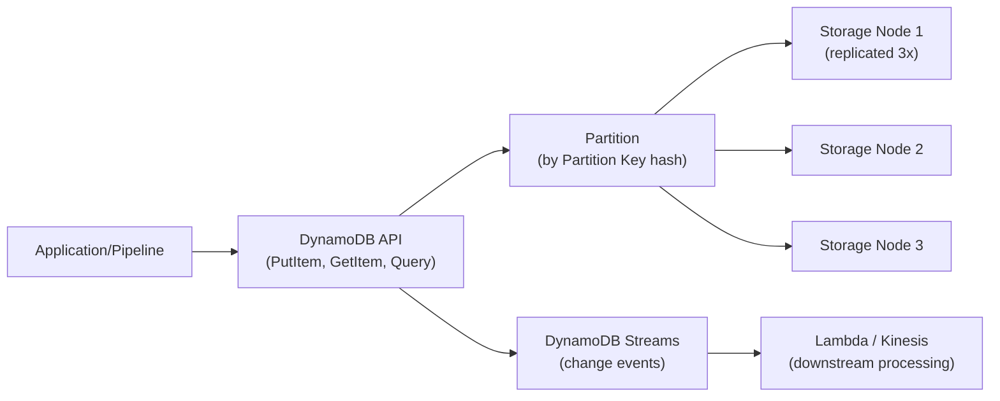

# AWS DynamoDB — Fundamentals

## What Is Amazon DynamoDB?

Amazon DynamoDB is a **fully managed, serverless NoSQL database** that provides single-digit millisecond performance at any scale. It supports both key-value and document data models, with automatic scaling, built-in replication, and zero operational overhead.

**The analogy:** DynamoDB is like a massive filing cabinet where every drawer is labeled with a unique key. You can instantly pull any drawer by its label (key lookup), but if you want to browse drawers by content without knowing the label, you need an index card system (secondary indexes). It's fast for lookups but not designed for complex SQL joins.

> **Why DynamoDB matters for DE:** Data engineers use DynamoDB as a metadata store (track pipeline runs, job status), a lookup table (enrich streaming data), and a state manager (deduplication, checkpointing). Its DynamoDB Streams feature also enables CDC-like event sourcing for downstream processing.

---

## How DynamoDB Works



**What this shows:**
- Data is distributed across partitions based on the partition key hash
- Each item is replicated across 3 Availability Zones (durable by default)
- Access is via API calls (not SQL) — GetItem, PutItem, Query, Scan
- DynamoDB Streams captures every change for event-driven processing

---

## Core Concepts

| Concept | Description | DE Example |
|---------|-------------|------------|
| **Table** | Collection of items (no fixed schema) | `pipeline_runs`, `job_metadata` |
| **Item** | Single record (like a row) | `{pipeline_id: "daily-etl", status: "SUCCESS"}` |
| **Partition Key (PK)** | Primary key — determines data distribution | `pipeline_id` |
| **Sort Key (SK)** | Optional — enables range queries within a partition | `run_date` |
| **GSI (Global Secondary Index)** | Alternate query pattern (different PK/SK) | Query by `status` across all pipelines |
| **LSI (Local Secondary Index)** | Alternate sort within same partition key | Sort runs by `duration` instead of `date` |
| **DynamoDB Streams** | Ordered log of item changes (insert/modify/delete) | Trigger Lambda on pipeline completion |
| **TTL (Time to Live)** | Auto-delete items after expiry | Clean up old pipeline run records |

---

## Key Design: Partition Key + Sort Key

```
Table: pipeline_runs
┌──────────────────────────────────────────────────────────────┐
│ Partition Key (PK)  │ Sort Key (SK)    │ Attributes          │
├─────────────────────┼──────────────────┼─────────────────────┤
│ daily-etl           │ 2024-01-15       │ status=SUCCESS, duration=1200 │
│ daily-etl           │ 2024-01-14       │ status=SUCCESS, duration=1150 │
│ daily-etl           │ 2024-01-13       │ status=FAILED, duration=800   │
│ hourly-ingest       │ 2024-01-15T10:00 │ status=SUCCESS, records=50000 │
│ hourly-ingest       │ 2024-01-15T09:00 │ status=SUCCESS, records=48000 │
└──────────────────────────────────────────────────────────────┘
```

**Query patterns enabled:**
- Get all runs for `daily-etl` → Query PK = "daily-etl"
- Get runs for `daily-etl` in January → Query PK = "daily-etl", SK begins_with "2024-01"
- Get latest run → Query PK = "daily-etl", SK descending, Limit 1

---

## Basic Operations (Python/Boto3)

```python
import boto3
from datetime import datetime

dynamodb = boto3.resource('dynamodb')
table = dynamodb.Table('pipeline_runs')

# --- Write: Track a pipeline run ---
table.put_item(Item={
    'pipeline_id': 'daily-etl',
    'run_date': '2024-01-15',
    'status': 'SUCCESS',
    'duration_seconds': 1200,
    'records_processed': 150000,
    'started_at': '2024-01-15T02:00:00Z',
    'completed_at': '2024-01-15T02:20:00Z',
    'ttl': int(datetime(2024, 4, 15).timestamp())  # Auto-delete after 90 days
})

# --- Read: Get a specific run ---
response = table.get_item(Key={
    'pipeline_id': 'daily-etl',
    'run_date': '2024-01-15'
})
item = response['Item']

# --- Query: Get last 7 runs for a pipeline ---
from boto3.dynamodb.conditions import Key

response = table.query(
    KeyConditionExpression=Key('pipeline_id').eq('daily-etl') & Key('run_date').gte('2024-01-08'),
    ScanIndexForward=False,  # Descending order
    Limit=7
)
runs = response['Items']

# --- Update: Mark a run as failed ---
table.update_item(
    Key={'pipeline_id': 'daily-etl', 'run_date': '2024-01-15'},
    UpdateExpression='SET #s = :status, error_message = :err',
    ExpressionAttributeNames={'#s': 'status'},
    ExpressionAttributeValues={':status': 'FAILED', ':err': 'Connection timeout'}
)
```

---

## Global Secondary Index (GSI)

Query data by a different key pattern without duplicating the table:

```python
# Create table with GSI to query by status
# (typically done via CloudFormation/Terraform, shown conceptually)

# GSI: status-index
# PK = status, SK = run_date
# Now you can query: "Give me all FAILED pipelines in the last week"

response = table.query(
    IndexName='status-index',
    KeyConditionExpression=Key('status').eq('FAILED') & Key('run_date').gte('2024-01-08')
)
failed_runs = response['Items']
```

**GSI design rules:**
- Each GSI is essentially a full copy of selected attributes (costs storage + write capacity)
- Maximum 20 GSIs per table
- GSI PK should have high cardinality (avoid hot partitions)

---

## DynamoDB Streams for Event-Driven DE

```python
# DynamoDB Streams + Lambda: trigger action when pipeline completes

# Lambda handler triggered by DynamoDB Stream
def handler(event, context):
    for record in event['Records']:
        if record['eventName'] == 'MODIFY':
            new_image = record['dynamodb']['NewImage']
            status = new_image['status']['S']
            pipeline = new_image['pipeline_id']['S']
            
            if status == 'FAILED':
                # Send alert via SNS
                send_alert(f"Pipeline {pipeline} FAILED!")
            elif status == 'SUCCESS':
                # Trigger downstream pipeline
                start_next_pipeline(pipeline)
```

---

## Capacity Modes

| Mode | How It Works | Best For | DE Use |
|------|-------------|----------|--------|
| **On-Demand** | Pay per request, auto-scales | Unpredictable traffic | Pipeline metadata (sporadic writes) |
| **Provisioned** | Set RCU/WCU, cheaper if predictable | Steady traffic | High-volume lookup tables |
| **Provisioned + Auto Scaling** | Auto-adjusts within min/max | Mostly predictable with bursts | Streaming enrichment tables |

> **DE rule of thumb:** Use On-Demand for metadata/state tables (low volume, unpredictable). Use Provisioned for lookup tables used in streaming pipelines (predictable, cost-sensitive).

---

## Key DE Use Cases

1. **Pipeline Metadata Store** — Track job runs, statuses, durations, record counts
2. **State Management** — Deduplication (store processed IDs), checkpointing (last offset)
3. **Lookup/Enrichment Tables** — Enrich streaming events with dimension data (customer info, product details)
4. **Configuration Store** — Pipeline configs, feature flags, connection strings
5. **CDC via Streams** — Capture changes and push to Kinesis/Lambda for downstream processing

---

## DynamoDB vs Alternatives

| Aspect | DynamoDB | Redis (ElastiCache) | RDS (PostgreSQL) |
|--------|----------|---------------------|------------------|
| **Data model** | Key-value / document | Key-value / in-memory | Relational (SQL) |
| **Latency** | Single-digit ms | Sub-millisecond | Low ms (indexed) |
| **Durability** | 3-AZ replication | Optional persistence | Multi-AZ + backups |
| **Scalability** | Virtually unlimited | Memory-limited | Vertical (instance size) |
| **Query flexibility** | PK/SK + GSI only | Key-based only | Full SQL (joins, aggregates) |
| **Cost at scale** | Moderate | Expensive (memory) | Moderate (instance) |
| **Best for DE** | Metadata, state, lookups | Low-latency cache layer | Source system, complex queries |

---

## Interview Tips

> **Tip 1:** "When would you use DynamoDB in a data pipeline?" — "Three main uses: (1) Pipeline metadata store — track run status, durations, record counts with PK=pipeline_id, SK=run_date. (2) Lookup tables for stream enrichment — sub-ms reads to join dimension data into streaming events. (3) State management — store checkpoints, processed IDs for exactly-once semantics. All serverless, all durable, all auto-scaling."

> **Tip 2:** "How do you design a DynamoDB table?" — "Start with access patterns, not data structure. Ask: 'What queries will I run?' Then choose PK/SK to support the primary query, and add GSIs for secondary patterns. For pipeline tracking: PK=pipeline_id (which pipeline), SK=run_date (query by time range). Key rule: PK determines partition — high-cardinality keys distribute load evenly."

> **Tip 3:** "DynamoDB Streams vs Kinesis?" — "DynamoDB Streams captures changes TO DynamoDB items (insert/modify/delete) — like CDC for DynamoDB. Use it to trigger downstream processing when pipeline state changes. Kinesis Data Streams is for ingesting external event streams (clickstream, IoT, logs). They solve different problems: Streams = react to DynamoDB changes; Kinesis = ingest high-volume external events."
