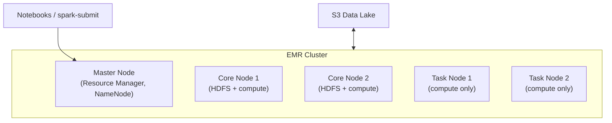

# AWS EMR — Fundamentals


## 🎯 Analogy

Think of EMR like a rented Spark cluster on demand: you describe how many machines you need, what software stack (Spark, Hive, Presto), EMR provisions it, runs your job, and you pay only for the runtime — no cluster management.

---
## What Is Amazon EMR?

Amazon EMR (Elastic MapReduce) is a **managed big data platform** that runs open-source frameworks like Apache Spark, Hive, Presto, HBase, and Flink on a cluster of EC2 instances (or serverless).

**The analogy:** If Glue is a vending machine (serverless, automatic), EMR is a full professional kitchen — you manage the equipment but have unlimited flexibility and power.

> **Why EMR matters for DE:** When you need full control over Spark configuration, custom libraries, long-running clusters, or tools beyond PySpark (Hive, Presto, HBase), EMR is the answer. It handles the hardest data engineering workloads at scale.

---

## EMR vs Glue — When to Use Which

| Factor | EMR | Glue |
|--------|-----|------|
| Management | You manage cluster lifecycle | Fully serverless |
| Flexibility | Full Spark config, any library | Limited to Glue API + Spark |
| Scale | 100s of nodes, PBs of data | 2-100 DPUs |
| Cost model | Per EC2 instance-hour | Per DPU-hour |
| Startup time | 5-10 minutes (cluster launch) | 1-2 minutes (warm pool) |
| Long-running | Yes (persistent clusters) | No (job-level only) |
| Ecosystem | Spark, Hive, Presto, Flink, HBase | Spark only |
| Best for | Large/complex, custom, persistent | Simple/medium, serverless ETL |

---

## Cluster Architecture



This diagram shows how a client submits work to the master node, which coordinates core and task nodes, while S3 acts as the durable storage layer instead of HDFS.

**Node types:**

| Node Type | Role | HDFS? | Can scale to 0? |
|-----------|------|:---:|:---:|
| **Master** | Cluster coordinator (YARN, Spark Driver) | Yes | No (always 1-3) |
| **Core** | Store HDFS data + run tasks | Yes | No (data loss risk) |
| **Task** | Run tasks only (no storage) | No | Yes (scale up/down freely) |

> **Best practice:** Use Core nodes for stable workload. Use Task nodes (especially Spot instances) for burst capacity — they're disposable since they don't store HDFS data.

---

## EMR on EC2 vs EMR Serverless vs EMR on EKS

| Option | What It Is | Best For |
|--------|-----------|----------|
| **EMR on EC2** | Traditional managed cluster | Long-running, persistent workloads |
| **EMR Serverless** | No cluster management, auto-scales | Job-level (like Glue but with full Spark) |
| **EMR on EKS** | Runs on Kubernetes pods | K8s-native teams, mixed workloads |

```python
# EMR Serverless: submit a job without managing a cluster
import boto3

emr_serverless = boto3.client('emr-serverless')

# Create an application (one-time setup)
app = emr_serverless.create_application(
    name='data-processing',
    releaseLabel='emr-6.15.0',
    type='SPARK',
    autoStartConfiguration={'enabled': True},
    autoStopConfiguration={'enabled': True, 'idleTimeoutMinutes': 5}
)

# Submit a job
emr_serverless.start_job_run(
    applicationId=app['applicationId'],
    executionRoleArn='arn:aws:iam::123:role/EMRServerlessRole',
    jobDriver={
        'sparkSubmit': {
            'entryPoint': 's3://scripts/etl/daily_transform.py',
            'entryPointArguments': ['--date', '2024-01-15'],
            'sparkSubmitParameters': '--conf spark.executor.memory=8g --conf spark.executor.cores=4'
        }
    }
)
```

---

## Submitting Spark Jobs

### Via spark-submit (SSH to master or Step)

```bash
# SSH to master node
spark-submit \
    --master yarn \
    --deploy-mode cluster \
    --num-executors 20 \
    --executor-memory 8g \
    --executor-cores 4 \
    --conf spark.sql.adaptive.enabled=true \
    s3://scripts/etl/process_orders.py \
    --date 2024-01-15
```

### Via EMR Steps (API-driven, no SSH)

```python
emr = boto3.client('emr')

emr.add_job_flow_steps(
    JobFlowId='j-CLUSTER_ID',
    Steps=[{
        'Name': 'Daily Orders ETL',
        'ActionOnFailure': 'CONTINUE',
        'HadoopJarStep': {
            'Jar': 'command-runner.jar',
            'Args': [
                'spark-submit',
                '--deploy-mode', 'cluster',
                '--num-executors', '20',
                's3://scripts/etl/process_orders.py',
                '--date', '2024-01-15'
            ]
        }
    }]
)
```

---

## Cost Optimization with Spot Instances

EMR supports mixing On-Demand and Spot instances for massive savings:

```python
# Instance fleet configuration (mixed On-Demand + Spot)
instance_fleets = [
    {
        'Name': 'Master',
        'InstanceFleetType': 'MASTER',
        'TargetOnDemandCapacity': 1,  # Master always On-Demand (stability)
        'InstanceTypeConfigs': [{'InstanceType': 'm5.xlarge'}]
    },
    {
        'Name': 'Core',
        'InstanceFleetType': 'CORE',
        'TargetOnDemandCapacity': 4,   # 4 On-Demand (HDFS data)
        'TargetSpotCapacity': 0,       # No Spot for Core (data safety)
        'InstanceTypeConfigs': [{'InstanceType': 'r5.2xlarge'}]
    },
    {
        'Name': 'Task',
        'InstanceFleetType': 'TASK',
        'TargetOnDemandCapacity': 0,   # No On-Demand needed
        'TargetSpotCapacity': 20,      # 20 Spot instances (cheap burst)
        'InstanceTypeConfigs': [
            {'InstanceType': 'r5.2xlarge'},   # Try these first
            {'InstanceType': 'r5a.2xlarge'},  # Fallback options
            {'InstanceType': 'r4.2xlarge'},   # More fallbacks
        ]
    }
]
# Spot savings: 60-80% off On-Demand pricing
# Task nodes are disposable: if Spot is reclaimed, tasks retry on remaining nodes
```

---

## EMR + S3 (EMRFS)

Modern EMR uses S3 as the primary storage layer (not HDFS):

```python
# Read/write directly from S3 (no HDFS needed)
df = spark.read.parquet("s3://data-lake/curated/orders/")
df.write.parquet("s3://data-lake/analytics/order_summary/")

# EMRFS provides:
# - Consistent view (read-after-write consistency)
# - S3 encryption integration
# - IAM-based access control
# - No HDFS means: cluster is stateless → easy terminate and recreate
```

> **Best practice:** Store all persistent data in S3, not HDFS. Use HDFS only for temporary shuffle data and caching. This makes clusters disposable (terminate when not in use).

---

## Common EMR Use Cases for DE

| Use Case | Why EMR (not Glue) | Configuration |
|----------|-------------------|---------------|
| 500 GB+ daily ETL | Need custom Spark tuning, >100 DPUs | 20-50 Task nodes |
| Interactive analytics | Persistent cluster for notebooks | Jupyter/Zeppelin on master |
| Hive SQL warehouse | Hive metastore + LLAP | Hive-optimized cluster |
| Streaming (Flink) | Long-running stream processor | Small persistent cluster |
| ML training (Spark MLlib) | Heavy compute, custom libraries | GPU instances for task nodes |

---


## ▶️ Try It Yourself

```bash
# Create an EMR cluster and submit a Spark job
aws emr create-cluster \
  --name "Orders ETL" \
  --release-label emr-7.0.0 \
  --applications Name=Spark \
  --instance-type m5.xlarge \
  --instance-count 3 \
  --use-default-roles \
  --steps '[{
    "Name": "Transform Orders",
    "ActionOnFailure": "TERMINATE_CLUSTER",
    "HadoopJarStep": {
      "Jar": "command-runner.jar",
      "Args": ["spark-submit",
               "s3://my-bucket/scripts/transform_orders.py",
               "--date", "2024-01-15"]
    }
  }]' \
  --auto-terminate

# Monitor the cluster
aws emr list-clusters --active
aws emr describe-cluster --cluster-id j-XXXXXXXXXXXXX
```

> **Run it:** Copy the snippet into a REPL or file and run it — no external services needed for the basic example.

---
## Interview Tips

> **Tip 1:** "EMR vs Glue?" — "Glue for: simple-to-medium serverless ETL, catalog-integrated, incremental loads with bookmarks. EMR for: large-scale (PB), custom Spark config, long-running clusters, other frameworks (Hive/Presto/Flink), or when you need Spot instances for 60-80% cost savings."

> **Tip 2:** "How do you optimize EMR costs?" — "Three strategies: (1) Spot instances for Task nodes (60-80% savings), (2) Auto-scaling to add/remove task nodes based on YARN pending containers, (3) Transient clusters (launch for job, terminate after) vs persistent (always-on). S3 storage means clusters are stateless and disposable."

> **Tip 3:** "Explain EMR node types" — "Master: coordinates cluster (YARN, Spark driver). Core: stores HDFS data + runs compute tasks (can't scale to zero safely). Task: compute-only, no data (freely scalable, perfect for Spot). For S3-based workloads, minimize Core nodes and maximize Task nodes for flexibility."
