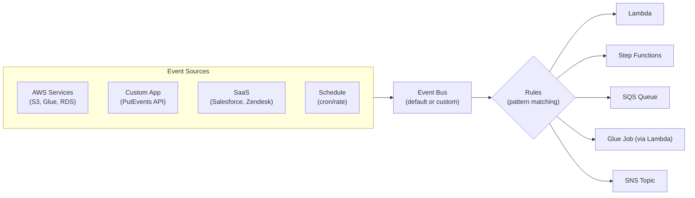

# AWS EventBridge — Fundamentals


## 🎯 Analogy

Think of EventBridge like an event switchboard: producers publish events (S3 file uploaded, order placed), rules pattern-match those events, and EventBridge routes them to the right consumer (Lambda, SQS, Step Functions) — decoupled, no direct wiring needed.

---
## What Is Amazon EventBridge?

Amazon EventBridge is a **serverless event bus** that connects applications using events. It routes events from AWS services, custom applications, and SaaS providers to targets (Lambda, Step Functions, SQS, etc.) based on rules you define. It also includes EventBridge Scheduler for cron-like scheduling.

**The analogy:** EventBridge is like a smart mail sorting center. Every event (letter) that arrives gets inspected against rules (sorting criteria). Based on the content, it gets routed to the right destination — some letters go to multiple recipients, some trigger automated responses, and some are scheduled for future delivery.

> **Why EventBridge matters for DE:** EventBridge is the modern way to trigger data pipelines on AWS. Schedule Glue jobs with cron expressions, react to S3 file arrivals, trigger Step Functions when upstream pipelines complete, or route events across AWS accounts. It replaced CloudWatch Events and adds powerful filtering, scheduling, and cross-account capabilities.

---

## How EventBridge Works



**What this shows:**
- Events arrive on an event bus from AWS services, your code, or SaaS
- Rules match events based on content patterns (JSON matching)
- Matched events are routed to targets (1 rule → up to 5 targets)
- EventBridge Scheduler handles time-based triggers (cron/rate)

---

## Core Concepts

| Concept | Description | DE Example |
|---------|-------------|------------|
| **Event** | JSON object describing something that happened | `{"source": "aws.glue", "detail-type": "Glue Job State Change"}` |
| **Event Bus** | Channel where events flow (default or custom) | `default` bus for AWS events, custom for pipelines |
| **Rule** | Pattern match + target(s) | "When Glue job fails, trigger Lambda" |
| **Target** | Where to send matched events | Lambda, Step Functions, SQS, SNS |
| **Schedule** | Cron or rate expression | `cron(0 2 * * ? *)` — run daily at 2 AM UTC |
| **Schema Registry** | Discover event structure automatically | See what fields Glue events contain |
| **Archive** | Store events for replay | Replay last week's events for testing |
| **Cross-Account Bus** | Send events to another account's bus | Central pipeline account receives events from data producers |

---

## Event Structure

Every event on EventBridge follows this format:

```json
{
  "version": "0",
  "id": "abc123-def456",
  "source": "aws.glue",
  "account": "123456789012",
  "time": "2024-01-15T02:30:00Z",
  "region": "us-east-1",
  "detail-type": "Glue Job State Change",
  "detail": {
    "jobName": "daily-etl",
    "state": "FAILED",
    "severity": "ERROR",
    "message": "OutOfMemoryError"
  }
}
```

**Rule pattern matching — match on any field:**
```json
{
  "source": ["aws.glue"],
  "detail-type": ["Glue Job State Change"],
  "detail": {
    "state": ["FAILED", "TIMEOUT"],
    "jobName": [{"prefix": "prod-"}]
  }
}
```

> This rule matches: any Glue job starting with "prod-" that FAILED or TIMEOUT'd.

---

## Scheduling Pipelines (EventBridge Scheduler)

```bash
# Schedule a Glue job to run daily at 2 AM UTC
aws scheduler create-schedule \
  --name "daily-etl-trigger" \
  --schedule-expression "cron(0 2 * * ? *)" \
  --target '{
    "Arn": "arn:aws:states:us-east-1:123456789:stateMachine:DailyETLPipeline",
    "RoleArn": "arn:aws:iam::123456789:role/EventBridgeSchedulerRole",
    "Input": "{\"execution_date\": \"<aws.scheduler.execution-id>\"}"
  }' \
  --flexible-time-window '{"Mode": "OFF"}'

# Schedule with rate expression (every 6 hours)
aws scheduler create-schedule \
  --name "incremental-load-trigger" \
  --schedule-expression "rate(6 hours)" \
  --target '{
    "Arn": "arn:aws:lambda:us-east-1:123456789:function:trigger-incremental-load",
    "RoleArn": "arn:aws:iam::123456789:role/EventBridgeSchedulerRole"
  }' \
  --flexible-time-window '{"Mode": "FLEXIBLE", "MaximumWindowInMinutes": 15}'
```

**Common DE schedules:**
| Expression | Meaning | Use Case |
|-----------|---------|----------|
| `cron(0 2 * * ? *)` | Daily at 2 AM UTC | Nightly ETL pipeline |
| `cron(0 */6 * * ? *)` | Every 6 hours | Incremental loads |
| `cron(0 8 ? * MON-FRI *)` | Weekdays at 8 AM | Business hours report refresh |
| `rate(15 minutes)` | Every 15 minutes | Near-real-time micro-batching |
| `rate(1 hour)` | Every hour | Hourly aggregation pipeline |

---

## Event-Driven Pipeline Triggers

### Trigger on S3 File Arrival

```python
import boto3
import json

events = boto3.client('events')

# Rule: When a new file arrives in the raw data bucket
events.put_rule(
    Name='new-file-arrival',
    EventPattern=json.dumps({
        "source": ["aws.s3"],
        "detail-type": ["Object Created"],
        "detail": {
            "bucket": {"name": ["raw-data-bucket"]},
            "object": {"key": [{"prefix": "orders/"}]}
        }
    }),
    State='ENABLED'
)

# Target: Start Step Functions pipeline
events.put_targets(
    Rule='new-file-arrival',
    Targets=[{
        'Id': 'start-pipeline',
        'Arn': 'arn:aws:states:us-east-1:123456789:stateMachine:ProcessNewFile',
        'RoleArn': 'arn:aws:iam::123456789:role/EventBridgeStepFunctionsRole',
        'InputTransformer': {
            'InputPathsMap': {
                'bucket': '$.detail.bucket.name',
                'key': '$.detail.object.key'
            },
            'InputTemplate': '{"source_bucket": "<bucket>", "source_key": "<key>"}'
        }
    }]
)
```

### Trigger on Glue Job Completion (Chain Pipelines)

```python
# Rule: When daily-etl Glue job succeeds, start the next pipeline
events.put_rule(
    Name='etl-completed-trigger',
    EventPattern=json.dumps({
        "source": ["aws.glue"],
        "detail-type": ["Glue Job State Change"],
        "detail": {
            "jobName": ["daily-etl"],
            "state": ["SUCCEEDED"]
        }
    }),
    State='ENABLED'
)

events.put_targets(
    Rule='etl-completed-trigger',
    Targets=[
        {
            'Id': 'start-downstream',
            'Arn': 'arn:aws:states:us-east-1:123456789:stateMachine:DownstreamPipeline',
            'RoleArn': 'arn:aws:iam::123456789:role/EventBridgeRole'
        },
        {
            'Id': 'notify-success',
            'Arn': 'arn:aws:sns:us-east-1:123456789:pipeline-alerts',
            'Input': '{"message": "daily-etl completed successfully!"}'
        }
    ]
)
```

---

## Cross-Account Event Routing

```
Account A (Data Producers)     Account B (Pipeline Account)
┌─────────────────────┐       ┌──────────────────────────┐
│ Glue Job completes  │       │ EventBridge Rule          │
│ → Event on default  │──────→│ → Start Step Functions   │
│   bus               │       │ → Process data           │
└─────────────────────┘       └──────────────────────────┘
```

```python
# Account A: Allow Account B to receive events
events_a = boto3.client('events')
events_a.put_permission(
    StatementId='AllowAccountB',
    Action='events:PutEvents',
    Principal='ACCOUNT_B_ID'
)

# Account A: Rule to forward events to Account B
events_a.put_rule(
    Name='forward-to-pipeline-account',
    EventPattern='{"source": ["aws.glue"]}',
    State='ENABLED'
)
events_a.put_targets(
    Rule='forward-to-pipeline-account',
    Targets=[{
        'Id': 'account-b-bus',
        'Arn': f'arn:aws:events:us-east-1:ACCOUNT_B_ID:event-bus/default'
    }]
)
```

---

## Custom Events (Pipeline Status)

```python
import boto3
import json
from datetime import datetime

events = boto3.client('events')

# Publish custom event from your pipeline code
def publish_pipeline_event(pipeline_name, status, metadata):
    events.put_events(
        Entries=[{
            'Source': 'data-platform.pipelines',
            'DetailType': 'Pipeline Execution Status',
            'Detail': json.dumps({
                'pipeline': pipeline_name,
                'status': status,  # STARTED, SUCCEEDED, FAILED
                'timestamp': datetime.utcnow().isoformat(),
                'records_processed': metadata.get('records', 0),
                'duration_seconds': metadata.get('duration', 0)
            }),
            'EventBusName': 'data-platform-bus'
        }]
    )

# Usage in your Glue job or Lambda
publish_pipeline_event('orders-daily', 'SUCCEEDED', {
    'records': 150000,
    'duration': 1200
})
```

---

## EventBridge vs CloudWatch Events

EventBridge is the evolution of CloudWatch Events (same underlying service):

| Aspect | CloudWatch Events (legacy) | EventBridge (modern) |
|--------|--------------------------|---------------------|
| **Custom event bus** | No (default only) | Yes (multiple buses) |
| **SaaS integration** | No | Yes (Salesforce, Zendesk, etc.) |
| **Schema Registry** | No | Yes (auto-discovers event shapes) |
| **Cross-account** | Limited | Full support |
| **Archive & Replay** | No | Yes |
| **Scheduler** | Basic cron | Full-featured with flexible windows |
| **Status** | Maintenance mode | Actively developed |

> **Rule:** Always use EventBridge for new projects. CloudWatch Events rules still work but are managed through the EventBridge console now.

---

## Key DE Use Cases

1. **Schedule Pipelines** — Cron-based triggers for Glue jobs, Step Functions, Lambda
2. **Event-Driven Processing** — React to S3 file arrivals, database changes, API events
3. **Pipeline Chaining** — When upstream Glue job succeeds → trigger downstream pipeline
4. **Cross-Account Orchestration** — Data producer accounts emit events → central pipeline account reacts
5. **Failure Alerting** — Match FAILED state events → SNS notification + Slack + PagerDuty
6. **Replay for Testing** — Archive events, replay them against updated pipeline logic

---

## EventBridge vs Alternatives

| Aspect | EventBridge | Airflow Scheduler | Step Functions | SNS/SQS |
|--------|-------------|------------------|----------------|---------|
| **Scheduling** | Cron/rate expressions | Advanced (DAG-level) | None (needs EventBridge) | None |
| **Event routing** | Pattern-based rules | Not event-driven | Not event-driven | Simple pub/sub |
| **Filtering** | Rich JSON pattern matching | N/A | Choice states | SNS filter policies |
| **Cross-account** | Built-in | Complex | Complex | Topic policies |
| **Best for** | Triggering, routing, scheduling | Complex DAG orchestration | Workflow execution | Message buffering |
| **DE role** | "When should this run?" | "What should happen?" | "In what order?" | "Buffer between steps" |

> **They work together:** EventBridge triggers Step Functions on schedule → Step Functions orchestrates the workflow → SQS buffers between steps → SNS alerts on completion/failure.

---


## ▶️ Try It Yourself

```python
import boto3
import json

events = boto3.client("events", region_name="us-east-1")

# Publish a custom event
events.put_events(
    Entries=[{
        "Source": "com.mycompany.orders",
        "DetailType": "OrderPlaced",
        "Detail": json.dumps({"order_id": "ord-001", "amount": 150.0, "region": "US"}),
        "EventBusName": "default",
    }]
)

# Rules are defined in the console or IaC (Terraform/CDK):
# Pattern: {"source": ["com.mycompany.orders"], "detail-type": ["OrderPlaced"]}
# Target: Lambda ARN or SQS queue

print("Event published to EventBridge — rules route it to targets automatically")
```

> **Run it:** Copy the snippet into a REPL or file and run it — no external services needed for the basic example.

---
## Interview Tips

> **Tip 1:** "What is EventBridge and how do you use it for data pipelines?" — "EventBridge is a serverless event bus that routes events to targets based on rules. For DE, it's used to: (1) Schedule pipelines with cron expressions (replacing CloudWatch Events), (2) React to events like S3 file arrivals to trigger processing, (3) Chain pipelines — when upstream job succeeds, start downstream. It supports cross-account events, making it ideal for multi-team data platforms."

> **Tip 2:** "How is EventBridge different from SNS?" — "SNS is simple pub/sub — publish a message to a topic and all subscribers get it (optionally filtered). EventBridge is an event bus with content-based routing — events are matched against rule patterns (any JSON field) and routed to different targets. EventBridge also handles scheduling, cross-account events, schema discovery, and archive/replay. Use SNS for simple fan-out notifications; use EventBridge for intelligent event routing and pipeline triggering."

> **Tip 3:** "How would you build an event-driven pipeline on AWS?" — "S3 file arrives → EventBridge rule matches the Object Created event → triggers Step Functions state machine → Step Functions orchestrates Glue jobs (extract, transform, load) with error handling → on completion, EventBridge receives the success event → triggers downstream consumers and sends SNS notification. For scheduling, EventBridge Scheduler triggers the initial Step Functions execution on a cron. The entire flow is serverless with no infrastructure to manage."
