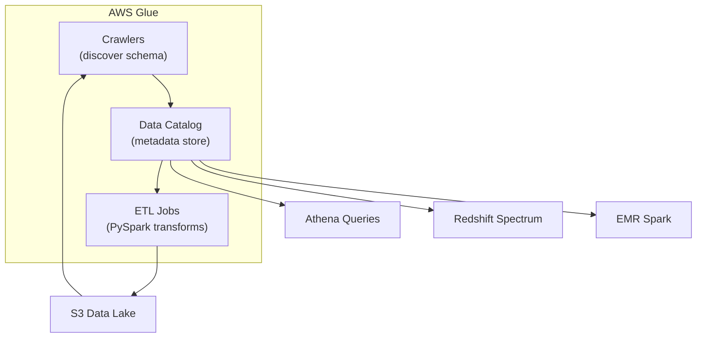

# AWS Glue — Fundamentals


## 🎯 Analogy

Think of AWS Glue like a serverless kitchen for data: the Glue Catalog is the recipe book (schemas and table definitions), Glue ETL Jobs are the chefs (Spark-based transforms), and crawlers automatically taste new ingredients and add them to the recipe book.

---
## What Is AWS Glue?

AWS Glue is a **serverless ETL (Extract, Transform, Load) service** that combines three capabilities:
1. **Data Catalog** — a centralized metadata store (like Hive Metastore)
2. **ETL Jobs** — serverless Spark (PySpark/Scala) jobs for data transformation
3. **Crawlers** — automated schema discovery that populates the catalog

**The analogy:** Glue is like having a librarian (Crawler) that catalogs all your books (data), a workshop (ETL engine) to refurbish them, and an index card system (Data Catalog) so anyone can find what they need.

> **Why Glue matters for DE:** It's the primary ETL service on AWS. No cluster management, pay-per-use, integrates with S3/Redshift/RDS/Athena. Most AWS data pipelines use Glue for transformation.

---

## The Three Components



**What this shows:**
- **Crawlers** scan S3 (or databases) and write schema metadata to the Data Catalog
- **Data Catalog** is the central schema registry — used by Athena, Redshift, EMR, and Glue itself
- **ETL Jobs** read from S3, transform data (using PySpark), and write back to S3
- All three work together but can also be used independently

---

## Component 1: Data Catalog

The Glue Data Catalog is a **Hive-compatible metastore** that stores:
- Database definitions (logical groupings)
- Table definitions (schema, location, format, partitions)
- Partition information (which data files exist for each partition value)

```
Catalog Structure:
├── Database: raw_data
│   ├── Table: orders (S3: s3://lake/raw/orders/, Format: JSON)
│   └── Table: users (S3: s3://lake/raw/users/, Format: CSV)
├── Database: curated
│   ├── Table: fact_orders (S3: s3://lake/curated/orders/, Format: Parquet)
│   └── Table: dim_users (S3: s3://lake/curated/users/, Format: Parquet)
```

**Why a catalog matters:**
- Athena can query S3 data using SQL (without knowing file locations or formats)
- Spark/EMR jobs can reference tables by name (not S3 paths)
- Schema is stored centrally (not scattered across job scripts)

---

## Component 2: Crawlers

Crawlers automatically discover data and register it in the catalog:

```python
import boto3

glue = boto3.client('glue')

# Create a crawler that scans an S3 path
glue.create_crawler(
    Name='orders-crawler',
    Role='arn:aws:iam::123:role/GlueRole',
    DatabaseName='raw_data',
    Targets={
        'S3Targets': [
            {'Path': 's3://data-lake/raw/orders/'}
        ]
    },
    Schedule='cron(0 6 * * ? *)',  # Run daily at 6 AM
    SchemaChangePolicy={
        'UpdateBehavior': 'UPDATE_IN_DATABASE',
        'DeleteBehavior': 'LOG'
    }
)

# Run the crawler
glue.start_crawler(Name='orders-crawler')
```

**What a crawler does:**
1. Scans the target S3 path
2. Reads sample files to infer schema (columns, types)
3. Detects partitions (e.g., `year=2024/month=01/`)
4. Creates/updates the table definition in the Data Catalog

> **When to use crawlers:** Initial schema discovery and when new partitions appear. For production: many teams prefer manual catalog registration (more control over schema).

---

## Component 3: ETL Jobs

Glue ETL jobs run PySpark code on a serverless Spark cluster:

```python
# A simple Glue ETL job script
import sys
from awsglue.transforms import *
from awsglue.utils import getResolvedOptions
from awsglue.context import GlueContext
from awsglue.job import Job
from pyspark.context import SparkContext

# Initialize Glue context
sc = SparkContext()
glueContext = GlueContext(sc)
spark = glueContext.spark_session
job = Job(glueContext)

args = getResolvedOptions(sys.argv, ['JOB_NAME'])
job.init(args['JOB_NAME'], args)

# Read from catalog (DynamicFrame — Glue's DataFrame extension)
orders_dyf = glueContext.create_dynamic_frame.from_catalog(
    database="raw_data",
    table_name="orders"
)

# Convert to Spark DataFrame for standard PySpark operations
orders_df = orders_dyf.toDF()

# Transform
from pyspark.sql.functions import col, upper, current_timestamp

clean_orders = orders_df \
    .filter(col("amount") > 0) \
    .withColumn("region", upper(col("region"))) \
    .withColumn("processed_at", current_timestamp())

# Write back to S3 as Parquet (and register in catalog)
clean_dyf = DynamicFrame.fromDF(clean_orders, glueContext, "clean_orders")
glueContext.write_dynamic_frame.from_options(
    frame=clean_dyf,
    connection_type="s3",
    connection_options={"path": "s3://data-lake/curated/orders/"},
    format="parquet"
)

job.commit()
```

---

## DynamicFrame vs DataFrame

Glue adds `DynamicFrame` on top of Spark's DataFrame:

| Feature | DataFrame | DynamicFrame |
|---------|-----------|-------------|
| Schema | Fixed (fails on mismatch) | Flexible (handles mixed types) |
| Null handling | Standard | Built-in null transforms |
| Catalog integration | Manual | Native (from_catalog, write to catalog) |
| Performance | Standard Spark | Same (converts internally) |
| When to use | Standard transformations | Reading messy source data |

```python
# DynamicFrame handles columns with mixed types (int AND string in same column)
# DataFrame would fail or cast incorrectly

# Convert between them freely:
df = dynamic_frame.toDF()              # DynamicFrame → DataFrame
dyf = DynamicFrame.fromDF(df, ctx, "name")  # DataFrame → DynamicFrame
```

> **Practical advice:** Use DynamicFrame for reading from catalog and writing to catalog. Convert to DataFrame immediately for all transformation logic (you get full PySpark API).

---

## Glue Job Types

| Type | Engine | Use Case | Cost Model |
|------|--------|----------|-----------|
| **Spark** | Apache Spark (PySpark/Scala) | Large-scale ETL, joins, aggregations | DPU-hours |
| **Python Shell** | Standard Python (no Spark) | Small scripts, API calls, light transforms | DPU-hours (1 DPU) |
| **Ray** | Ray distributed computing | ML workloads, distributed Python | DPU-hours |
| **Streaming** | Spark Streaming | Continuous ingestion from Kinesis/Kafka | DPU-hours (always on) |

**DPU (Data Processing Unit):** 4 vCPU + 16 GB RAM. You choose how many DPUs (2-100) per job.

```python
# Job configuration
glue.create_job(
    Name='daily-orders-etl',
    Role='arn:aws:iam::123:role/GlueRole',
    Command={
        'Name': 'glueetl',
        'ScriptLocation': 's3://scripts/etl/orders_transform.py',
        'PythonVersion': '3'
    },
    DefaultArguments={
        '--TempDir': 's3://glue-temp/orders/',
        '--job-bookmark-option': 'job-bookmark-enable',
        '--enable-metrics': 'true',
        '--enable-continuous-cloudwatch-log': 'true',
    },
    GlueVersion='4.0',
    NumberOfWorkers=10,
    WorkerType='G.1X',  # G.1X = 4 vCPU, 16 GB | G.2X = 8 vCPU, 32 GB
)
```

---

## Job Bookmarks — Incremental Processing

Job bookmarks track what data has been processed, enabling incremental loads:

```python
# With bookmarks enabled, Glue only reads NEW files since last run
orders_dyf = glueContext.create_dynamic_frame.from_catalog(
    database="raw_data",
    table_name="orders",
    transformation_ctx="orders_dyf"  # Required for bookmark tracking
)
# First run: processes all files
# Second run: processes only files added since first run
# Third run: processes only files added since second run
```

**How it works:**
- Glue stores a "bookmark" (timestamp/file list) of what was processed
- Next run starts from where the bookmark left off
- Enables efficient daily incremental loads without custom watermark logic

---

## Cost Model

| Component | Pricing | Optimization |
|-----------|---------|-------------|
| ETL Jobs | $0.44 per DPU-hour (standard) | Right-size workers, use bookmarks for incremental |
| Crawlers | $0.44 per DPU-hour while running | Schedule off-peak, reduce scope |
| Data Catalog | Free for first 1M objects, then $1/100K | — |
| Development Endpoint | $0.44 per DPU-hour | Use Glue Studio notebooks instead (cheaper) |

> **Cost tip:** A 10-DPU job running for 30 minutes costs: 10 × 0.5 hours × $0.44 = $2.20. Very cost-effective for serverless ETL.

---


## ▶️ Try It Yourself

```python
import boto3

glue = boto3.client("glue", region_name="us-east-1")

# Start a Glue ETL job
response = glue.start_job_run(
    JobName="orders-transform-job",
    Arguments={
        "--source_path": "s3://my-bucket/raw/orders/",
        "--target_path": "s3://my-bucket/silver/orders/",
        "--date": "2024-01-15",
    }
)
print("Job run ID:", response["JobRunId"])

# Check job status
status = glue.get_job_run(JobName="orders-transform-job", RunId=response["JobRunId"])
print("State:", status["JobRun"]["JobRunState"])

# Get tables from the Glue Catalog
tables = glue.get_tables(DatabaseName="raw_db")
for t in tables["TableList"]:
    print(t["Name"], t["StorageDescriptor"]["Location"])
```

> **Run it:** Copy the snippet into a REPL or file and run it — no external services needed for the basic example.

---
## Interview Tips

> **Tip 1:** "What is AWS Glue?" — "A serverless ETL service with three parts: Data Catalog (central metadata store used by Athena/Redshift/EMR), Crawlers (auto-discover schemas from S3), and ETL Jobs (serverless PySpark for transformation). No cluster management — you specify DPUs and Glue handles the infrastructure."

> **Tip 2:** "When would you use Glue vs EMR?" — "Glue for: serverless simplicity, catalog integration, incremental processing (bookmarks), smaller-to-medium ETL jobs. EMR for: long-running clusters, custom Spark configurations, very large scale (100+ nodes), or when you need other Hadoop ecosystem tools (Hive, Presto, HBase)."

> **Tip 3:** "How does Glue handle incremental loads?" — "Job bookmarks. Glue tracks which files/records were processed in the last run. On the next run, it only reads new data. This enables efficient daily incremental loads without writing custom watermark logic. Set `transformation_ctx` on each read to enable it."
