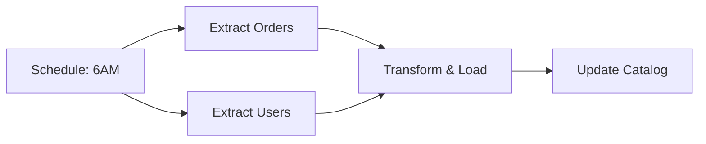

# AWS Glue — Intermediate Concepts

## Glue Connections — Accessing Data Sources

Glue connects to various data stores beyond S3:

| Connection Type | Data Sources | Use Case |
|----------------|-------------|----------|
| JDBC | RDS, Redshift, PostgreSQL, MySQL, Oracle | Extract from transactional DBs |
| Kafka | MSK, self-managed Kafka | Streaming ingestion |
| MongoDB | DocumentDB, MongoDB Atlas | NoSQL extraction |
| Network | VPC endpoints | Access private resources |

```python
# Read from RDS via JDBC connection
orders_dyf = glueContext.create_dynamic_frame.from_catalog(
    database="rds_source",
    table_name="public_orders",
    additional_options={
        "hashfield": "order_id",         # Partition column for parallel reads
        "hashpartitions": "10"           # Read with 10 parallel connections
    }
)

# Write to Redshift
glueContext.write_dynamic_frame.from_jdbc_conf(
    frame=clean_orders,
    catalog_connection="redshift-warehouse",
    connection_options={
        "dbtable": "curated.fact_orders",
        "database": "warehouse"
    },
    redshift_tmp_dir="s3://glue-temp/redshift/"
)
```

---

## Partition Handling and Pushdown Predicates

### Catalog Partitions

When your S3 data uses Hive-style partitioning (`year=2024/month=01/`), Glue Catalog tracks each partition:

```python
# Read ONLY specific partitions (pushdown predicate)
orders_dyf = glueContext.create_dynamic_frame.from_catalog(
    database="raw_data",
    table_name="orders",
    push_down_predicate="year == '2024' AND month == '01'"
    # Only reads files in s3://lake/raw/orders/year=2024/month=01/
    # Skips all other partitions entirely (no S3 LIST or file reads)
)
```

**Without pushdown:** Glue reads ALL partitions (potentially terabytes of irrelevant data).
**With pushdown:** Glue only reads the matching partitions (potentially megabytes).

> **Critical for performance:** Always use `push_down_predicate` when you know which partitions you need. This is the single biggest performance lever for Glue jobs reading partitioned data.

### Adding New Partitions Programmatically

```python
# After writing new partitioned data, register the partition in the catalog
glue.batch_create_partition(
    DatabaseName='curated',
    TableName='fact_orders',
    PartitionInputList=[
        {
            'Values': ['2024', '01', '15'],  # year, month, day
            'StorageDescriptor': {
                'Location': 's3://lake/curated/fact_orders/year=2024/month=01/day=15/',
                'InputFormat': 'org.apache.hadoop.hive.ql.io.parquet.MapredParquetInputFormat',
                'OutputFormat': 'org.apache.hadoop.hive.ql.io.parquet.MapredParquetOutputFormat',
                'SerdeInfo': {'SerializationLibrary': 'org.apache.hadoop.hive.ql.io.parquet.serde.ParquetHiveSerDe'},
                'Columns': [...]
            }
        }
    ]
)
```

---

## Glue Workflows — Orchestrating Multi-Job Pipelines

Glue Workflows chain crawlers, jobs, and triggers into a visual pipeline:

```python
# Create a workflow
glue.create_workflow(Name='daily-etl-pipeline')

# Add triggers (sequence of events)
# Trigger 1: Start on schedule
glue.create_trigger(
    Name='start-daily',
    WorkflowName='daily-etl-pipeline',
    Type='SCHEDULED',
    Schedule='cron(0 6 * * ? *)',
    Actions=[{'JobName': 'extract-orders'}, {'JobName': 'extract-users'}]
)

# Trigger 2: When both extracts complete, start transform
glue.create_trigger(
    Name='after-extract',
    WorkflowName='daily-etl-pipeline',
    Type='CONDITIONAL',
    Predicate={
        'Logical': 'AND',
        'Conditions': [
            {'LogicalOperator': 'EQUALS', 'JobName': 'extract-orders', 'State': 'SUCCEEDED'},
            {'LogicalOperator': 'EQUALS', 'JobName': 'extract-users', 'State': 'SUCCEEDED'}
        ]
    },
    Actions=[{'JobName': 'transform-and-load'}]
)

# Trigger 3: After transform, run crawler to update catalog
glue.create_trigger(
    Name='after-transform',
    WorkflowName='daily-etl-pipeline',
    Type='CONDITIONAL',
    Predicate={
        'Conditions': [
            {'JobName': 'transform-and-load', 'State': 'SUCCEEDED'}
        ]
    },
    Actions=[{'CrawlerName': 'curated-crawler'}]
)
```



**What this shows:**
- Two extract jobs run in parallel (triggered by schedule)
- Transform only starts when BOTH extracts succeed
- Catalog update happens last

> **Glue Workflows vs Airflow:** Workflows handle simple sequential/parallel patterns. For complex logic (branching, dynamic tasks, cross-account), use Airflow/Step Functions instead.

---

## Glue Studio — Visual ETL Builder

Glue Studio provides a drag-and-drop interface for building ETL jobs:

**Key features:**
- Visual DAG editor (no code required for simple transforms)
- Auto-generates PySpark code from visual nodes
- Built-in transforms: filter, join, rename, select, aggregate
- Data preview at each step
- Notebook integration for interactive development

**When to use Glue Studio vs custom scripts:**

| Use Glue Studio | Use Custom Scripts |
|----------------|-------------------|
| Simple transforms (filter, rename, type cast) | Complex business logic |
| Non-engineers building ETL | Custom libraries needed |
| Quick prototyping | Performance-critical optimization |
| Standard patterns (S3 → transform → S3) | Multi-source complex joins |

---

## Error Handling and Retries

```python
# Job-level retry configuration
glue.create_job(
    Name='critical-etl',
    MaxRetries=2,          # Retry up to 2 times on failure
    Timeout=120,           # Kill job after 120 minutes
    NotificationProperty={
        'NotifyDelayAfter': 60  # Alert if running > 60 minutes
    },
    ...
)

# In the job script: handle individual record errors
from awsglue.transforms import Filter

# Option 1: Filter out bad records
good_records = Filter.apply(
    frame=raw_data,
    f=lambda row: row["amount"] is not None and float(row["amount"]) > 0
)

# Option 2: Route bad records to a separate output
from awsglue.transforms import SplitRows

split = SplitRows.apply(
    raw_data,
    {"amount": {"$gte": 0}},  # Good records
    "good", "bad"
)
# split["good"] → write to curated
# split["bad"] → write to quarantine
```

---

## Glue Data Quality (DQDL)

Built-in data quality rules evaluated during ETL:

```python
# Define quality rules in DQDL (Data Quality Definition Language)
quality_rules = """
    Rules = [
        ColumnExists "order_id",
        IsComplete "order_id",
        IsComplete "amount",
        ColumnValues "amount" > 0,
        ColumnValues "order_date" between "2020-01-01" and "2030-12-31",
        Uniqueness "order_id" > 0.99,
        RowCount > 1000
    ]
"""

# Apply in Glue Studio or via API
# Results: PASS/FAIL per rule, with counts of violations
```

---

## Glue Schema Registry

For streaming data (Kafka/Kinesis), enforce schemas centrally:

```python
# Register an Avro schema
glue.create_schema(
    RegistryId={'RegistryName': 'events-registry'},
    SchemaName='order-event',
    DataFormat='AVRO',
    Compatibility='BACKWARD',
    SchemaDefinition=json.dumps({
        "type": "record",
        "name": "OrderEvent",
        "fields": [
            {"name": "order_id", "type": "string"},
            {"name": "amount", "type": "double"},
            {"name": "timestamp", "type": "long"}
        ]
    })
)

# In streaming job: validate against schema
# Producers must conform to registered schema
# Consumers deserialize using schema from registry
```

---

## Performance Optimization

| Technique | Impact | How |
|-----------|--------|-----|
| Partition pushdown | 10-100x faster reads | `push_down_predicate="partition_col = 'value'"` |
| Right-size workers | Cost savings | Start with G.1X, scale to G.2X if OOM |
| Job bookmarks | Process only new data | Enable in job config + transformation_ctx |
| Avoid DynamicFrame for big transforms | Better Spark optimization | Convert to DataFrame early |
| Write to Parquet with compression | Smaller output, faster downstream | `format="glueparquet", compression="snappy"` |
| Enable Spark UI | Debug performance | `--enable-spark-ui` argument |

---

## Interview Tips

> **Tip 1:** "Explain the Glue Data Catalog" — "A centralized Hive-compatible metastore that stores table schemas, partitions, and locations. Athena, Redshift Spectrum, EMR, and Glue itself all use it as a shared metadata layer. Crawlers can auto-populate it, or you register tables manually."

> **Tip 2:** "How do you optimize a Glue job?" — "Three things: (1) Partition pushdown predicates — only read the partitions you need. (2) Job bookmarks — only process new data on each run. (3) Convert DynamicFrame to DataFrame early and use native PySpark functions (avoids Glue overhead for complex transforms)."

> **Tip 3:** "Glue vs Step Functions vs Airflow for orchestration?" — "Glue Workflows for simple linear/parallel Glue-only pipelines. Step Functions for complex AWS-service orchestration with branching and error handling. Airflow for cross-platform orchestration, complex scheduling, and when you need extensive operator ecosystem (non-AWS systems)."
