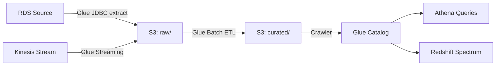

# AWS Glue — Real-World Production Examples

## Pattern 1: Complete Data Lake ETL Pipeline



**What this shows:**
- Multiple sources (JDBC + streaming) land in raw zone
- Batch Glue job transforms raw → curated
- Crawler keeps catalog updated for downstream consumers

**Implementation:**

```python
# Production ETL job: raw → curated
import sys
from awsglue.transforms import *
from awsglue.utils import getResolvedOptions
from awsglue.context import GlueContext
from awsglue.job import Job
from pyspark.context import SparkContext
from pyspark.sql.functions import col, when, current_timestamp, lit

sc = SparkContext()
glueContext = GlueContext(sc)
spark = glueContext.spark_session
job = Job(glueContext)

args = getResolvedOptions(sys.argv, ['JOB_NAME', 'process_date'])
job.init(args['JOB_NAME'], args)
process_date = args['process_date']

# Step 1: Read with partition pushdown + bookmark
orders_raw = glueContext.create_dynamic_frame.from_catalog(
    database="raw_data",
    table_name="orders",
    push_down_predicate=f"dt = '{process_date}'",
    transformation_ctx="orders_raw"
)

# Step 2: Convert to DataFrame and transform
df = orders_raw.toDF()

clean_df = df \
    .filter(col("order_id").isNotNull()) \
    .filter(col("amount") > 0) \
    .withColumn("amount_usd", 
        when(col("currency") == "EUR", col("amount") * 1.08)
        .when(col("currency") == "GBP", col("amount") * 1.27)
        .otherwise(col("amount"))
    ) \
    .withColumn("processed_at", current_timestamp()) \
    .withColumn("pipeline_version", lit("2.1.0"))

# Step 3: Deduplicate (keep latest per order_id)
from pyspark.sql.window import Window
from pyspark.sql.functions import row_number

dedup_window = Window.partitionBy("order_id").orderBy(col("updated_at").desc())
deduped = clean_df.withColumn("rn", row_number().over(dedup_window)) \
    .filter("rn = 1").drop("rn")

# Step 4: Data quality check
row_count = deduped.count()
if row_count == 0:
    raise ValueError(f"CRITICAL: Zero rows for {process_date}. Aborting.")

null_rate = deduped.filter(col("customer_id").isNull()).count() / row_count
if null_rate > 0.05:
    raise ValueError(f"CRITICAL: Null customer_id rate {null_rate:.1%} exceeds 5% threshold.")

# Step 5: Write partitioned Parquet to curated zone
deduped.write \
    .mode("overwrite") \
    .partitionBy("year", "month") \
    .option("path", f"s3://data-lake/curated/orders/") \
    .format("parquet") \
    .save()

# Step 6: Update catalog partition
glue_client = boto3.client('glue')
glue_client.batch_create_partition(
    DatabaseName='curated',
    TableName='orders',
    PartitionInputList=[{
        'Values': [process_date[:4], process_date[5:7]],
        'StorageDescriptor': {...}
    }]
)

job.commit()
```

---

## Pattern 2: Streaming Ingestion from Kinesis

```python
# Glue Streaming job: continuous ingestion from Kinesis → S3
from awsglue.context import GlueContext
from pyspark.context import SparkContext
from pyspark.sql.functions import from_json, col, current_timestamp
from pyspark.sql.types import StructType, StructField, StringType, DoubleType

sc = SparkContext()
glueContext = GlueContext(sc)
spark = glueContext.spark_session

# Define the expected schema of Kinesis records
event_schema = StructType([
    StructField("user_id", StringType()),
    StructField("event_type", StringType()),
    StructField("page_url", StringType()),
    StructField("amount", DoubleType()),
    StructField("event_time", StringType()),
])

# Read from Kinesis stream
kinesis_df = spark.readStream \
    .format("kinesis") \
    .option("streamName", "clickstream-events") \
    .option("region", "us-east-1") \
    .option("startingPosition", "TRIM_HORIZON") \
    .load()

# Parse JSON payload
parsed = kinesis_df \
    .select(from_json(col("data").cast("string"), event_schema).alias("event")) \
    .select("event.*") \
    .withColumn("ingested_at", current_timestamp())

# Write to S3 as Parquet (micro-batch every 60 seconds)
query = parsed.writeStream \
    .format("parquet") \
    .option("path", "s3://data-lake/raw/clickstream/") \
    .option("checkpointLocation", "s3://glue-checkpoints/clickstream/") \
    .partitionBy("event_type") \
    .trigger(processingTime="60 seconds") \
    .start()

query.awaitTermination()
```

---

## Pattern 3: Cross-Account Data Processing

```python
# Scenario: Read from Account A's S3, process in Account B's Glue, write to Account B's S3

# Account A bucket policy allows Account B's Glue role:
# {
#   "Principal": {"AWS": "arn:aws:iam::ACCOUNT_B:role/GlueRole"},
#   "Action": ["s3:GetObject", "s3:ListBucket"],
#   "Resource": ["arn:aws:s3:::account-a-data/*"]
# }

# In Account B's Glue job:
source_df = spark.read.parquet("s3://account-a-data/shared/orders/")
# Works because Glue role in Account B has cross-account S3 permissions

transformed = source_df.filter("region = 'US'")
transformed.write.parquet("s3://account-b-warehouse/curated/orders/")
```

---

## Pattern 4: Large-Scale Type 2 SCD with Glue

```python
# Process 500K customer dimension changes daily
# Maintain full history (SCD Type 2) in S3/Iceberg

from delta.tables import DeltaTable  # Or Iceberg equivalent

# Read today's customer snapshot from source
today_snapshot = glueContext.create_dynamic_frame.from_catalog(
    database="raw", table_name="customer_daily_snapshot",
    push_down_predicate=f"snapshot_date = '{process_date}'"
).toDF()

# Read current dimension state
dim_customer = spark.read.format("iceberg") \
    .load("glue_catalog.curated.dim_customer")

# Detect changes: join on business key, compare attributes
current_active = dim_customer.filter("is_current = true")
changes = today_snapshot.alias("new").join(
    current_active.alias("old"),
    col("new.customer_id") == col("old.customer_id"),
    "full_outer"
).filter(
    col("old.customer_id").isNull() |  # New customer
    (col("new.name") != col("old.name")) |  # Name changed
    (col("new.segment") != col("old.segment"))  # Segment changed
)

change_count = changes.count()
print(f"Detected {change_count} changes to process")

# Apply SCD Type 2 via Iceberg MERGE
spark.sql(f"""
    MERGE INTO curated.dim_customer t
    USING changes s ON t.customer_id = s.customer_id AND t.is_current = true
    WHEN MATCHED THEN UPDATE SET
        t.is_current = false,
        t.effective_to = '{process_date}'
    WHEN NOT MATCHED THEN INSERT (
        customer_id, name, segment, effective_from, effective_to, is_current
    ) VALUES (
        s.customer_id, s.name, s.segment, '{process_date}', '9999-12-31', true
    )
""")
```

---

## Pattern 5: Cost-Optimized Job Configuration

```python
# Production job config optimized for a 50 GB daily load
{
    "Name": "daily-orders-etl",
    "GlueVersion": "4.0",
    "WorkerType": "G.1X",       # 4 vCPU, 16 GB — sufficient for 50 GB
    "NumberOfWorkers": 5,        # Start with 5 workers
    "MaxCapacity": 20,           # Auto-scale up to 20 if needed
    "Timeout": 60,               # Kill after 60 min (normal run: 15 min)
    "MaxRetries": 1,             # One retry on transient failure
    "DefaultArguments": {
        "--job-bookmark-option": "job-bookmark-enable",
        "--enable-metrics": "true",
        "--enable-continuous-cloudwatch-log": "true",
        "--enable-spark-ui": "true",
        "--spark-event-logs-path": "s3://glue-logs/spark-ui/",
        "--conf": "spark.sql.adaptive.enabled=true",  # Enable AQE
        "--conf": "spark.sql.parquet.compression.codec=snappy",
    }
}

# Monthly cost estimate:
# 5-20 DPUs × 15 min/day × 30 days × $0.44/DPU-hour
# = 5 × 0.25 hours × 30 × $0.44 = $16.50/month (minimum, with auto-scaling)
# Much cheaper than a 24/7 EMR cluster ($2000+/month)
```

---

## Production Operations Checklist

| Check | Frequency | How |
|-------|-----------|-----|
| Job success/failure | Every run | CloudWatch alarm on Glue job state |
| Job duration trend | Daily | Alert if >2x average duration |
| Data quality metrics | Every run | Check in-job assertions before commit |
| Bookmark health | Weekly | Verify bookmark advancing (not stuck) |
| Catalog accuracy | Weekly | Validate table row counts match S3 |
| Cost monitoring | Monthly | Glue DPU-hours in Cost Explorer |
| Worker utilization | Monthly | Check if over-provisioned (CPU < 30%) |
| Failed crawlers | Daily | Alarm on crawler state != SUCCEEDED |

---

## Interview Tips

> **Tip 1:** "Walk me through a production Glue pipeline" — "EventBridge triggers the job on schedule. It reads from the catalog with partition pushdown (only today's data). Job bookmarks ensure we skip already-processed files. Transform in PySpark: clean, deduplicate, validate quality. Write partitioned Parquet to curated zone. Register partition in catalog. CloudWatch alarms on job failure. Cost: ~$15-50/month for a daily 50 GB load."

> **Tip 2:** "How do you handle late-arriving data in Glue?" — "Two strategies: (1) Job bookmarks with timestamp-based keys — late records have newer timestamps and get picked up on the next run. (2) Re-run for specific partitions using the `--process_date` parameter and overwrite mode — idempotent because we overwrite the full partition."

> **Tip 3:** "Glue job is taking too long — how do you debug?" — "Enable Spark UI (`--enable-spark-ui`). Check: (1) Is partition pushdown working? (Full scan = slow). (2) Are there skewed tasks? (One worker doing 90% of work). (3) Is it spilling to disk? (Need bigger workers G.2X or more workers). (4) Is the job bookmark processing too much history? (Reset and start fresh from known date)."
