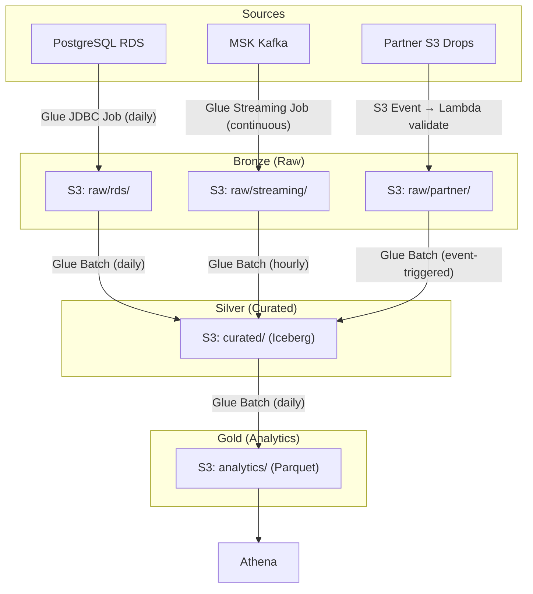

# Scenario Questions — AWS Glue

<article data-difficulty="junior">

## 🟢 Junior: Glue vs Lambda for ETL

**Scenario:** Your team needs to process a 5 MB JSON file uploaded to S3 daily (customer updates) and load it into a Redshift table. A colleague suggests using AWS Glue. Another suggests Lambda. Which is more appropriate and why?

<details>
<summary>✅ Solution</summary>

**For a 5 MB file: Lambda is more appropriate.**

| Factor | Lambda | Glue |
|--------|--------|------|
| Data size | 5 MB (tiny) | Designed for GB-TB scale |
| Startup time | Milliseconds (instant) | 1-2 minutes (Spark startup) |
| Cost | ~$0.001 per invocation | $0.44+ per run (minimum 1 DPU-min) |
| Complexity | Simple Python script | Full Spark/PySpark setup |
| Trigger | S3 event (immediate) | Scheduled or triggered (delay) |

**Lambda implementation:**
```python
# Lambda function: S3 event → parse JSON → load to Redshift
import json
import boto3
import psycopg2

def handler(event, context):
    # Get the uploaded file
    bucket = event['Records'][0]['s3']['bucket']['name']
    key = event['Records'][0]['s3']['object']['key']
    
    s3 = boto3.client('s3')
    obj = s3.get_object(Bucket=bucket, Key=key)
    records = json.loads(obj['Body'].read())
    
    # Load to Redshift
    conn = psycopg2.connect(...)
    for record in records:
        conn.execute("INSERT INTO customers ...", record)
    conn.commit()
```

**When to use Glue instead:**
- File size > 1 GB (Lambda times out at 15 min, memory limit 10 GB)
- Complex Spark transformations needed (joins, aggregations)
- Need catalog integration (schema discovery, partition management)
- Need job bookmarks (incremental processing)

</details>

</article>

<article data-difficulty="mid-level">

## 🟡 Mid-Level: Glue Job Running Too Slow

**Scenario:** Your daily Glue job reads from a partitioned table (`s3://lake/raw/events/year=*/month=*/day=*/`) and processes today's data only. It should take 10 minutes but takes 2 hours. The table has 3 years of data (1 TB). What's likely wrong?

<details>
<summary>💡 Hint</summary>

If the job is reading ALL 1 TB instead of just today's ~1 GB partition, what Glue feature are you missing?

</details>

<details>
<summary>✅ Solution</summary>

**Root cause: Missing partition pushdown predicate.** Without it, Glue reads ALL partitions (1 TB) instead of just today (1 GB).

**The fix:**

```python
# SLOW (no pushdown): reads ALL 1 TB
events = glueContext.create_dynamic_frame.from_catalog(
    database="raw",
    table_name="events",
    transformation_ctx="events"
)
# Then filters AFTER reading all data — too late!
events_today = events.toDF().filter("day = '15' AND month = '01' AND year = '2024'")

# FAST (with pushdown): reads only today's 1 GB partition
events = glueContext.create_dynamic_frame.from_catalog(
    database="raw",
    table_name="events",
    push_down_predicate="year == '2024' AND month == '01' AND day == '15'",
    transformation_ctx="events"
)
```

**Additional checks if still slow:**
1. Verify the partition is registered in the catalog (`aws glue get-partitions`)
2. Check if the partition has thousands of tiny files (small files problem → OPTIMIZE or compact)
3. Check worker count: 2 DPUs for 1 GB is fine, but if you have complex joins, increase to 5-10

**Prevention:** Always use pushdown predicates when reading partitioned tables. Parameterize the date: `push_down_predicate=f"year == '{year}' AND month == '{month}' AND day == '{day}'"`

</details>

</article>

<article data-difficulty="mid-level">

## 🟡 Mid-Level: Design Incremental Load with Bookmarks

**Scenario:** You have a Glue job that loads new orders from an S3-based raw zone to a curated zone. Files arrive continuously throughout the day. Design the job so it only processes NEW files on each run (not reprocessing everything).

<details>
<summary>✅ Solution</summary>

**Solution: Glue Job Bookmarks**

```python
# Job configuration (in Glue console or API):
# --job-bookmark-option: job-bookmark-enable

# In the job script:
# 1. CRITICAL: Use transformation_ctx parameter on every read
orders_dyf = glueContext.create_dynamic_frame.from_catalog(
    database="raw_data",
    table_name="orders",
    transformation_ctx="orders_bookmark"  # THIS enables bookmark tracking
)

# 2. Transform
df = orders_dyf.toDF()
clean = df.filter("amount > 0").withColumn("processed_at", current_timestamp())

# 3. Write to curated (append mode — don't overwrite!)
clean.write.mode("append").parquet("s3://lake/curated/orders/")

# 4. Commit the bookmark (at end of job)
job.commit()
# After commit: Glue records which files were processed
# Next run: only reads files added AFTER the last bookmark
```

**How it works internally:**
- Glue stores: list of S3 files processed + their modification timestamps
- Next run: only reads files with `LastModified` > last bookmark timestamp
- If job FAILS before `job.commit()`: bookmark is NOT updated → safe retry

**Schedule:**
```python
# Run every hour to catch new files
glue.create_trigger(
    Name='hourly-orders-trigger',
    Type='SCHEDULED',
    Schedule='cron(0 * * * ? *)',  # Every hour
    Actions=[{'JobName': 'orders-incremental-load'}]
)
```

**Important gotchas:**
- `transformation_ctx` MUST be set (bookmark doesn't work without it)
- Use `append` mode, not `overwrite` (overwrite replaces everything each run)
- If you need to reprocess: reset the bookmark via API or console

</details>

</article>

<article data-difficulty="senior">

## 🔴 Senior: Design a Multi-Source Medallion Pipeline

**Scenario:** Design a complete Glue-based pipeline for:
- 3 source systems (PostgreSQL RDS, Kafka via MSK, partner S3 drops)
- Medallion architecture (bronze → silver → gold)
- Daily + real-time processing
- Data quality gates between layers
- Catalog integration for self-service analytics
- Cost budget: < $500/month

<details>
<summary>✅ Solution</summary>

**Architecture:**



This pipeline lands all three sources in the bronze zone, promotes validated data into a shared Iceberg silver layer, and builds gold aggregates that analysts query through Athena.

**Job definitions:**

```python
# Job 1: RDS Extract (daily, ~10 GB)
# Type: Glue Spark, 5 DPUs, bookmark on "updated_at" column
# Cost: 5 DPU × 0.25 hr × $0.44 × 30 days = $16.50/month

# Job 2: Streaming ingestion (continuous, from MSK)
# Type: Glue Streaming, 2 DPUs (minimum)
# Cost: 2 DPU × 24 hr × $0.44 × 30 = $633/month ← TOO EXPENSIVE!
# OPTIMIZATION: Use micro-batch instead (run every 5 min)
# Cost: 2 DPU × 0.08 hr × 288 runs/day × $0.44 × 30 = $24/month ← MUCH BETTER

# Job 3: Partner file processing (event-triggered, ~500 MB/day)
# Type: Glue Python Shell (1 DPU) — small files don't need Spark
# Cost: 1 DPU × 0.1 hr × $0.44 × 30 = $1.32/month

# Job 4: Bronze → Silver transformation (daily, 15 GB)
# Type: Glue Spark, auto-scaling 5-15 DPUs
# Cost: ~10 DPU × 0.5 hr × $0.44 × 30 = $66/month

# Job 5: Silver → Gold aggregation (daily, 2 GB output)
# Type: Glue Spark, 5 DPUs
# Cost: 5 DPU × 0.25 hr × $0.44 × 30 = $16.50/month

# Crawlers: 2 crawlers, run daily
# Cost: 2 × 1 DPU × 0.1 hr × $0.44 × 30 = $2.64/month
```

**Total estimated cost: ~$127/month** (well under $500 budget)

**Data quality gates (between Bronze and Silver):**

```python
# In the Bronze → Silver job:
quality_rules = """
    Rules = [
        IsComplete "order_id",
        IsComplete "customer_id",
        ColumnValues "amount" > 0,
        RowCount > 100,
        Uniqueness "order_id" > 0.99
    ]
"""

# If quality fails: route to quarantine, send SNS alert
# If quality passes: proceed to Silver
```

**Catalog organization:**
```
Databases:
├── raw_bronze (tables auto-discovered by crawlers)
├── curated_silver (Iceberg tables, manually registered)
└── analytics_gold (Parquet tables, manually registered)

Access:
├── Analysts → read-only on analytics_gold via Athena
├── Data Scientists → read on curated_silver via EMR notebooks
└── Engineers → full access to all layers
```

</details>

</article>

---

## ⚡ Quick-fire Q&A

**Q: What is AWS Glue and what are its main components?**
A: AWS Glue is a fully managed serverless ETL service. Its main components are: Glue Data Catalog (central metadata repository), Glue Crawlers (auto-discover schemas from data sources), Glue ETL Jobs (Spark- or Python-based data transformation), Glue Workflows (orchestrating multi-job pipelines), and Glue DataBrew (no-code data preparation).

**Q: What is the Glue Data Catalog and why is it important?**
A: The Glue Data Catalog is a central metadata repository storing database and table definitions, schemas, and partition information. It integrates natively with Athena, EMR, Redshift Spectrum, and Lake Formation, acting as a unified schema registry for your entire data lake.

**Q: What is the difference between Glue DynamicFrame and Spark DataFrame?**
A: DynamicFrame is Glue's extension of Spark DataFrame designed for semi-structured, schema-inconsistent data. It supports `choice` types (fields with multiple data types across records) and schema-on-the-fly resolution without upfront schema enforcement. You can convert between the two using `toDF()` and `fromDF()`.

**Q: What are Glue job bookmarks?**
A: Job bookmarks track which data has already been processed by a Glue job, enabling incremental loads. When enabled, a job only processes new or changed data since the last successful run, avoiding reprocessing of historical data in S3-based sources.

**Q: What is the difference between Glue Trigger types: Scheduled, On-Demand, and Conditional?**
A: Scheduled triggers run jobs on a cron schedule. On-Demand triggers start jobs manually or via API. Conditional (event-based) triggers start a job when a preceding job or crawler in a Workflow succeeds, fails, or completes — enabling dependency-based pipeline orchestration.

**Q: How do you optimize Glue job performance?**
A: Key optimizations: enable Glue auto-scaling (G.1X or G.2X workers with auto-scaling), use pushdown predicates to filter data at the source, partition source data by frequently filtered columns, use columnar formats (Parquet/ORC), enable the Glue Spark UI for profiling, and tune the number of DPUs for job size.

**Q: What is AWS Glue Studio?**
A: Glue Studio is a visual interface for building ETL pipelines using a drag-and-drop DAG editor. It generates PySpark code, supports custom transforms, and provides job monitoring. It lowers the barrier for building Glue jobs without writing code from scratch.

**Q: How does Glue handle schema evolution?**
A: Glue Crawlers detect schema changes and update the Data Catalog. Glue jobs using DynamicFrames handle column additions gracefully. For critical pipelines, you can configure crawlers with schema change policies (UPDATE_IN_DATABASE, LOG, or DEPRECATE_IN_DATABASE) to control how schema drift is handled.

---

## 💼 Interview Tips

- Distinguish Glue from EMR clearly: Glue is serverless and managed (pay per DPU-second, no cluster setup), while EMR gives you full control with persistent or transient clusters. Glue is faster to start for standard ETL; EMR is better for complex Spark tuning.
- Senior interviewers expect you to know job bookmarks deeply — when they work well (S3 sources, JDBC with modification timestamps) and when they don't (sources without reliable modification tracking require custom watermarking logic).
- Mention the Glue Data Catalog's role in the broader ecosystem: it's the shared schema layer consumed by Athena, Redshift Spectrum, EMR, and Lake Formation — demonstrating this cross-service integration shows architectural breadth.
- Avoid the mistake of always using Glue for everything: know that for lightweight Python tasks, Lambda or a simple Python script on ECS may be cheaper and faster. Glue has a 10-minute startup time for jobs.
- Demonstrate cost awareness: Glue bills per DPU-second with a 10-minute minimum. For very short jobs, Lambda or Athena queries are more cost-efficient.
- Show awareness of Glue's limitations: job startup latency (2-10 minutes for Spark jobs) makes it unsuitable for near-real-time processing — contrast with Kinesis Data Analytics or MSK for streaming.
