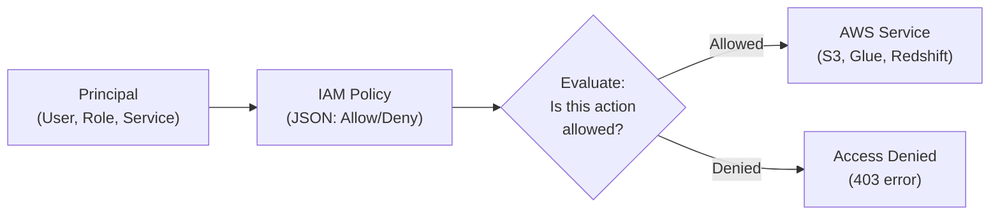

# AWS IAM — Fundamentals


## 🎯 Analogy

Think of IAM like a building access card system: each identity (user, role, service) gets a card with specific room permissions. Least privilege means the Glue job's card only opens the S3 room — not the RDS room.

---
## What Is AWS IAM?

AWS Identity and Access Management (IAM) is the **permission system for all of AWS**. It controls who (identity) can do what (actions) on which resources (services/objects). Every API call in AWS is authenticated and authorized through IAM.

**The analogy:** IAM is like the security badge system in a corporate building. Your badge (identity) determines which floors you can access (services), which rooms you can enter (resources), and what you can do inside (actions) — read documents, modify files, or nothing at all. Without a valid badge, you can't even enter the building.

> **Why IAM matters for DE:** Every data pipeline needs permissions — Glue jobs need access to S3 and Redshift, Lambda needs to read from Kinesis, EMR needs to write to S3. If you don't understand IAM roles and policies, your pipelines will fail with "Access Denied" errors. Properly configured IAM is also critical for security audits and compliance.

---

## How IAM Works



**What this shows:**
- Every AWS API call comes from a principal (who's asking?)
- IAM evaluates attached policies to determine if the action is allowed
- Explicit Deny always wins over Allow
- No policy = implicit Deny (default deny everything)

---

## Core Concepts

| Concept | Description | DE Example |
|---------|-------------|------------|
| **User** | Human identity with long-term credentials | Your personal AWS console login |
| **Role** | Identity assumed by services/applications (temporary credentials) | Glue job role, Lambda execution role |
| **Policy** | JSON document defining permissions | Allow s3:GetObject on data-lake bucket |
| **Group** | Collection of users sharing policies | "data-engineering-team" group |
| **Principal** | Entity that can make requests (user, role, service) | `arn:aws:iam::123456789:role/GlueETLRole` |
| **ARN** | Amazon Resource Name (unique identifier) | `arn:aws:s3:::data-lake/curated/*` |
| **Trust Policy** | Defines WHO can assume a role | "Allow Glue service to assume this role" |
| **Permission Boundary** | Maximum permissions ceiling | Prevent even admins from deleting prod data |

---

## IAM Policy Structure

```json
{
  "Version": "2012-10-17",
  "Statement": [
    {
      "Sid": "AllowReadDataLake",
      "Effect": "Allow",
      "Action": [
        "s3:GetObject",
        "s3:ListBucket"
      ],
      "Resource": [
        "arn:aws:s3:::data-lake",
        "arn:aws:s3:::data-lake/curated/*"
      ]
    },
    {
      "Sid": "DenyDeleteProduction",
      "Effect": "Deny",
      "Action": "s3:DeleteObject",
      "Resource": "arn:aws:s3:::data-lake/production/*"
    }
  ]
}
```

**Key elements:**
- **Effect**: `Allow` or `Deny`
- **Action**: API operations (`s3:GetObject`, `glue:StartJobRun`)
- **Resource**: Which specific resources (ARNs)
- **Condition** (optional): When the rule applies (IP, time, tags)

---

## IAM Roles for DE Services

### Glue Job Role

```json
{
  "Version": "2012-10-17",
  "Statement": [
    {
      "Sid": "GlueReadSourceData",
      "Effect": "Allow",
      "Action": [
        "s3:GetObject",
        "s3:ListBucket"
      ],
      "Resource": [
        "arn:aws:s3:::raw-data-bucket",
        "arn:aws:s3:::raw-data-bucket/*"
      ]
    },
    {
      "Sid": "GlueWriteCuratedData",
      "Effect": "Allow",
      "Action": [
        "s3:PutObject",
        "s3:DeleteObject"
      ],
      "Resource": "arn:aws:s3:::curated-data-bucket/*"
    },
    {
      "Sid": "GlueCatalogAccess",
      "Effect": "Allow",
      "Action": [
        "glue:GetDatabase",
        "glue:GetTable",
        "glue:CreateTable",
        "glue:UpdateTable",
        "glue:GetPartitions",
        "glue:BatchCreatePartition"
      ],
      "Resource": "*"
    },
    {
      "Sid": "GlueCloudWatchLogs",
      "Effect": "Allow",
      "Action": [
        "logs:CreateLogGroup",
        "logs:CreateLogStream",
        "logs:PutLogEvents"
      ],
      "Resource": "arn:aws:logs:*:*:/aws-glue/*"
    }
  ]
}
```

**Trust Policy (who can assume this role):**
```json
{
  "Version": "2012-10-17",
  "Statement": [
    {
      "Effect": "Allow",
      "Principal": {
        "Service": "glue.amazonaws.com"
      },
      "Action": "sts:AssumeRole"
    }
  ]
}
```

---

### Lambda Execution Role (Pipeline Trigger)

```json
{
  "Version": "2012-10-17",
  "Statement": [
    {
      "Sid": "StartGlueJobs",
      "Effect": "Allow",
      "Action": [
        "glue:StartJobRun",
        "glue:GetJobRun"
      ],
      "Resource": "arn:aws:glue:us-east-1:123456789:job/daily-*"
    },
    {
      "Sid": "ReadFromKinesis",
      "Effect": "Allow",
      "Action": [
        "kinesis:GetRecords",
        "kinesis:GetShardIterator",
        "kinesis:DescribeStream",
        "kinesis:ListShards"
      ],
      "Resource": "arn:aws:kinesis:us-east-1:123456789:stream/events-stream"
    },
    {
      "Sid": "PublishAlerts",
      "Effect": "Allow",
      "Action": "sns:Publish",
      "Resource": "arn:aws:sns:us-east-1:123456789:pipeline-alerts"
    }
  ]
}
```

---

## Cross-Account Access

Common pattern: Data lake in Account A, pipelines in Account B.

```json
// In Account A: Role that Account B can assume
{
  "Version": "2012-10-17",
  "Statement": [
    {
      "Effect": "Allow",
      "Principal": {
        "AWS": "arn:aws:iam::ACCOUNT_B_ID:role/GlueETLRole"
      },
      "Action": "sts:AssumeRole"
    }
  ]
}

// In Account B: Glue job assumes cross-account role
// boto3 code in Glue job:
```

```python
import boto3

# Assume role in Account A
sts = boto3.client('sts')
response = sts.assume_role(
    RoleArn='arn:aws:iam::ACCOUNT_A_ID:role/DataLakeReadRole',
    RoleSessionName='glue-cross-account'
)

# Use temporary credentials to access Account A's S3
credentials = response['Credentials']
s3 = boto3.client('s3',
    aws_access_key_id=credentials['AccessKeyId'],
    aws_secret_access_key=credentials['SecretAccessKey'],
    aws_session_token=credentials['SessionToken']
)

# Now read from Account A's data lake
s3.get_object(Bucket='account-a-data-lake', Key='curated/orders/data.parquet')
```

---

## Least Privilege Principle

| Bad Practice | Good Practice |
|-------------|---------------|
| `"Action": "*"` | `"Action": ["s3:GetObject", "s3:PutObject"]` |
| `"Resource": "*"` | `"Resource": "arn:aws:s3:::my-bucket/prefix/*"` |
| One role for all pipelines | Separate role per pipeline/job |
| Admin access for Glue jobs | Only permissions the job actually needs |
| Long-lived access keys | IAM roles with temporary credentials |

**How to implement least privilege:**
1. Start with zero permissions
2. Run your pipeline — note "Access Denied" errors
3. Add only the specific actions and resources needed
4. Use IAM Access Analyzer to find unused permissions and tighten further

---

## Key DE Use Cases

1. **Glue Job Roles** — S3 read/write, Catalog access, CloudWatch logging
2. **Redshift Roles** — COPY from S3, UNLOAD to S3, Spectrum access
3. **Cross-Account Pipelines** — Central data lake accessed by multiple team accounts
4. **Service-Linked Roles** — Auto-created roles for services like Lake Formation, EMR
5. **Pipeline Security** — Restrict which pipelines can access which data (PII vs non-PII)

---

## Common IAM Patterns for DE

| Pattern | Description |
|---------|-------------|
| **Service role** | Role assumed by AWS service (Glue, Lambda, EMR) |
| **Cross-account role** | Role in Account A assumed by Account B |
| **Pass role** | Permission to assign a role to a service (`iam:PassRole`) |
| **Resource-based policy** | Policy on the resource itself (S3 bucket policy) |
| **Session policy** | Further restrict permissions within an assumed role |
| **Permission boundary** | Maximum possible permissions (ceiling) for a role |

---

## IAM vs Alternatives

| Aspect | IAM Policies | Lake Formation | S3 Bucket Policies | Resource Policies |
|--------|-------------|----------------|-------------------|------------------|
| **Scope** | All AWS services | Data lake (tables/columns) | S3 only | Per-resource |
| **Granularity** | API action level | Column/row level | Bucket/prefix level | Varies |
| **Manages** | Who can do what | Who can see which data | Who can access bucket | Who can use resource |
| **Best for** | Service permissions | Data governance | Cross-account S3 | Cross-account APIs |

---

## Debugging "Access Denied" Errors

```bash
# Step 1: Check what role the service is using
aws iam get-role --role-name GlueETLRole

# Step 2: Simulate the permission
aws iam simulate-principal-policy \
  --policy-source-arn "arn:aws:iam::123456789:role/GlueETLRole" \
  --action-names "s3:GetObject" \
  --resource-arns "arn:aws:s3:::data-lake/raw/orders/file.parquet"

# Step 3: Check for explicit denies (SCPs, permission boundaries)
# Look in: IAM policy, resource policy, SCP, permission boundary

# Step 4: Use CloudTrail to see the exact denied API call
aws cloudtrail lookup-events \
  --lookup-attributes AttributeKey=EventName,AttributeValue=GetObject \
  --start-time "2024-01-15T00:00:00Z"
```

---


## ▶️ Try It Yourself

```bash
# Create a role for a Glue ETL job
aws iam create-role \
  --role-name GlueETLRole \
  --assume-role-policy-document '{
    "Version": "2012-10-17",
    "Statement": [{
      "Effect": "Allow",
      "Principal": {"Service": "glue.amazonaws.com"},
      "Action": "sts:AssumeRole"
    }]
  }'

# Attach a policy granting S3 read access to a specific bucket only
aws iam put-role-policy \
  --role-name GlueETLRole \
  --policy-name S3ReadPolicy \
  --policy-document '{
    "Version": "2012-10-17",
    "Statement": [{
      "Effect": "Allow",
      "Action": ["s3:GetObject", "s3:ListBucket"],
      "Resource": [
        "arn:aws:s3:::my-data-bucket",
        "arn:aws:s3:::my-data-bucket/*"
      ]
    }]
  }'
```

> **Run it:** Copy the snippet into a REPL or file and run it — no external services needed for the basic example.

---
## Interview Tips

> **Tip 1:** "What IAM role does a Glue job need?" — "A Glue job needs an IAM role with: (1) S3 access — read from source buckets, write to target buckets. (2) Glue Catalog access — GetTable, CreateTable, BatchCreatePartition for metadata management. (3) CloudWatch Logs — write job logs. (4) Optional: Secrets Manager (for DB credentials), KMS (for encrypted data), VPC networking permissions. The trust policy allows `glue.amazonaws.com` to assume the role."

> **Tip 2:** "How do you implement least privilege for pipelines?" — "One role per pipeline/job, not shared roles. Start with zero permissions, add only what's needed. Scope resources to specific buckets/prefixes, not `*`. Use IAM Access Analyzer to identify unused permissions and tighten. For sensitive data (PII), use separate roles with narrower access and tag resources for auditing."

> **Tip 3:** "How does cross-account access work?" — "Account A creates a role with a trust policy allowing Account B's role to assume it. Account B's pipeline calls sts:AssumeRole to get temporary credentials, then uses those to access Account A's resources. This is the standard pattern for central data lakes: one account owns the data, other accounts assume roles to read/write. All access is logged in CloudTrail for audit."
