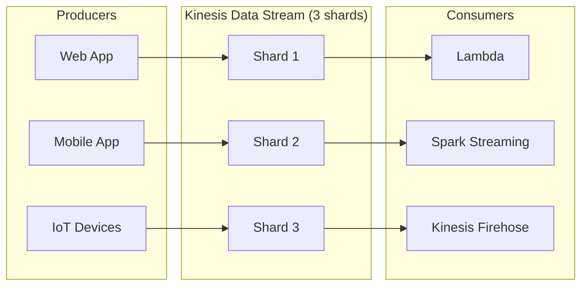
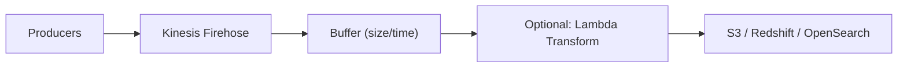
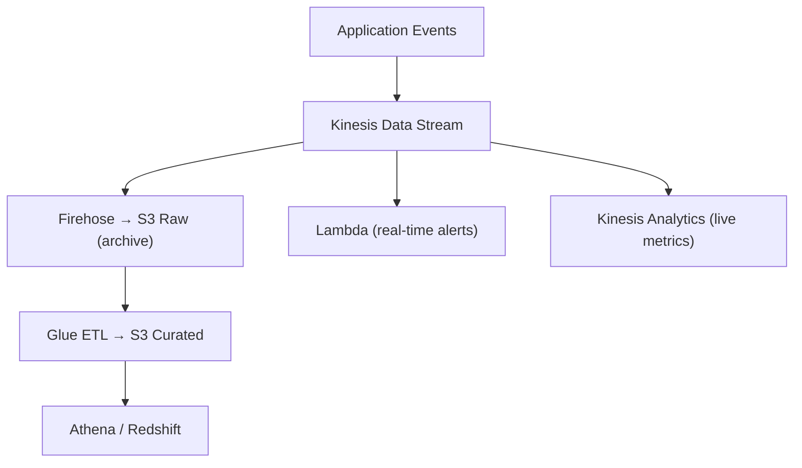

# AWS Kinesis — Fundamentals


## 🎯 Analogy

Think of Kinesis like a high-speed conveyor belt at an airport: data records are luggage, shards are parallel conveyor lanes, and consumers are baggage handlers reading from their lane. More shards = more parallel throughput.

---
## What Is Amazon Kinesis?

Amazon Kinesis is a family of services for **real-time streaming data** — collecting, processing, and delivering continuous data flows.

**The analogy:** Kinesis is like a river system. Data Streams is the river itself (flowing data). Firehose is a pipe that automatically routes the river into a storage tank (S3/Redshift). Analytics is a lab that tests the water (processes it) as it flows.

> **Why Kinesis matters for DE:** It's AWS's primary streaming service. Used for real-time log ingestion, clickstream collection, IoT data, and event-driven architectures. It's the AWS alternative to Kafka.

---

## The Kinesis Family

| Service | Purpose | Managed Level | Use Case |
|---------|---------|:---:|----------|
| **Kinesis Data Streams** | Custom real-time processing | Semi (you manage consumers) | Complex event processing |
| **Kinesis Data Firehose** | Auto-deliver to storage | Fully managed | Simple S3/Redshift delivery |
| **Kinesis Data Analytics** | SQL/Flink on streams | Fully managed | Real-time aggregation |
| **Kinesis Video Streams** | Video ingestion | Fully managed | Not DE-relevant |

---

## Kinesis Data Streams — Core Concepts



**Key concepts:**

| Concept | Kinesis | Kafka Equivalent |
|---------|---------|-----------------|
| Stream | Named data flow | Topic |
| Shard | Throughput unit | Partition |
| Record | Data entry (up to 1 MB) | Message |
| Partition key | Determines shard assignment | Message key |
| Sequence number | Unique ID per record in a shard | Offset |
| Retention | 24 hours–365 days | Configurable retention |

### Shard Capacity

Each shard provides:
- **Write:** 1 MB/sec or 1,000 records/sec
- **Read:** 2 MB/sec (shared across all consumers)

```
Need 10 MB/sec write throughput?
→ 10 shards (each handles 1 MB/sec)
→ Cost: ~$0.015/shard/hour = ~$11/shard/month = $110/month for 10 shards
```

---

## Producing Data (Writing to Kinesis)

```python
import boto3
import json

kinesis = boto3.client('kinesis', region_name='us-east-1')

# Put a single record
kinesis.put_record(
    StreamName='clickstream-events',
    Data=json.dumps({
        "user_id": "user-123",
        "event_type": "click",
        "page": "/products",
        "timestamp": "2024-01-15T10:30:00Z"
    }).encode('utf-8'),
    PartitionKey='user-123'  # Determines which shard receives this record
)

# Put multiple records (batch — more efficient)
records = [
    {'Data': json.dumps(event).encode('utf-8'), 'PartitionKey': event['user_id']}
    for event in event_batch
]
kinesis.put_records(StreamName='clickstream-events', Records=records)
# Returns which records succeeded/failed (handle partial failures!)
```

**Partition key routing:**
- Records with the SAME partition key always go to the same shard
- This guarantees ordering for that key (like Kafka's key-based partitioning)
- Use `user_id` as partition key for per-user ordering

---

## Kinesis Data Firehose — Zero-Code Delivery

Firehose automatically delivers streaming data to storage destinations with no custom code:



**What this shows:**
- Data arrives at Firehose (via direct PUT or from Data Streams)
- Firehose buffers records (by size: 1-128 MB, or by time: 60-900 seconds)
- Optionally transforms with Lambda (format conversion, enrichment)
- Delivers to destination automatically

```python
# Create a Firehose delivery stream → S3
firehose = boto3.client('firehose')
firehose.create_delivery_stream(
    DeliveryStreamName='events-to-s3',
    ExtendedS3DestinationConfiguration={
        'RoleARN': 'arn:aws:iam::123:role/FirehoseRole',
        'BucketARN': 'arn:aws:s3:::data-lake',
        'Prefix': 'raw/events/year=!{timestamp:yyyy}/month=!{timestamp:MM}/day=!{timestamp:dd}/hour=!{timestamp:HH}/',
        'ErrorOutputPrefix': 'errors/events/',
        'BufferingHints': {
            'SizeInMBs': 128,        # Buffer up to 128 MB
            'IntervalInSeconds': 300  # Or flush every 5 minutes
        },
        'CompressionFormat': 'GZIP',
        'DataFormatConversionConfiguration': {
            'Enabled': True,
            'InputFormatConfiguration': {'Deserializer': {'OpenXJsonSerDe': {}}},
            'OutputFormatConfiguration': {'Serializer': {'ParquetSerDe': {'Compression': 'SNAPPY'}}},
            'SchemaConfiguration': {
                'DatabaseName': 'raw_data',
                'TableName': 'events',
                'RoleARN': 'arn:aws:iam::123:role/FirehoseRole'
            }
        }
    }
)
```

**Firehose vs Data Streams:**

| Aspect | Data Streams | Firehose |
|--------|------------|----------|
| Custom processing | Yes (write your own consumer) | Limited (Lambda transform only) |
| Delivery destinations | Custom (you implement) | S3, Redshift, OpenSearch, Splunk |
| Buffer/batch control | You manage | Automatic (configure size/time) |
| Scaling | Manual shard management | Automatic |
| Replay capability | Yes (re-read from any position) | No (delivered once) |
| Format conversion | You implement | Built-in (JSON → Parquet) |
| Cost | Per shard-hour + per GB | Per GB delivered |
| Best for | Complex processing, multiple consumers | Simple S3/Redshift delivery |

---

## Consuming Data (Reading from Kinesis)

### Using Lambda (Simplest)

```python
# Lambda function triggered by Kinesis
def handler(event, context):
    for record in event['Records']:
        # Decode the data
        payload = json.loads(base64.b64decode(record['kinesis']['data']))
        
        # Process each record
        process_event(payload)
    
    return {'statusCode': 200}
```

### Using KCL (Kinesis Client Library)

```python
# For complex consumers that maintain state
# KCL handles: shard assignment, checkpointing, resharding, failover
# Similar to Kafka consumer groups

# Conceptual flow:
# 1. KCL assigns shards to your application instances
# 2. Your code processes records from assigned shards
# 3. You checkpoint your position (like committing Kafka offsets)
# 4. On failure: another instance picks up from the checkpoint
```

---

## Kinesis vs Kafka (MSK) — Decision Guide

| Factor | Kinesis | Kafka (MSK) |
|--------|---------|-------------|
| Management | Fully managed (serverless) | Semi-managed (you configure brokers) |
| Throughput limit | 1 MB/shard/sec (limited) | Much higher (100+ MB/broker/sec) |
| Cost at scale | Expensive above 50 shards | More cost-effective at high volume |
| Retention | 24 hours–365 days | Unlimited (configurable) |
| Ecosystem | AWS-native integration | Kafka Connect, Streams, KSQL |
| Consumer model | KCL or Lambda | Consumer groups (more mature) |
| Best for | AWS-only, moderate throughput | High throughput, multi-cloud, Kafka ecosystem |

> **Rule of thumb:** Use Kinesis when you're all-in on AWS and throughput is <50 MB/sec. Use MSK (Kafka) when you need high throughput, Kafka ecosystem tools, or multi-cloud portability.

---

## Common Architecture Pattern



**What this shows:**
- One stream feeds multiple consumers simultaneously
- Firehose handles durable archival to S3 (cheap, reliable)
- Lambda handles real-time alerting (immediate, per-record)
- Analytics handles live aggregation (windowed metrics)
- Downstream batch (Glue) transforms the archive for analytics

---


## ▶️ Try It Yourself

```python
import boto3
import json
import time

kinesis = boto3.client("kinesis", region_name="us-east-1")

# Put a record
kinesis.put_record(
    StreamName="orders-stream",
    Data=json.dumps({"order_id": 1, "amount": 150.0}).encode(),
    PartitionKey="customer-42",  # Routes to a specific shard
)

# Read from a shard (simple consumer)
shards = kinesis.list_shards(StreamName="orders-stream")["Shards"]
shard_id = shards[0]["ShardId"]

it = kinesis.get_shard_iterator(
    StreamName="orders-stream",
    ShardId=shard_id,
    ShardIteratorType="TRIM_HORIZON",
)["ShardIterator"]

records = kinesis.get_records(ShardIterator=it, Limit=10)
for r in records["Records"]:
    print(json.loads(r["Data"]))
```

> **Run it:** Copy the snippet into a REPL or file and run it — no external services needed for the basic example.

---
## Interview Tips

> **Tip 1:** "What is Kinesis?" — "A managed streaming platform on AWS with three main services: Data Streams (custom real-time processing), Firehose (automatic delivery to S3/Redshift), and Analytics (SQL on streams). It's conceptually similar to Kafka but fully managed and integrated with AWS."

> **Tip 2:** "Kinesis vs Kafka?" — "Kinesis for: AWS-native workloads, moderate throughput (<50 MB/s), serverless operation, Lambda-based processing. Kafka (MSK) for: high throughput, Kafka Connect/Streams ecosystem, existing Kafka expertise, multi-cloud needs."

> **Tip 3:** "How do you handle the small files problem with streaming to S3?" — "Use Firehose with buffer settings: 128 MB buffer size and 300-second interval. This batches small records into ~128 MB files before writing to S3. For Data Streams + custom consumer: buffer records in memory and flush to S3 in larger batches."
