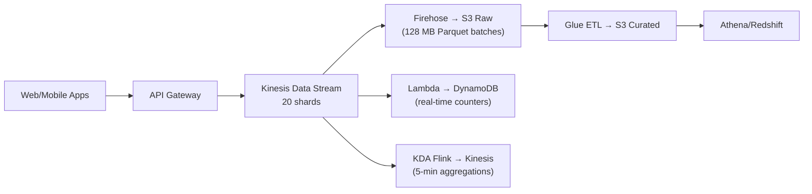

# AWS Kinesis — Real-World Production Examples

## Pattern 1: Complete Streaming Data Lake Ingestion



This pipeline fans one ingestion stream out to durable S3 archival, real-time counters, and streaming aggregations, with the S3 archive feeding downstream batch analytics.

**Firehose configuration for optimal data lake files:**

```python
firehose.create_delivery_stream(
    DeliveryStreamName='events-to-datalake',
    KinesisStreamSourceConfiguration={
        'KinesisStreamARN': 'arn:aws:kinesis:...:stream/clickstream',
        'RoleARN': 'arn:aws:iam::123:role/FirehoseRole'
    },
    ExtendedS3DestinationConfiguration={
        'BucketARN': 'arn:aws:s3:::data-lake',
        'Prefix': 'raw/events/year=!{timestamp:yyyy}/month=!{timestamp:MM}/day=!{timestamp:dd}/hour=!{timestamp:HH}/',
        'ErrorOutputPrefix': 'errors/events/',
        'BufferingHints': {'SizeInMBs': 128, 'IntervalInSeconds': 300},
        'DataFormatConversionConfiguration': {
            'Enabled': True,
            'InputFormatConfiguration': {'Deserializer': {'OpenXJsonSerDe': {}}},
            'OutputFormatConfiguration': {'Serializer': {'ParquetSerDe': {'Compression': 'SNAPPY'}}},
            'SchemaConfiguration': {
                'DatabaseName': 'raw_data', 'TableName': 'events', 'Region': 'us-east-1',
                'RoleARN': 'arn:aws:iam::123:role/FirehoseRole'
            }
        }
    }
)
```

**Result:** JSON events arrive → automatically buffered → converted to Parquet → landed in S3 with Hive partitioning. No custom code. 128 MB files optimal for downstream Athena/Spark.

---

## Pattern 2: Real-Time Fraud Detection

```python
# Lambda consumer: checks each transaction against user history in DynamoDB

def handler(event, context):
    dynamodb = boto3.resource('dynamodb')
    user_history = dynamodb.Table('user_transaction_history')
    alerts_stream = boto3.client('kinesis')
    
    for record in event['Records']:
        txn = json.loads(base64.b64decode(record['kinesis']['data']))
        
        # Look up user's average transaction in last 30 days
        history = user_history.get_item(Key={'user_id': txn['user_id']})
        if 'Item' not in history:
            continue  # New user, no baseline
        
        avg_amount = float(history['Item']['avg_30d_amount'])
        current_amount = float(txn['amount'])
        
        # Flag if >5x the 30-day average
        if current_amount > avg_amount * 5:
            # Send to fraud alerts stream for human review
            alerts_stream.put_record(
                StreamName='fraud-alerts',
                PartitionKey=txn['user_id'],
                Data=json.dumps({
                    'user_id': txn['user_id'],
                    'amount': current_amount,
                    'avg_amount': avg_amount,
                    'ratio': current_amount / avg_amount,
                    'timestamp': txn['timestamp'],
                    'risk_level': 'HIGH' if current_amount > avg_amount * 10 else 'MEDIUM'
                }).encode()
            )
        
        # Update running average (exponential moving average)
        new_avg = avg_amount * 0.95 + current_amount * 0.05
        user_history.update_item(
            Key={'user_id': txn['user_id']},
            UpdateExpression='SET avg_30d_amount = :avg, last_txn_time = :ts',
            ExpressionAttributeValues={':avg': str(new_avg), ':ts': txn['timestamp']}
        )

# Lambda config: 10 parallelization factor, batch size 100, enhanced fan-out
# Latency: <2 seconds from transaction to alert
```

---

## Pattern 3: Cross-Region Replication

```python
# Replicate stream from us-east-1 to eu-west-1 for DR

# Custom KCL consumer that reads from source and writes to destination
class CrossRegionReplicator:
    def __init__(self, source_stream, dest_stream, dest_region):
        self.source = boto3.client('kinesis', region_name='us-east-1')
        self.dest = boto3.client('kinesis', region_name=dest_region)
        self.dest_stream = dest_stream
    
    def replicate_records(self, records):
        """Replicate a batch of records to the destination stream."""
        put_records = []
        for record in records:
            put_records.append({
                'Data': record['data'],
                'PartitionKey': record['partitionKey']
            })
            if len(put_records) >= 500:  # PutRecords max batch size
                self.dest.put_records(StreamName=self.dest_stream, Records=put_records)
                put_records = []
        if put_records:
            self.dest.put_records(StreamName=self.dest_stream, Records=put_records)

# Latency: source region → replicator → dest region = ~100-500ms
# For lower latency: use Kinesis Global Tables (if available) or MSK replication
```

---

## Pattern 4: Backpressure Handling

```python
# When producer rate exceeds shard capacity:
# PutRecord throws ProvisionedThroughputExceededException

import time
from botocore.exceptions import ClientError

def put_with_backpressure(kinesis, stream, records, max_retries=5):
    """Handle throughput exceeded with exponential backoff."""
    failed_records = records
    
    for attempt in range(max_retries):
        response = kinesis.put_records(StreamName=stream, Records=failed_records)
        
        if response['FailedRecordCount'] == 0:
            return  # All succeeded
        
        # Collect failed records for retry
        failed_records = [
            records[i] for i, result in enumerate(response['Records'])
            if 'ErrorCode' in result
        ]
        
        # Exponential backoff
        wait_time = min(2 ** attempt * 0.1, 5.0)  # 0.1s, 0.2s, 0.4s... max 5s
        print(f"Retrying {len(failed_records)} failed records after {wait_time}s")
        time.sleep(wait_time)
    
    # After all retries: send to DLQ or local buffer
    send_to_dlq(failed_records)

# Alternative: buffer locally and send in batches (smoother throughput)
# Use the KPL (Kinesis Producer Library) which handles this automatically
```

---

## Production Cost Optimization

| Strategy | Savings | Trade-off |
|----------|---------|-----------|
| On-Demand mode (auto-scale) | No over-provisioning | 15% premium per GB |
| Provisioned + auto-split scripts | Control costs | Operational overhead |
| Firehose instead of custom consumer | No consumer infrastructure | Limited transform capability |
| Reduce retention to 24h | ~50% shard cost reduction | Can't replay beyond 24h |
| Aggregate records in producer (KPL) | Fewer shards needed | Higher producer latency |
| Move to MSK at >30 shards | 30-50% cheaper at scale | More operational complexity |

```python
# Monthly cost comparison for 25 MB/s sustained throughput:

# Kinesis Provisioned (50 shards):
# Shard hours: 50 × $0.015/hr × 730 = $548
# PUT payload: 25 MB/s × 2.6M sec × $0.014/GB = $910
# Extended retention (7d): 50 × $0.023/hr × 730 = $840
# Total: ~$2,300/month

# Kinesis On-Demand:
# Write: 25 MB/s × 2.6M × $0.08/GB = $5,200  ← MORE EXPENSIVE at steady load
# Read: similar
# Total: ~$6,000/month (On-Demand is 2.5x more expensive for steady workloads!)

# MSK (Kafka) equivalent:
# 3 × m5.2xlarge brokers: 3 × $0.384/hr × 730 = $841
# Storage: 50 TB × $0.10/GB = $5,120
# Total: ~$6,000/month (similar to On-Demand, but unlimited throughput)

# Verdict: Kinesis Provisioned is cheapest for steady, predictable workloads
# On-Demand wins for spiky/unpredictable patterns
# MSK wins when you need Kafka ecosystem tools
```

---

## Interview Tips

> **Tip 1:** "Design a production streaming pipeline on AWS" — "Kinesis Data Streams for ingestion (sized per throughput formula). Firehose for auto-delivery to S3 as Parquet (128 MB batches, Hive partitioning). Lambda for real-time alerting (enhanced fan-out for dedicated throughput). KDA Flink for stateful aggregations (time-windowed metrics). All independent consumers on the same stream."

> **Tip 2:** "How do you handle a Kinesis consumer outage?" — "Kinesis retains records for 24h-365d. When the consumer restarts, it resumes from the last checkpoint (KCL) or last committed position (Lambda). Records produced during the outage are NOT lost — they're replayed automatically. Monitor IteratorAgeMilliseconds to track how far behind the consumer falls."

> **Tip 3:** "Kinesis is getting expensive at scale — what are alternatives?" — "At >50 shards sustained, evaluate MSK (Kafka): similar throughput at lower cost for steady workloads. At extreme scale (>100 MB/s), MSK with tiered storage is most cost-effective. If workload is spiky (bursts): keep Kinesis On-Demand (pay-per-use is cheaper than over-provisioned Kafka). Key: match billing model to access pattern."
