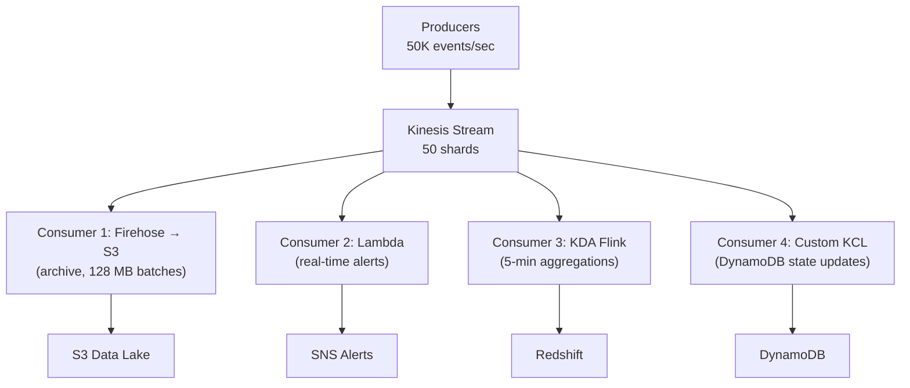

# AWS Kinesis — Senior-Level Deep Dive

## Exactly-Once Processing with Kinesis

Achieving exactly-once requires coordination between Kinesis, Lambda/consumer, and the sink:

```python
# Pattern: Idempotent sink using sequence number as dedup key
def handler(event, context):
    dynamodb = boto3.resource('dynamodb')
    dedup_table = dynamodb.Table('processed_records')
    
    for record in event['Records']:
        seq_num = record['kinesis']['sequenceNumber']
        
        # Atomic conditional write: succeeds only if not already processed
        try:
            dedup_table.put_item(
                Item={'seq_num': seq_num, 'processed_at': str(datetime.now()), 
                      'ttl': int(time.time()) + 604800},  # 7 day TTL
                ConditionExpression='attribute_not_exists(seq_num)'
            )
        except ClientError as e:
            if e.response['Error']['Code'] == 'ConditionalCheckFailedException':
                continue  # Already processed — skip (idempotent!)
            raise
        
        # Process the record (only reached for new records)
        data = json.loads(base64.b64decode(record['kinesis']['data']))
        write_to_destination(data)
```

**Alternative: Checkpointing with KCL**

```python
# KCL (Kinesis Client Library) provides checkpoint-based exactly-once:
# 1. Process batch of records
# 2. Write to sink (idempotent: upsert/overwrite)
# 3. Checkpoint the sequence number
# On restart: resume from last checkpoint (re-read uncommitted records)
# Since sink is idempotent: re-processing produces same result
```

---

## Capacity Planning Formula

```
Inputs:
- Average message size: S bytes
- Peak messages per second: M msgs/s
- Number of consumers: C
- Required retention: R hours

Shard calculation (Provisioned mode):

Write shards needed = MAX(
    CEIL(M × S / 1,048,576),          # 1 MB/s per shard write limit
    CEIL(M / 1000)                     # 1000 records/s per shard limit
)

Read shards needed = CEIL(
    M × S × C / 2,097,152             # 2 MB/s per shard read (shared mode)
)
-- OR with Enhanced Fan-Out: each consumer gets 2 MB/s independently

Total shards = MAX(write_shards, read_shards)

Storage estimate:
Daily storage = M × S × 86400 bytes/day
Total storage = daily × (R / 24) days of retention

Example:
- 50K msgs/s × 500 bytes = 25 MB/s
- Write: CEIL(25/1) = 25 shards (by throughput)
- Write: CEIL(50000/1000) = 50 shards (by record count) ← LIMITING FACTOR
- 3 consumers shared: CEIL(25 × 3 / 2) = 38 shards
- Total: 50 shards

Monthly cost (Provisioned):
- 50 shards × $0.015/hr × 730 hrs = $548/month (shard hours)
- Data in: 25 MB/s × 2.6M s/month × $0.014/GB = $900/month
- Total: ~$1,450/month
```

---

## Production Architecture: Multi-Consumer Pattern



**Each consumer is independent:**
- Firehose: simple delivery, auto-retries, no code
- Lambda: per-record logic, auto-scales, handles errors with DLQ
- Flink: stateful processing (windows, aggregations, joins)
- KCL: custom Java/Python consumer for complex state management

---

## Handling Shard-Level Hot Keys

```python
# Problem: partition key "homepage" gets 80% of traffic → one shard overwhelmed

# Solution 1: Random suffix on hot keys
def get_partition_key(event):
    key = event['page_url']
    if key in HOT_KEYS:
        return f"{key}#{random.randint(0, 49)}"  # Spread across ~50 shards
    return key

# Solution 2: Explicit shard routing (ExplicitHashKey)
# Bypass the partition key hash — directly specify which shard
kinesis.put_record(
    StreamName='events',
    Data=payload,
    PartitionKey='homepage',
    ExplicitHashKey=str(random.randint(0, 340282366920938463463374607431768211455))
    # Random hash → random shard (overrides partition key routing)
)

# Solution 3: On-Demand mode (auto-splits hot shards)
# Kinesis automatically detects throughput exceeded and adds shards
```

---

## Monitoring and Alerting

| Metric | Normal | Warning | Critical | Action |
|--------|--------|---------|----------|--------|
| `IncomingBytes` / shard | < 1 MB/s | 0.8 MB/s | 1 MB/s (limit) | Split shard or switch to On-Demand |
| `WriteProvisionedThroughputExceeded` | 0 | > 0 | Sustained > 0 | Immediate: increase shards |
| `ReadProvisionedThroughputExceeded` | 0 | > 0 | Sustained | Add Enhanced Fan-Out or reduce consumers |
| `IteratorAgeMilliseconds` | < 60000 | > 300000 | > 600000 | Consumer falling behind: scale out |
| `GetRecords.IteratorAge` per consumer | < 1 min | > 5 min | > 30 min | Consumer-specific processing issue |

```python
# CloudWatch alarm: consumer lag
cloudwatch.put_metric_alarm(
    AlarmName='kinesis-consumer-lag-critical',
    Namespace='AWS/Kinesis',
    MetricName='GetRecords.IteratorAgeMilliseconds',
    Dimensions=[{'Name': 'StreamName', 'Value': 'orders-stream'}],
    Statistic='Maximum',
    Period=60,
    EvaluationPeriods=5,
    Threshold=300000,  # 5 minutes
    ComparisonOperator='GreaterThanThreshold',
    AlarmActions=['arn:aws:sns:...:critical-alerts']
)
```

---

## Data Retention and Replay

```python
# Standard: 24 hours (default)
# Extended: up to 365 days ($0.023/shard/hour extra)

# Enable extended retention
kinesis.increase_stream_retention_period(
    StreamName='orders-stream',
    RetentionPeriodHours=168  # 7 days
)

# Replay from a specific point in time
# Use case: "Our consumer had a bug yesterday, need to reprocess from 6 AM"
kinesis.get_shard_iterator(
    StreamName='orders-stream',
    ShardId='shardId-000000000001',
    ShardIteratorType='AT_TIMESTAMP',
    Timestamp=datetime(2024, 1, 15, 6, 0, 0)  # Start from 6 AM
)
# Consumer reads from this point forward (replays ~18 hours of data)
```

---

## Interview Tips

> **Tip 1:** "How do you achieve exactly-once with Kinesis?" — "Kinesis provides at-least-once delivery. For exactly-once processing: make the consumer idempotent. Use the Kinesis sequence number as a dedup key in DynamoDB (conditional write). Or use S3 paths that include the sequence number range (overwrite = same result). The key insight: if processing the same record twice gives the same outcome, at-least-once becomes effectively exactly-once."

> **Tip 2:** "How do you size a Kinesis stream?" — "Calculate from two limits per shard: 1 MB/s write AND 1000 records/s. Take the maximum. Example: 50K records/s at 500 bytes each = 25 MB/s write. By throughput: 25 shards. By record count: 50 shards. The higher number (50) is your minimum. Add 25% headroom for spikes: 63 shards, round to 64."

> **Tip 3:** "Consumer is falling behind — how do you fix it?" — "Check IteratorAgeMilliseconds. Three fixes: (1) Add more Lambda concurrency (ParallelizationFactor up to 10 per shard). (2) Increase batch size (process more records per invocation). (3) Add more shards (enables more parallel consumers in KCL). For Lambda specifically: optimize per-record processing time (batch external calls, remove unnecessary I/O)."
