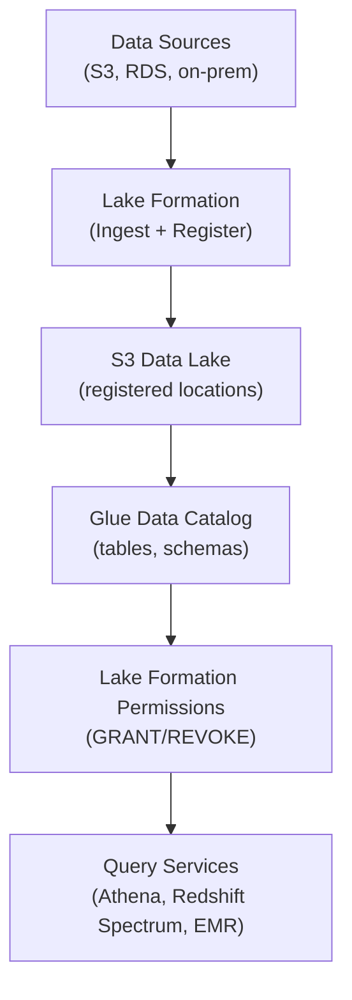

# AWS Lake Formation — Fundamentals

## What Is AWS Lake Formation?

AWS Lake Formation is a **data lake governance service** that simplifies building, securing, and managing data lakes. It provides fine-grained access control (column-level, row-level, cell-level) on data stored in S3, managed through a centralized permissions model that integrates with the Glue Data Catalog.

**The analogy:** If your data lake is a library, Lake Formation is the librarian who controls who can read which books, which chapters, and even which paragraphs — while also helping organize the books on shelves in the first place.

> **Why Lake Formation matters for DE:** As data lakes grow, managing IAM policies per table/column becomes unmanageable. Lake Formation provides a single place to grant/revoke access at database, table, column, and row level — replacing hundreds of S3 bucket policies with simple GRANT/REVOKE statements.

---

## How Lake Formation Works



**What this shows:**
- Lake Formation registers S3 locations under its governance
- The Glue Data Catalog provides the metadata layer (databases, tables, columns)
- Permissions are managed centrally through GRANT/REVOKE (like SQL)
- Query services (Athena, Redshift Spectrum, EMR) enforce Lake Formation permissions automatically
- Replaces complex IAM + S3 bucket policies with a unified model

---

## Core Concepts

| Concept | Description | DE Relevance |
|---------|-------------|--------------|
| **Data Lake Administrator** | IAM principal with full Lake Formation privileges | Sets up governance, grants permissions to teams |
| **Registered Location** | S3 path managed by Lake Formation | Lake Formation controls access instead of S3 policies |
| **Database/Table Permissions** | GRANT on Glue Catalog objects | Control who can query which tables |
| **Column-Level Security** | Include/exclude specific columns | Hide PII columns from analysts |
| **Row-Level Security (Data Filters)** | Filter rows by expression | Show only region-specific data per team |
| **Tag-Based Access Control (LF-Tags)** | Attribute-based permissions | Scale permissions across hundreds of tables |
| **Cross-Account Sharing** | Share databases/tables across AWS accounts | Central data lake accessed by multiple teams |

---

## Permission Model: Lake Formation vs IAM

**Before Lake Formation (IAM-only):**
```
❌ S3 bucket policy per table
❌ IAM policy per user/role per table
❌ No column-level control
❌ 100+ policies to manage for 50 tables × 10 teams
```

**With Lake Formation:**
```
✅ Single GRANT statement per permission
✅ Column-level and row-level filtering
✅ Central audit via CloudTrail
✅ 1 governance console for all permissions
```

---

## Granting Permissions

```sql
-- Grant SELECT on specific columns to a role
-- (via AWS Console, CLI, or SDK — shown as pseudo-SQL for clarity)

GRANT SELECT (order_id, amount, order_date)
ON TABLE analytics.fact_orders
TO ROLE data_analyst_role;

-- Revoke access to PII column
REVOKE SELECT (customer_email)
ON TABLE analytics.dim_customers
FROM ROLE junior_analyst_role;
```

**Via AWS CLI:**
```bash
# Grant table-level permission
aws lakeformation grant-permissions \
  --principal '{"DataLakePrincipalIdentifier": "arn:aws:iam::123456789:role/DataAnalystRole"}' \
  --resource '{"Table": {"DatabaseName": "analytics", "Name": "fact_orders"}}' \
  --permissions '["SELECT"]'

# Grant column-level permission (include specific columns)
aws lakeformation grant-permissions \
  --principal '{"DataLakePrincipalIdentifier": "arn:aws:iam::123456789:role/DataAnalystRole"}' \
  --resource '{"TableWithColumns": {"DatabaseName": "analytics", "Name": "dim_customers", "ColumnNames": ["customer_id", "segment", "region"]}}' \
  --permissions '["SELECT"]'
```

---

## Row-Level Security (Data Filters)

```bash
# Create a data filter — analysts see only their region
aws lakeformation create-data-cells-filter \
  --table-data '{
    "TableCatalogId": "123456789",
    "DatabaseName": "analytics",
    "TableName": "fact_orders",
    "Name": "us-east-only",
    "RowFilter": {"FilterExpression": "region = '\''us-east-1'\''"},
    "ColumnNames": ["order_id", "amount", "order_date", "region"]
  }'

# Grant the filtered view to a role
aws lakeformation grant-permissions \
  --principal '{"DataLakePrincipalIdentifier": "arn:aws:iam::123456789:role/USEastAnalyst"}' \
  --resource '{"DataCellsFilter": {"TableCatalogId": "123456789", "DatabaseName": "analytics", "TableName": "fact_orders", "Name": "us-east-only"}}' \
  --permissions '["SELECT"]'
```

> **Result:** When `USEastAnalyst` queries `fact_orders` via Athena, they only see rows where `region = 'us-east-1'` — automatically enforced.

---

## LF-Tags (Tag-Based Access Control)

Scale permissions across many tables without individual grants:

```bash
# Define tags
aws lakeformation create-lf-tag --tag-key "classification" --tag-values '["public", "internal", "confidential"]'
aws lakeformation create-lf-tag --tag-key "domain" --tag-values '["sales", "marketing", "finance"]'

# Tag tables
aws lakeformation add-lf-tags-to-resource \
  --resource '{"Table": {"DatabaseName": "analytics", "Name": "fact_orders"}}' \
  --lf-tags '[{"TagKey": "classification", "TagValues": ["internal"]}, {"TagKey": "domain", "TagValues": ["sales"]}]'

# Grant based on tags (applies to ALL tables with matching tags)
aws lakeformation grant-permissions \
  --principal '{"DataLakePrincipalIdentifier": "arn:aws:iam::123456789:role/SalesTeamRole"}' \
  --resource '{"LFTagPolicy": {"ResourceType": "TABLE", "Expression": [{"TagKey": "domain", "TagValues": ["sales"]}, {"TagKey": "classification", "TagValues": ["public", "internal"]}]}}' \
  --permissions '["SELECT", "DESCRIBE"]'
```

> **Why LF-Tags matter:** With 500 tables and 20 teams, individual grants = 10,000 permission entries. With tags: tag tables by domain/classification, grant by tag → a few dozen rules manage everything.

---

## Key DE Use Cases

1. **PII Protection** — Hide sensitive columns (SSN, email) from analytics roles while allowing data engineers full access
2. **Multi-Tenant Data Lake** — Row-level filtering so each business unit sees only their data
3. **Cross-Account Data Sharing** — Central data lake in Account A, analytics teams in Account B query via Athena
4. **Compliance Auditing** — All permission grants/revokes logged in CloudTrail for SOC2/HIPAA
5. **Self-Service Analytics** — Grant analysts access to curated tables without touching S3 policies

---

## Lake Formation vs Alternatives

| Aspect | Lake Formation | IAM + S3 Policies | Ranger (EMR) |
|--------|---------------|-------------------|--------------|
| **Granularity** | Column + row level | Bucket/prefix level | Column + row level |
| **Scale** | Tag-based (1000s of tables) | Policy per resource (limit ~20KB) | Policy per resource |
| **Services supported** | Athena, Spectrum, EMR, Glue | All AWS services | EMR/Hive only |
| **Setup complexity** | Medium (register + migrate) | High (many policies) | High (Ranger cluster) |
| **Cross-account** | Built-in sharing | Complex (bucket policies + IAM) | Not native |
| **Audit** | CloudTrail + built-in | CloudTrail | Ranger audit logs |

---

## Common Setup Pattern for DE Teams

```python
import boto3

lf_client = boto3.client('lakeformation')

# Step 1: Register S3 location with Lake Formation
lf_client.register_resource(
    ResourceArn='arn:aws:s3:::data-lake-curated',
    UseServiceLinkedRole=True  # Lake Formation manages access
)

# Step 2: Grant Data Engineer role full access
lf_client.grant_permissions(
    Principal={'DataLakePrincipalIdentifier': 'arn:aws:iam::123456789:role/DataEngineerRole'},
    Resource={'Database': {'Name': 'analytics'}},
    Permissions=['ALL'],
    PermissionsWithGrantOption=['ALL']  # Can grant to others
)

# Step 3: Grant Analyst role read-only on specific tables
lf_client.grant_permissions(
    Principal={'DataLakePrincipalIdentifier': 'arn:aws:iam::123456789:role/AnalystRole'},
    Resource={'Table': {'DatabaseName': 'analytics', 'Name': 'fact_orders'}},
    Permissions=['SELECT', 'DESCRIBE']
)
```

---

## Interview Tips

> **Tip 1:** "What is Lake Formation?" — "A centralized governance layer for data lakes that provides fine-grained access control (column-level, row-level) on S3 data via the Glue Data Catalog. It replaces complex IAM + S3 bucket policies with simple GRANT/REVOKE permissions, supports tag-based access control for scale, and cross-account data sharing."

> **Tip 2:** "How do you secure PII in a data lake?" — "Use Lake Formation column-level security to exclude PII columns (email, SSN) from analyst roles. For row-level filtering, use Data Filters to restrict rows by region or tenant. Combined with LF-Tags, you can enforce policies like 'confidential columns only visible to data-engineering role' across hundreds of tables automatically."

> **Tip 3:** "Lake Formation vs IAM policies for data lake security?" — "IAM operates at the S3 path level — you can restrict access to a prefix but not to specific columns or rows. Lake Formation adds a metadata-aware security layer: it understands tables, columns, and rows via the Glue Catalog. For any data lake with more than 10 tables and multiple consumer teams, Lake Formation is far more manageable than IAM alone."
