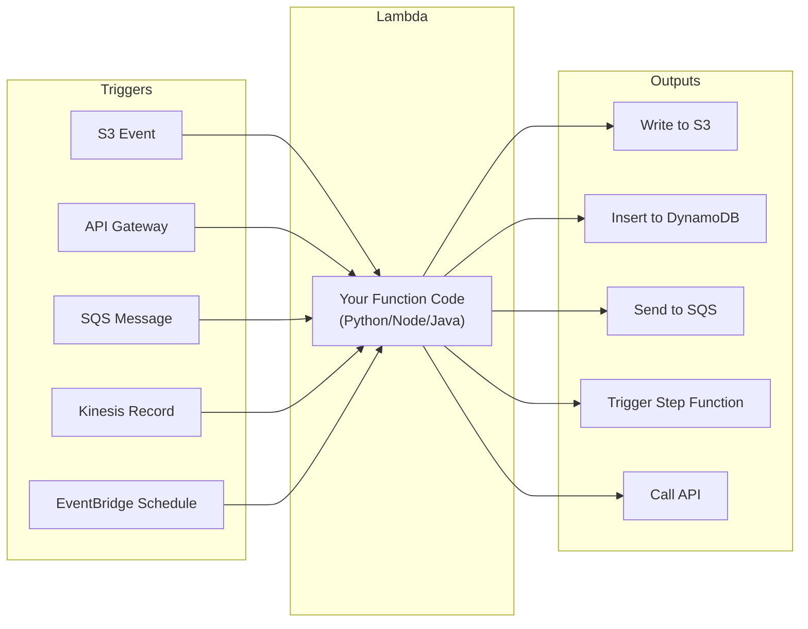
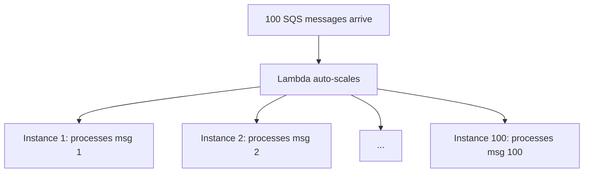

# AWS Lambda — Fundamentals

## What Is AWS Lambda?

AWS Lambda is a **serverless compute service** that runs your code in response to events — without provisioning or managing servers. You upload code, define a trigger, and Lambda handles everything else.

**The analogy:** Lambda is like a vending machine for code execution. Insert an event (trigger), get a result. No kitchen (server) to maintain. Pay only when the machine dispenses (code runs).

> **Why Lambda matters for DE:** It's the glue that connects AWS services in event-driven data pipelines. File arrives in S3 → Lambda validates and triggers Glue. Message lands in SQS → Lambda processes it. Used for lightweight transformations, orchestration, and real-time processing.

---

## How Lambda Works



**What this shows:**
- Lambda is triggered by events (S3, API, queue, stream, schedule)
- Your function processes the event
- It can write to any AWS service as output
- Lambda handles scaling, availability, and infrastructure

---

## Your First Lambda Function

```python
import json
import boto3

s3 = boto3.client('s3')

def handler(event, context):
    """
    Lambda handler — entry point for execution.
    
    Args:
        event: The trigger event data (S3 notification, SQS message, etc.)
        context: Runtime info (function name, time remaining, memory)
    
    Returns:
        Response object (for API Gateway) or None (for async triggers)
    """
    # Example: triggered by S3 file upload
    bucket = event['Records'][0]['s3']['bucket']['name']
    key = event['Records'][0]['s3']['object']['key']
    
    print(f"Processing file: s3://{bucket}/{key}")
    
    # Download and validate the file
    obj = s3.get_object(Bucket=bucket, Key=key)
    content = obj['Body'].read().decode('utf-8')
    
    # Simple validation
    lines = content.strip().split('\n')
    row_count = len(lines) - 1  # Exclude header
    
    if row_count == 0:
        raise ValueError(f"Empty file: {key}")
    
    print(f"File validated: {row_count} rows")
    
    return {
        'statusCode': 200,
        'body': json.dumps({'file': key, 'rows': row_count})
    }
```

---

## Lambda Limits (Critical to Know)

| Limit | Value | Impact on DE |
|-------|-------|-------------|
| **Max execution time** | 15 minutes | Can't run long ETL jobs |
| **Max memory** | 10 GB | Limited processing capacity |
| **Max payload (sync)** | 6 MB | Can't pass large data in events |
| **Max payload (async)** | 256 KB | SQS/SNS message size limit |
| **Max /tmp storage** | 10 GB | Limited scratch space for files |
| **Max concurrent** | 1000 (default, can increase) | Throttling under high load |
| **Deployment package** | 250 MB (unzipped) | Limits library size |

> **Key implication for DE:** Lambda is for LIGHTWEIGHT processing (validation, routing, small transforms). For heavy ETL (GB+ data), use Glue or EMR. Lambda is the orchestrator/trigger, not the workhorse.

---

## Common DE Use Cases for Lambda

### 1. S3 File Arrival → Trigger Pipeline

```python
# When a file lands in S3 raw zone → validate and trigger Glue
def handler(event, context):
    bucket = event['Records'][0]['s3']['bucket']['name']
    key = event['Records'][0]['s3']['object']['key']
    
    # Validate file
    if not key.endswith('.parquet'):
        print(f"Skipping non-parquet file: {key}")
        return
    
    # Trigger Glue job
    glue = boto3.client('glue')
    glue.start_job_run(
        JobName='process-raw-orders',
        Arguments={'--input_path': f's3://{bucket}/{key}'}
    )
    print(f"Triggered Glue job for: {key}")
```

### 2. Data Quality Gate

```python
# Validate data before allowing downstream processing
def handler(event, context):
    s3 = boto3.client('s3')
    bucket = event['bucket']
    key = event['key']
    
    # Read sample for validation
    obj = s3.get_object(Bucket=bucket, Key=key)
    df = pd.read_parquet(io.BytesIO(obj['Body'].read()))
    
    # Quality checks
    checks = {
        'row_count': len(df) > 0,
        'no_null_ids': df['order_id'].notna().all(),
        'positive_amounts': (df['amount'] > 0).all(),
    }
    
    failed = [k for k, v in checks.items() if not v]
    
    if failed:
        # Route to quarantine
        s3.copy_object(Bucket='quarantine', Key=key, CopySource=f'{bucket}/{key}')
        raise ValueError(f"Quality check failed: {failed}")
    
    return {'status': 'passed', 'rows': len(df)}
```

### 3. Kinesis Stream Processor

```python
# Process streaming records in real-time
import base64
import json

def handler(event, context):
    for record in event['Records']:
        # Decode Kinesis record
        payload = json.loads(base64.b64decode(record['kinesis']['data']))
        
        # Real-time logic (alerting, enrichment, routing)
        if payload.get('amount', 0) > 10000:
            send_alert(f"High-value transaction: {payload['order_id']}")
        
        # Route to appropriate destination
        if payload['event_type'] == 'purchase':
            sqs.send_message(QueueUrl=PURCHASE_QUEUE, MessageBody=json.dumps(payload))
    
    return {'processedRecords': len(event['Records'])}
```

### 4. Scheduled Data Check (Cron)

```python
# EventBridge schedule: run every hour
# Check if expected data has arrived

def handler(event, context):
    s3 = boto3.client('s3')
    today = datetime.now().strftime('%Y-%m-%d')
    
    # Check if today's data exists
    response = s3.list_objects_v2(
        Bucket='data-lake',
        Prefix=f'raw/orders/dt={today}/',
        MaxKeys=1
    )
    
    if response.get('KeyCount', 0) == 0:
        sns = boto3.client('sns')
        sns.publish(
            TopicArn=ALERT_TOPIC,
            Subject='Missing Data Alert',
            Message=f"No orders data found for {today} as of {datetime.now()}"
        )
    
    return {'date': today, 'data_found': response.get('KeyCount', 0) > 0}
```

---

## Lambda Layers (Shared Libraries)

Package common libraries once and share across functions:

```python
# Create a layer with pandas + pyarrow (for Parquet processing)
# Layer package structure:
# python/
#   pandas/
#   pyarrow/
#   numpy/

# Attach to Lambda function
lambda_client.update_function_configuration(
    FunctionName='data-validator',
    Layers=['arn:aws:lambda:us-east-1:123:layer:pandas-layer:3']
)
# Now the function can import pandas without including it in the deployment package
```

---

## Lambda Concurrency and Scaling



**Scaling behavior:**
- Lambda creates a new instance per concurrent request
- Scales from 0 to 1000+ instances in seconds
- Each instance handles ONE event at a time
- After processing, instance is reused (warm start) or terminated (cold start)

**Cold start:** First invocation takes 1-5 seconds (loading code, initializing). Subsequent invocations on warm instances take milliseconds.

---

## Cost Model

| Component | Pricing |
|-----------|---------|
| Requests | $0.20 per 1M invocations |
| Duration | $0.0000166667 per GB-second |
| Free tier | 1M requests + 400,000 GB-seconds/month |

**Example cost:**
- Function: 256 MB memory, runs 500ms per invocation
- 10,000 invocations/day = 300K/month
- Cost: 300K × $0.20/1M + 300K × 0.256 GB × 0.5s × $0.0000166667 = $0.06 + $0.64 = **$0.70/month**

> **Lambda is extremely cheap for DE workloads** (thousands of small invocations). Only becomes expensive at millions of invocations or long-running functions.

---

## Interview Tips

> **Tip 1:** "When would you use Lambda in a data pipeline?" — "As the orchestration/trigger layer: S3 event triggers Lambda → validates file → triggers Glue/Step Functions for heavy ETL. Also for lightweight real-time processing from Kinesis/SQS (per-record alerting, routing). NOT for heavy data transformation (use Glue/EMR for that — Lambda's 15-min limit and 10 GB memory are too restrictive)."

> **Tip 2:** "Lambda vs Glue for ETL?" — "Lambda for: small data (<100 MB), simple transforms, event-driven triggers, fast execution (<15 min). Glue for: large data (GB-TB), complex Spark transformations, catalog integration, job bookmarks. Many pipelines use BOTH: Lambda triggers/validates, Glue transforms."

> **Tip 3:** "How do you handle Lambda cold starts?" — "Provisioned concurrency (pre-warm instances), keep functions small (fewer dependencies = faster init), use Lambda layers for large libraries, and keep handler logic lightweight. For streaming (Kinesis/SQS), cold starts are less impactful because instances stay warm between batches."
