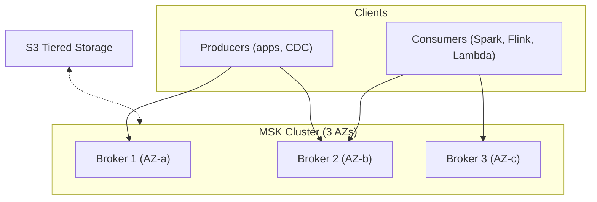

# AWS MSK (Managed Streaming for Apache Kafka) — Fundamentals


## 🎯 Analogy

Think of MSK (Managed Streaming for Kafka) like AWS running Kafka for you: brokers, ZooKeeper/KRaft, storage, and patches are all managed — you just produce and consume messages without cluster operations.

---
## What Is Amazon MSK?

Amazon MSK is a **fully managed Apache Kafka service** that handles the infrastructure (brokers, ZooKeeper/KRaft, storage, patching, monitoring) while you focus on producing and consuming data using standard Kafka APIs.

**The analogy:** If Kinesis is a managed, opinionated highway (AWS-native, auto-scales, limited options), MSK is a managed open road (full Kafka flexibility, you choose the lanes and speed limits, AWS handles the pavement maintenance).

> **Why MSK matters for DE:** Many enterprises standardize on Kafka. MSK lets you run Kafka on AWS without managing servers, while keeping 100% Kafka API compatibility. You can use Kafka Connect, Kafka Streams, Schema Registry, and all ecosystem tools.

---

## MSK vs Kinesis — The Key Decision

| Factor | MSK (Kafka) | Kinesis |
|--------|------------|---------|
| API | Open-source Kafka API | AWS proprietary API |
| Ecosystem | Full Kafka ecosystem (Connect, Streams, KSQL) | AWS-native (Lambda, Firehose) |
| Throughput | Very high (100s MB/s per broker) | 1 MB/s per shard (limited) |
| Scaling | Manual (add brokers) or Serverless (auto) | Manual shards or On-Demand |
| Cost at high volume | Cheaper ($0.10-0.25/GB at scale) | More expensive ($0.014-0.08/GB) |
| Cost at low volume | More expensive (always-on brokers) | Cheaper (per-shard pricing) |
| Management | Semi-managed (some Kafka admin needed) | Fully managed (zero admin) |
| Multi-cloud portability | Yes (standard Kafka) | No (AWS-only) |
| Consumer model | Consumer groups (mature) | KCL or Lambda |
| Retention | Unlimited (tiered storage) | 24h–365 days |
| Best for | High throughput, Kafka teams, multi-cloud | AWS-only, serverless, moderate throughput |

> **Rule of thumb:** Use MSK when throughput > 50 MB/s, team knows Kafka, or you need the Kafka ecosystem. Use Kinesis when you want serverless simplicity, AWS-native integrations, or throughput < 50 MB/s.

---

## MSK Architecture



**What this shows:**
- Brokers spread across 3 Availability Zones (HA by default)
- Producers and consumers use standard Kafka client libraries
- Tiered storage offloads cold data to S3 (reduces broker storage costs)
- Standard Kafka replication between brokers handles fault tolerance

---

## MSK Cluster Types

### Provisioned (Traditional)

```python
import boto3
kafka = boto3.client('kafka')

kafka.create_cluster(
    ClusterName='data-platform-kafka',
    KafkaVersion='3.5.1',
    NumberOfBrokerNodes=3,          # 1 per AZ minimum
    BrokerNodeGroupInfo={
        'InstanceType': 'kafka.m5.large',   # 2 vCPU, 8 GB
        'ClientSubnets': ['subnet-a', 'subnet-b', 'subnet-c'],
        'SecurityGroups': ['sg-kafka'],
        'StorageInfo': {
            'EbsStorageInfo': {
                'VolumeSize': 1000,  # 1 TB per broker
                'ProvisionedThroughput': {
                    'Enabled': True,
                    'VolumeThroughput': 250  # 250 MB/s per broker
                }
            }
        }
    },
    EncryptionInfo={
        'EncryptionInTransit': {'ClientBroker': 'TLS', 'InCluster': True}
    },
    EnhancedMonitoring='PER_TOPIC_PER_BROKER',
)
```

### Serverless (Auto-Scaling, No Broker Management)

```python
kafka.create_cluster_v2(
    ClusterName='serverless-kafka',
    Serverless={
        'ClientAuthentication': {
            'Sasl': {'Iam': {'Enabled': True}}  # IAM authentication
        },
        'VpcConfigs': [{
            'SubnetIds': ['subnet-a', 'subnet-b', 'subnet-c'],
            'SecurityGroupIds': ['sg-kafka']
        }]
    }
)
# No broker count, instance type, or storage to configure!
# MSK Serverless auto-scales based on throughput
# Pay per data in/out (no idle cost for unused capacity)
```

| Feature | Provisioned | Serverless |
|---------|------------|-----------|
| Broker management | You choose instance type + count | Fully automatic |
| Scaling | Manual (add brokers) + auto-scaling storage | Automatic |
| Max throughput | Unlimited (add brokers) | 200 MB/s per cluster |
| Cost model | Per broker-hour + storage | Per GB in/out |
| Kafka version control | You choose | AWS manages |
| Best for | High throughput, full control | Variable workloads, simplicity |

---

## Creating Topics and Producing Data

```python
# Standard Kafka client (works identically with MSK)
from kafka import KafkaProducer, KafkaAdminClient
from kafka.admin import NewTopic

# Get bootstrap brokers from MSK API
response = kafka.get_bootstrap_brokers(ClusterArn='arn:aws:kafka:...')
bootstrap_servers = response['BootstrapBrokerStringTls']
# e.g., "b-1.cluster.xxx.kafka.us-east-1.amazonaws.com:9094,b-2..."

# Create topic
admin = KafkaAdminClient(bootstrap_servers=bootstrap_servers,
                         security_protocol='SSL')
admin.create_topics([
    NewTopic(name='order-events', num_partitions=12, replication_factor=3)
])

# Produce messages (standard Kafka producer)
producer = KafkaProducer(
    bootstrap_servers=bootstrap_servers,
    security_protocol='SSL',
    value_serializer=lambda v: json.dumps(v).encode('utf-8'),
    acks='all',
    enable_idempotence=True,
)

producer.send('order-events', key=b'order-123', value={'amount': 99.99, 'status': 'placed'})
producer.flush()
```

> **Key point:** MSK is 100% Kafka API compatible. Any Kafka client library (Python, Java, Go) works without modification. You just point it at the MSK bootstrap brokers.

---

## MSK Connect — Managed Kafka Connect

Run connectors (CDC, S3 sink, JDBC source) without managing Connect workers:

```python
kafka.create_connector(
    connectorName='s3-sink-orders',
    kafkaCluster={'apacheKafkaCluster': {
        'bootstrapServers': bootstrap_servers,
        'vpc': {'subnets': [...], 'securityGroups': [...]}
    }},
    connectorConfiguration={
        'connector.class': 'io.confluent.connect.s3.S3SinkConnector',
        'topics': 'order-events',
        's3.bucket.name': 'data-lake',
        's3.region': 'us-east-1',
        'flush.size': '10000',
        'storage.class': 'io.confluent.connect.s3.storage.S3Storage',
        'format.class': 'io.confluent.connect.s3.format.parquet.ParquetFormat',
        'partitioner.class': 'io.confluent.connect.storage.partitioner.TimeBasedPartitioner',
        'path.format': "'year'=YYYY/'month'=MM/'day'=dd/'hour'=HH",
        'locale': 'en-US',
        'timezone': 'UTC',
    },
    capacity={'autoScaling': {
        'minWorkerCount': 1, 'maxWorkerCount': 4,
        'scaleInPolicy': {'cpuUtilizationPercentage': 20},
        'scaleOutPolicy': {'cpuUtilizationPercentage': 80}
    }},
    plugins=[{'customPlugin': {'customPluginArn': 'arn:aws:kafkaconnect:...:plugin/s3-sink', 'revision': 1}}]
)
```

**MSK Connect use cases:**
- S3 sink (Kafka → Parquet on S3 automatically)
- JDBC source (database → Kafka CDC)
- Elasticsearch/OpenSearch sink
- Debezium CDC connector

---

## Authentication Options

| Method | Best For | Setup Complexity |
|--------|----------|:---:|
| IAM (recommended) | AWS-native apps (Lambda, Glue, MSK Serverless) | Low |
| SASL/SCRAM | Non-AWS clients, existing Kafka tooling | Medium |
| mTLS (mutual TLS) | Zero-trust environments, client certificates | High |
| Unauthenticated | Development only (never in production!) | None |

```python
# IAM authentication (recommended for AWS workloads)
from aws_msk_iam_sasl_signer import MSKAuthTokenProvider

producer = KafkaProducer(
    bootstrap_servers=bootstrap_servers,
    security_protocol='SASL_SSL',
    sasl_mechanism='OAUTHBEARER',
    sasl_oauth_token_provider=MSKAuthTokenProvider(region='us-east-1'),
)
```

---

## Monitoring

MSK provides metrics at multiple levels via CloudWatch:

| Metric Level | Example Metrics | Alert On |
|-------------|-----------------|----------|
| Cluster | `ActiveControllerCount`, `OfflinePartitionsCount` | Controller != 1, Offline > 0 |
| Broker | `CpuUser`, `KafkaDataLogsDiskUsed`, `NetworkRxDropped` | CPU > 80%, Disk > 85% |
| Topic | `BytesInPerSec`, `BytesOutPerSec`, `MessagesInPerSec` | Throughput drop > 50% |
| Consumer Group | `MaxOffsetLag`, `SumOffsetLag` | Lag growing > 5 minutes |

---

## Cost Estimate

```
Example: 3 × kafka.m5.large brokers, 1 TB storage each, 50 MB/s throughput

Broker hours: 3 × $0.21/hr × 730 hrs = $460/month
Storage: 3 × 1 TB × $0.10/GB = $307/month
Data transfer (within VPC): Free
Total: ~$767/month

Compare to Kinesis for 50 MB/s:
50 shards × $0.015/hr × 730 = $548 (shard hours)
+ data ingestion: 50 MB/s × 2.6M sec × $0.014/GB = $1,820
Kinesis total: ~$2,368/month

MSK is 3x cheaper at this throughput level!
```

---


## ▶️ Try It Yourself

```bash
# Create an MSK cluster (simplified)
aws kafka create-cluster \
  --cluster-name orders-kafka \
  --kafka-version "3.5.1" \
  --number-of-broker-nodes 3 \
  --broker-node-group-info '{
    "InstanceType": "kafka.m5.large",
    "ClientSubnets": ["subnet-aaa","subnet-bbb","subnet-ccc"],
    "SecurityGroups": ["sg-kafka"],
    "StorageInfo": {"EbsStorageInfo": {"VolumeSize": 100}}
  }'

# Get bootstrap brokers
aws kafka get-bootstrap-brokers --cluster-arn arn:aws:kafka:us-east-1:...

# Then use bootstrap brokers in your KafkaProducer/Consumer as normal
# bootstrap.servers=b-1.orders-kafka.abc.kafka.us-east-1.amazonaws.com:9092,...
```

> **Run it:** Copy the snippet into a REPL or file and run it — no external services needed for the basic example.

---
## Interview Tips

> **Tip 1:** "When would you choose MSK over Kinesis?" — "MSK when: throughput >50 MB/s (cheaper at scale), team has Kafka expertise, need Kafka Connect/Streams ecosystem, or require multi-cloud portability. Kinesis when: want zero management, AWS-native integrations (Lambda event source), moderate throughput, or serverless-first architecture."

> **Tip 2:** "How does MSK handle high availability?" — "Brokers are spread across 3 AZs automatically. Each partition is replicated (default replication-factor=3). If a broker/AZ fails, leaders are re-elected on surviving brokers in seconds. MSK also offers automatic broker recovery — if a broker's EBS volume fails, MSK replaces it and replicates data from surviving replicas."

> **Tip 3:** "MSK Provisioned vs Serverless?" — "Provisioned for: steady high-throughput workloads, full Kafka configuration control, cost predictability. Serverless for: variable/spiky workloads, teams that don't want to manage broker capacity, quick development. Serverless caps at 200 MB/s; Provisioned scales to thousands of MB/s."
