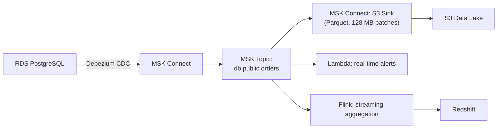

# AWS MSK — Real-World Production Examples

## Pattern 1: CDC Pipeline (Database → MSK → Data Lake)



This diagram shows a change-data-capture pipeline: Debezium captures row-level changes from RDS into MSK Connect, which publishes them to a Kafka topic that multiple independent consumers (an S3 sink, a Lambda alerter, and a Flink aggregator) read in parallel.

**Implementation:**

```python
# Debezium Source Connector (via MSK Connect)
debezium_config = {
    'connector.class': 'io.debezium.connector.postgresql.PostgresConnector',
    'database.hostname': 'mydb.xxx.rds.amazonaws.com',
    'database.port': '5432',
    'database.user': 'debezium',
    'database.password': '${secretsmanager:debezium-creds:password}',
    'database.dbname': 'production',
    'database.server.name': 'prod-db',
    'table.include.list': 'public.orders,public.customers,public.products',
    'plugin.name': 'pgoutput',
    'slot.name': 'debezium_slot',
    'publication.name': 'debezium_pub',
    'transforms': 'route',
    'transforms.route.type': 'org.apache.kafka.connect.transforms.RegexRouter',
    'transforms.route.regex': '([^.]+)\\.([^.]+)\\.([^.]+)',
    'transforms.route.replacement': 'cdc.$3',  # Topic: cdc.orders, cdc.customers
    'key.converter': 'io.apicurio.registry.serde.avro.AvroKafkaSerializer',
    'value.converter': 'io.apicurio.registry.serde.avro.AvroKafkaSerializer',
}

# S3 Sink Connector (MSK Connect)
s3_sink_config = {
    'connector.class': 'io.confluent.connect.s3.S3SinkConnector',
    'topics.regex': 'cdc\\..*',              # All CDC topics
    's3.bucket.name': 'data-lake',
    's3.region': 'us-east-1',
    'flush.size': '100000',                  # Flush every 100K records
    'rotate.interval.ms': '300000',          # Or every 5 minutes
    'format.class': 'io.confluent.connect.s3.format.parquet.ParquetFormat',
    'parquet.codec': 'snappy',
    'partitioner.class': 'io.confluent.connect.storage.partitioner.TimeBasedPartitioner',
    'path.format': "'year'=YYYY/'month'=MM/'day'=dd/'hour'=HH",
    'timestamp.extractor': 'RecordField',
    'timestamp.field': 'ts_ms',
}
```

**Result:** Database changes stream to S3 in near-real-time (5-minute batches) as optimized Parquet files. Lambda processes alerts instantly. No Glue job or custom consumer code needed.

---

## Pattern 2: Event-Driven Microservices Backbone

```python
# Order service produces events
producer.send('order.placed', key=order_id, value={
    'order_id': 'O-12345',
    'customer_id': 'C-789',
    'items': [{'product_id': 'P-1', 'qty': 2, 'price': 29.99}],
    'total': 59.98,
    'timestamp': '2024-01-15T10:30:00Z'
})

# Multiple services consume independently:
# 1. Inventory service: reserves stock
# 2. Payment service: charges customer
# 3. Analytics service: updates real-time dashboard
# 4. Data lake consumer: archives to S3

# Each consumer group is independent — MSK handles fanout natively
# Topic: order.placed → 4 consumer groups reading same data independently
```

**Topic naming convention:**
```
Domain-driven naming:
  order.placed        (business event)
  order.shipped       (business event)
  order.cancelled     (business event)
  payment.processed   (business event)
  inventory.reserved  (business event)
  
CDC naming:
  cdc.orders          (database change stream)
  cdc.customers       (database change stream)
  
Internal:
  _internal.dlq.orders    (dead letter queue)
  _internal.retry.orders  (retry topic)
```

---

## Pattern 3: Migration from Kinesis to MSK

**Motivation:** Growing from 20 to 100 shards made Kinesis expensive ($5K/month). MSK at same throughput: $1.5K/month.

**Migration approach (zero-downtime):**

```python
# Phase 1: Dual-write (2 weeks)
# Producers write to BOTH Kinesis AND MSK simultaneously
def produce_event(event):
    # Write to Kinesis (existing)
    kinesis.put_record(StreamName='events', Data=json.dumps(event), PartitionKey=event['user_id'])
    # Write to MSK (new)
    kafka_producer.send('events', key=event['user_id'].encode(), value=event)

# Phase 2: Migrate consumers one by one
# Move each consumer from Kinesis SDK → Kafka consumer
# Verify: same data processed, same results produced

# Phase 3: Remove Kinesis writes
# Once all consumers are on MSK: stop Kinesis dual-write
# Decommission Kinesis stream

# Validation during migration:
# Compare message counts: Kinesis CloudWatch vs MSK metrics
# Compare consumer output: hash of processed results
```

**Timeline:**
- Week 1-2: Set up MSK cluster, configure topics, test producers
- Week 2-4: Dual-write (validate data parity between Kinesis and MSK)
- Week 4-6: Migrate consumers one at a time (start with non-critical)
- Week 6-8: Migrate remaining consumers, decommission Kinesis

---

## Pattern 4: Production Monitoring and Alerting

```python
# Comprehensive MSK monitoring setup
import boto3

cloudwatch = boto3.client('cloudwatch')

# Critical alarms
critical_alarms = [
    {
        'AlarmName': 'msk-offline-partitions',
        'MetricName': 'OfflinePartitionsCount',
        'Namespace': 'AWS/Kafka',
        'Threshold': 0,
        'ComparisonOperator': 'GreaterThanThreshold',
        'Period': 60,
        'EvaluationPeriods': 1,
        'AlarmDescription': 'CRITICAL: Partitions offline — data unavailable'
    },
    {
        'AlarmName': 'msk-under-replicated',
        'MetricName': 'UnderReplicatedPartitions',
        'Threshold': 0,
        'ComparisonOperator': 'GreaterThanThreshold',
        'Period': 300,
        'EvaluationPeriods': 3,
        'AlarmDescription': 'WARNING: Replication behind — durability risk'
    },
    {
        'AlarmName': 'msk-consumer-lag',
        'MetricName': 'MaxOffsetLag',
        'Threshold': 500000,
        'ComparisonOperator': 'GreaterThanThreshold',
        'Period': 300,
        'EvaluationPeriods': 3,
        'AlarmDescription': 'WARNING: Consumer 500K+ messages behind'
    },
    {
        'AlarmName': 'msk-disk-usage',
        'MetricName': 'KafkaDataLogsDiskUsed',
        'Threshold': 85,
        'ComparisonOperator': 'GreaterThanThreshold',
        'Period': 300,
        'EvaluationPeriods': 2,
        'AlarmDescription': 'WARNING: Broker disk >85% — enable tiered storage or reduce retention'
    },
]

for alarm in critical_alarms:
    cloudwatch.put_metric_alarm(
        AlarmName=alarm['AlarmName'],
        MetricName=alarm['MetricName'],
        Namespace='AWS/Kafka',
        Dimensions=[{'Name': 'Cluster Name', 'Value': 'data-platform-kafka'}],
        Statistic='Maximum',
        Period=alarm['Period'],
        EvaluationPeriods=alarm['EvaluationPeriods'],
        Threshold=alarm['Threshold'],
        ComparisonOperator=alarm['ComparisonOperator'],
        AlarmActions=['arn:aws:sns:...:critical-alerts'],
        AlarmDescription=alarm['AlarmDescription'],
    )
```

---

## Production Operations Checklist

| Task | Frequency | How |
|------|-----------|-----|
| Monitor consumer lag | Continuous | CloudWatch MaxOffsetLag alarm |
| Monitor broker CPU/disk | Continuous | CloudWatch alarms per broker |
| Review topic configs | Monthly | Audit retention, partitions, replication |
| Kafka version upgrade | Quarterly | MSK rolling upgrade (zero downtime) |
| Capacity review | Monthly | Check broker utilization vs headroom |
| Partition reassignment | After scaling | kafka-reassign-partitions tool |
| Dead-letter queue review | Weekly | Process/investigate failed messages |
| Schema evolution review | Per change | Schema Registry compatibility checks |
| Cost review | Monthly | Compare to Kinesis/Serverless pricing |
| DR test | Quarterly | Failover to replicator target region |

---

## Interview Tips

> **Tip 1:** "Describe a production MSK architecture" — "CDC from RDS via Debezium → MSK Connect. Events flow to MSK topics partitioned by entity ID. MSK Connect S3 sink auto-delivers Parquet to the data lake. Lambda handles real-time alerting. Flink (KDA) does streaming aggregation to Redshift. Glue Schema Registry ensures schema compatibility. Monitoring via CloudWatch with alarms on lag, disk, and offline partitions."

> **Tip 2:** "How do you migrate from Kinesis to MSK?" — "Dual-write pattern: producers send to both systems simultaneously for 2 weeks. Validate parity (message counts, consumer outputs). Migrate consumers one at a time from Kinesis SDK to Kafka consumer. Once all consumers are on MSK: remove Kinesis writes and decommission. Zero downtime throughout."

> **Tip 3:** "What's the biggest operational challenge with MSK?" — "Partition reassignment after adding brokers. MSK doesn't automatically rebalance data to new brokers. You must manually create a reassignment plan and execute it. This involves data movement between brokers (network-intensive, can take hours for large topics). Plan scaling events during low-traffic windows and monitor rebalance progress."
