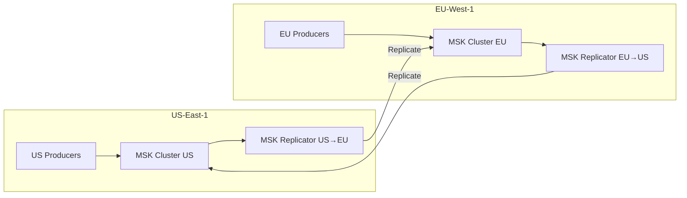

# Scenario Questions — AWS MSK

<article data-difficulty="junior">

## 🟢 Junior: MSK vs Kinesis Decision

**Scenario:** Your startup processes 5 MB/s of clickstream events. The team has no Kafka experience. You need: S3 delivery, Lambda processing, and minimal ops. A senior engineer suggests MSK because "Kafka is industry standard." Is MSK the right choice here?

<details>
<summary>✅ Solution</summary>

**Answer: NO — Kinesis is better for this scenario.**

| Factor | This Scenario | Best Choice |
|--------|--------------|:-----------:|
| Throughput | 5 MB/s (low) | Kinesis (per-shard pricing wins at low volume) |
| Team expertise | No Kafka experience | Kinesis (simpler, AWS-native) |
| S3 delivery | Required | Kinesis Firehose (zero-code, built-in) |
| Lambda processing | Required | Kinesis (native Lambda event source mapping) |
| Ops burden | Minimize | Kinesis (fully serverless, zero management) |

**Cost comparison at 5 MB/s:**
- Kinesis: 5 shards × $0.015/hr × 730 + ingestion = ~$180/month
- MSK: 3 × kafka.t3.small (minimum) + storage = ~$300/month
- **Kinesis is cheaper AND simpler at this scale**

**When to switch to MSK:** When throughput exceeds 50 MB/s, team learns Kafka, or you need Kafka Connect/Streams ecosystem for complex processing. Don't choose MSK just because "Kafka is industry standard" — choose based on actual requirements.

</details>

</article>

<article data-difficulty="mid-level">

## 🟡 Mid-Level: Size an MSK Cluster

**Scenario:** Design an MSK cluster for:
- Peak write throughput: 200 MB/s
- 5 consumer groups reading simultaneously
- 7-day retention
- 99.9% availability
- Budget: minimize cost

What instance type, broker count, partition count, and storage configuration do you recommend?

<details>
<summary>✅ Solution</summary>

**Step 1: Broker sizing**

```
Write throughput: 200 MB/s
Replication factor: 3 (required for 99.9% availability)
Total cluster throughput: 200 × 3 = 600 MB/s

Instance: kafka.m5.2xlarge (recommended throughput: 80 MB/s each)
Brokers needed: CEIL(600 / 80) = 8 brokers
With 30% headroom: 8 × 1.3 = 11 → round to 9 (multiple of 3 for AZ balance)

Final: 9 × kafka.m5.2xlarge across 3 AZs (3 per AZ)
```

**Step 2: Storage sizing**

```
Daily data: 200 MB/s × 86400 sec = 17.3 TB/day (before replication)
With RF=3: 17.3 × 3 = 51.8 TB/day (total across cluster)
7-day retention: 51.8 × 7 = 362.6 TB total

With tiered storage (1 day local, 6 days S3):
Local: 51.8 TB / 9 brokers = 5.8 TB per broker
S3: 362.6 - 51.8 = 310.8 TB in S3

Per-broker EBS: 6 TB (with headroom)
```

**Step 3: Partition count**

```
Target per-partition throughput: 5 MB/s write (conservative)
Partitions across all topics: 200 / 5 = 40 minimum
With 5 consumer groups: max parallelism = partition count
Actual: distribute across topics (main topic: 48 partitions, others: 12-24 each)
```

**Step 4: Consumer configuration**

```
5 consumer groups × dedicated 2 MB/s per partition = no contention
With 48 partitions on the main topic: each consumer group can scale to 48 consumers
Standard read throughput (2 MB/s per partition shared) is sufficient at 200 MB/s write
```

**Final architecture:**
```yaml
Cluster:
  Brokers: 9 × kafka.m5.2xlarge (3 per AZ)
  Storage: 6 TB EBS per broker + tiered storage enabled
  Local retention: 24 hours
  Total retention: 7 days (S3 tiered)
  
Topics:
  order-events: 48 partitions, RF=3
  user-events: 24 partitions, RF=3
  payment-events: 12 partitions, RF=3
  
Estimated cost:
  Brokers: 9 × $0.48/hr × 730 = $3,153/month
  EBS: 9 × 6 TB × $0.10/GB = $5,530/month
  S3 (tiered): 310 TB × $0.023/GB = $7,130/month
  Total: ~$15,813/month
  
Optimized with tiered storage vs all-local:
  All-local would need: 9 × 40 TB = $36,864 in EBS
  Savings from tiered storage: $24,000/month (62%!)
```

</details>

</article>

<article data-difficulty="senior">

## 🔴 Senior: Design Multi-Region Active-Active MSK

**Scenario:** Your global platform has users in US and EU. Both regions generate events that the other region needs for real-time analytics. Design a multi-region MSK architecture that:
- Supports writes in both regions
- Replicates events cross-region in < 500ms
- Handles region failover without data loss
- Avoids infinite replication loops

<details>
<summary>✅ Solution</summary>

**Architecture: Bidirectional Replication with Topic Naming Convention**



**Preventing infinite loops (critical!):**

```python
# Topic naming convention prevents replication loops:
# Local topics: orders.us, orders.eu (region-suffixed)
# Replicated topics: us.orders.us (prefix = source region)

# US Replicator config:
replicator_us_to_eu = {
    'topics_to_replicate': ['orders.us', 'events.us'],  # Only local US topics
    'topics_to_exclude': ['eu.*'],  # NEVER replicate EU topics back to EU!
    'source_cluster': 'msk-us-east-1',
    'target_cluster': 'msk-eu-west-1',
    'topic_name_prefix': 'us.',  # Replicated topic: us.orders.us in EU
}

# EU Replicator config (mirror):
replicator_eu_to_us = {
    'topics_to_replicate': ['orders.eu', 'events.eu'],
    'topics_to_exclude': ['us.*'],
    'source_cluster': 'msk-eu-west-1',
    'target_cluster': 'msk-us-east-1',
    'topic_name_prefix': 'eu.',
}

# Consumer in US reads: local 'orders.us' + replicated 'eu.orders.eu'
# Consumer in EU reads: local 'orders.eu' + replicated 'us.orders.us'
# NO loop: replicators only replicate LOCAL topics, never remote-prefixed ones
```

**Failover strategy:**

```python
# Normal operation:
# US producers → orders.us (local)
# EU producers → orders.eu (local)
# Both replicated cross-region in <500ms

# US region failure:
# 1. US producers fail over to EU region (DNS failover or client config)
# 2. They write to orders.eu (or a dedicated orders.us-failover topic in EU)
# 3. When US recovers: replicate missed data back, resume normal operation

# Data loss prevention:
# min.insync.replicas=2 within each region (survives 1 AZ failure)
# Cross-region replication is async (<500ms lag, not zero)
# Potential data loss window: up to 500ms of in-flight data during instant failure
# Mitigation: producers retry with acks=all + idempotence (at-least-once to both regions)
```

**Consumers in each region:**

```python
# US consumer reads unified global view:
consumer = KafkaConsumer(
    'orders.us',       # Local US orders
    'eu.orders.eu',    # Replicated EU orders (arrives <500ms after EU write)
    group_id='global-analytics-us',
    bootstrap_servers=us_cluster_brokers
)

# Global aggregation happens locally in each region:
# No cross-region read traffic for consumers (reads are always local)
```

**Monitoring for replication:**
- Track `ReplicatorLag` metric (should stay < 500ms)
- Alert if lag exceeds 5 seconds (network issue or broker overload)
- Track `ReplicatorBytesReplicated` for throughput validation

</details>

</article>

---

## ⚡ Quick-fire Q&A

**Q: What is Amazon MSK and how does it differ from Kinesis Data Streams?**
A: MSK (Managed Streaming for Apache Kafka) is a fully managed Kafka service running the open-source Kafka protocol. Kinesis is a proprietary AWS streaming service. MSK is ideal when you need Kafka API compatibility, existing Kafka tooling (Kafka Streams, ksqlDB, MirrorMaker), or very high throughput. Kinesis is simpler to operate but locked to AWS APIs.

**Q: What are the key components of an MSK cluster?**
A: An MSK cluster consists of: broker nodes (Kafka brokers running on EC2 across AZs), ZooKeeper nodes (for cluster coordination — being replaced by KRaft mode), topics (logical stream categories), partitions (the unit of parallelism within a topic), and a configuration for replication factor and retention settings.

**Q: How does MSK handle high availability?**
A: MSK deploys brokers across multiple Availability Zones (typically 3). With a replication factor of 3 and `min.insync.replicas=2`, the cluster tolerates one AZ failure without data loss. MSK automatically replaces failed brokers and rebalances partition leaders.

**Q: What is the difference between MSK Provisioned and MSK Serverless?**
A: MSK Provisioned requires you to select broker instance types and storage upfront, giving you control over performance and cost for predictable workloads. MSK Serverless automatically scales capacity based on demand with no cluster management — you pay per partition-hour and data throughput, ideal for variable or unknown workloads.

**Q: How do you secure an MSK cluster?**
A: MSK security layers include: encryption in transit (TLS between clients and brokers), encryption at rest (KMS), client authentication (TLS mutual auth with certificates, SASL/SCRAM with Secrets Manager, or IAM access control), and network isolation (VPC with private subnets and security groups).

**Q: What is MSK Connect?**
A: MSK Connect is a fully managed service for running Apache Kafka Connect connectors. It enables no-code data integration — ingesting data from databases (Debezium CDC), S3, and other sources into Kafka topics, or sinking Kafka topics to S3, Redshift, or OpenSearch, without managing Kafka Connect workers.

**Q: How do you monitor MSK cluster health?**
A: Monitor MSK using CloudWatch metrics: `UnderReplicatedPartitions` (replication lag, critical alert), `OfflinePartitionsCount` (unavailable partitions, critical), `BytesInPerSec/BytesOutPerSec` (throughput), `CpuUser` and `KafkaDataLogsDiskUsed` (resource utilization). Enable enhanced monitoring for broker and topic-level metrics.

**Q: How does consumer lag monitoring work in MSK?**
A: Consumer lag is the difference between the latest offset in a partition and the consumer group's committed offset. Monitor it via CloudWatch metric `MaxOffsetLag` or by using Kafka consumer group tools. High lag means consumers are falling behind producers — trigger scaling or alerting when lag exceeds thresholds.

---

## 💼 Interview Tips

- Lead with the Kafka vs. Kinesis decision framework: MSK when you need open-source Kafka compatibility, existing Kafka ecosystem tools, or very high throughput (millions of events/second); Kinesis when you want simpler AWS-native integration and don't need Kafka APIs.
- Senior interviewers expect deep knowledge of replication: explain `replication.factor`, `min.insync.replicas`, and `acks=all` together as the combination that guarantees durability — knowing all three demonstrates production experience.
- Mention MSK Connect and Debezium for CDC (Change Data Capture) patterns — this is a common data engineering use case that shows you know real-world Kafka applications beyond basic produce/consume.
- Avoid the mistake of treating MSK as a drop-in Kinesis replacement without discussing the operational differences: MSK requires VPC setup, security group configuration, and broker monitoring that Kinesis abstracts away.
- Demonstrate awareness of the small files problem on the Kafka → S3 sink: Kafka S3 Sink Connector creates many small files. Mention configuring `s3.part.size` and `rotate.interval.ms` to balance latency vs. file size.
- Know consumer group rebalancing as a production pain point: frequent rebalances cause lag spikes. Mention cooperative incremental rebalancing (KIP-429) as the modern solution that avoids stop-the-world rebalances.
