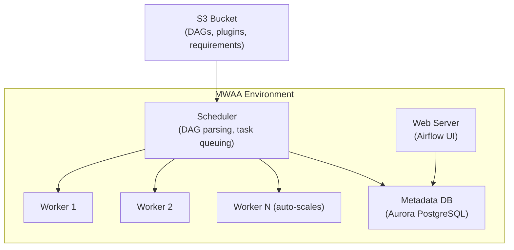

# AWS MWAA (Managed Workflows for Apache Airflow) — Fundamentals


## 🎯 Analogy

Think of MWAA (Managed Workflows for Apache Airflow) like AWS running your Airflow for you: the scheduler, webserver, and workers are managed — you just upload DAGs to S3 and they appear in the UI.

---
## What Is Amazon MWAA?

Amazon MWAA is a **fully managed Apache Airflow service** — it handles the Airflow infrastructure (web server, scheduler, workers, metadata database, task queue) while you focus on writing DAGs and managing your pipelines.

**The analogy:** Self-hosted Airflow is like owning a restaurant (manage the building, kitchen, staff, AND the menu). MWAA is like a managed kitchen space — AWS provides the building and equipment, you just create the menu (DAGs).

> **Why MWAA matters for DE:** Airflow is the most popular orchestration tool for data pipelines. MWAA removes the operational burden (patching, scaling, HA) while keeping full Airflow compatibility. It's the fastest path to production Airflow on AWS.

---

## MWAA Architecture



**What this shows:**
- DAGs are stored in S3 (not on the web server filesystem)
- Scheduler reads DAGs from S3 and queues tasks
- Workers auto-scale based on task queue depth
- Metadata DB (Aurora) managed by AWS (backups, HA)
- Web server provides the Airflow UI (accessed via IAM auth)

---

## How DAGs Are Deployed

```
Your S3 Bucket (s3://my-mwaa-bucket/):
├── dags/
│   ├── daily_etl.py              ← Your DAG files
│   ├── weekly_report.py
│   └── utils/
│       ├── __init__.py
│       └── helpers.py            ← Shared Python modules
├── plugins/
│   └── custom_operators.py       ← Custom Airflow plugins
└── requirements.txt              ← Python dependencies
```

**Deployment workflow:**
1. Write DAG locally
2. Upload to `s3://bucket/dags/`
3. MWAA scheduler detects new/changed files (within 30-60 seconds)
4. DAG appears in Airflow UI automatically

```bash
# Deploy a DAG
aws s3 cp daily_etl.py s3://my-mwaa-bucket/dags/daily_etl.py

# Deploy custom dependencies
aws s3 cp requirements.txt s3://my-mwaa-bucket/requirements.txt
# MWAA installs on next environment update (takes 10-20 minutes)
```

---

## Creating an MWAA Environment

```python
import boto3
mwaa = boto3.client('mwaa')

mwaa.create_environment(
    Name='data-platform-airflow',
    AirflowVersion='2.8.1',
    SourceBucketArn='arn:aws:s3:::my-mwaa-bucket',
    DagS3Path='dags/',
    PluginsS3Path='plugins/',
    RequirementsS3Path='requirements.txt',
    ExecutionRoleArn='arn:aws:iam::123:role/MWAARole',
    EnvironmentClass='mw1.medium',  # Scheduler + web server size
    MaxWorkers=10,
    MinWorkers=1,
    Schedulers=2,  # HA: 2 schedulers (Airflow 2.x)
    NetworkConfiguration={
        'SubnetIds': ['subnet-a', 'subnet-b'],
        'SecurityGroupIds': ['sg-mwaa']
    },
    WebserverAccessMode='PUBLIC_NETWORK',  # Or PRIVATE_ONLY for VPC-only access
    AirflowConfigurationOptions={
        'core.default_timezone': 'utc',
        'core.parallelism': '32',
        'core.max_active_runs_per_dag': '3',
        'celery.worker_autoscale': '10,1',
    }
)
```

---

## Environment Classes (Sizing)

| Class | Scheduler | Workers | Concurrent Tasks | Cost (approx) | Use Case |
|-------|:---------:|:-------:|:----------------:|:-------------:|----------|
| mw1.small | 1 vCPU | 1-5 | ~10 | $0.49/hr | Dev, small workloads |
| mw1.medium | 2 vCPU | 1-10 | ~20 | $0.95/hr | Medium production |
| mw1.large | 4 vCPU | 1-25 | ~50 | $1.89/hr | Large production |
| mw1.xlarge | 8 vCPU | 1-25 | ~100+ | $3.58/hr | Enterprise scale |
| mw1.2xlarge | 16 vCPU | 1-25 | ~200+ | $7.15/hr | Very large deployments |

**Workers auto-scale:** MWAA automatically adds workers when tasks queue up and removes them when idle (min to max range).

> **Cost note:** You pay for the environment 24/7 (scheduler + web server always running). Workers scale to zero when no tasks are running. A mw1.medium with no active tasks costs ~$690/month.

---

## MWAA vs Self-Hosted Airflow vs Step Functions

| Aspect | MWAA | Self-Hosted (EKS/EC2) | Step Functions |
|--------|------|----------------------|----------------|
| Management | Fully managed | You manage everything | Fully managed |
| Airflow compatible | 100% | 100% | Not Airflow |
| Worker scaling | Auto (min/max) | You configure (K8s HPA) | Infinite (serverless) |
| Startup time | 20-30 min (environment creation) | Minutes (if infra exists) | Instant |
| Cost (idle) | $500-700/month minimum | Varies (can be $0 with spot) | $0 (pay per execution) |
| Cost (active) | $700-3000/month typical | Similar (depends on infra) | Per-state-transition |
| DAG complexity | Unlimited (full Python) | Unlimited | Limited (JSON/YAML states) |
| Ecosystem | Full Airflow providers | Full | AWS SDK integrations only |
| Best for | Teams wanting managed Airflow | Full control, cost optimization | Simple AWS-service chains |

---

## Writing DAGs for MWAA

```python
# dags/daily_etl.py — standard Airflow DAG (same as self-hosted)
from airflow import DAG
from airflow.providers.amazon.aws.operators.glue import GlueJobOperator
from airflow.providers.amazon.aws.sensors.s3 import S3KeySensor
from airflow.providers.amazon.aws.operators.sns import SnsPublishOperator
from datetime import datetime, timedelta

default_args = {
    'owner': 'data-engineering',
    'retries': 2,
    'retry_delay': timedelta(minutes=5),
}

with DAG(
    dag_id='daily_orders_etl',
    default_args=default_args,
    schedule_interval='0 6 * * *',
    start_date=datetime(2024, 1, 1),
    catchup=False,
    tags=['production', 'orders'],
) as dag:

    wait_for_file = S3KeySensor(
        task_id='wait_for_source_data',
        bucket_name='source-data',
        bucket_key='exports/orders/{{ ds }}/data.parquet',
        timeout=3600,
        mode='reschedule',
    )

    run_glue = GlueJobOperator(
        task_id='transform_orders',
        job_name='orders-etl',
        script_args={'--process_date': '{{ ds }}'},
        num_of_dpus=10,
        wait_for_completion=True,
    )

    notify = SnsPublishOperator(
        task_id='notify_completion',
        topic_arn='arn:aws:sns:...:pipeline-notifications',
        message='Daily orders ETL completed for {{ ds }}',
    )

    wait_for_file >> run_glue >> notify
```

> **Key point:** DAGs for MWAA are identical to standard Airflow DAGs. No code changes needed when migrating from self-hosted Airflow.

---

## Managing Dependencies (requirements.txt)

```text
# requirements.txt — Python packages for your DAGs
apache-airflow-providers-amazon==8.0.0
pandas==2.1.0
pyarrow==14.0.0
boto3==1.28.0
requests==2.31.0
sqlalchemy==2.0.0

# Constraints (pin Airflow's internal deps to avoid conflicts)
--constraint "https://raw.githubusercontent.com/apache/airflow/constraints-2.8.1/constraints-3.11.txt"
```

> **Important:** Always pin versions and use Airflow constraints. MWAA installs these on environment update (takes 10-20 minutes). Test locally first with the same Python/Airflow version.

---

## Accessing the Airflow UI

```python
# Get UI login token (CLI)
import boto3, requests

mwaa = boto3.client('mwaa')
token_response = mwaa.create_web_login_token(Name='data-platform-airflow')
web_ui_url = f"https://{token_response['WebServerHostname']}/aws_mwaa/aws-console-sso?login=true#{token_response['WebToken']}"
# Open this URL in browser — authenticated via IAM
```

**Access modes:**
- `PUBLIC_NETWORK`: Airflow UI accessible from internet (IAM-authenticated)
- `PRIVATE_ONLY`: Only accessible from within the VPC (bastion host or VPN required)

---


## ▶️ Try It Yourself

```bash
# Create an MWAA environment (via AWS CLI)
aws mwaa create-environment \
  --name my-airflow \
  --airflow-version "2.7.2" \
  --source-bucket-arn arn:aws:s3:::my-airflow-bucket \
  --dag-s3-path dags/ \
  --execution-role-arn arn:aws:iam::123456789:role/AirflowRole \
  --network-configuration SubnetIds=subnet-aaa,subnet-bbb,SecurityGroupIds=sg-airflow \
  --environment-class mw1.small

# Upload a DAG to S3 — it auto-syncs to MWAA
aws s3 cp my_dag.py s3://my-airflow-bucket/dags/

# Trigger a DAG run via CLI
aws mwaa create-cli-token --name my-airflow  # Get a CLI token
# Then use the token to call the Airflow REST API
```

> **Run it:** Copy the snippet into a REPL or file and run it — no external services needed for the basic example.

---
## Interview Tips

> **Tip 1:** "What is MWAA?" — "A fully managed Apache Airflow service on AWS. You deploy DAGs to S3, MWAA handles the scheduler, web server, workers, metadata database, and auto-scaling. 100% Airflow-compatible — same DAGs work without modification. Best for teams that want Airflow without managing infrastructure."

> **Tip 2:** "MWAA vs Step Functions?" — "MWAA when: complex workflows with Python logic, many operators (Spark, dbt, SQL, custom), large team already knows Airflow, need visibility into task history. Step Functions when: simple AWS service chains, serverless (pay per execution), event-driven, short-running workflows. Many teams use both: Step Functions for real-time event processing, MWAA for batch orchestration."

> **Tip 3:** "How do you deploy DAGs to MWAA?" — "Upload Python files to the designated S3 bucket path (dags/ folder). MWAA scheduler picks them up within 30-60 seconds. For dependencies: update requirements.txt in S3 and trigger an environment update. For custom operators: add to the plugins/ folder. Version control via Git + CI/CD pipeline that syncs to S3 on merge."
