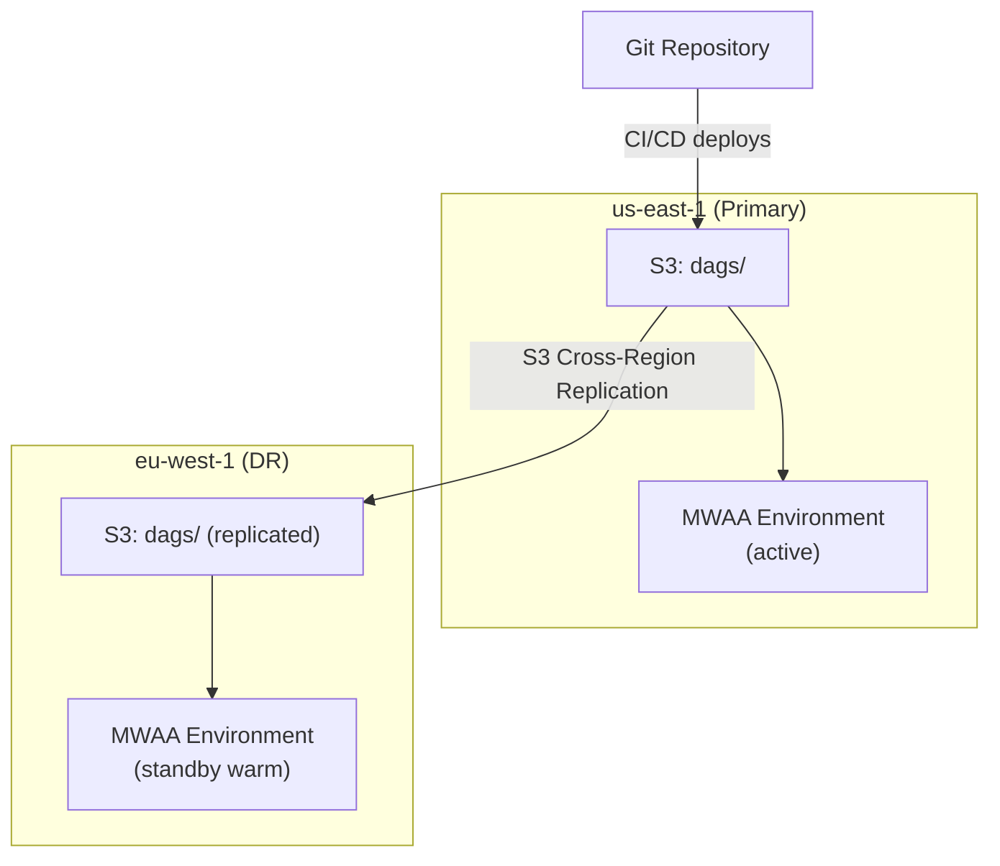

# Scenario Questions — AWS MWAA

<article data-difficulty="junior">

## 🟢 Junior: Deploy a DAG to MWAA

**Scenario:** You've written a new Airflow DAG locally. Explain the steps to deploy it to your MWAA production environment and verify it's working.

<details>
<summary>✅ Solution</summary>

**Step-by-step deployment:**

```bash
# 1. Test locally (verify no import errors)
python dags/new_pipeline.py
# If this prints nothing and exits clean: imports are fine

# 2. Run unit tests (if you have them)
pytest tests/test_new_pipeline.py

# 3. Upload to S3 (MWAA's DAG source)
aws s3 cp dags/new_pipeline.py s3://mwaa-prod-bucket/dags/new_pipeline.py

# 4. Wait for MWAA to detect the new file (~30-60 seconds)
# The scheduler scans the S3 dags/ folder every 30 seconds (configurable)

# 5. Verify in Airflow UI
# - Navigate to the MWAA web UI
# - Check "DAGs" page: new_pipeline should appear
# - Check for import errors: Admin → Import Errors (should be empty)

# 6. Enable the DAG (new DAGs are paused by default)
# Click the toggle in the UI, or via CLI:
aws mwaa create-cli-token --name prod-airflow
# Use the token to call: airflow dags unpause new_pipeline

# 7. Trigger a test run
# airflow dags trigger new_pipeline --conf '{"date": "2024-01-15"}'

# 8. Monitor execution in the UI: DAG runs → click on run → view task logs
```

**If the DAG doesn't appear:**
- Check for Python syntax errors (try importing locally)
- Verify the file is in the correct S3 path (dags/ folder)
- Check scheduler logs for parsing errors
- Verify the file has proper DAG definition (not just functions)

</details>

</article>

<article data-difficulty="mid-level">

## 🟡 Mid-Level: MWAA vs Step Functions for Your Pipeline

**Scenario:** You need to orchestrate: (1) Wait for a file in S3, (2) Trigger a Glue job, (3) If Glue succeeds → run a quality check Lambda, (4) If quality passes → trigger another Glue job, (5) If anything fails → send SNS alert. This runs daily at 6 AM. Should you use MWAA or Step Functions?

<details>
<summary>✅ Solution</summary>

**Analysis:**

| Factor | MWAA | Step Functions | This Scenario |
|--------|------|----------------|:---:|
| Schedule-triggered | ✅ Native cron | ✅ EventBridge | Tie |
| Wait for S3 file | ✅ S3KeySensor | ❌ Must poll via Lambda | MWAA |
| Trigger Glue + wait | ✅ GlueJobOperator | ✅ Glue SDK integration | Tie |
| Conditional logic | ✅ BranchOperator | ✅ Choice state | Tie |
| Error handling + alert | ✅ on_failure_callback | ✅ Catch → SNS | Tie |
| Cost (daily run) | ~$23/day (environment) | ~$0.01/day (per execution) | **Step Functions** |
| Already have MWAA? | Just add a DAG | Need separate setup | **MWAA** (if exists) |
| Team knows Airflow? | Easy to maintain | Learn ASL/JSON | **MWAA** |
| Observability | Full task history, logs | Execution history | Tie |

**Recommendation:**
- **If you already have MWAA for other pipelines:** Add this as another DAG. Marginal cost is ~$0 (already paying for the environment).
- **If this is your ONLY pipeline:** Step Functions is ~$0.01/day vs $700/month for MWAA. Step Functions wins on cost.
- **If the pipeline will grow in complexity:** Start with MWAA — easier to add new tasks, dependencies, and Python logic.

**MWAA implementation:**
```python
with DAG('daily_pipeline', schedule_interval='0 6 * * *', ...):
    wait = S3KeySensor(task_id='wait_file', bucket_key='data/{{ ds }}/_SUCCESS', timeout=7200, mode='reschedule')
    glue_1 = GlueJobOperator(task_id='transform', job_name='etl-job-1', wait_for_completion=True)
    quality = LambdaInvokeFunctionOperator(task_id='quality_check', function_name='quality-gate')
    glue_2 = GlueJobOperator(task_id='load', job_name='etl-job-2', wait_for_completion=True)
    # on_failure_callback handles SNS alerting
    wait >> glue_1 >> quality >> glue_2
```

</details>

</article>

<article data-difficulty="senior">

## 🔴 Senior: Design HA Cross-Region MWAA for a Global Platform

**Scenario:** Your company operates data pipelines in us-east-1 (primary) and eu-west-1 (DR). Design an MWAA architecture that:
- Orchestrates pipelines in both regions
- Fails over to EU within 30 minutes if US MWAA goes down
- Keeps DAG code synchronized across regions
- Handles region-specific connections (different Redshift clusters per region)

<details>
<summary>✅ Solution</summary>

**Architecture:**



This diagram shows an active/warm-standby DR topology: CI/CD deploys DAGs to the primary region's S3 bucket, cross-region replication keeps the DR bucket in sync, and each region's MWAA environment reads its local copy so EU can take over quickly if US fails.

**Implementation:**

```python
# 1. S3 Cross-Region Replication (automatic DAG sync)
s3.put_bucket_replication(
    Bucket='mwaa-us-bucket',
    ReplicationConfiguration={
        'Role': 'arn:aws:iam::123:role/S3ReplicationRole',
        'Rules': [{
            'Status': 'Enabled',
            'Destination': {
                'Bucket': 'arn:aws:s3:::mwaa-eu-bucket',
                'ReplicationTime': {'Status': 'Enabled', 'Time': {'Minutes': 15}}
            },
            'Filter': {'Prefix': ''}  # Replicate everything
        }]
    }
)

# 2. Region-specific connections via Secrets Manager
# US: airflow/connections/redshift_default → US Redshift endpoint
# EU: airflow/connections/redshift_default → EU Redshift endpoint
# Same connection NAME, different Secrets Manager in each region

# 3. DAGs use connection NAMES (not hardcoded endpoints)
# This DAG works in BOTH regions without code changes:
with DAG('daily_etl', ...):
    load = S3ToRedshiftOperator(
        task_id='load',
        redshift_conn_id='redshift_default',  # Resolves to region-specific endpoint
        ...
    )

# 4. EU environment in "warm standby" mode
# - Environment exists and is healthy
# - DAGs are present (via S3 replication)
# - DAGs are PAUSED in EU (not running — US is primary)
# - On failover: unpause DAGs in EU, pause in US

# 5. Failover procedure (automated via Lambda + CloudWatch):
def failover_to_eu():
    """Triggered by US MWAA health alarm."""
    # Unpause all production DAGs in EU
    eu_token = mwaa_eu.create_cli_token(Name='eu-airflow')
    requests.post(eu_url, headers={'Authorization': f'Bearer {eu_token}'},
                  data='dags unpause --yes')
    
    # Pause DAGs in US (if reachable)
    try:
        us_token = mwaa_us.create_cli_token(Name='us-airflow')
        requests.post(us_url, headers={'Authorization': f'Bearer {us_token}'},
                      data='dags pause --yes')
    except Exception:
        pass  # US may be unreachable (that's why we're failing over)
    
    # Update Route 53 DNS to point to EU web UI
    route53.change_resource_record_sets(...)
    
    # Alert team
    sns.publish(TopicArn=ALERT_TOPIC, Subject='MWAA Failover to EU activated')
```

**Key design decisions:**
- **S3 replication** syncs DAGs automatically (RPO ~15 min)
- **Same connection names** in both regions → DAGs work without code changes
- **Warm standby** (environment running but DAGs paused) → RTO ~5 min (just unpause)
- **Automated failover** via CloudWatch alarm → Lambda → reduces RTO further
- **DAG run history is NOT replicated** (accepted data loss — can re-trigger)

**Cost:**
- US (primary): mw1.medium = $690/month
- EU (standby, minimal workers): mw1.small = $360/month
- S3 replication: negligible
- Total HA cost: $1,050/month (50% premium over single-region)

</details>

</article>
