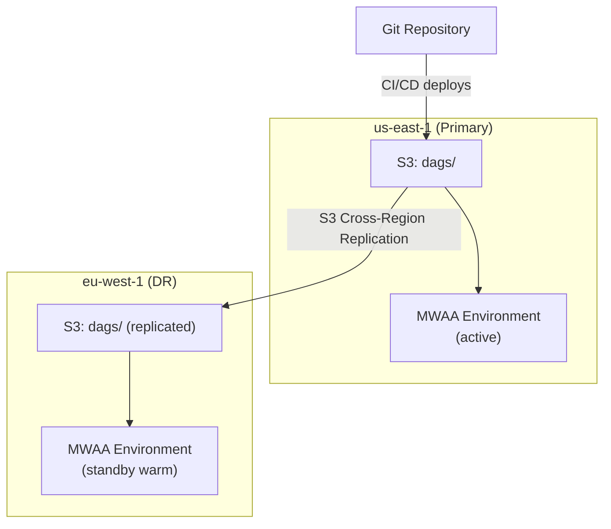

# Scenario Questions — AWS MWAA

<article data-difficulty="junior">

## 🟢 Junior: Deploy a DAG to MWAA

**Scenario:** You've written a new Airflow DAG locally. Explain the steps to deploy it to your MWAA production environment and verify it's working.

<details>
<summary>✅ Solution</summary>

**Step-by-step deployment:**

```bash
# 1. Test locally (verify no import errors)
python dags/new_pipeline.py
# If this prints nothing and exits clean: imports are fine

# 2. Run unit tests (if you have them)
pytest tests/test_new_pipeline.py

# 3. Upload to S3 (MWAA's DAG source)
aws s3 cp dags/new_pipeline.py s3://mwaa-prod-bucket/dags/new_pipeline.py

# 4. Wait for MWAA to detect the new file (~30-60 seconds)
# The scheduler scans the S3 dags/ folder every 30 seconds (configurable)

# 5. Verify in Airflow UI
# - Navigate to the MWAA web UI
# - Check "DAGs" page: new_pipeline should appear
# - Check for import errors: Admin → Import Errors (should be empty)

# 6. Enable the DAG (new DAGs are paused by default)
# Click the toggle in the UI, or via CLI:
aws mwaa create-cli-token --name prod-airflow
# Use the token to call: airflow dags unpause new_pipeline

# 7. Trigger a test run
# airflow dags trigger new_pipeline --conf '{"date": "2024-01-15"}'

# 8. Monitor execution in the UI: DAG runs → click on run → view task logs
```

**If the DAG doesn't appear:**
- Check for Python syntax errors (try importing locally)
- Verify the file is in the correct S3 path (dags/ folder)
- Check scheduler logs for parsing errors
- Verify the file has proper DAG definition (not just functions)

</details>

</article>

<article data-difficulty="mid-level">

## 🟡 Mid-Level: MWAA vs Step Functions for Your Pipeline

**Scenario:** You need to orchestrate: (1) Wait for a file in S3, (2) Trigger a Glue job, (3) If Glue succeeds → run a quality check Lambda, (4) If quality passes → trigger another Glue job, (5) If anything fails → send SNS alert. This runs daily at 6 AM. Should you use MWAA or Step Functions?

<details>
<summary>✅ Solution</summary>

**Analysis:**

| Factor | MWAA | Step Functions | This Scenario |
|--------|------|----------------|:---:|
| Schedule-triggered | ✅ Native cron | ✅ EventBridge | Tie |
| Wait for S3 file | ✅ S3KeySensor | ❌ Must poll via Lambda | MWAA |
| Trigger Glue + wait | ✅ GlueJobOperator | ✅ Glue SDK integration | Tie |
| Conditional logic | ✅ BranchOperator | ✅ Choice state | Tie |
| Error handling + alert | ✅ on_failure_callback | ✅ Catch → SNS | Tie |
| Cost (daily run) | ~$23/day (environment) | ~$0.01/day (per execution) | **Step Functions** |
| Already have MWAA? | Just add a DAG | Need separate setup | **MWAA** (if exists) |
| Team knows Airflow? | Easy to maintain | Learn ASL/JSON | **MWAA** |
| Observability | Full task history, logs | Execution history | Tie |

**Recommendation:**
- **If you already have MWAA for other pipelines:** Add this as another DAG. Marginal cost is ~$0 (already paying for the environment).
- **If this is your ONLY pipeline:** Step Functions is ~$0.01/day vs $700/month for MWAA. Step Functions wins on cost.
- **If the pipeline will grow in complexity:** Start with MWAA — easier to add new tasks, dependencies, and Python logic.

**MWAA implementation:**
```python
with DAG('daily_pipeline', schedule_interval='0 6 * * *', ...):
    wait = S3KeySensor(task_id='wait_file', bucket_key='data/{{ ds }}/_SUCCESS', timeout=7200, mode='reschedule')
    glue_1 = GlueJobOperator(task_id='transform', job_name='etl-job-1', wait_for_completion=True)
    quality = LambdaInvokeFunctionOperator(task_id='quality_check', function_name='quality-gate')
    glue_2 = GlueJobOperator(task_id='load', job_name='etl-job-2', wait_for_completion=True)
    # on_failure_callback handles SNS alerting
    wait >> glue_1 >> quality >> glue_2
```

</details>

</article>

<article data-difficulty="senior">

## 🔴 Senior: Design HA Cross-Region MWAA for a Global Platform

**Scenario:** Your company operates data pipelines in us-east-1 (primary) and eu-west-1 (DR). Design an MWAA architecture that:
- Orchestrates pipelines in both regions
- Fails over to EU within 30 minutes if US MWAA goes down
- Keeps DAG code synchronized across regions
- Handles region-specific connections (different Redshift clusters per region)

<details>
<summary>✅ Solution</summary>

**Architecture:**



This diagram shows an active/warm-standby DR topology: CI/CD deploys DAGs to the primary region's S3 bucket, cross-region replication keeps the DR bucket in sync, and each region's MWAA environment reads its local copy so EU can take over quickly if US fails.

**Implementation:**

```python
# 1. S3 Cross-Region Replication (automatic DAG sync)
s3.put_bucket_replication(
    Bucket='mwaa-us-bucket',
    ReplicationConfiguration={
        'Role': 'arn:aws:iam::123:role/S3ReplicationRole',
        'Rules': [{
            'Status': 'Enabled',
            'Destination': {
                'Bucket': 'arn:aws:s3:::mwaa-eu-bucket',
                'ReplicationTime': {'Status': 'Enabled', 'Time': {'Minutes': 15}}
            },
            'Filter': {'Prefix': ''}  # Replicate everything
        }]
    }
)

# 2. Region-specific connections via Secrets Manager
# US: airflow/connections/redshift_default → US Redshift endpoint
# EU: airflow/connections/redshift_default → EU Redshift endpoint
# Same connection NAME, different Secrets Manager in each region

# 3. DAGs use connection NAMES (not hardcoded endpoints)
# This DAG works in BOTH regions without code changes:
with DAG('daily_etl', ...):
    load = S3ToRedshiftOperator(
        task_id='load',
        redshift_conn_id='redshift_default',  # Resolves to region-specific endpoint
        ...
    )

# 4. EU environment in "warm standby" mode
# - Environment exists and is healthy
# - DAGs are present (via S3 replication)
# - DAGs are PAUSED in EU (not running — US is primary)
# - On failover: unpause DAGs in EU, pause in US

# 5. Failover procedure (automated via Lambda + CloudWatch):
def failover_to_eu():
    """Triggered by US MWAA health alarm."""
    # Unpause all production DAGs in EU
    eu_token = mwaa_eu.create_cli_token(Name='eu-airflow')
    requests.post(eu_url, headers={'Authorization': f'Bearer {eu_token}'},
                  data='dags unpause --yes')
    
    # Pause DAGs in US (if reachable)
    try:
        us_token = mwaa_us.create_cli_token(Name='us-airflow')
        requests.post(us_url, headers={'Authorization': f'Bearer {us_token}'},
                      data='dags pause --yes')
    except Exception:
        pass  # US may be unreachable (that's why we're failing over)
    
    # Update Route 53 DNS to point to EU web UI
    route53.change_resource_record_sets(...)
    
    # Alert team
    sns.publish(TopicArn=ALERT_TOPIC, Subject='MWAA Failover to EU activated')
```

**Key design decisions:**
- **S3 replication** syncs DAGs automatically (RPO ~15 min)
- **Same connection names** in both regions → DAGs work without code changes
- **Warm standby** (environment running but DAGs paused) → RTO ~5 min (just unpause)
- **Automated failover** via CloudWatch alarm → Lambda → reduces RTO further
- **DAG run history is NOT replicated** (accepted data loss — can re-trigger)

**Cost:**
- US (primary): mw1.medium = $690/month
- EU (standby, minimal workers): mw1.small = $360/month
- S3 replication: negligible
- Total HA cost: $1,050/month (50% premium over single-region)

</details>

</article>

---

## ⚡ Quick-fire Q&A

**Q: What is Amazon MWAA and what does it manage?**
A: MWAA (Managed Workflows for Apache Airflow) is a fully managed service that handles the deployment, scaling, and maintenance of Apache Airflow environments on AWS. It manages the Airflow scheduler, web server, workers, and metadata database — you only write DAGs and manage plugins and requirements.

**Q: How do you deploy DAGs to an MWAA environment?**
A: DAGs are deployed by uploading Python files to the MWAA-designated S3 bucket (the `dags/` folder). MWAA automatically syncs DAGs from S3 to the Airflow environment within about a minute. Plugins and Python requirements are similarly managed via S3 with a version update triggering environment refresh.

**Q: What is the difference between MWAA environment classes?**
A: MWAA environment classes (mw1.small, mw1.medium, mw1.large, mw1.xlarge, mw1.2xlarge) determine the compute resources for the Airflow scheduler and web server. Worker capacity scales separately via the `min_workers` and `max_workers` settings — the environment class affects the control plane, not worker auto-scaling.

**Q: How does MWAA handle worker auto-scaling?**
A: MWAA workers run on AWS Fargate and scale automatically between `min_workers` and `max_workers` based on queued task count. Each worker is a Fargate container running the Airflow Celery worker. Scaling is reactive — it responds to queue depth changes.

**Q: How do you manage Python dependencies in MWAA?**
A: Add dependencies to a `requirements.txt` file stored in the MWAA S3 bucket. Updating the file version in the MWAA environment configuration triggers a rolling update of the environment. For custom packages or binary dependencies, use custom plugins packaged as a ZIP file.

**Q: What IAM permissions does MWAA require?**
A: MWAA needs an execution role that grants access to the DAG S3 bucket, CloudWatch Logs for Airflow log groups, KMS for encryption, Secrets Manager for Airflow connections and variables, and the Airflow API. Task-level AWS access uses the same execution role or task-specific IAM roles passed via operators.

**Q: How do you use Secrets Manager with MWAA for Airflow connections?**
A: Configure MWAA to use Secrets Manager as the Airflow secrets backend. Store Airflow connections as secrets with the naming convention `airflow/connections/<connection_id>`. MWAA automatically retrieves and injects these connections at runtime, keeping credentials out of the metadata database and DAG code.

**Q: What are the key differences between self-hosted Airflow and MWAA?**
A: MWAA removes the burden of managing Airflow infrastructure (scheduler HA, worker scaling, metadata DB, upgrades) but constrains you to MWAA-supported Airflow versions and the Celery executor. Self-hosted Airflow on EKS (with KubernetesExecutor) offers more flexibility, custom resource allocation per task, and faster version upgrades.

---

## 💼 Interview Tips

- Frame MWAA's value as eliminating Airflow infrastructure management, not just "hosted Airflow" — mention scheduler HA, automatic worker scaling, managed upgrades, and integrated CloudWatch logging as the specific operational burdens it removes.
- Senior interviewers probe the MWAA vs. self-hosted trade-off: MWAA is faster to get started and operationally simpler; self-hosted on EKS with KubernetesExecutor enables pod-per-task isolation, custom resource requests, and faster adoption of new Airflow versions.
- Mention the S3 sync delay for DAG deployment as a key operational consideration — MWAA is not instant; allow up to 1-2 minutes for DAGs to appear after S3 upload, and use versioning + CI/CD pipelines for controlled deployments.
- Demonstrate security depth: describe using Secrets Manager for connections, VPC private endpoints for MWAA, and task-level IAM roles (via `aws_conn_id` and role assumption) to limit blast radius of compromised credentials.
- Know the worker memory limit: MWAA workers have fixed memory per Fargate task. For memory-intensive tasks, offload heavy compute to Glue, EMR, or Batch via operators — Airflow is an orchestrator, not an execution engine.
- Avoid treating MWAA as a solution for sub-minute scheduling: Airflow's scheduler operates at minute-level granularity. For event-driven, sub-minute triggers, EventBridge or Lambda is more appropriate.
