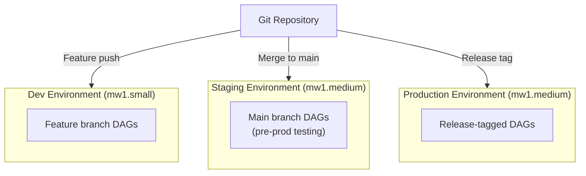

# AWS MWAA — Senior-Level Deep Dive

## Cost Optimization

### Environment Scheduling (Non-Production)

MWAA environments can't be stopped — but you can delete and recreate:

```python
# For dev/staging: delete environment after business hours, recreate in morning
# Saves ~65% cost (only pay for 8 hours instead of 24)

# Nightly teardown (Lambda + EventBridge schedule):
def teardown_dev_environment(event, context):
    mwaa.delete_environment(Name='dev-airflow')

# Morning recreation (Lambda + EventBridge):
def create_dev_environment(event, context):
    mwaa.create_environment(Name='dev-airflow', ...)
    # DAGs are in S3 — they auto-deploy when environment starts
```

> **Limitation:** Environment creation takes 20-30 minutes. Only suitable for non-production where this delay is acceptable.

### Right-Sizing

```
Diagnosis: check if you're over-provisioned
- CloudWatch: RunningTasks metric → if rarely exceeds 10, you don't need mw1.large
- Worker utilization: if MaxWorkers=25 but peak is always 3 → reduce MaxWorkers
- Scheduler CPU: if mw1.large scheduler is at 10% CPU → downsize to mw1.medium

Cost impact:
- mw1.small: $360/month (fixed) + workers
- mw1.medium: $690/month (fixed) + workers  
- mw1.large: $1,380/month (fixed) + workers

Most teams start with mw1.medium and only upgrade when scheduler becomes bottleneck
```

---

## Multi-Environment Strategy (Dev/Staging/Prod)



This diagram shows how a single Git repository promotes DAGs through three isolated MWAA environments: feature branches deploy to Dev, the main branch to Staging, and release tags to Production.

**CI/CD Pipeline (GitHub Actions):**

```yaml
# .github/workflows/deploy-dags.yml
name: Deploy DAGs to MWAA
on:
  push:
    branches: [main]
    paths: ['dags/**', 'plugins/**', 'requirements.txt']

jobs:
  test:
    runs-on: ubuntu-latest
    steps:
      - uses: actions/checkout@v4
      - name: Install dependencies
        run: pip install apache-airflow==2.8.1 pytest
      - name: Test DAG imports
        run: python -c "from dags import *"  # Verify no import errors
      - name: Run unit tests
        run: pytest tests/

  deploy-staging:
    needs: test
    runs-on: ubuntu-latest
    steps:
      - uses: actions/checkout@v4
      - name: Sync DAGs to staging S3
        run: aws s3 sync dags/ s3://mwaa-staging-bucket/dags/ --delete
      - name: Sync plugins
        run: aws s3 sync plugins/ s3://mwaa-staging-bucket/plugins/ --delete
      - name: Wait for MWAA to pick up changes
        run: sleep 90
      - name: Trigger smoke test DAG
        run: |
          TOKEN=$(aws mwaa create-cli-token --name staging-airflow --query CliToken --output text)
          curl -X POST "https://staging-airflow.xxx/aws_mwaa/cli" \
            -H "Authorization: Bearer $TOKEN" \
            -H "Content-Type: text/plain" \
            -d "dags trigger smoke_test_dag"

  deploy-prod:
    needs: deploy-staging
    runs-on: ubuntu-latest
    if: github.ref == 'refs/heads/main'
    environment: production  # Requires manual approval
    steps:
      - uses: actions/checkout@v4
      - name: Sync DAGs to production S3
        run: aws s3 sync dags/ s3://mwaa-prod-bucket/dags/ --delete
```

---

## Scaling Limits and Workarounds

| Limit | Value | Workaround |
|-------|-------|-----------|
| Max DAGs per environment | ~1000 (practical, not hard limit) | Split into multiple environments by domain |
| Max workers | 25 | Use larger worker_autoscale values per worker |
| Max concurrent tasks | Workers × autoscale = ~400 | Multiple environments or KubernetesExecutor (EKS) |
| DAG file parsing timeout | 150 seconds | Keep DAGs lightweight (defer imports) |
| requirements.txt install timeout | 10 minutes | Use pre-built Docker layers (custom plugin) |
| Environment update time | 20-30 minutes | Test requirements locally first |

### When MWAA Isn't Enough

```
If you need:
├── >400 concurrent tasks → Self-host with KubernetesExecutor on EKS
├── >1000 DAGs → Split into domain-specific MWAA environments  
├── Sub-minute DAG scheduling → Step Functions or EventBridge Scheduler
├── Custom executor → Self-host (MWAA only supports CeleryExecutor)
└── Cost optimization beyond MWAA → Self-host on EKS (scale workers to zero)
```

---

## MWAA + Step Functions Hybrid

Use MWAA for complex orchestration, Step Functions for real-time event processing:

```python
# MWAA DAG that triggers Step Functions for a sub-workflow
from airflow.providers.amazon.aws.operators.step_function import StepFunctionStartExecutionOperator

with DAG('hybrid_orchestration', ...):
    # MWAA handles: scheduling, retries, dependencies, monitoring
    extract = GlueJobOperator(task_id='extract', ...)
    
    # Step Functions handles: parallel fan-out with fine-grained error handling
    process_files = StepFunctionStartExecutionOperator(
        task_id='parallel_processing',
        state_machine_arn='arn:aws:states:...:stateMachine:process-files',
        input='{"files": {{ ti.xcom_pull(task_ids="extract") }} }',
        wait_for_completion=True,
    )
    
    load = GlueJobOperator(task_id='load', ...)
    
    extract >> process_files >> load
```

**When to use which:**
- **MWAA:** Complex DAGs, many dependencies, scheduling, retries, monitoring, Python logic
- **Step Functions:** Parallel fan-out (Map state), event-driven triggers, sub-minute execution, simple AWS service chains
- **Hybrid:** MWAA orchestrates the overall pipeline, delegates parallel/event-driven steps to Step Functions

---

## Cross-Account MWAA Patterns

```python
# Scenario: Central MWAA orchestrates pipelines across 5 AWS accounts

# Pattern: DAGs assume cross-account roles
from airflow.providers.amazon.aws.hooks.base_aws import AwsBaseHook

def get_cross_account_session(account_id, role_name):
    """Assume a role in another AWS account."""
    hook = AwsBaseHook(aws_conn_id='aws_default')
    credentials = hook.get_session().client('sts').assume_role(
        RoleArn=f'arn:aws:iam::{account_id}:role/{role_name}',
        RoleSessionName='mwaa-cross-account'
    )['Credentials']
    return boto3.Session(
        aws_access_key_id=credentials['AccessKeyId'],
        aws_secret_access_key=credentials['SecretAccessKey'],
        aws_session_token=credentials['SessionToken']
    )

# In DAG task:
def extract_from_account_b(**context):
    session = get_cross_account_session('222222222222', 'MWAA-Access-Role')
    s3 = session.client('s3')
    # Read from Account B's S3 bucket
    data = s3.get_object(Bucket='account-b-data', Key='exports/orders.parquet')
    # Process and write to central data lake
```

---

## Disaster Recovery

```
MWAA DR Strategy:
├── DAGs stored in S3 (replicate S3 bucket cross-region)
├── Connections/Variables in Secrets Manager (replicate cross-region)
├── Metadata DB: managed by AWS (Aurora backups)
│   └── NOTE: DAG run history is NOT replicated — accept loss on failover
├── Recovery: create new MWAA environment in DR region pointing to replicated S3
│   └── Time: 20-30 minutes (environment creation)
└── RPO: ~0 (S3 replication is near-real-time)
    RTO: 30 minutes (new environment creation)
```

---

## Interview Tips

> **Tip 1:** "How do you do CI/CD for MWAA DAGs?" — "Git repository with dags/ folder. On merge to main: GitHub Actions runs DAG import tests (catch syntax errors), then syncs files to S3 with `aws s3 sync`. MWAA picks up changes within 60 seconds. For staging: separate S3 bucket + MWAA environment. For production: manual approval gate in the pipeline before S3 sync."

> **Tip 2:** "MWAA vs self-hosted Airflow on EKS?" — "MWAA: zero ops, 20-min setup, auto-scaling workers, AWS-managed HA. But: minimum $500/month, CeleryExecutor only, 25 max workers. Self-hosted EKS: full control, KubernetesExecutor (pods scale to zero), custom images, potentially cheaper at scale. But: you manage the infra (upgrades, HA, monitoring). Choose MWAA unless you have specific requirements it can't meet or strong K8s expertise."

> **Tip 3:** "How do you handle MWAA failures?" — "Environment-level: MWAA handles scheduler/web server HA automatically (2 schedulers in 2.x). Task-level: use Airflow retries + on_failure_callback for alerting. DAG deployment failures: CI/CD tests catch syntax errors before S3 sync. Dependency install failures: test requirements.txt locally with matching Python version before updating environment."
