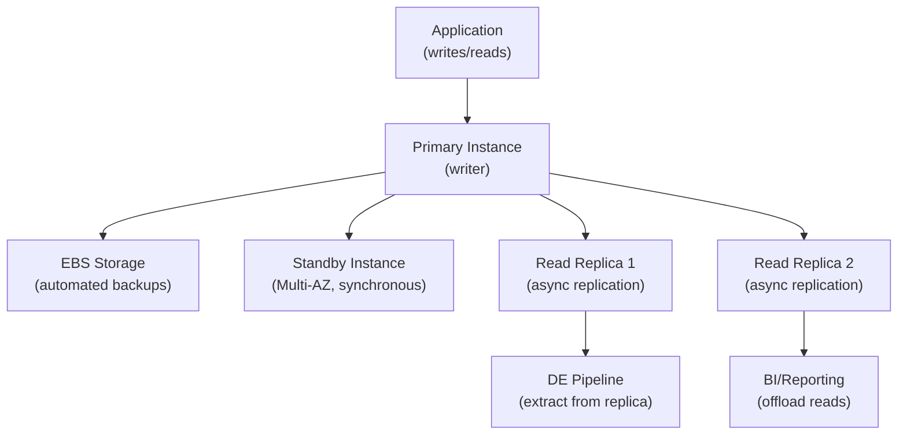

# AWS RDS — Fundamentals

## What Is Amazon RDS?

Amazon RDS (Relational Database Service) is a **managed relational database service** that handles provisioning, patching, backups, failover, and scaling for popular database engines (PostgreSQL, MySQL, MariaDB, Oracle, SQL Server, and Aurora). You focus on your data and queries; AWS manages the infrastructure.

**The analogy:** If running a database on EC2 is like owning a house (you handle plumbing, electrical, roof repairs), RDS is like renting a managed apartment — the building management handles maintenance, security, and repairs while you just live there and use the space.

> **Why RDS matters for DE:** RDS instances are the most common source systems for data pipelines. Data engineers extract data from RDS via full loads, incremental queries, or Change Data Capture (CDC). Understanding RDS features (read replicas, snapshots, Multi-AZ) helps you extract data without impacting production.

---

## How RDS Works



**What this shows:**
- Primary instance handles writes
- Multi-AZ standby provides high availability (automatic failover)
- Read replicas offload read traffic (async replication, slight lag)
- Data engineers should extract from READ REPLICAS to avoid impacting production

---

## Core Concepts

| Concept | Description | DE Relevance |
|---------|-------------|--------------|
| **DB Instance** | Single database server (compute + storage) | Source system to extract from |
| **Multi-AZ** | Synchronous standby in another AZ | High availability, not for read offloading |
| **Read Replica** | Async copy for read traffic | **Extract data without impacting prod** |
| **Automated Backups** | Daily snapshots + transaction logs (up to 35 days) | Point-in-time recovery |
| **Manual Snapshots** | User-triggered, persist indefinitely | Clone DB for testing pipelines |
| **Parameter Group** | Database engine configuration | Tune for CDC (e.g., enable logical replication) |
| **Security Group** | Network firewall (inbound/outbound rules) | Allow Glue/EMR to connect |
| **IAM Authentication** | Token-based DB access (no passwords) | Secure pipeline connections |
| **Enhanced Monitoring** | OS-level metrics (CPU, RAM, I/O) | Detect resource pressure during extraction |

---

## Supported Engines

| Engine | Version Example | DE Notes |
|--------|----------------|----------|
| **PostgreSQL** | 15.x | Best CDC support (logical replication), most popular for DE |
| **MySQL** | 8.x | Good CDC (binlog), widely used |
| **Aurora PostgreSQL** | Compatible with PG 15 | 5x faster, auto-scaling replicas, best for high-volume |
| **Aurora MySQL** | Compatible with MySQL 8 | 5x faster, auto-scaling storage |
| **MariaDB** | 10.x | MySQL fork, binlog CDC |
| **Oracle** | 19c | Enterprise, LogMiner for CDC |
| **SQL Server** | 2022 | Enterprise, CDC built-in |

> **DE preference:** PostgreSQL or Aurora PostgreSQL for new projects. Best CDC support, open-source, excellent with tools like Debezium and DMS.

---

## Data Extraction Patterns for DE

### Pattern 1: Full Load (Simple but Expensive)

```python
import psycopg2
import pandas as pd

# Connect to READ REPLICA (never prod primary!)
conn = psycopg2.connect(
    host='mydb-replica.abc123.us-east-1.rds.amazonaws.com',
    port=5432,
    database='orders_db',
    user='de_pipeline_user',
    password='...'  # Better: use IAM auth or Secrets Manager
)

# Full table extract
df = pd.read_sql('SELECT * FROM orders', conn)
df.to_parquet('s3://data-lake/raw/orders/full_load.parquet')
```

### Pattern 2: Incremental Load (Better)

```python
# Only extract new/modified records since last run
last_watermark = get_last_watermark()  # e.g., '2024-01-14 23:59:59'

query = """
SELECT * FROM orders 
WHERE updated_at > %s
ORDER BY updated_at
"""

df = pd.read_sql(query, conn, params=[last_watermark])
df.to_parquet(f's3://data-lake/raw/orders/incremental/{today}.parquet')

# Update watermark
save_watermark(df['updated_at'].max())
```

### Pattern 3: Change Data Capture (Best)

```bash
# AWS DMS task for continuous CDC from RDS PostgreSQL
# Captures INSERT, UPDATE, DELETE in real-time

aws dms create-replication-task \
  --replication-task-identifier "orders-cdc" \
  --source-endpoint-arn "arn:aws:dms:...:endpoint:rds-source" \
  --target-endpoint-arn "arn:aws:dms:...:endpoint:s3-target" \
  --replication-task-settings '{"TargetMetadata": {"ParallelLoadThreads": 4}}' \
  --table-mappings '{"rules": [{"rule-type": "selection", "rule-action": "include", "object-locator": {"schema-name": "public", "table-name": "orders"}}]}' \
  --migration-type "cdc"
```

---

## Read Replicas — The DE Best Practice

```
Production traffic → Primary Instance (writer)
DE extraction      → Read Replica (no impact on prod!)

Key facts:
- Async replication (typically < 1 second lag)
- Can be in a different region (cross-region replica)
- Up to 5 replicas for RDS, 15 for Aurora
- Can be promoted to standalone (for migration)
```

**Why this matters:** Running heavy SELECT queries (full table scans for extraction) on the primary instance can cause lock contention, increased I/O, and degraded application performance. Always extract from a replica.

---

## RDS for CDC: Enabling Logical Replication (PostgreSQL)

```sql
-- Step 1: Set parameter group (requires reboot)
-- rds.logical_replication = 1
-- wal_level = logical

-- Step 2: Create a replication slot
SELECT pg_create_logical_replication_slot('debezium_slot', 'pgoutput');

-- Step 3: Create publication for specific tables
CREATE PUBLICATION cdc_publication FOR TABLE orders, customers, products;

-- Step 4: Debezium or DMS connects to this slot and streams changes
```

> **CDC advantage:** Instead of "what does the table look like now?" (full/incremental), CDC answers "what changed since last time?" — capturing inserts, updates, AND deletes in real-time. Essential for keeping a data lake in sync with source systems.

---

## Multi-AZ vs Read Replicas

| Feature | Multi-AZ | Read Replica |
|---------|----------|--------------|
| **Purpose** | High availability (failover) | Read scaling / offload |
| **Replication** | Synchronous | Asynchronous |
| **Accessible?** | No (standby, not queryable) | Yes (full read access) |
| **Failover** | Automatic (30-60 sec) | Manual promotion |
| **Cross-region** | No (same region, different AZ) | Yes |
| **DE use** | N/A (can't read from it) | **Extract data here** |

---

## Key DE Use Cases

1. **Source System Extraction** — Most common DE task: pull data from RDS into data lake (S3)
2. **CDC Pipelines** — Stream changes via DMS or Debezium to keep lake/warehouse in sync
3. **Read Replica Offloading** — Run heavy analytical queries without impacting production
4. **Snapshot Cloning** — Create test environments with real data for pipeline development
5. **Cross-Region Replication** — Replicate data closer to analytics infrastructure

---

## RDS vs Alternatives

| Aspect | RDS | Aurora | Redshift | DynamoDB |
|--------|-----|--------|----------|----------|
| **Type** | Managed relational | High-performance relational | Data warehouse (columnar) | NoSQL (key-value) |
| **Use case** | OLTP (transactions) | OLTP (high throughput) | OLAP (analytics) | Low-latency lookups |
| **Scale** | Vertical (instance size) | Auto-scaling storage + replicas | Cluster (RA3 nodes) | Virtually unlimited |
| **SQL** | Full SQL | Full SQL | Full SQL (analytics-optimized) | Limited (PartiQL) |
| **DE role** | Source system | Source system | Target warehouse | Metadata / state store |
| **Cost** | Per instance-hour | Per instance-hour (higher) | Per node-hour | Per request or provisioned |

---

## Connecting Securely from Pipelines

```python
import boto3

# Best practice: Use IAM database authentication (no passwords!)
rds_client = boto3.client('rds')

token = rds_client.generate_db_auth_token(
    DBHostname='mydb-replica.abc123.us-east-1.rds.amazonaws.com',
    Port=5432,
    DBUsername='de_pipeline_user',
    Region='us-east-1'
)

# Use token as password (valid for 15 minutes)
conn = psycopg2.connect(
    host='mydb-replica.abc123.us-east-1.rds.amazonaws.com',
    port=5432,
    database='orders_db',
    user='de_pipeline_user',
    password=token,
    sslmode='require'
)
```

---

## Interview Tips

> **Tip 1:** "How do you extract data from RDS for a data lake?" — "Three approaches, in order of sophistication: (1) Full load — SELECT * periodically, simple but expensive and slow for large tables. (2) Incremental load — query only records with updated_at > last_watermark, efficient but misses deletes. (3) CDC via DMS or Debezium — captures all changes (inserts, updates, deletes) in real-time. Always extract from a read replica to avoid impacting production."

> **Tip 2:** "What's the difference between Multi-AZ and Read Replicas?" — "Multi-AZ is for high availability — a synchronous standby that you can't read from, used for automatic failover. Read Replicas are for read scaling — async copies you CAN query. For DE, read replicas are essential: run heavy extraction queries against the replica, leaving the primary free for application traffic."

> **Tip 3:** "How do you set up CDC from RDS?" — "For PostgreSQL: enable logical replication in the parameter group (rds.logical_replication=1), create a publication for target tables, then connect DMS or Debezium to consume the WAL stream. Changes flow as insert/update/delete events to S3, Kinesis, or Kafka. Key benefit over incremental loads: captures deletes and provides the exact sequence of changes."
