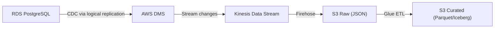

# Scenario Questions — AWS RDS

<article data-difficulty="mid-level">

## 🟡 Mid-Level: Design a CDC Pipeline from RDS to Data Lake

**Scenario:** You have a PostgreSQL RDS instance with 50 tables. You need to capture all inserts, updates, and deletes and replicate them to your S3 data lake in near-real-time (< 5 minute latency). Design the architecture.

<details>
<summary>✅ Solution</summary>

**Architecture: DMS (Database Migration Service) for CDC**



This pipeline captures row-level changes from RDS through DMS, buffers them in Kinesis and Firehose for durable landing in the raw zone, then transforms them into a curated, query-ready format.

**Implementation:**

```python
# Step 1: Enable logical replication on RDS
# Parameter group: rds.logical_replication = 1

# Step 2: Create DMS replication instance
dms = boto3.client('dms')
dms.create_replication_instance(
    ReplicationInstanceIdentifier='cdc-replicator',
    ReplicationInstanceClass='dms.r5.large',
    AllocatedStorage=100
)

# Step 3: Create source endpoint (RDS)
dms.create_endpoint(
    EndpointIdentifier='rds-source',
    EndpointType='source',
    EngineName='postgres',
    ServerName='mydb.xxx.us-east-1.rds.amazonaws.com',
    DatabaseName='production',
    Username='dms_user',
    Password='...',
    Port=5432
)

# Step 4: Create target endpoint (Kinesis for real-time)
dms.create_endpoint(
    EndpointIdentifier='kinesis-target',
    EndpointType='target',
    EngineName='kinesis',
    KinesisSettings={
        'StreamArn': 'arn:aws:kinesis:...:stream/cdc-events',
        'MessageFormat': 'json-unformatted'
    }
)

# Step 5: Create replication task (CDC mode)
dms.create_replication_task(
    ReplicationTaskIdentifier='full-cdc',
    SourceEndpointArn='...',
    TargetEndpointArn='...',
    ReplicationInstanceArn='...',
    MigrationType='full-load-and-cdc',  # Initial snapshot + ongoing CDC
    TableMappings='{"rules": [{"rule-type": "selection", "rule-action": "include", "object-locator": {"schema-name": "public", "table-name": "%"}}]}'
)
```

**CDC record format in Kinesis:**
```json
{
    "data": {"order_id": 123, "amount": 99.99, "status": "shipped"},
    "metadata": {
        "operation": "update",
        "schema-name": "public",
        "table-name": "orders",
        "timestamp": "2024-01-15T10:30:00Z"
    }
}
```

**Latency:** < 5 seconds from RDS change to S3 landing (via Kinesis + Firehose).

</details>

</article>

---

## ⚡ Quick-fire Q&A

**Q: What is Amazon RDS and what engines does it support?**
A: RDS (Relational Database Service) is a fully managed relational database service that handles provisioning, patching, backups, and failover. It supports MySQL, PostgreSQL, MariaDB, Oracle, SQL Server, and Amazon Aurora (MySQL- and PostgreSQL-compatible). RDS manages the database engine; you manage schema, queries, and application configuration.

**Q: What is the difference between RDS Multi-AZ and Read Replicas?**
A: Multi-AZ maintains a synchronous standby in a second AZ for automatic failover (HA/DR, typically 1-2 minute failover). Read Replicas are asynchronous copies used to scale read throughput — you route read queries to replicas. They are different purposes: Multi-AZ is for availability, Read Replicas are for read scaling.

**Q: What is Amazon Aurora and how does it differ from standard RDS?**
A: Aurora is AWS's cloud-native relational engine, compatible with MySQL and PostgreSQL but with a distributed storage layer that automatically replicates 6 copies of data across 3 AZs. Aurora provides faster failover (under 30 seconds), higher write throughput, up to 15 low-latency read replicas, and Aurora Serverless for variable-workload auto-scaling.

**Q: How do you use RDS as a data source in ETL pipelines?**
A: Common patterns include: Glue JDBC connections to extract data from RDS for ETL to S3, DMS (Database Migration Service) for continuous replication with CDC, AWS Batch or Lambda with JDBC drivers for custom extraction logic, and Debezium on MSK Connect for Kafka-based CDC from PostgreSQL/MySQL.

**Q: What is RDS Proxy and when is it useful for data engineering?**
A: RDS Proxy is a fully managed database proxy that pools and shares connections to RDS. It's useful when Lambda functions or serverless workloads create many short-lived connections — Lambda can create thousands of concurrent connections that overwhelm RDS. RDS Proxy multiplexes these into a smaller pool of long-lived database connections.

**Q: What are RDS automated backups and snapshots?**
A: Automated backups occur daily to S3 with transaction logs captured continuously, enabling point-in-time recovery (PITR) to any second within the retention window (1-35 days). Manual snapshots are user-initiated, persist beyond the instance lifecycle, and are used for long-term archival or pre-maintenance safety copies.

**Q: How do you secure an RDS database in a data platform?**
A: Security layers include: VPC with private subnets (no public access), security groups restricting inbound to specific compute resources only, encryption at rest (KMS), encryption in transit (SSL/TLS required), IAM database authentication for MySQL/PostgreSQL (eliminates password management), and Secrets Manager for credential rotation.

**Q: What is AWS DMS and how does it relate to RDS?**
A: DMS (Database Migration Service) migrates data between databases and supports continuous CDC replication. For data engineering, DMS is used to replicate RDS changes in near-real-time to S3 (in Parquet) or Redshift, enabling analytics on operational data without impacting the source RDS instance.

---

## 💼 Interview Tips

- Distinguish clearly between Multi-AZ (HA/DR) and Read Replicas (read scaling) — confusing these is a common junior mistake that interviewers watch for.
- Senior interviewers expect you to discuss the operational database problem for analytics: running analytical queries on the production RDS instance impacts transactional performance. Describe the pattern of routing analytics to a read replica or replicating via DMS to Redshift/S3.
- Mention RDS Proxy as the solution for the Lambda connection exhaustion problem — this is a well-known serverless + RDS integration challenge, and knowing the solution signals real production experience.
- Advocate for IAM database authentication for internal service connections and Secrets Manager with automatic rotation for human-managed credentials — avoid static passwords in environment variables.
- Know Aurora Serverless v2 for variable-workload scenarios: it scales in fine-grained ACU increments (not on/off like v1), making it suitable for development environments and bursty production workloads.
- Demonstrate awareness of the RDS limitations for analytics: RDS is an OLTP database with row-oriented storage. For analytical queries over millions of rows, always recommend offloading to Redshift, Athena, or a purpose-built analytics store.
