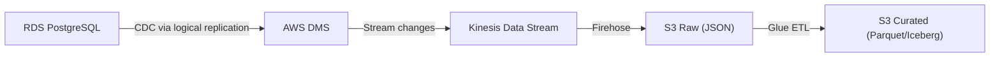

# Scenario Questions — AWS RDS

<article data-difficulty="mid-level">

## 🟡 Mid-Level: Design a CDC Pipeline from RDS to Data Lake

**Scenario:** You have a PostgreSQL RDS instance with 50 tables. You need to capture all inserts, updates, and deletes and replicate them to your S3 data lake in near-real-time (< 5 minute latency). Design the architecture.

<details>
<summary>✅ Solution</summary>

**Architecture: DMS (Database Migration Service) for CDC**



This pipeline captures row-level changes from RDS through DMS, buffers them in Kinesis and Firehose for durable landing in the raw zone, then transforms them into a curated, query-ready format.

**Implementation:**

```python
# Step 1: Enable logical replication on RDS
# Parameter group: rds.logical_replication = 1

# Step 2: Create DMS replication instance
dms = boto3.client('dms')
dms.create_replication_instance(
    ReplicationInstanceIdentifier='cdc-replicator',
    ReplicationInstanceClass='dms.r5.large',
    AllocatedStorage=100
)

# Step 3: Create source endpoint (RDS)
dms.create_endpoint(
    EndpointIdentifier='rds-source',
    EndpointType='source',
    EngineName='postgres',
    ServerName='mydb.xxx.us-east-1.rds.amazonaws.com',
    DatabaseName='production',
    Username='dms_user',
    Password='...',
    Port=5432
)

# Step 4: Create target endpoint (Kinesis for real-time)
dms.create_endpoint(
    EndpointIdentifier='kinesis-target',
    EndpointType='target',
    EngineName='kinesis',
    KinesisSettings={
        'StreamArn': 'arn:aws:kinesis:...:stream/cdc-events',
        'MessageFormat': 'json-unformatted'
    }
)

# Step 5: Create replication task (CDC mode)
dms.create_replication_task(
    ReplicationTaskIdentifier='full-cdc',
    SourceEndpointArn='...',
    TargetEndpointArn='...',
    ReplicationInstanceArn='...',
    MigrationType='full-load-and-cdc',  # Initial snapshot + ongoing CDC
    TableMappings='{"rules": [{"rule-type": "selection", "rule-action": "include", "object-locator": {"schema-name": "public", "table-name": "%"}}]}'
)
```

**CDC record format in Kinesis:**
```json
{
    "data": {"order_id": 123, "amount": 99.99, "status": "shipped"},
    "metadata": {
        "operation": "update",
        "schema-name": "public",
        "table-name": "orders",
        "timestamp": "2024-01-15T10:30:00Z"
    }
}
```

**Latency:** < 5 seconds from RDS change to S3 landing (via Kinesis + Firehose).

</details>

</article>
