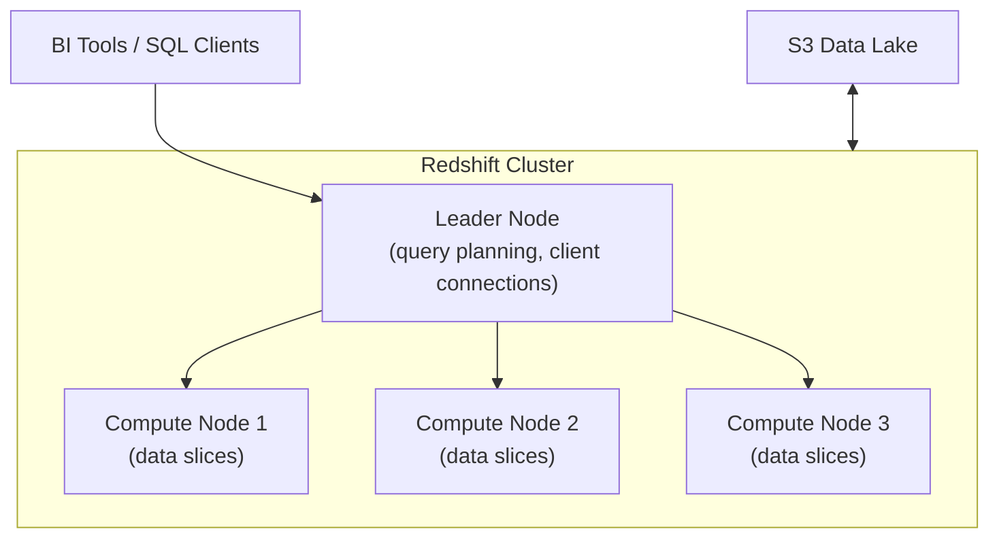

# AWS Redshift — Fundamentals


## 🎯 Analogy

Think of Redshift like a columnar filing system on steroids: instead of storing each row together, it stores each column together. When you SELECT just revenue and date from 50 columns, it reads only 2 columns — 48 columns never leave disk.

---
## What Is Amazon Redshift?

Amazon Redshift is a **fully managed, petabyte-scale cloud data warehouse** optimized for analytical queries (OLAP). It uses a massively parallel processing (MPP) architecture with columnar storage.

**The analogy:** If S3 is your filing cabinet (raw storage), Redshift is your organized spreadsheet application — optimized for fast calculations across huge datasets.

> **Why Redshift matters for DE:** It's one of the top 3 cloud data warehouses (alongside Snowflake and BigQuery). Commonly used as the analytical layer in AWS data architectures. Many companies still run their BI workloads on Redshift.

---

## Architecture Overview



**What this shows:**
- **Leader Node:** Receives queries, creates execution plan, distributes work, aggregates results. Doesn't store data.
- **Compute Nodes:** Store data and execute queries in parallel. Each node has multiple "slices" (processing units).
- **Slices:** Each node is divided into slices (2-16 per node depending on instance type). Each slice processes a portion of the data independently.

---

## Key Concepts

| Concept | What It Means |
|---------|--------------|
| **Columnar storage** | Data stored by column (not by row) — reads only needed columns |
| **MPP** | Query work split across all nodes/slices in parallel |
| **Distribution style** | How rows are spread across nodes (KEY, EVEN, ALL) |
| **Sort key** | Determines physical order of data on disk (enables range scan) |
| **Compression** | Automatic column encoding (reduces storage and I/O) |
| **Slices** | Processing units within each node (parallel execution) |

---

## Distribution Styles

The distribution style determines how table rows are distributed across compute nodes:

### KEY Distribution (Most Important)

Rows with the same key value go to the same node. Critical for join performance.

```sql
CREATE TABLE fact_orders (
    order_id BIGINT,
    customer_id INT,
    amount DECIMAL(10,2),
    order_date DATE
)
DISTSTYLE KEY
DISTKEY(customer_id);  -- All orders for same customer on same node
```

**When to use:** On columns frequently used in JOINs. If fact_orders and dim_customer both have DISTKEY(customer_id), joining them requires ZERO data movement between nodes.

### EVEN Distribution

Rows distributed round-robin across all nodes (balanced, no locality).

```sql
CREATE TABLE staging_events (...)
DISTSTYLE EVEN;
```

**When to use:** Tables not frequently joined, or when no clear join key exists.

### ALL Distribution

Entire table copied to every node. Used for small dimension tables.

```sql
CREATE TABLE dim_date (
    date_key INT,
    full_date DATE,
    month_name VARCHAR(10),
    year INT
)
DISTSTYLE ALL;  -- Full copy on every node (365 rows — tiny)
```

**When to use:** Small dimension tables (<1M rows) joined with large fact tables. Eliminates data movement for the join.

### Distribution Selection Guide

| Table Type | Size | Distribution |
|-----------|------|-------------|
| Large fact table | 100M+ rows | KEY (on most-joined column) |
| Medium dimension | 1M-100M rows | KEY (same column as fact FK) |
| Small dimension | <1M rows | ALL (copy to every node) |
| Staging/temp | Any | EVEN (no specific join pattern) |

---

## Sort Keys

Sort keys define the **physical order** of rows on disk. Redshift uses this for zone maps (min/max per block) to skip irrelevant data.

```sql
CREATE TABLE fact_orders (
    order_id BIGINT,
    customer_id INT,
    amount DECIMAL(10,2),
    order_date DATE
)
DISTSTYLE KEY DISTKEY(customer_id)
SORTKEY(order_date);  -- Data physically ordered by date on disk
```

**Effect of sort key:**

```sql
-- With SORTKEY(order_date):
SELECT SUM(amount) FROM fact_orders WHERE order_date = '2024-01-15';
-- Zone maps tell Redshift: "blocks 1-50 have dates Jan 1-14, block 51-52 has Jan 15"
-- Only reads blocks 51-52 (skips 96% of data!)

-- Without sort key:
-- Must scan ALL blocks (no skip possible)
```

### Compound vs Interleaved Sort Keys

| Type | Behavior | Best For |
|------|----------|----------|
| **Compound** (default) | Sorts by first key, then second, etc. | Queries always filter on first column |
| **Interleaved** | Equal weight to all key columns | Queries filter on ANY key column |

```sql
-- Compound: great for WHERE order_date = X, OR WHERE order_date = X AND customer_id = Y
-- Poor for WHERE customer_id = Y alone (first column not used)
COMPOUND SORTKEY(order_date, customer_id)

-- Interleaved: good for any filter combination
-- But: slower VACUUM, more maintenance
INTERLEAVED SORTKEY(order_date, customer_id, product_id)
```

> **Recommendation:** Use compound sort keys (simpler, less maintenance). Put the most-filtered column first (usually date).

---

## Loading Data

### COPY Command (Primary Load Method)

```sql
-- Load from S3 (fastest method — parallel across all slices)
COPY fact_orders
FROM 's3://data-lake/curated/orders/'
IAM_ROLE 'arn:aws:iam::123:role/RedshiftRole'
FORMAT AS PARQUET;

-- Load CSV with options
COPY staging_table
FROM 's3://uploads/data.csv'
IAM_ROLE 'arn:aws:iam::123:role/RedshiftRole'
DELIMITER ','
IGNOREHEADER 1
DATEFORMAT 'auto'
GZIP;  -- Compressed files
```

**COPY optimization tips:**
- Split files into multiple parts (one per slice for parallel loading)
- Use compressed formats (gzip, lzo, Parquet)
- Manifest file to specify exact file list
- COPY is 10-100x faster than INSERT for bulk loads

### Best Practices for Loading

| Practice | Why |
|----------|-----|
| Use COPY, not INSERT | Parallel load across all slices |
| Split files = number of slices | Each slice reads one file in parallel |
| Use Parquet/compressed | Less I/O from S3 |
| Load to staging table first | Validate before INSERT INTO target |
| VACUUM after large loads | Reclaims space and re-sorts |

---

## Querying in Redshift

```sql
-- Standard SQL with Redshift extensions
SELECT 
    d.month_name,
    p.category,
    SUM(f.amount) AS total_revenue,
    COUNT(DISTINCT f.customer_id) AS unique_customers
FROM fact_orders f
JOIN dim_date d ON f.order_date = d.date_key     -- Collocated if same DISTKEY
JOIN dim_product p ON f.product_id = p.product_id -- ALL dist = no movement
WHERE d.year = 2024
GROUP BY d.month_name, p.category
ORDER BY total_revenue DESC;
```

---

## Redshift Serverless vs Provisioned

| Feature | Provisioned | Serverless |
|---------|------------|-----------|
| Pricing | Per-node per-hour (always on) | Per-RPU-hour (pay per query) |
| Setup | Choose node type and count | Specify base capacity (RPUs) |
| Scaling | Manual resize or elastic resize | Auto-scales based on workload |
| Idle cost | Full cost even when idle | Charges only when querying |
| Best for | Predictable, steady workloads | Variable/unpredictable workloads |

```sql
-- Redshift Serverless: no cluster management
-- Just create a namespace + workgroup and start querying
CREATE EXTERNAL SCHEMA spectrum_schema
FROM DATA CATALOG DATABASE 'glue_database'
IAM_ROLE 'arn:aws:iam::123:role/RedshiftRole';
```

---

## Redshift Spectrum — Query S3 Directly

Query data in S3 without loading it into Redshift tables:

```sql
-- Create external schema pointing to Glue Catalog
CREATE EXTERNAL SCHEMA lake
FROM DATA CATALOG DATABASE 'raw_data'
IAM_ROLE 'arn:aws:iam::123:role/RedshiftSpectrumRole';

-- Query S3 data as if it were a regular table
SELECT event_type, COUNT(*)
FROM lake.events  -- Data lives in S3, not Redshift!
WHERE event_date = '2024-01-15'
GROUP BY event_type;

-- Join Redshift tables with S3 external tables
SELECT c.name, COUNT(e.event_id)
FROM local_schema.customers c
JOIN lake.events e ON c.customer_id = e.user_id
WHERE e.event_date >= '2024-01-01'
GROUP BY c.name;
```

> **Spectrum pattern:** Keep hot/recent data in Redshift tables (fast). Keep cold/historical data in S3 as external tables (cheap). Query both seamlessly.

---


## ▶️ Try It Yourself

```python
import boto3

# Connect via psycopg2 or redshift_connector
# pip install redshift-connector
import redshift_connector

conn = redshift_connector.connect(
    host="my-cluster.abc123.us-east-1.redshift.amazonaws.com",
    database="dev",
    user="admin",
    password="password",
    port=5439,
)

cursor = conn.cursor()

# COPY from S3 (fastest load method)
copy_sql = (
    "COPY orders FROM 's3://my-bucket/raw/orders/' "
    "IAM_ROLE 'arn:aws:iam::123456789:role/RedshiftRole' "
    "FORMAT AS PARQUET;"
)
cursor.execute(copy_sql)

cursor.execute("SELECT COUNT(*) FROM orders")
print(cursor.fetchone())
conn.close()
```

> **Run it:** Copy the snippet into a REPL or file and run it — no external services needed for the basic example.

---
## Interview Tips

> **Tip 1:** "What is Redshift's architecture?" — "MPP (Massively Parallel Processing) with a leader node (planning) and compute nodes (execution). Data is columnar, distributed across nodes via DISTKEY, and sorted via SORTKEY. Each node has slices that process in parallel. Queries are compiled into C++ code and run across all slices simultaneously."

> **Tip 2:** "How do you optimize joins in Redshift?" — "Use DISTKEY on the join column for both tables being joined — this collocates matching rows on the same node (zero data movement). For small dimensions, use DISTSTYLE ALL (copies to every node). This eliminates the 'redistribute' step in the query plan."

> **Tip 3:** "When would you use Redshift vs Athena?" — "Redshift for: frequent complex queries, sub-second dashboards, concurrent users, and when data fits in a warehouse (TB scale). Athena for: ad-hoc exploratory queries, infrequent access, and when data lives in S3 (no loading required). Many teams use both: Redshift for BI dashboards, Athena for data exploration."
