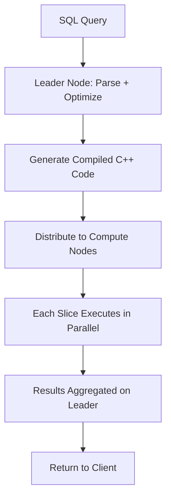

# AWS Redshift — Senior-Level Deep Dive

## Query Execution Internals

### How Redshift Processes a Query



**What this shows:**
- Leader node compiles SQL into optimized C++ execution code
- Code is distributed to compute node slices
- Each slice processes its local data portion in parallel
- Results flow back to leader for final aggregation

### Reading Execution Plans (EXPLAIN)

```sql
EXPLAIN SELECT region, SUM(amount)
FROM fact_orders f
JOIN dim_store s ON f.store_key = s.store_key
WHERE f.order_date >= '2024-01-01'
GROUP BY region;

-- Key operators to understand:
-- DS_DIST_NONE: No data movement (collocated join — ideal!)
-- DS_DIST_ALL_NONE: ALL-distributed table (no movement needed)
-- DS_BCAST_INNER: Small inner table broadcast to all nodes
-- DS_DIST_BOTH: BOTH tables redistributed (worst — both shuffled!)
-- DS_DIST_INNER: Only inner table redistributed
-- DS_DIST_OUTER: Only outer table redistributed
```

**Red flags in plans:**

| What You See | Problem | Fix |
|--------------|---------|-----|
| `DS_DIST_BOTH` | Both tables shuffled | Align DISTKEYs on join column |
| `Sort` with large row estimate | Expensive sort | Add/fix SORTKEY |
| `Seq Scan` on filtered table | Missing sort/zone-map benefit | Add SORTKEY on filter column |
| `Hash Join` with huge build side | Memory pressure, disk spill | Filter before join, or broadcast small side |
| Very high `cost=` value | Expensive operation | Investigate the specific operator |

---

## Distribution Key Design — Advanced Patterns

### Fact-Dimension Colocation

```sql
-- OPTIMAL: fact and dimension share DISTKEY → zero-shuffle joins
CREATE TABLE fact_orders (...) DISTSTYLE KEY DISTKEY(customer_id);
CREATE TABLE dim_customer (...) DISTSTYLE KEY DISTKEY(customer_id);

-- Plan shows: DS_DIST_NONE (no redistribution — fastest possible join)
```

### Multi-Fact Warehouse Pattern

When you have multiple fact tables joining different dimensions:

```sql
-- Problem: fact_orders joins on customer_id, but fact_shipments joins on order_id
-- Can't optimize both with one DISTKEY

-- Solution: DISTKEY on the MOST FREQUENT join, ALL distribution for small dims
CREATE TABLE fact_orders (...) DISTKEY(customer_id);
CREATE TABLE fact_shipments (...) DISTKEY(order_id);
CREATE TABLE dim_customer (...) DISTSTYLE ALL;    -- Copied everywhere (small)
CREATE TABLE dim_order_status (...) DISTSTYLE ALL; -- Copied everywhere (tiny)

-- fact_orders JOIN dim_customer: ALL dist means dim is local → DS_DIST_ALL_NONE ✓
-- fact_shipments JOIN fact_orders ON order_id: one side redistributed → DS_DIST_INNER
```

### Detecting Bad Distribution

```sql
-- Check data distribution skew across slices
SELECT slice, "table", num_values, minvalue, maxvalue
FROM svv_diskusage
WHERE name = 'fact_orders'
ORDER BY slice;
-- If one slice has 10x more rows than others → DISTKEY has skew

-- Check which tables cause redistribution in queries
SELECT query, segment, step, label, rows, bytes
FROM svl_query_report
WHERE label LIKE '%dist%' OR label LIKE '%bcast%'
ORDER BY query DESC, segment, step
LIMIT 50;
```

---

## Advanced Sort Key Patterns

### Compound Sort Key (Date-First Pattern)

```sql
CREATE TABLE fact_events (
    event_id BIGINT,
    event_date DATE,
    user_id INT,
    event_type VARCHAR(50),
    amount DECIMAL(10,2)
)
DISTSTYLE KEY DISTKEY(user_id)
COMPOUND SORTKEY(event_date, event_type);

-- Effective for:
-- WHERE event_date = '2024-01-15'                    ✓ (first sort column)
-- WHERE event_date = '2024-01-15' AND event_type = 'purchase'  ✓ (first + second)
-- WHERE event_type = 'purchase'                      ✗ (skips first column!)
```

### Interleaved Sort Key (Multi-Access Pattern)

```sql
CREATE TABLE fact_events (...)
INTERLEAVED SORTKEY(event_date, user_id, event_type);

-- Effective for ANY filter combination:
-- WHERE event_date = '2024-01-15'           ✓
-- WHERE user_id = 42                        ✓
-- WHERE event_type = 'purchase'             ✓
-- WHERE event_date = X AND user_id = Y      ✓

-- Downsides: VACUUM is much slower, less effective than compound for single-column filters
```

### Zone Maps (How Sort Keys Actually Work)

```
Block 1: event_date min=2024-01-01, max=2024-01-05
Block 2: event_date min=2024-01-06, max=2024-01-10
Block 3: event_date min=2024-01-11, max=2024-01-15
...

Query: WHERE event_date = '2024-01-08'
→ Check zone maps: Block 1 (max=Jan 5) → SKIP, Block 2 (Jan 6-10) → READ
→ Only reads 1 out of 100 blocks (99% eliminated without scanning data)
```

> **This is why SORTKEY matters:** Without it, ALL blocks must be scanned. With it, zone maps eliminate 90-99% of blocks before reading any data.

---

## Late Binding Views vs Standard Views

```sql
-- Standard view: schema checked at creation time
CREATE VIEW v_orders AS SELECT * FROM schema.fact_orders;
-- If fact_orders schema changes → view breaks

-- Late binding view: schema checked at query time (flexible)
CREATE VIEW v_orders AS 
SELECT * FROM schema.fact_orders
WITH NO SCHEMA BINDING;
-- Works even if underlying table schema changes
-- Essential for Spectrum external tables (schema may evolve)
```

---

## Redshift Serverless Architecture

```sql
-- No cluster management: just create a workgroup and namespace
-- Auto-scales compute based on query complexity
-- Charges per RPU-second (Redshift Processing Unit)

-- Key configuration:
-- Base capacity: 32-512 RPU (minimum always available)
-- Auto-scale: up to 1024 RPU during complex queries
-- Idle timeout: pause after N minutes (stop charges)

-- Cost estimate:
-- 128 RPU base × $0.375/RPU-hour × 8 active hours/day × 30 days = $11,520/month
-- vs Provisioned (always on): 4 × ra3.xlplus × $1.086/hr × 720 hrs = $3,128/month
-- Serverless wins when: usage is sporadic/unpredictable
-- Provisioned wins when: usage is steady/predictable
```

---

## Performance Tuning Workflow

```
1. IDENTIFY slow query (STL_QUERY, SVL_QLOG)
   SELECT query, elapsed/1000000 AS seconds, querytxt
   FROM stl_query WHERE elapsed > 60000000 ORDER BY elapsed DESC;

2. READ the plan (EXPLAIN)
   Look for: DS_DIST_BOTH, large sorts, sequential scans

3. CHECK distribution (SVV_TABLE_INFO)
   SELECT "table", diststyle, sortkey1, skew_rows
   FROM svv_table_info WHERE schema = 'public';

4. CHECK statistics freshness
   SELECT "table", stats_off FROM svv_table_info WHERE stats_off > 10;
   → If stats_off > 10%: run ANALYZE

5. FIX (in priority order):
   a. Add/fix DISTKEY alignment for joins with DS_DIST_BOTH
   b. Add SORTKEY for filtered columns showing Seq Scan
   c. Run VACUUM if table has high dead-row percentage
   d. Run ANALYZE if statistics are stale
   e. Consider materialized view for repeated aggregations
```

---

## System Tables for Monitoring

| Table | What It Shows |
|-------|--------------|
| `STL_QUERY` | All executed queries with duration |
| `STL_ALERT_EVENT_LOG` | Optimizer warnings (missing stats, bad joins) |
| `SVL_QUERY_REPORT` | Per-step execution metrics |
| `SVV_TABLE_INFO` | Table metadata (dist style, sort key, size, skew) |
| `SVL_DISKUSAGE` | Per-slice storage distribution |
| `STL_WLM_QUERY` | Queue time, execution time per WLM queue |
| `SVL_CONCURRENCY_SCALING_USAGE` | Burst cluster usage |

```sql
-- Find queries that trigger alerts (potential performance issues)
SELECT event_time, solution, query 
FROM stl_alert_event_log 
WHERE event_time > GETDATE() - 7
ORDER BY event_time DESC;
-- Common alerts: "Missing statistics", "Nested Loop Join", "Very selective filter"
```

---

## Interview Tips

> **Tip 1:** "How do you diagnose a slow Redshift query?" — "Five steps: (1) EXPLAIN to read the plan — look for DS_DIST_BOTH (bad join) and Seq Scan (missing sort key). (2) Check SVV_TABLE_INFO for distribution skew. (3) Check stats freshness (ANALYZE if stale). (4) Check STL_ALERT_EVENT_LOG for optimizer warnings. (5) Check disk spill in SVL_QUERY_REPORT."

> **Tip 2:** "What's the most impactful Redshift optimization?" — "Aligning DISTKEYs between fact and dimension tables on their join column. This eliminates the most expensive operation in distributed SQL: cross-node data movement. A query with DS_DIST_BOTH doing a 100B-row shuffle becomes DS_DIST_NONE with zero shuffle — often 10-50x faster."

> **Tip 3:** "How does Redshift differ from Snowflake architecturally?" — "Redshift: you manage distribution (DISTKEY) and sort (SORTKEY) manually for optimal performance. Snowflake: automatic (micro-partitions, clustering keys are optional hints). Redshift: compute and storage are coupled per node (except RA3). Snowflake: fully separated. Redshift requires VACUUM. Snowflake doesn't. Trade-off: Redshift gives more control but more operational burden."

## ⚡ Cheat Sheet

**Cluster vs Serverless**
| Feature | Provisioned | Serverless |
|---|---|---|
| Scaling | Manual resize or elastic | Automatic (RPU-based) |
| Cost model | Per node-hour | Per RPU-second |
| Concurrency scaling | Add/remove nodes | Auto |
| Best for | Steady predictable workload | Spiky/variable workload |

**Distribution styles**
| Style | When to use |
|---|---|
| `EVEN` | Default; balanced rows; no obvious join key |
| `KEY(col)` | Large fact table joining on col; co-locates matching rows |
| `ALL` | Small dimension tables (<1M rows); broadcast to all nodes |
| `AUTO` | Let Redshift decide; good starting point |

**Sort keys**
- Compound: efficient range scans on first N columns; bad for single later columns
- Interleaved: equal weight to all columns; better for multi-column filters; higher vacuum cost
- Choose 1–3 columns most used in WHERE/JOIN; date/timestamp almost always first

**Key table properties**
```sql
CREATE TABLE fact_orders (
    order_id BIGINT NOT NULL ENCODE az64,
    order_date DATE ENCODE az64,
    amount NUMERIC(12,2) ENCODE az64,
    customer_id INT ENCODE az64
)
DISTSTYLE KEY DISTKEY(customer_id)
SORTKEY(order_date)
;
```

**Performance commands**
```sql
VACUUM DELETE ONLY tablename;        -- reclaim deleted rows
VACUUM SORT ONLY tablename;          -- re-sort unsorted rows
ANALYZE tablename;                   -- update statistics
SELECT * FROM SVV_TABLE_INFO WHERE table = 'fact_orders'; -- table health
```

**Concurrency scaling**
- Enabled per workload management (WLM) queue; billed per second
- Auto-pause: serverless pauses after 3min idle; provisioned needs manual scheduling
- Spectrum: query S3 directly via external tables; charged per TB scanned
