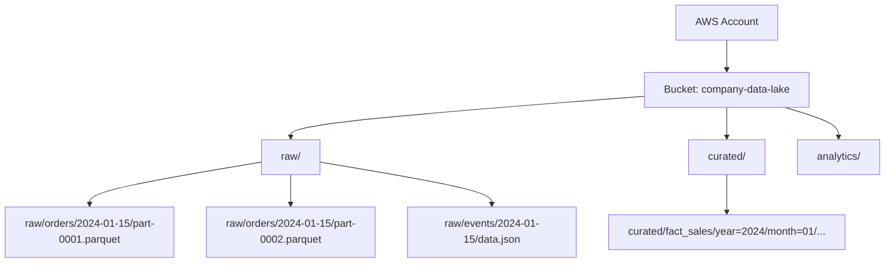

# AWS S3 — Fundamentals

## What Is Amazon S3?

Amazon S3 (Simple Storage Service) is an **object storage service** — think of it as an infinitely scalable file system in the cloud. It stores any type of data (files, images, logs, Parquet, JSON) as "objects" in "buckets."

**The analogy:** S3 is like a filing cabinet with infinite drawers (buckets). Each drawer can hold unlimited files (objects). You access files by their full path (key), not by navigating folders.

> **Why S3 matters for DE:** S3 is the foundation of nearly every data lake. Raw data lands in S3, gets processed by Spark/Glue/EMR, and transformed data lands back in S3. It's the universal storage layer for AWS data pipelines.

---

## Core Concepts

| Concept | What It Is | Example |
|---------|-----------|---------|
| **Bucket** | Top-level container (globally unique name) | `my-company-data-lake` |
| **Object** | A single file stored in a bucket | `raw/orders/2024-01-15/data.parquet` |
| **Key** | The full path/name of the object (like a file path) | `raw/orders/2024-01-15/data.parquet` |
| **Prefix** | A "folder-like" portion of the key (not real folders) | `raw/orders/` |
| **Metadata** | Key-value pairs attached to an object | `Content-Type: application/parquet` |
| **Region** | Physical AWS location where data is stored | `us-east-1` |

> **Important:** S3 doesn't have real folders/directories. What looks like `raw/orders/file.parquet` is actually a single object with key `raw/orders/file.parquet`. The "/" is just part of the name. The console shows it as folders for convenience.

---

## Bucket and Object Structure



**What this shows:**
- One bucket contains your entire data lake
- Prefixes (raw/, curated/, analytics/) act like top-level folders
- Data is organized by domain/date for easy discovery
- Hive-style partitioning (`year=2024/month=01/`) enables query engines to skip irrelevant files

---

## Creating and Using Buckets

```python
import boto3

s3 = boto3.client('s3', region_name='us-east-1')

# Create a bucket
s3.create_bucket(Bucket='my-data-lake-prod')

# Upload a file
s3.upload_file(
    Filename='/local/path/sales_data.parquet',
    Bucket='my-data-lake-prod',
    Key='raw/sales/2024-01-15/sales_data.parquet'
)

# Download a file
s3.download_file(
    Bucket='my-data-lake-prod',
    Key='raw/sales/2024-01-15/sales_data.parquet',
    Filename='/local/path/downloaded.parquet'
)

# List objects with a prefix (like listing a "directory")
response = s3.list_objects_v2(
    Bucket='my-data-lake-prod',
    Prefix='raw/sales/2024-01-15/'
)
for obj in response.get('Contents', []):
    print(f"  {obj['Key']} ({obj['Size']} bytes)")
```

---

## Storage Classes

S3 offers different storage tiers based on access frequency — critical for cost optimization:

| Storage Class | Access Pattern | Cost (per GB/month) | Retrieval Cost | Use Case |
|--------------|---------------|--------------------:|----------------|----------|
| **Standard** | Frequent access | $0.023 | None | Active data, hot queries |
| **Intelligent-Tiering** | Unknown/changing | $0.023 (auto-moves) | None | Unpredictable access |
| **Standard-IA** | Infrequent (monthly) | $0.0125 | Per-GB retrieval | Backups, old partitions |
| **Glacier Instant** | Rare (quarterly) | $0.004 | Per-GB retrieval | Compliance archives |
| **Glacier Flexible** | Very rare (annual) | $0.0036 | Hours to retrieve | Long-term archives |
| **Glacier Deep Archive** | Almost never | $0.00099 | 12-48 hours | Regulatory retention |

> **Data lake pattern:** Recent data (last 30 days) in Standard. Older data auto-transitions to IA or Glacier via lifecycle rules.

### Lifecycle Rules

```json
{
    "Rules": [
        {
            "ID": "transition-to-ia-after-30-days",
            "Status": "Enabled",
            "Filter": {"Prefix": "raw/"},
            "Transitions": [
                {"Days": 30, "StorageClass": "STANDARD_IA"},
                {"Days": 90, "StorageClass": "GLACIER_IR"},
                {"Days": 365, "StorageClass": "DEEP_ARCHIVE"}
            ],
            "Expiration": {"Days": 2555}
        }
    ]
}
```

---

## Data Lake File Organization Patterns

### Pattern 1: Date-Partitioned (Most Common)

```
s3://data-lake/raw/orders/
    year=2024/month=01/day=15/part-0001.parquet
    year=2024/month=01/day=15/part-0002.parquet
    year=2024/month=01/day=16/part-0001.parquet
```

**Benefits:** Athena/Spark can skip entire date folders when filtering by date.

### Pattern 2: Hive-Style Partitioning

```
s3://data-lake/curated/fact_sales/
    region=US/year=2024/month=01/data.parquet
    region=EU/year=2024/month=01/data.parquet
```

**Benefits:** Multiple partition columns for multi-dimensional pruning.

### Pattern 3: Delta/Iceberg Format

```
s3://data-lake/delta/fact_sales/
    _delta_log/                    # Transaction log
        00000000000000000001.json
        00000000000000000002.json
    part-00000-*.parquet          # Data files
    part-00001-*.parquet
```

**Benefits:** ACID transactions, time travel, schema evolution on S3.

---

## S3 Consistency Model

Since December 2020, S3 provides **strong read-after-write consistency**:

| Operation | Consistency |
|-----------|-------------|
| PUT (new object) | Strongly consistent — immediately readable |
| PUT (overwrite) | Strongly consistent — reads return new version |
| DELETE | Strongly consistent — object immediately gone |
| LIST | Strongly consistent — reflects all recent writes |

> **Before 2020:** S3 had eventual consistency for overwrites and deletes — a common interview question that's now outdated. But know this history in case it comes up.

---

## Security Basics

### Bucket Policies

```json
{
    "Version": "2012-10-17",
    "Statement": [
        {
            "Effect": "Allow",
            "Principal": {"AWS": "arn:aws:iam::123456789:role/GlueRole"},
            "Action": ["s3:GetObject", "s3:PutObject"],
            "Resource": "arn:aws:s3:::my-data-lake/raw/*"
        }
    ]
}
```

### Encryption

| Type | Key Management | Use Case |
|------|---------------|----------|
| SSE-S3 | AWS manages keys | Default, simplest |
| SSE-KMS | Customer-managed KMS key | Compliance, audit trail |
| SSE-C | Customer provides key per request | Maximum control |
| Client-side | Encrypt before upload | End-to-end encryption |

```python
# Upload with server-side encryption (KMS)
s3.put_object(
    Bucket='my-data-lake',
    Key='sensitive/data.parquet',
    Body=data,
    ServerSideEncryption='aws:kms',
    SSEKMSKeyId='arn:aws:kms:us-east-1:123:key/abc-123'
)
```

---

## S3 Performance

| Metric | Value |
|--------|-------|
| Request rate | 5,500 GET/s and 3,500 PUT/s per prefix |
| Object size limit | 5 TB per object |
| Multipart upload threshold | Recommended for files > 100 MB |
| Transfer speed | Up to 100 Gbps within same region |

**Performance optimization for data lakes:**
- Use randomized prefixes if >5,500 reads/s on same prefix
- Use multipart upload for large files (parallel upload of parts)
- Keep files between 128 MB–1 GB for optimal Spark/Athena performance
- Avoid too many small files (each file = 1 LIST API call overhead)

---

## Interview Tips

> **Tip 1:** "How do you organize a data lake on S3?" — "Three zones: raw/ (source data as-is), curated/ (cleaned, typed, deduplicated), and analytics/ (aggregated, ready for BI). Each zone uses Hive-style partitioning by date for query performance. File format is Parquet for analytics tables (columnar, compressed)."

> **Tip 2:** "How do you optimize S3 costs?" — "Lifecycle rules to transition cold data to cheaper tiers (Standard → IA → Glacier). Intelligent-Tiering for unpredictable access. Delete staging/temp data promptly. Use S3 Inventory to find large unused objects."

> **Tip 3:** "What file format do you use on S3 for analytics?" — "Parquet — it's columnar (only reads needed columns), compressed (3-5x smaller than CSV), schema-embedded, and splittable (Spark can read parts in parallel). For streaming ingestion, I use JSON/Avro landing in raw/ and convert to Parquet in curated/."
