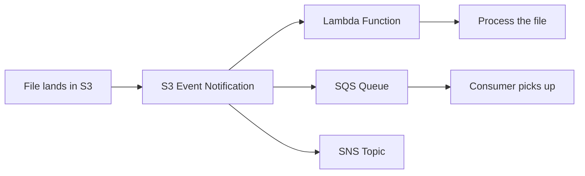

# AWS S3 — Intermediate Concepts

## Versioning

S3 versioning keeps every version of every object, enabling recovery from accidental deletes or overwrites.

```python
# Enable versioning on a bucket
s3.put_bucket_versioning(
    Bucket='my-data-lake',
    VersioningConfiguration={'Status': 'Enabled'}
)

# When you overwrite a file, the old version is preserved
s3.put_object(Bucket='my-data-lake', Key='config.json', Body=b'v1')
s3.put_object(Bucket='my-data-lake', Key='config.json', Body=b'v2')  # v1 still exists!

# List all versions of an object
versions = s3.list_object_versions(Bucket='my-data-lake', Prefix='config.json')
for v in versions['Versions']:
    print(f"  Version: {v['VersionId']}, Last Modified: {v['LastModified']}")

# Restore a previous version (copy old version to current)
s3.copy_object(
    Bucket='my-data-lake',
    Key='config.json',
    CopySource={'Bucket': 'my-data-lake', 'Key': 'config.json', 'VersionId': 'old-version-id'}
)
```

**Delete behavior with versioning:**
- `DELETE` creates a "delete marker" (object appears deleted but versions remain)
- To truly delete: specify the VersionId explicitly
- To undelete: remove the delete marker

> **Cost warning:** Every version consumes storage. Enable lifecycle rules to expire old versions after N days.

---

## Event Notifications

S3 can trigger actions when objects are created, deleted, or modified — enabling event-driven pipelines:



**What this shows:**
- A file upload triggers an event automatically
- You can route events to Lambda (instant processing), SQS (queued processing), or SNS (fan-out to multiple consumers)
- This eliminates polling — no need to check S3 repeatedly for new files

**Configuration example:**

```json
{
    "LambdaFunctionConfigurations": [
        {
            "LambdaFunctionArn": "arn:aws:lambda:us-east-1:123:function:process-upload",
            "Events": ["s3:ObjectCreated:*"],
            "Filter": {
                "Key": {
                    "FilterRules": [
                        {"Name": "prefix", "Value": "raw/orders/"},
                        {"Name": "suffix", "Value": ".parquet"}
                    ]
                }
            }
        }
    ]
}
```

**Use case in DE:** File lands in `raw/orders/` → Lambda triggers Glue job → transforms and loads to warehouse. Fully event-driven, no scheduler needed.

---

## S3 Select and Glacier Select

Query data **inside** S3 objects without downloading the entire file:

```python
# Query a CSV file in S3 using SQL (only transfer matching rows!)
response = s3.select_object_content(
    Bucket='my-data-lake',
    Key='raw/large_file.csv',
    ExpressionType='SQL',
    Expression="SELECT customer_id, amount FROM s3object WHERE amount > 1000",
    InputSerialization={'CSV': {'FileHeaderInfo': 'USE'}},
    OutputSerialization={'JSON': {}}
)

# Only the matching rows are transferred — not the entire file
for event in response['Payload']:
    if 'Records' in event:
        print(event['Records']['Payload'].decode())
```

**When to use:**
- Quick exploration of large CSV/JSON files without Athena
- Filtering data before download (save bandwidth/time)
- NOT for Parquet analytics (use Athena or Spark instead)

---

## Cross-Region Replication (CRR)

Automatically copy objects to a bucket in another region — for disaster recovery or compliance:

```python
# Enable replication
replication_config = {
    'Role': 'arn:aws:iam::123:role/S3ReplicationRole',
    'Rules': [{
        'Status': 'Enabled',
        'Destination': {
            'Bucket': 'arn:aws:s3:::my-data-lake-dr-eu',
            'StorageClass': 'STANDARD_IA'  # Save cost in DR region
        },
        'Filter': {'Prefix': 'curated/'},  # Only replicate curated data
    }]
}
s3.put_bucket_replication(Bucket='my-data-lake', ReplicationConfiguration=replication_config)
```

**Replication types:**

| Type | Scope | Use Case |
|------|-------|----------|
| Cross-Region (CRR) | Different regions | DR, compliance (data residency) |
| Same-Region (SRR) | Same region, different bucket | Log aggregation, prod/backup separation |

---

## Presigned URLs (Secure Temporary Access)

Grant temporary access to an S3 object without sharing credentials:

```python
# Generate a download URL valid for 1 hour
url = s3.generate_presigned_url(
    ClientMethod='get_object',
    Params={'Bucket': 'my-data-lake', 'Key': 'reports/monthly-summary.pdf'},
    ExpiresIn=3600  # 1 hour
)
print(url)
# https://my-data-lake.s3.amazonaws.com/reports/monthly-summary.pdf?X-Amz-Signature=...

# Generate an upload URL (allow external party to upload)
upload_url = s3.generate_presigned_url(
    ClientMethod='put_object',
    Params={'Bucket': 'my-data-lake', 'Key': 'uploads/partner-data.csv'},
    ExpiresIn=1800  # 30 minutes
)
```

**Use case:** Allow a partner to upload a file to your S3 without giving them AWS credentials. The URL expires after the specified time.

---

## Multipart Upload (Large Files)

For files > 100 MB, use multipart upload for reliability and performance:

```python
from boto3.s3.transfer import TransferConfig

# Configure multipart upload
config = TransferConfig(
    multipart_threshold=100 * 1024 * 1024,   # 100 MB
    multipart_chunksize=50 * 1024 * 1024,    # 50 MB parts
    max_concurrency=10                        # Upload 10 parts in parallel
)

# Upload large file with multipart
s3.upload_file(
    'huge_dataset.parquet',
    'my-data-lake',
    'raw/huge_dataset.parquet',
    Config=config
)
```

**Benefits:**
- Parallel upload of parts (faster than single stream)
- If one part fails, only that part is retried (not the whole file)
- Can pause and resume uploads
- Required for files > 5 GB (S3 single PUT limit)

---

## S3 Access Points

Simplify access management for shared buckets with many consumers:

```python
# Create an access point with restricted permissions
s3control = boto3.client('s3control')
s3control.create_access_point(
    AccountId='123456789012',
    Name='analytics-team-ap',
    Bucket='my-data-lake',
    PublicAccessBlockConfiguration={
        'BlockPublicAcls': True,
        'BlockPublicPolicy': True,
        'IgnorePublicAcls': True,
        'RestrictPublicBuckets': True
    }
)

# Access point policy: analytics team can only read curated/
access_point_policy = {
    "Version": "2012-10-17",
    "Statement": [{
        "Effect": "Allow",
        "Principal": {"AWS": "arn:aws:iam::123:role/AnalyticsRole"},
        "Action": ["s3:GetObject"],
        "Resource": "arn:aws:s3:us-east-1:123:accesspoint/analytics-team-ap/object/curated/*"
    }]
}
```

**Benefits:** Each team gets their own access point with tailored permissions — instead of one complex bucket policy that's hard to maintain.

---

## S3 Inventory (Auditing What You Have)

Automatically generate reports of all objects in your bucket:

```json
{
    "Destination": {
        "S3BucketDestination": {
            "Bucket": "arn:aws:s3:::inventory-reports",
            "Format": "Parquet",
            "Prefix": "s3-inventory/"
        }
    },
    "IsEnabled": true,
    "Id": "daily-inventory",
    "IncludedObjectVersions": "Current",
    "OptionalFields": ["Size", "LastModifiedDate", "StorageClass", "IntelligentTieringAccessTier"],
    "Schedule": {"Frequency": "Daily"}
}
```

**Use cases:**
- Find large unused objects (cost optimization)
- Audit encryption status (compliance)
- Count objects per prefix (monitoring)
- Input to lifecycle rule planning

---

## Interview Tips

> **Tip 1:** "How do you handle file arrival detection in S3?" — "S3 Event Notifications. When a file lands in a specific prefix, S3 triggers a Lambda or sends to SQS. The consumer processes the file. This is fully event-driven — no polling. For batch, I might use a success marker file (_SUCCESS) that a sensor watches."

> **Tip 2:** "How do you secure data in S3?" — "Encryption at rest (SSE-KMS for audit trail), bucket policies for cross-account access, VPC endpoints for private access (no internet), Block Public Access enabled, and versioning + MFA Delete for critical data."

> **Tip 3:** "How do you deal with the small files problem?" — "Many small files (< 128 MB) slow down Spark/Athena because each file requires a separate S3 GET request and adds metadata overhead. Solution: compact small files into larger ones (128 MB–1 GB) using a Spark job, Glue compaction, or Delta Lake/Iceberg OPTIMIZE command."
