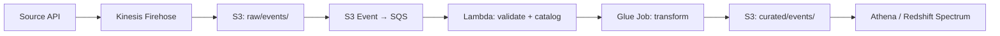

# AWS S3 — Real-World Production Examples

## Pattern 1: Event-Driven Ingestion Pipeline



**What this shows:**
- Kinesis Firehose buffers streaming events and writes to S3 in batches (128 MB or 5 min)
- S3 event notification triggers processing when files land
- Lambda validates schema and registers in Glue Catalog
- Glue ETL transforms and writes to curated zone
- Athena queries curated data directly from S3

**Firehose configuration for optimal file sizes:**

```python
firehose.create_delivery_stream(
    DeliveryStreamName='events-to-s3',
    S3DestinationConfiguration={
        'BucketARN': 'arn:aws:s3:::data-lake',
        'Prefix': 'raw/events/year=!{timestamp:yyyy}/month=!{timestamp:MM}/day=!{timestamp:dd}/',
        'ErrorOutputPrefix': 'errors/events/',
        'BufferingHints': {
            'SizeInMBs': 128,       # Buffer up to 128 MB
            'IntervalInSeconds': 300  # Or flush every 5 minutes
        },
        'CompressionFormat': 'GZIP',
    }
)
```

---

## Pattern 2: Cross-Account Data Sharing

```python
# Account A (data producer) grants access to Account B (data consumer)

# Step 1: Bucket policy allowing cross-account access
bucket_policy = {
    "Version": "2012-10-17",
    "Statement": [
        {
            "Sid": "AllowCrossAccountRead",
            "Effect": "Allow",
            "Principal": {"AWS": "arn:aws:iam::ACCOUNT_B_ID:root"},
            "Action": [
                "s3:GetObject",
                "s3:ListBucket"
            ],
            "Resource": [
                "arn:aws:s3:::shared-data-bucket",
                "arn:aws:s3:::shared-data-bucket/shared/*"
            ],
            "Condition": {
                "StringEquals": {"aws:PrincipalOrgID": "o-myorgid"}
            }
        }
    ]
}

# Step 2: Account B assumes role and accesses data
# In Account B's Glue/Spark job:
df = spark.read.parquet("s3://shared-data-bucket/shared/fact_sales/")
```

---

## Pattern 3: Data Lake Migration (On-Prem to S3)

**Scenario:** Migrate 500 TB of historical data from on-premises HDFS to S3.

```python
# Phase 1: Bulk transfer with AWS DataSync or Snowball
# For 500 TB: order AWS Snowball Edge devices (physical transfer)
# Each Snowball holds 80 TB → need ~7 devices

# Phase 2: Ongoing sync with DataSync (after initial load)
import boto3
datasync = boto3.client('datasync')

task = datasync.create_task(
    SourceLocationArn='arn:aws:datasync:us-east-1:123:location/loc-abc',  # On-prem NFS
    DestinationLocationArn='arn:aws:datasync:us-east-1:123:location/loc-xyz',  # S3
    Options={
        'VerifyMode': 'ONLY_FILES_TRANSFERRED',
        'TransferMode': 'CHANGED',  # Only transfer new/modified files
        'PreserveDeletedFiles': 'PRESERVE',
    },
    Schedule={'ScheduleExpression': 'cron(0 4 * * ? *)'}  # Daily at 4 AM
)
```

**Migration validation:**

```sql
-- Compare row counts between HDFS source and S3 destination
-- Run in Spark (connects to both)
hdfs_count = spark.read.parquet("hdfs:///warehouse/fact_sales/").count()
s3_count = spark.read.parquet("s3://data-lake/curated/fact_sales/").count()
assert hdfs_count == s3_count, f"Mismatch: HDFS={hdfs_count}, S3={s3_count}"
```

---

## Pattern 4: S3 Cost Report and Optimization

```sql
-- Query S3 Inventory (exported to Athena-queryable format)
-- Find largest prefixes and potential savings

WITH object_stats AS (
    SELECT
        SPLIT_PART(key, '/', 1) AS zone,
        SPLIT_PART(key, '/', 2) AS domain,
        storage_class,
        size,
        last_modified_date,
        DATEDIFF(day, last_modified_date, CURRENT_DATE) AS days_since_modified
    FROM s3_inventory_data
)
SELECT
    zone,
    domain,
    storage_class,
    COUNT(*) AS object_count,
    ROUND(SUM(size) / POWER(1024, 3), 2) AS total_gb,
    ROUND(SUM(CASE WHEN days_since_modified > 90 THEN size ELSE 0 END) / POWER(1024, 3), 2) AS stale_gb,
    ROUND(
        SUM(CASE WHEN days_since_modified > 90 THEN size ELSE 0 END) * 100.0 / NULLIF(SUM(size), 0), 
    1) AS stale_pct
FROM object_stats
GROUP BY zone, domain, storage_class
HAVING SUM(size) > 1073741824  -- Only show > 1 GB
ORDER BY total_gb DESC;

-- Estimated monthly savings from lifecycle transitions:
-- stale_gb in Standard ($0.023/GB) → Standard-IA ($0.0125/GB)
-- Savings per TB moved: ($0.023 - $0.0125) * 1024 = ~$10.75/TB/month
```

---

## Pattern 5: Disaster Recovery and Compliance

```python
# Multi-region setup for critical data

# Primary: us-east-1 (main data lake)
# DR: eu-west-1 (cross-region replicated)

# Enable versioning + replication
s3.put_bucket_versioning(Bucket='primary-lake', VersioningConfiguration={'Status': 'Enabled'})

# Replication rule: critical data replicated to DR region
replication_config = {
    'Role': 'arn:aws:iam::123:role/S3ReplicationRole',
    'Rules': [{
        'ID': 'replicate-critical',
        'Status': 'Enabled',
        'Filter': {'And': {'Prefix': 'curated/', 'Tags': [{'Key': 'critical', 'Value': 'true'}]}},
        'Destination': {
            'Bucket': 'arn:aws:s3:::dr-lake-eu',
            'ReplicationTime': {'Status': 'Enabled', 'Time': {'Minutes': 15}},  # SLA: 15 min
            'Metrics': {'Status': 'Enabled', 'EventThreshold': {'Minutes': 15}}
        },
        'DeleteMarkerReplication': {'Status': 'Enabled'},
    }]
}

# Object Lock for regulatory compliance (7-year retention)
# Applied to financial records that must not be deleted
s3.put_object_retention(
    Bucket='compliance-lake',
    Key='finance/audit_trail/2024/transactions.parquet',
    Retention={'Mode': 'COMPLIANCE', 'RetainUntilDate': datetime(2031, 12, 31)}
)
```

---

## Production Monitoring Checklist

| Metric | Source | Alert Threshold |
|--------|--------|----------------|
| 4xx errors (AccessDenied) | CloudWatch S3 metrics | > 100/hour |
| 5xx errors (server-side) | CloudWatch S3 metrics | > 10/hour |
| Bucket size growth rate | S3 Storage Lens | > 2x normal daily |
| Replication lag | Replication metrics | > 15 minutes |
| Lifecycle transition failures | CloudTrail | Any |
| Object count per prefix | S3 Inventory | > 1M in single prefix |
| Monthly cost | Cost Explorer | > budget threshold |

---

## Interview Tips

> **Tip 1:** "Walk me through a production S3 data lake" — "Three-zone architecture (raw/curated/analytics). Raw stores data as-is from sources. A processing layer (Glue/Spark) validates, deduplicates, and converts to Parquet in curated/. Gold zone has pre-computed aggregates for dashboards. Lifecycle rules transition cold data to cheaper storage. Glue Catalog provides schema and discovery."

> **Tip 2:** "How do you handle 100 TB of data cost-effectively?" — "Tiered storage: last 30 days in Standard ($0.023/GB), 30-365 days in IA ($0.0125/GB), older in Glacier ($0.004/GB). Use S3 Inventory + Athena to analyze what's stale. Compact small files to reduce per-request costs. Set abort rules for incomplete multipart uploads."

> **Tip 3:** "How do you ensure S3 data integrity?" — "Three mechanisms: (1) S3 checksums (MD5/SHA256) verified on upload, (2) Cross-region replication for DR with 15-min SLA monitoring, (3) Versioning + Object Lock for compliance data that must never be altered. Plus data quality checks at the application layer after every write."
