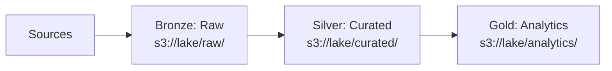

# AWS S3 — Senior-Level Deep Dive

## Data Lake Architecture on S3

### The Medallion Architecture (Bronze/Silver/Gold)



**What this shows:**
- **Bronze (raw/):** Data exactly as received from sources. Append-only. Full history. Format: original (JSON, CSV, Parquet).
- **Silver (curated/):** Cleaned, deduplicated, typed, validated. Format: Parquet/Delta with schema enforcement.
- **Gold (analytics/):** Business-level aggregations, denormalized for BI. Format: Parquet/Delta, optimized for specific queries.

**Bucket structure:**

```
s3://company-data-lake/
├── raw/                          # Bronze: immutable source data
│   ├── orders/dt=2024-01-15/     # Partitioned by ingestion date
│   ├── events/dt=2024-01-15/
│   └── _metadata/                # Schema registry, data contracts
├── curated/                      # Silver: clean, typed
│   ├── fact_orders/year=2024/month=01/
│   ├── dim_customer/             # Latest snapshot (SCD)
│   └── _quality_reports/         # DQ check results
├── analytics/                    # Gold: business aggregates
│   ├── daily_revenue/
│   ├── customer_360/
│   └── _dashboards/              # Dashboard-specific views
└── _admin/                       # Lake metadata
    ├── schemas/
    ├── lineage/
    └── access_logs/
```

---

## S3 Performance at Scale

### Request Rate Limits

S3 supports **5,500 GET/s and 3,500 PUT/s per prefix** (partition). With proper prefix design, this scales infinitely.

**Problem scenario:**
```
All files under one prefix:
s3://bucket/data/file_001.parquet  ← All 5,500 GET/s shared here
s3://bucket/data/file_002.parquet
s3://bucket/data/file_999.parquet
```

**Solution — distribute across prefixes:**
```
Hash-distributed prefixes:
s3://bucket/a1/data/file_001.parquet   ← 5,500 GET/s each
s3://bucket/b2/data/file_002.parquet   ← 5,500 GET/s each
s3://bucket/c3/data/file_003.parquet   ← 5,500 GET/s each
```

> **Modern note:** Since 2018, S3 automatically partitions internally for high request rates. Prefix-based distribution is rarely needed now unless you're doing 50K+ requests/second to the same prefix consistently.

### Optimal File Sizes for Analytics

| File Size | Problem | Impact |
|-----------|---------|--------|
| < 1 MB | Too many files ("small files problem") | LIST calls dominate, Spark task overhead |
| 1–64 MB | Suboptimal for Spark/Athena | High task startup overhead |
| **128 MB–1 GB** | **Optimal** | **Good balance of parallelism and overhead** |
| > 2 GB | Too large for some engines | Can't split across workers efficiently |

**Compaction strategy:**

```python
# Spark: compact small files into optimal size
spark.read.parquet("s3://lake/raw/events/dt=2024-01-15/") \
    .repartition(10) \  # 10 output files (~500MB each from 5GB input)
    .write.mode("overwrite") \
    .parquet("s3://lake/curated/events/dt=2024-01-15/")
```

---

## Cost Optimization Strategies

### Strategy 1: Lifecycle Policies by Zone

```python
# Raw data: keep 90 days in Standard, then IA, then Glacier
# Curated data: keep 1 year in Standard, then IA
# Analytics: always Standard (frequently queried)

lifecycle_rules = [
    {
        'ID': 'raw-tiering',
        'Filter': {'Prefix': 'raw/'},
        'Status': 'Enabled',
        'Transitions': [
            {'Days': 90, 'StorageClass': 'STANDARD_IA'},
            {'Days': 365, 'StorageClass': 'GLACIER_IR'},
        ],
        'Expiration': {'Days': 2555},  # 7 years (compliance)
    },
    {
        'ID': 'curated-tiering',
        'Filter': {'Prefix': 'curated/'},
        'Status': 'Enabled',
        'Transitions': [
            {'Days': 365, 'StorageClass': 'STANDARD_IA'},
        ],
    },
    {
        'ID': 'delete-temp-files',
        'Filter': {'Prefix': '_temp/'},
        'Status': 'Enabled',
        'Expiration': {'Days': 1},  # Delete after 1 day
    },
]
```

### Strategy 2: Cost Analysis with S3 Storage Lens

```sql
-- Query S3 Inventory (exported as Parquet) to find cost hotspots
SELECT 
    SPLIT_PART(key, '/', 1) AS zone,
    storage_class,
    COUNT(*) AS object_count,
    SUM(size) / POWER(1024, 4) AS total_tb,
    SUM(CASE WHEN last_modified_date < CURRENT_DATE - 90 
        THEN size ELSE 0 END) / POWER(1024, 4) AS stale_tb
FROM s3_inventory
GROUP BY zone, storage_class
ORDER BY total_tb DESC;
```

### Strategy 3: Delete Incomplete Multipart Uploads

Abandoned multipart uploads silently consume storage:

```python
# Add lifecycle rule to clean up incomplete multipart uploads
s3.put_bucket_lifecycle_configuration(
    Bucket='my-data-lake',
    LifecycleConfiguration={
        'Rules': [{
            'ID': 'abort-incomplete-multipart',
            'Status': 'Enabled',
            'Filter': {'Prefix': ''},
            'AbortIncompleteMultipartUpload': {'DaysAfterInitiation': 7}
        }]
    }
)
```

---

## S3 + Query Engines Integration

### Athena (Serverless SQL on S3)

```sql
-- Create external table pointing to S3 data
CREATE EXTERNAL TABLE fact_sales (
    order_id STRING,
    customer_id STRING,
    amount DOUBLE,
    order_date DATE
)
PARTITIONED BY (year INT, month INT)
STORED AS PARQUET
LOCATION 's3://data-lake/curated/fact_sales/';

-- Add partitions (or use MSCK REPAIR TABLE for auto-discovery)
ALTER TABLE fact_sales ADD PARTITION (year=2024, month=1)
    LOCATION 's3://data-lake/curated/fact_sales/year=2024/month=01/';

-- Query (only scans relevant partitions)
SELECT customer_id, SUM(amount)
FROM fact_sales
WHERE year = 2024 AND month = 1
GROUP BY customer_id;
```

### Spark (EMR/Glue/Databricks)

```python
# Read with partition discovery
df = spark.read.parquet("s3://data-lake/curated/fact_sales/")
# Spark auto-discovers year=*/month=* partition columns

# Write with partition
df.write \
    .partitionBy("year", "month") \
    .mode("overwrite") \
    .parquet("s3://data-lake/curated/fact_sales/")
```

---

## Data Governance on S3

### Lake Formation Integration

```
AWS Lake Formation provides:
├── Fine-grained access control (column-level, row-level)
├── Data catalog (Glue Catalog integration)
├── Cross-account sharing (governed)
└── Audit logging (who accessed what)
```

### S3 Object Lock (WORM — Write Once Read Many)

For compliance requirements where data must not be deleted or modified:

```python
# Enable Object Lock on bucket (must be set at bucket creation)
# Governance mode: admins CAN override
# Compliance mode: NOBODY can delete until retention expires

s3.put_object_retention(
    Bucket='compliance-bucket',
    Key='audit/2024/financial_records.parquet',
    Retention={
        'Mode': 'COMPLIANCE',
        'RetainUntilDate': datetime(2031, 1, 1)  # 7-year retention
    }
)
```

---

## Common Anti-Patterns

| Anti-Pattern | Problem | Fix |
|-------------|---------|-----|
| Thousands of tiny files (<1 MB) | Slow queries, high API costs | Compact into 128MB-1GB files |
| No partitioning | Full table scan for every query | Partition by date + key columns |
| Using CSV for analytics | No schema, no compression, slow | Convert to Parquet |
| Storing temp data indefinitely | Wasted storage cost | Lifecycle rules to expire in 1 day |
| Single bucket for everything | Complex permissions, hard to manage | Separate by environment/sensitivity |
| No versioning on critical data | Can't recover from accidental delete | Enable versioning + MFA Delete |

---

## Interview Tips

> **Tip 1:** "Design a data lake on S3" — "Medallion architecture: Bronze (raw as-is), Silver (cleaned/typed Parquet), Gold (business aggregates). Hive-style partitioning by date. Lifecycle rules for cost optimization. Glue Catalog for schema discovery. Athena for ad-hoc queries."

> **Tip 2:** "How do you handle the small files problem?" — "Three approaches: (1) Compaction job (Spark repartition + overwrite), (2) Delta Lake OPTIMIZE command (auto-compacts), (3) Streaming: buffer in Kinesis Firehose with 128MB buffer size before writing to S3."

> **Tip 3:** "How do you ensure data quality in a data lake?" — "Schema-on-read is the trap — data quality issues hide until query time. Solution: enforce schema at the Silver layer (reject rows that don't conform), run automated DQ checks after each load (null rates, duplicates, row counts vs thresholds), quarantine bad records separately for investigation."

## ⚡ Cheat Sheet

**Storage classes decision**
| Class | Access pattern | Min duration | Cost model |
|---|---|---|---|
| Standard | Frequent | None | GB/month |
| Intelligent-Tiering | Unknown | 30 days | GB + monitoring fee |
| Standard-IA | Infrequent | 30 days | Lower storage, retrieval fee |
| One Zone-IA | Infrequent, non-critical | 30 days | Cheaper, single AZ |
| Glacier Instant | Archive, ms retrieval | 90 days | Very low storage |
| Glacier Flexible | Archive, hours retrieval | 90 days | Lowest storage |
| Deep Archive | Long-term, 12h retrieval | 180 days | Cheapest |

**Lifecycle rules**
```json
{"Rules": [{"Filter": {"Prefix": "logs/"}, "Status": "Enabled",
  "Transitions": [
    {"Days": 30, "StorageClass": "STANDARD_IA"},
    {"Days": 90, "StorageClass": "GLACIER"}
  ],
  "Expiration": {"Days": 365}}]}
```

**Performance**
- Request rate: 3,500 PUT/COPY/DELETE + 5,500 GET per prefix per second
- Use random prefixes or date-based partitioning to distribute across prefixes
- Multipart upload: required >5 GB; recommended >100 MB; parallel part upload
- Transfer Acceleration: CloudFront edge network; use for cross-region uploads

**Security**
- Block Public Access: enable at account level; overrides bucket/object ACLs
- Bucket policies vs IAM: both evaluated; explicit deny wins; IAM alone sufficient for cross-account
- Encryption: SSE-S3 (default), SSE-KMS (audit trail), SSE-C (customer-provided key)
- VPC endpoint: S3 traffic stays within AWS network (no NAT gateway cost)

**Consistency model**
- Strong consistency (since Dec 2020): read-after-write for all operations
- No eventual consistency edge cases; safe to list after PUT

**Key S3 features for DE**
- Event notifications: Lambda/SQS/SNS on `s3:ObjectCreated`; trigger pipelines
- S3 Inventory: daily/weekly CSV of objects + metadata; replace expensive LIST calls
- Object Lock (WORM): compliance mode (even root can't delete) vs governance mode
