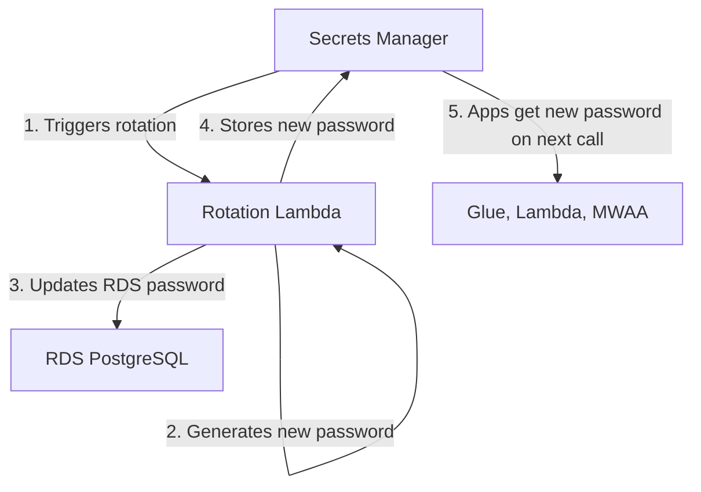

# Scenario Questions — AWS Secrets Manager

<article data-difficulty="junior">

## 🟢 Junior: Store and Retrieve Database Credentials

**Scenario:** Your Glue ETL job currently has database credentials hardcoded in the script. Refactor it to use Secrets Manager instead. Show how to store the secret and retrieve it in the job.

<details>
<summary>✅ Solution</summary>

```python
# Step 1: Store credentials (one-time setup via CLI or console)
import boto3, json

secrets = boto3.client('secretsmanager')
secrets.create_secret(
    Name='prod/source-db/credentials',
    SecretString=json.dumps({
        'host': 'source-db.xxx.rds.amazonaws.com',
        'port': 5432,
        'dbname': 'production',
        'username': 'etl_reader',
        'password': 'original-hardcoded-password'
    })
)

# Step 2: Refactor Glue job to retrieve credentials at runtime
# BEFORE (insecure):
# connection_url = "jdbc:postgresql://source-db.xxx:5432/production"
# username = "etl_reader"
# password = "hardcoded-password-BAD!"

# AFTER (secure):
def get_credentials(secret_name):
    client = boto3.client('secretsmanager')
    response = client.get_secret_value(SecretId=secret_name)
    return json.loads(response['SecretString'])

creds = get_credentials('prod/source-db/credentials')
connection_url = f"jdbc:postgresql://{creds['host']}:{creds['port']}/{creds['dbname']}"

df = glueContext.create_dynamic_frame.from_options(
    connection_type="postgresql",
    connection_options={
        "url": connection_url,
        "user": creds['username'],
        "password": creds['password'],
        "dbtable": "public.orders"
    }
)

# Step 3: Ensure Glue IAM role has permission to read the secret
# IAM policy needed on the Glue role:
# Action: secretsmanager:GetSecretValue
# Resource: arn:aws:secretsmanager:us-east-1:123:secret:prod/source-db/credentials*
```

**Benefits over hardcoded:**
- Password not in source code (no risk if code is leaked/shared)
- Can rotate password without deploying new code
- Audit trail: CloudTrail logs who accessed the secret
- Access control: only the Glue role can read it (not developers)

</details>

</article>

<article data-difficulty="mid-level">

## 🟡 Mid-Level: Design Secret Rotation with Zero Downtime

**Scenario:** Your RDS PostgreSQL database password needs to rotate every 30 days (compliance requirement). Multiple services (3 Glue jobs, 2 Lambdas, 1 MWAA environment) use this password. Design rotation that doesn't break any of them.

<details>
<summary>✅ Solution</summary>

**Architecture:**



This diagram shows the rotation flow: Secrets Manager invokes the rotation Lambda on schedule, the Lambda generates a new password and updates RDS, then stores the new value back in Secrets Manager so consuming services pick it up on their next retrieval.

**Implementation:**

```python
# Rotation Lambda (AWS provides templates for RDS)
# The Lambda performs these 4 steps:
# 1. createSecret: generate new password, store as AWSPENDING
# 2. setSecret: update the database with the new password
# 3. testSecret: verify new password works
# 4. finishSecret: promote AWSPENDING to AWSCURRENT

# Enable rotation:
secrets.rotate_secret(
    SecretId='prod/rds/credentials',
    RotationLambdaARN='arn:aws:lambda:...:function:SecretsManagerRDSPostgreSQLRotation',
    RotationRules={'AutomaticallyAfterDays': 30}
)
```

**Zero-downtime design for all consumers:**

```python
# All consuming services must NOT cache the password indefinitely!

# Pattern: cache with short TTL (5 minutes)
import time

_secret_cache = {}
_cache_ttl = 300  # 5 minutes

def get_secret_with_cache(name):
    now = time.time()
    if name in _secret_cache and (now - _secret_cache[name]['time']) < _cache_ttl:
        return _secret_cache[name]['value']
    
    client = boto3.client('secretsmanager')
    value = json.loads(client.get_secret_value(SecretId=name)['SecretString'])
    _secret_cache[name] = {'value': value, 'time': now}
    return value

# For Glue: each job run calls get_secret_value() fresh (no persistent cache)
# For Lambda: cache expires between invocations or after 5 min (warm container)
# For MWAA: Secrets Manager backend refreshes automatically per task execution
```

**Rotation timeline (what happens during the 30-second rotation window):**
1. `t=0`: Rotation Lambda generates new password, stores as `AWSPENDING`
2. `t=5s`: Lambda updates RDS to accept BOTH old and new passwords
3. `t=10s`: Lambda tests new password → works!
4. `t=15s`: Lambda promotes: new password → `AWSCURRENT`, old → `AWSPREVIOUS`
5. `t=15s+`: Any app calling `get_secret_value()` gets the new password
6. `t=15s-5min`: Apps with cached old password still work (RDS accepts both briefly)
7. `t=5min+`: Old password eventually expires from RDS

**No app breaks because:**
- RDS accepts both passwords during transition
- Apps that cache refresh within 5 minutes
- Apps that don't cache always get the current password

</details>

</article>

<article data-difficulty="senior">

## 🔴 Senior: Multi-Account Secret Management for Data Platform

**Scenario:** Your data platform spans 5 AWS accounts (central data lake, 3 domain teams, 1 analytics). Each account needs access to shared database credentials managed by the central account. Design a cross-account secrets management strategy.

<details>
<summary>✅ Solution</summary>

**Architecture: Central Secrets + Cross-Account Access**

```python
# Central account (111111111111): owns all secrets
# Domain accounts (222222222222, 333333333333, 444444444444): consume secrets
# Analytics account (555555555555): consumes secrets

# Option 1: Resource-based policy on the secret (recommended)
secrets.put_resource_policy(
    SecretId='shared/data-lake/redshift',
    ResourcePolicy=json.dumps({
        "Version": "2012-10-17",
        "Statement": [{
            "Effect": "Allow",
            "Principal": {
                "AWS": [
                    "arn:aws:iam::222222222222:role/GlueETLRole",
                    "arn:aws:iam::333333333333:role/GlueETLRole",
                    "arn:aws:iam::444444444444:role/GlueETLRole",
                    "arn:aws:iam::555555555555:role/AnalyticsRole",
                ]
            },
            "Action": "secretsmanager:GetSecretValue",
            "Resource": "*",
            "Condition": {
                "StringEquals": {"aws:PrincipalOrgID": "o-myorgid"}
            }
        }]
    })
)

# Domain account Glue job: access cross-account secret
def get_cross_account_secret(secret_arn):
    """Retrieve secret from central account."""
    client = boto3.client('secretsmanager')  
    # Works because resource policy grants our role access
    return json.loads(
        client.get_secret_value(SecretId=secret_arn)['SecretString']
    )

creds = get_cross_account_secret(
    'arn:aws:secretsmanager:us-east-1:111111111111:secret:shared/data-lake/redshift-AbCdEf'
)
```

**Option 2: Secret Replication (for multi-region + faster access)**

```python
# Replicate secret from central account to each domain account's region
secrets.replicate_secret_to_regions(
    SecretId='shared/data-lake/redshift',
    AddReplicaRegions=[
        {'Region': 'us-east-1'},   # Same region replica
        {'Region': 'eu-west-1'},   # EU region replica
    ]
)
# Each region has a local copy — lower latency, survives regional outage
```

**Naming convention for multi-account:**
```
Central account secrets:
  shared/data-lake/redshift           — Shared Redshift creds (all teams)
  shared/data-lake/s3-access-key      — Shared S3 access (legacy)
  domain/crm/source-db                — CRM team's source DB (only CRM account)
  domain/payments/source-db           — Payments team's source DB

IAM policy pattern:
  CRM account role → access: shared/* + domain/crm/*
  Payments account role → access: shared/* + domain/payments/*
  Analytics account → access: shared/* (read-only)
```

**Audit and compliance:**
```python
# CloudTrail logs every GetSecretValue call with:
# - Who (principal ARN + account ID)
# - When (timestamp)
# - Which secret (ARN)
# - Source IP

# Automated compliance alert:
# EventBridge rule → detect GetSecretValue from unexpected accounts
events.put_rule(
    Name='unauthorized-secret-access',
    EventPattern=json.dumps({
        "source": ["aws.secretsmanager"],
        "detail-type": ["AWS API Call via CloudTrail"],
        "detail": {
            "eventName": ["GetSecretValue"],
            "userIdentity": {
                "accountId": [{"anything-but": ["111111111111", "222222222222", ...]}]
            }
        }
    })
)
# Alerts if ANY account outside the allowed list tries to access secrets
```

</details>

</article>

---

## ⚡ Quick-fire Q&A

**Q: What is AWS Secrets Manager and how does it differ from SSM Parameter Store?**
A: Secrets Manager is purpose-built for secret storage with built-in automatic rotation, cross-account access, and a higher cost per secret (~$0.40/month). SSM Parameter Store is a general configuration and secret store — SecureString parameters use KMS encryption. Use Secrets Manager when you need automatic rotation; use Parameter Store for non-rotating config values and cost-sensitive scenarios.

**Q: How does Secrets Manager automatic rotation work?**
A: Rotation uses a Lambda function (provided by AWS for supported databases or custom for others) that: creates a new secret version, updates the credentials in the target system (e.g., RDS password), tests the new credentials, and marks the new version as AWSCURRENT. The old version becomes AWSPREVIOUS and is retained briefly for in-flight connections.

**Q: What is the Secrets Manager caching best practice for Lambda functions?**
A: Calling `GetSecretValue` on every Lambda invocation adds latency and API cost. Use the AWS Secrets Manager Lambda Extension or the Secrets Manager caching client library to cache secrets in memory. The extension caches secrets for a configurable TTL, reducing API calls to Secrets Manager while keeping credentials current.

**Q: How do you reference Secrets Manager secrets in CloudFormation or ECS task definitions?**
A: In ECS task definitions, reference secrets using the ARN or name of the secret in the `secrets` block — ECS injects them as environment variables at container start. In CloudFormation, use dynamic references (`{{resolve:secretsmanager:MySecret:SecretString:username}}`) to inject secret values at stack deployment time.

**Q: What IAM permissions are needed to access a secret?**
A: The calling principal needs `secretsmanager:GetSecretValue` on the specific secret ARN. If the secret is encrypted with a customer-managed KMS key (not the default), the principal also needs `kms:Decrypt` on that key. Resource-based policies on the secret can grant cross-account access.

**Q: How do you enable cross-account secret access?**
A: Attach a resource-based policy to the secret allowing the principal from the other account (`sts:AssumeRole` or a specific role ARN) to call `GetSecretValue`. The cross-account role must also have IAM permissions to call `GetSecretValue`. If using a CMK, share KMS key access across accounts as well.

**Q: What is the difference between AWSCURRENT, AWSPENDING, and AWSPREVIOUS secret versions?**
A: During rotation, Secrets Manager uses staging labels: AWSPENDING (new credentials being rotated in), AWSCURRENT (active credentials), and AWSPREVIOUS (previous credentials, retained briefly for graceful cutover). Applications should always retrieve AWSCURRENT; the rotation Lambda manages label transitions.

**Q: How do you audit secret access in Secrets Manager?**
A: All Secrets Manager API calls are logged in AWS CloudTrail — including `GetSecretValue`, `PutSecretValue`, `RotateSecret`, and `DeleteSecret`. Set up CloudWatch alarms on unusual access patterns (e.g., unexpected `GetSecretValue` calls from unknown principals) for security monitoring.

---

## 💼 Interview Tips

- Lead with the core principle: never store credentials in code, environment variables (in plaintext), or configuration files — Secrets Manager and SSM Parameter Store exist to externalize and manage secrets securely.
- Know the Secrets Manager vs. Parameter Store decision criteria cold: rotation built-in → Secrets Manager; static config/non-rotating values → Parameter Store SecureString (cheaper); need cross-account secret sharing → Secrets Manager.
- Senior interviewers probe rotation implementation: describe the four-phase rotation Lambda (create, set, test, finish) and explain why AWSPREVIOUS is retained — to handle in-flight connections still using the old password during the cutover window.
- Mention the Lambda Extension for caching as a production best practice: calling `GetSecretValue` on every Lambda invocation adds 10-50ms latency and unnecessary API cost — caching is essential for high-throughput functions.
- Demonstrate security awareness: discuss the blast radius of a compromised secret and how automatic rotation limits the exposure window — a 30-day rotation cycle means a leaked credential is valid for at most 30 days.
- Avoid the anti-pattern of logging secret values: CloudTrail logs API calls but not secret contents. However, ensure your application code never logs retrieved secret values — a common accidental credential exposure vector.
