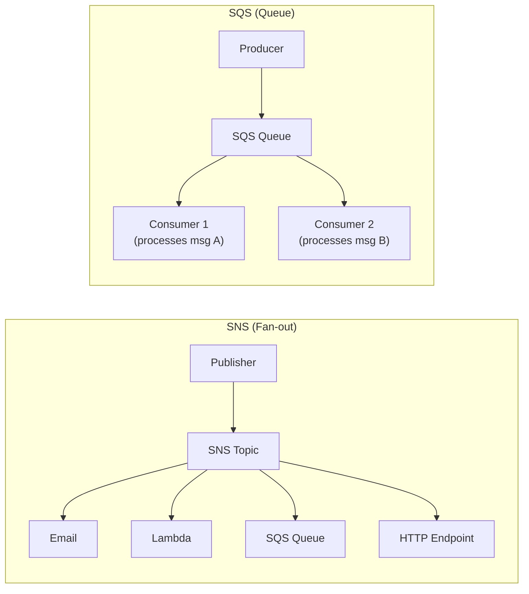
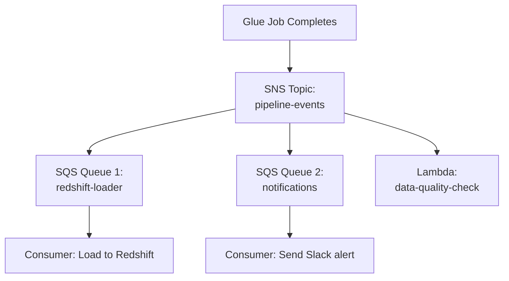

# AWS SNS & SQS — Fundamentals

## What Are SNS and SQS?

**Amazon SNS (Simple Notification Service)** is a **pub/sub messaging service** that pushes messages to multiple subscribers simultaneously. One message, many receivers.

**Amazon SQS (Simple Queue Service)** is a **message queue** that decouples producers from consumers. Messages wait in a queue until a consumer pulls and processes them.

**The analogy:**
- **SNS** = A radio broadcast. The station (publisher) transmits once, and everyone tuned in (subscribers) hears it simultaneously. If you're not listening, you miss it.
- **SQS** = A mailbox. Someone drops a letter (message) in your mailbox (queue). It sits there until you check it. You process at your own pace, and the letter doesn't disappear until you've handled it.

> **Why SNS/SQS matter for DE:** Pipelines need alerting (SNS sends failure notifications to Slack/email), decoupling (SQS buffers events between fast producers and slow consumers), and reliability (dead-letter queues catch failed messages for reprocessing). These are the plumbing that makes event-driven pipelines reliable.

---

## SNS vs SQS at a Glance



The diagram contrasts SNS's one-to-many fan-out (a single publish reaches every subscriber) with SQS's one-to-one consumption (each message is processed and deleted by a single consumer). The table below summarizes the practical differences.

| Aspect | SNS | SQS |
|--------|-----|-----|
| **Model** | Pub/Sub (push) | Queue (pull) |
| **Delivery** | One-to-many (fan-out) | One-to-one (per message) |
| **Persistence** | No (fire-and-forget) | Yes (messages persist until consumed) |
| **Consumer** | Subscribers receive automatically | Consumer polls and deletes |
| **Ordering** | No guarantee (standard) | FIFO option available |
| **Retry** | Delivery retries per protocol | Visibility timeout + redrive to DLQ |
| **DE use** | Alerting, triggering multiple systems | Buffering, decoupling, reliable processing |

---

## Core Concepts

### SNS Concepts

| Concept | Description | DE Example |
|---------|-------------|------------|
| **Topic** | Named channel for messages | `pipeline-alerts`, `data-events` |
| **Publisher** | Sends messages to a topic | CloudWatch Alarm, Lambda, Step Functions |
| **Subscriber** | Receives messages from a topic | Email, Lambda, SQS, HTTP/S, SMS |
| **Message Filtering** | Route specific messages to specific subscribers | Only send CRITICAL alerts to PagerDuty |
| **Fan-out** | One message → multiple subscribers | Alert email + Slack + PagerDuty simultaneously |

### SQS Concepts

| Concept | Description | DE Example |
|---------|-------------|------------|
| **Queue** | Buffer for messages | `file-processing-queue` |
| **Message** | Payload up to 256 KB | `{"file": "s3://bucket/data.csv", "action": "process"}` |
| **Visibility Timeout** | Time a message is "hidden" while being processed | 5 minutes (if not deleted, reappears for retry) |
| **Dead-Letter Queue (DLQ)** | Catches messages that fail repeatedly | Messages that failed 3 times → DLQ for investigation |
| **Retention Period** | How long messages stay in queue | 4 days (default), up to 14 days |
| **FIFO Queue** | Exactly-once, ordered delivery | Process events in exact order received |
| **Long Polling** | Efficient wait for messages (reduces empty responses) | Consumer waits up to 20 sec for messages |

---

## Common Pattern: SNS + SQS Fan-out



**Why fan-out?** One pipeline event triggers multiple independent actions. Each SQS queue processes at its own pace. If the Redshift loader is slow, it doesn't block notifications.

---

## SNS: Pipeline Alerting Setup

```python
import boto3

sns = boto3.client('sns')

# Create a topic for pipeline alerts
topic = sns.create_topic(Name='data-pipeline-alerts')
topic_arn = topic['TopicArn']

# Subscribe email
sns.subscribe(
    TopicArn=topic_arn,
    Protocol='email',
    Endpoint='data-team@company.com'
)

# Subscribe Lambda (for Slack integration)
sns.subscribe(
    TopicArn=topic_arn,
    Protocol='lambda',
    Endpoint='arn:aws:lambda:us-east-1:123456789:function:slack-notifier'
)

# Publish an alert (from your pipeline code)
sns.publish(
    TopicArn=topic_arn,
    Subject='Pipeline FAILED: daily-etl',
    Message='The daily-etl Glue job failed at 2024-01-15 03:45 UTC.\n\nError: OutOfMemoryError\nJob Run ID: jr_abc123',
    MessageAttributes={
        'severity': {'DataType': 'String', 'StringValue': 'CRITICAL'},
        'pipeline': {'DataType': 'String', 'StringValue': 'daily-etl'}
    }
)
```

### SNS Message Filtering (Route by Severity)

```python
# Only send CRITICAL alerts to PagerDuty
sns.subscribe(
    TopicArn=topic_arn,
    Protocol='https',
    Endpoint='https://events.pagerduty.com/integration/...',
    Attributes={
        'FilterPolicy': '{"severity": ["CRITICAL"]}'
    }
)

# Send all alerts to Slack
sns.subscribe(
    TopicArn=topic_arn,
    Protocol='lambda',
    Endpoint='arn:aws:lambda:us-east-1:123456789:function:slack-notifier',
    Attributes={
        'FilterPolicy': '{"severity": ["CRITICAL", "WARNING", "INFO"]}'
    }
)
```

---

## SQS: Decoupling Pipeline Components

```python
import boto3
import json

sqs = boto3.client('sqs')

# Create a queue with DLQ
dlq = sqs.create_queue(QueueName='file-processing-dlq')
dlq_arn = sqs.get_queue_attributes(
    QueueUrl=dlq['QueueUrl'],
    AttributeNames=['QueueArn']
)['Attributes']['QueueArn']

queue = sqs.create_queue(
    QueueName='file-processing-queue',
    Attributes={
        'VisibilityTimeout': '300',  # 5 minutes to process
        'MessageRetentionPeriod': '345600',  # 4 days
        'RedrivePolicy': json.dumps({
            'deadLetterTargetArn': dlq_arn,
            'maxReceiveCount': '3'  # After 3 failures → DLQ
        })
    }
)

queue_url = queue['QueueUrl']

# --- Producer: Enqueue files to process ---
def enqueue_file(file_path):
    sqs.send_message(
        QueueUrl=queue_url,
        MessageBody=json.dumps({
            'file': file_path,
            'timestamp': '2024-01-15T10:00:00Z',
            'source': 'raw-ingestion'
        })
    )

enqueue_file('s3://raw-data/orders/2024-01-15/part-001.parquet')
enqueue_file('s3://raw-data/orders/2024-01-15/part-002.parquet')

# --- Consumer: Process files from queue ---
def process_messages():
    while True:
        response = sqs.receive_message(
            QueueUrl=queue_url,
            MaxNumberOfMessages=10,
            WaitTimeSeconds=20  # Long polling
        )
        
        for message in response.get('Messages', []):
            try:
                body = json.loads(message['Body'])
                process_file(body['file'])  # Your processing logic
                
                # Delete message after successful processing
                sqs.delete_message(
                    QueueUrl=queue_url,
                    ReceiptHandle=message['ReceiptHandle']
                )
            except Exception as e:
                # Message becomes visible again after VisibilityTimeout
                # After 3 failures, goes to DLQ
                print(f"Failed to process: {e}")
```

---

## Dead-Letter Queue (DLQ) Pattern

```
Normal Queue                     Dead-Letter Queue
┌──────────────┐                ┌──────────────────┐
│ msg A        │ → Process ✓   │                  │
│ msg B        │ → Fail (1/3)  │                  │
│ msg B        │ → Fail (2/3)  │                  │
│ msg B        │ → Fail (3/3)  │ msg B (failed)   │ → Investigate & reprocess
│ msg C        │ → Process ✓   │                  │
└──────────────┘                └──────────────────────┘
```

**DLQ monitoring for DE:**
```python
# Alert when DLQ has messages (something is failing!)
# CloudWatch Alarm on ApproximateNumberOfMessagesVisible > 0
import boto3

cloudwatch = boto3.client('cloudwatch')
cloudwatch.put_metric_alarm(
    AlarmName='DLQ-Has-Messages',
    Namespace='AWS/SQS',
    MetricName='ApproximateNumberOfMessagesVisible',
    Dimensions=[{'Name': 'QueueName', 'Value': 'file-processing-dlq'}],
    Statistic='Sum',
    Period=60,
    EvaluationPeriods=1,
    Threshold=0,
    ComparisonOperator='GreaterThanThreshold',
    AlarmActions=['arn:aws:sns:us-east-1:123456789:pipeline-alerts']
)
```

---

## FIFO Queue (Ordered Processing)

```python
# FIFO queue: guarantees order and exactly-once delivery
fifo_queue = sqs.create_queue(
    QueueName='ordered-events.fifo',  # Must end in .fifo
    Attributes={
        'FifoQueue': 'true',
        'ContentBasedDeduplication': 'true'  # Auto-dedup by message body hash
    }
)

# Send with MessageGroupId (orders within a group are strictly ordered)
sqs.send_message(
    QueueUrl=fifo_queue['QueueUrl'],
    MessageBody='{"order_id": "123", "action": "created"}',
    MessageGroupId='order-123'  # All events for order 123 arrive in order
)
sqs.send_message(
    QueueUrl=fifo_queue['QueueUrl'],
    MessageBody='{"order_id": "123", "action": "updated"}',
    MessageGroupId='order-123'
)
```

> **DE use case for FIFO:** When processing CDC events — you need INSERT before UPDATE before DELETE for the same record to arrive in order.

---

## Key DE Use Cases

1. **Pipeline Alerting** — SNS sends failure notifications to email/Slack/PagerDuty
2. **Decoupling Producers & Consumers** — S3 events → SQS → Lambda processor (handle backpressure)
3. **Fan-out Processing** — SNS topic triggers multiple downstream systems simultaneously
4. **Dead-Letter Queues** — Catch and investigate failed pipeline messages
5. **Event-Driven Pipelines** — New file arrives → SQS message → trigger processing
6. **Ordered CDC Processing** — FIFO queues for sequential event processing

---

## SNS/SQS vs Alternatives

| Aspect | SNS + SQS | Kinesis Data Streams | EventBridge | Kafka (MSK) |
|--------|-----------|---------------------|-------------|-------------|
| **Model** | Pub/Sub + Queue | Stream (ordered log) | Event bus (rules) | Stream (ordered log) |
| **Ordering** | FIFO optional | Per-shard guaranteed | Per-rule | Per-partition guaranteed |
| **Retention** | Up to 14 days (SQS) | Up to 365 days | None (pass-through) | Configurable (unlimited) |
| **Throughput** | High (auto-scales) | Shard-based (manual) | High (auto) | Partition-based (manual) |
| **Consumer model** | Delete after processing | Multiple consumers, replay | Rules → targets | Consumer groups, replay |
| **Best for DE** | Alerting, decoupling, simple events | Real-time streaming, replay | Scheduling, cross-account events | High-volume streaming, multi-consumer |
| **Cost** | Per message ($0.40/million) | Per shard-hour ($0.015/hr) | Per event ($1/million) | Per broker-hour |

---

## Interview Tips

> **Tip 1:** "What's the difference between SNS and SQS?" — "SNS is pub/sub (push, fan-out) — one message goes to many subscribers simultaneously, fire-and-forget. SQS is a queue (pull, one-to-one) — messages persist until a consumer processes and deletes them. They're often used together: SNS fans out to multiple SQS queues, giving each consumer its own reliable buffer."

> **Tip 2:** "How do you handle failed messages in a pipeline?" — "Dead-letter queues (DLQ). Configure a redrive policy: after N failed processing attempts (e.g., 3), the message moves to a DLQ instead of being retried forever. Set a CloudWatch alarm on the DLQ's message count to alert the team. Then investigate: read DLQ messages, fix the bug, and reprocess. This prevents pipeline stalls and data loss."

> **Tip 3:** "When would you use SQS vs Kinesis for a data pipeline?" — "SQS for: decoupling (buffering between components), handling bursty workloads, simple processing where ordering doesn't matter. Kinesis for: real-time streaming, when you need ordering guarantees, multiple consumers reading the same data, or the ability to replay events. Rule of thumb: if you need sub-second latency or replay capability, use Kinesis. If you need simple decoupling with automatic scaling, use SQS."
