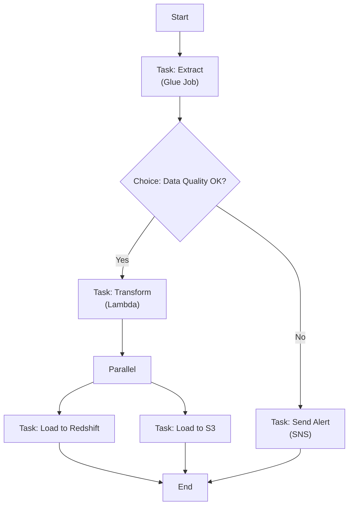

# AWS Step Functions — Fundamentals


## 🎯 Analogy

Think of Step Functions like a visual workflow engine: each state is a step (Lambda, Glue Job, wait, choice), and Step Functions orchestrates the sequence, handles retries, and records every state transition — like Airflow but fully serverless.

---
## What Are AWS Step Functions?

AWS Step Functions is a **serverless orchestration service** that lets you coordinate multiple AWS services into complex workflows using visual state machines. You define your workflow as a series of steps (states), and Step Functions handles execution, retries, error handling, and parallelism.

**The analogy:** If your data pipeline is a recipe, Step Functions is the chef following each step in order — chopping vegetables, boiling water, combining ingredients — deciding what to do next based on what happened in the previous step (burnt? retry. out of stock? skip to alternative).

> **Why Step Functions matters for DE:** Data pipelines often involve multiple services (Glue jobs, Lambda transforms, EMR clusters, SNS notifications). Step Functions lets you orchestrate them declaratively with built-in retry logic, error handling, and visual monitoring — no server to manage.

---

## How Step Functions Works



**What this shows:**
- You define workflows as JSON (Amazon States Language - ASL)
- Each step is a "state" with a defined type (Task, Choice, Parallel, etc.)
- Step Functions manages state transitions, retries, and error handling
- Built-in visual console shows execution status in real-time
- Two workflow types: Standard (long-running) and Express (high-volume, short)

---

## Core State Types

| State Type | Purpose | DE Example |
|-----------|---------|------------|
| **Task** | Execute work (Lambda, Glue, ECS, SDK call) | Run a Glue ETL job |
| **Choice** | Branch logic (if/else) | Skip transform if no new data |
| **Parallel** | Run branches concurrently | Load to Redshift AND S3 simultaneously |
| **Wait** | Pause for time or timestamp | Wait 5 min for Glue job warm-up |
| **Map** | Loop over items (dynamic parallelism) | Process each partition file independently |
| **Pass** | Pass input to output (transform/inject data) | Add metadata to state |
| **Succeed** | Mark successful completion | Pipeline finished |
| **Fail** | Mark failure with error/cause | Pipeline failed validation |

---

## Basic Workflow Definition (ASL)

```json
{
  "Comment": "Daily ETL Pipeline",
  "StartAt": "ExtractData",
  "States": {
    "ExtractData": {
      "Type": "Task",
      "Resource": "arn:aws:states:::glue:startJobRun.sync",
      "Parameters": {
        "JobName": "raw-to-staging-extract",
        "Arguments": {
          "--source_date.$": "$.execution_date"
        }
      },
      "Retry": [
        {
          "ErrorEquals": ["Glue.ConcurrentRunsExceededException"],
          "IntervalSeconds": 60,
          "MaxAttempts": 3,
          "BackoffRate": 2.0
        }
      ],
      "Catch": [
        {
          "ErrorEquals": ["States.ALL"],
          "Next": "NotifyFailure"
        }
      ],
      "Next": "CheckDataQuality"
    },
    "CheckDataQuality": {
      "Type": "Choice",
      "Choices": [
        {
          "Variable": "$.rowCount",
          "NumericGreaterThan": 0,
          "Next": "TransformData"
        }
      ],
      "Default": "NotifyNoData"
    },
    "TransformData": {
      "Type": "Task",
      "Resource": "arn:aws:states:::glue:startJobRun.sync",
      "Parameters": {
        "JobName": "staging-to-curated-transform"
      },
      "Next": "LoadInParallel"
    },
    "LoadInParallel": {
      "Type": "Parallel",
      "Branches": [
        {
          "StartAt": "LoadToRedshift",
          "States": {
            "LoadToRedshift": {
              "Type": "Task",
              "Resource": "arn:aws:lambda:us-east-1:123456789:function:load-redshift",
              "End": true
            }
          }
        },
        {
          "StartAt": "LoadToS3Curated",
          "States": {
            "LoadToS3Curated": {
              "Type": "Task",
              "Resource": "arn:aws:states:::glue:startJobRun.sync",
              "Parameters": {
                "JobName": "write-curated-parquet"
              },
              "End": true
            }
          }
        }
      ],
      "Next": "PipelineSuccess"
    },
    "PipelineSuccess": {
      "Type": "Succeed"
    },
    "NotifyFailure": {
      "Type": "Task",
      "Resource": "arn:aws:states:::sns:publish",
      "Parameters": {
        "TopicArn": "arn:aws:sns:us-east-1:123456789:pipeline-alerts",
        "Message": "ETL pipeline failed!"
      },
      "Next": "PipelineFailed"
    },
    "NotifyNoData": {
      "Type": "Task",
      "Resource": "arn:aws:states:::sns:publish",
      "Parameters": {
        "TopicArn": "arn:aws:sns:us-east-1:123456789:pipeline-alerts",
        "Message": "No data to process today."
      },
      "Next": "PipelineSuccess"
    },
    "PipelineFailed": {
      "Type": "Fail",
      "Error": "PipelineError",
      "Cause": "ETL pipeline encountered an unrecoverable error."
    }
  }
}
```

---

## Map State — Dynamic Parallelism

Process collections of items in parallel (e.g., files, partitions, tables):

```json
{
  "ProcessPartitions": {
    "Type": "Map",
    "ItemsPath": "$.partitions",
    "MaxConcurrency": 10,
    "Iterator": {
      "StartAt": "ProcessOnePartition",
      "States": {
        "ProcessOnePartition": {
          "Type": "Task",
          "Resource": "arn:aws:lambda:us-east-1:123456789:function:process-partition",
          "End": true
        }
      }
    },
    "Next": "AllPartitionsDone"
  }
}
```

> **Use case:** You have 50 partition files to process. Map state launches up to 10 concurrent Lambda executions, processes all 50 files, and continues when all are complete.

---

## Standard vs Express Workflows

| Aspect | Standard | Express |
|--------|----------|---------|
| **Max duration** | 1 year | 5 minutes |
| **Execution model** | Exactly-once | At-least-once (async) or at-most-once (sync) |
| **Pricing** | Per state transition ($0.025/1000) | Per execution + duration |
| **Best for** | ETL pipelines, long jobs | High-volume event processing |
| **History** | 90-day execution history | CloudWatch Logs only |
| **DE use** | Orchestrate Glue/EMR workflows | Real-time micro-batching |

---

## Key DE Use Cases

1. **ETL Pipeline Orchestration** — Chain Glue jobs: extract → validate → transform → load
2. **Data Quality Gates** — Use Choice states to halt pipelines on bad data
3. **Fan-out Processing** — Map state to process multiple tables/partitions in parallel
4. **Cross-service Coordination** — Start EMR cluster → run Spark job → terminate cluster → notify
5. **Error Recovery** — Built-in retry with exponential backoff + catch blocks for alerting

---

## Step Functions vs Airflow vs Glue Workflows

| Aspect | Step Functions | Airflow (MWAA) | Glue Workflows |
|--------|---------------|----------------|----------------|
| **Hosting** | Fully serverless | Managed (MWAA) or self-hosted | Fully serverless |
| **Definition** | JSON (ASL) | Python (DAGs) | Console/API |
| **Complexity** | Medium workflows | Complex, multi-dependency DAGs | Simple Glue-only chains |
| **Scheduling** | EventBridge (external) | Built-in scheduler + cron | Built-in triggers |
| **Integrations** | 200+ AWS services native | Any system (operators/hooks) | Glue Jobs + Crawlers only |
| **Monitoring** | Visual console + CloudWatch | Web UI + logs | Console + CloudWatch |
| **Cost** | $0.025/1000 transitions | ~$350+/month (MWAA small) | Free (pay for Glue jobs) |
| **Best for** | AWS-native orchestration | Complex multi-system DAGs | Simple Glue-only pipelines |

> **Decision framework:** Use Step Functions for AWS-native pipelines with moderate complexity. Use Airflow when you need complex scheduling, cross-system orchestration (Snowflake, dbt, APIs), or DAG-of-DAGs patterns. Use Glue Workflows only for simple Glue-job chaining.

---

## Triggering Step Functions

```python
import boto3

# Start execution via SDK
sfn_client = boto3.client('stepfunctions')

response = sfn_client.start_execution(
    stateMachineArn='arn:aws:states:us-east-1:123456789:stateMachine:DailyETL',
    name='daily-etl-2024-01-15',
    input='{"execution_date": "2024-01-15", "source": "orders"}'
)

print(f"Execution ARN: {response['executionArn']}")
```

**Common triggers for DE:**
- **EventBridge Schedule** — Daily/hourly cron trigger
- **S3 Event** — New file arrives → start processing
- **API Gateway** — On-demand pipeline runs
- **Another Step Function** — Nested workflows

---


## ▶️ Try It Yourself

```python
import boto3
import json

sfn = boto3.client("stepfunctions", region_name="us-east-1")

# State machine definition (simplified)
definition = {
    "Comment": "ETL pipeline",
    "StartAt": "ExtractData",
    "States": {
        "ExtractData": {
            "Type": "Task",
            "Resource": "arn:aws:lambda:us-east-1:123:function:extract",
            "Next": "TransformData",
            "Retry": [{"ErrorEquals": ["States.ALL"], "MaxAttempts": 2}],
        },
        "TransformData": {
            "Type": "Task",
            "Resource": "arn:aws:lambda:us-east-1:123:function:transform",
            "End": True,
        },
    },
}

# Start execution
resp = sfn.start_execution(
    stateMachineArn="arn:aws:states:us-east-1:123:stateMachine:etl-pipeline",
    input=json.dumps({"date": "2024-01-15"}),
)
print("Execution ARN:", resp["executionArn"])
```

> **Run it:** Copy the snippet into a REPL or file and run it — no external services needed for the basic example.

---
## Interview Tips

> **Tip 1:** "What are Step Functions?" — "A serverless orchestration service that coordinates AWS services into workflows using state machines. You define states (Task, Choice, Parallel, Map) in JSON. Built-in retry/catch for error handling, visual execution monitoring, and native integration with 200+ AWS services. Two types: Standard (long-running ETL) and Express (high-volume, short)."

> **Tip 2:** "Step Functions vs Airflow?" — "Step Functions is serverless with deep AWS integration — great for AWS-native pipelines with built-in retries and visual monitoring. Airflow is better for complex multi-system orchestration (Snowflake, dbt, Spark, APIs), advanced scheduling, and when you need Python-defined logic. Cost: Step Functions is cheaper for simple workflows; Airflow (MWAA) has a baseline ~$350/month but scales better for hundreds of DAGs."

> **Tip 3:** "How would you handle errors in Step Functions?" — "Three layers: (1) Retry blocks with exponential backoff for transient errors (throttling, timeouts). (2) Catch blocks to route to error-handling states (send SNS alert, write to DLQ). (3) Choice states as data quality gates before expensive operations. Always define a Catch-all at the top-level to ensure no silent failures."
