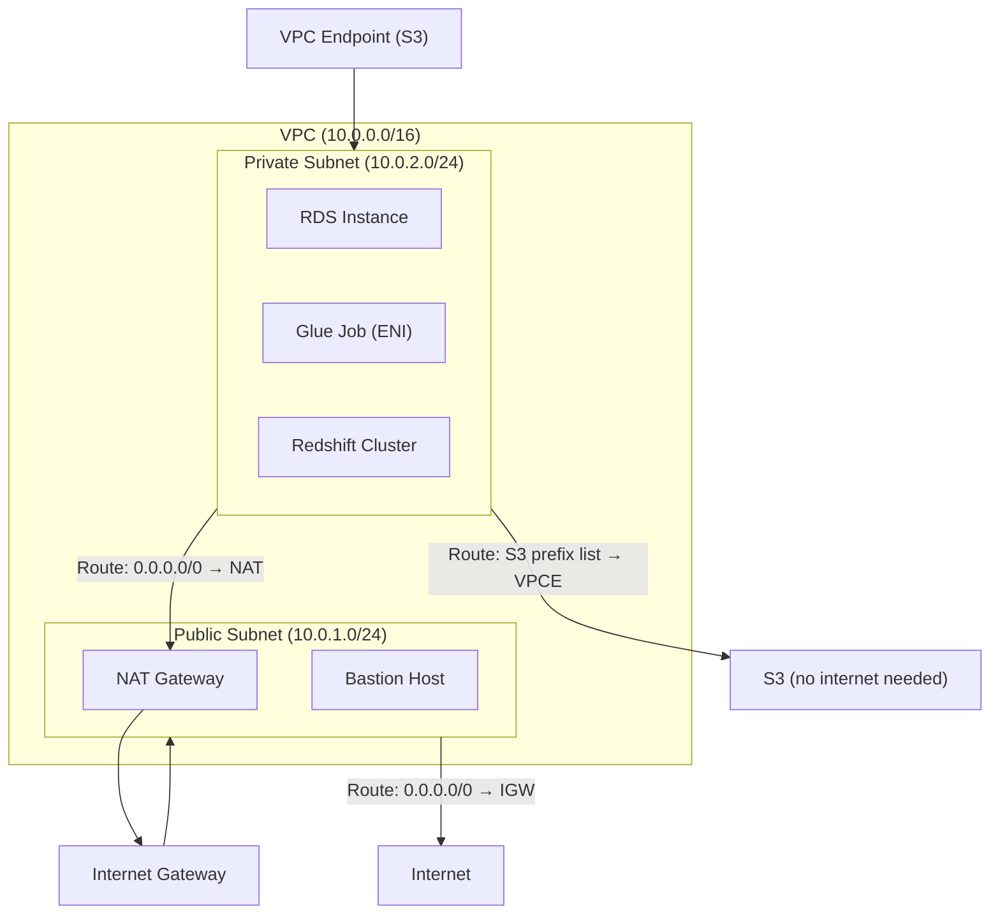

# AWS VPC — Fundamentals

## What Is Amazon VPC?

Amazon Virtual Private Cloud (VPC) is your **private, isolated network within AWS**. It lets you control IP address ranges, create subnets, configure route tables, and manage network gateways. Every AWS resource that needs network connectivity lives in a VPC.

**The analogy:** A VPC is like your own office building within a massive business park (AWS region). You control which floors (subnets) are public-facing (lobby) vs private (server room), who can enter (security groups), and how people travel between floors (route tables). The internet is outside your building — you choose which doors to open and which to keep locked.

> **Why VPC matters for DE:** Many DE services (Glue, EMR, Redshift, RDS) run inside VPCs. Understanding networking is critical when Glue jobs need to connect to private RDS databases, when EMR clusters need internet access for package downloads, or when Redshift must stay private but still access S3. Misconfigured VPCs cause "connection timeout" errors that waste hours of debugging.

---

## How VPC Works



**What this shows:**
- Public subnets have a route to the Internet Gateway (can reach/be reached from internet)
- Private subnets route through NAT Gateway for outbound internet (no inbound)
- VPC Endpoints provide private access to S3/DynamoDB without internet
- DE services (Glue, RDS, Redshift) live in private subnets for security

---

## Core Concepts

| Concept | Description | DE Relevance |
|---------|-------------|--------------|
| **VPC** | Isolated virtual network (CIDR block) | Container for all network resources |
| **Subnet** | IP range within a VPC, tied to one AZ | Public vs private placement of services |
| **Route Table** | Rules for where network traffic goes | Route to internet, NAT, or VPC endpoint |
| **Internet Gateway (IGW)** | Connects VPC to the internet | Public subnet access |
| **NAT Gateway** | Outbound-only internet for private subnets | Glue/EMR downloading packages |
| **Security Group** | Instance-level firewall (stateful) | Allow Glue to connect to RDS on port 5432 |
| **Network ACL (NACL)** | Subnet-level firewall (stateless) | Broad subnet-level rules |
| **VPC Endpoint** | Private connection to AWS services | Glue accessing S3 without internet |
| **VPC Peering** | Connect two VPCs privately | Cross-account data lake access |
| **ENI (Elastic Network Interface)** | Virtual network card | Glue job gets ENI in your VPC |

---

## Public vs Private Subnets

| Aspect | Public Subnet | Private Subnet |
|--------|--------------|----------------|
| **Route to internet** | Via Internet Gateway | Via NAT Gateway (outbound only) |
| **Reachable from internet** | Yes (if security group allows) | No |
| **Typical residents** | Load balancers, bastion hosts, NAT GW | RDS, Redshift, Glue ENIs, EMR |
| **DE services** | Rarely (maybe bastion for SSH) | Almost everything |

> **DE rule:** Put data services (RDS, Redshift, EMR) in private subnets. They should not be reachable from the public internet.

---

## Security Groups for DE

```bash
# Security group for RDS (allow connections from Glue and EMR)
aws ec2 create-security-group \
  --group-name "rds-data-sources" \
  --description "Allow DE services to connect to RDS" \
  --vpc-id vpc-abc123

# Allow Glue to connect on PostgreSQL port
aws ec2 authorize-security-group-ingress \
  --group-id sg-rds123 \
  --protocol tcp \
  --port 5432 \
  --source-group sg-glue456  # Glue's security group

# Security group for Glue (self-referencing for Glue-to-Glue communication)
aws ec2 authorize-security-group-ingress \
  --group-id sg-glue456 \
  --protocol tcp \
  --port 0-65535 \
  --source-group sg-glue456  # Required: Glue workers talk to each other
```

**Critical Glue requirement:** Glue jobs running in a VPC need a security group that allows ALL TCP traffic from itself (self-referencing rule). Without this, Glue workers can't communicate and jobs fail silently.

---

## VPC Endpoints — Private Access to AWS Services

```bash
# Gateway Endpoint for S3 (free, recommended)
aws ec2 create-vpc-endpoint \
  --vpc-id vpc-abc123 \
  --service-name com.amazonaws.us-east-1.s3 \
  --route-table-ids rtb-private123

# Interface Endpoint for Glue (charges apply)
aws ec2 create-vpc-endpoint \
  --vpc-id vpc-abc123 \
  --service-name com.amazonaws.us-east-1.glue \
  --vpc-endpoint-type Interface \
  --subnet-ids subnet-private1 subnet-private2 \
  --security-group-ids sg-vpce123
```

| Endpoint Type | Services | Cost | How It Works |
|--------------|----------|------|--------------|
| **Gateway** | S3, DynamoDB | Free | Adds route to route table |
| **Interface** | Glue, Secrets Manager, KMS, etc. | ~$0.01/hr + data | Creates ENI in subnet |

> **Why this matters:** Without a VPC endpoint for S3, a Glue job in a private subnet needs a NAT Gateway to reach S3 — NAT charges $0.045/GB processed. With an S3 Gateway Endpoint: free and faster.

---

## Common DE Networking Patterns

### Pattern 1: Glue Job Connecting to Private RDS

```
Requirements:
1. Glue job needs a "Connection" with VPC, subnet, security group
2. Glue security group must allow self-referencing (all TCP from itself)
3. RDS security group must allow inbound from Glue security group on DB port
4. Private subnet needs NAT Gateway (for Glue to download dependencies)
   OR VPC endpoints for required services
```

```python
# Glue Connection configuration (via Terraform)
# resource "aws_glue_connection" "rds_connection" {
#   name = "rds-orders-connection"
#   connection_properties = {
#     JDBC_CONNECTION_URL = "jdbc:postgresql://mydb.abc123.us-east-1.rds.amazonaws.com:5432/orders"
#     USERNAME = "glue_user"
#     PASSWORD = "..."  # Better: reference Secrets Manager
#   }
#   physical_connection_requirements {
#     availability_zone      = "us-east-1a"
#     security_group_id_list = ["sg-glue456"]
#     subnet_id              = "subnet-private1"
#   }
# }
```

### Pattern 2: Private Redshift with S3 Access

```
Redshift in private subnet needs:
1. S3 Gateway VPC Endpoint (for COPY/UNLOAD commands)
2. Glue Interface VPC Endpoint (for Spectrum/Catalog access)
3. No internet access required!
```

### Pattern 3: EMR in Private Subnet

```
EMR needs outbound internet for:
- Downloading packages (pip, conda, Maven)
- Accessing public APIs

Options:
1. NAT Gateway (easiest, costs $0.045/GB)
2. VPC Endpoints + custom AMI with pre-installed packages (cheaper)
```

---

## Troubleshooting VPC Issues (DE Focus)

| Symptom | Likely Cause | Fix |
|---------|-------------|-----|
| Glue job timeout connecting to RDS | Security group misconfigured | Add inbound rule: Glue SG → RDS SG on port 5432 |
| Glue job can't reach S3 | No NAT or VPC endpoint | Add S3 Gateway Endpoint to route table |
| Glue workers can't communicate | Missing self-referencing rule | Allow all TCP inbound from own security group |
| EMR can't download packages | No outbound internet | Add NAT Gateway or pre-bake AMI |
| Redshift COPY fails | No S3 endpoint or IAM role | Add S3 VPC endpoint + check Redshift IAM role |
| Lambda timeout in VPC | No NAT Gateway | Add NAT or use VPC endpoint for target service |

---

## Key DE Use Cases

1. **Glue in VPC** — Connect to private RDS/Redshift for ETL
2. **EMR Networking** — Private cluster with NAT for package downloads
3. **Private Redshift** — No public access, S3 via VPC endpoint
4. **Cross-Account Access** — VPC Peering or PrivateLink for shared data lake
5. **Security Compliance** — All data services in private subnets, no internet exposure

---

## VPC vs Alternatives/Complements

| Aspect | VPC (networking) | Security Groups | NACLs | AWS PrivateLink |
|--------|-----------------|-----------------|-------|-----------------|
| **Scope** | Entire network isolation | Instance-level | Subnet-level | Service-to-service |
| **Stateful?** | N/A | Yes (tracks connections) | No (rules both ways) | N/A |
| **Granularity** | IP ranges, routes | Port + protocol + source | Port + protocol + IP | Endpoint services |
| **DE use** | Where services live | Who can talk to whom | Broad subnet restrictions | Cross-account private access |

---

## Interview Tips

> **Tip 1:** "Why does a Glue job need VPC configuration?" — "When a Glue job needs to connect to a private resource like RDS or Redshift, it must run inside the same VPC (or a peered VPC). Glue gets an ENI (network interface) in your subnet. You need: (1) a security group with self-referencing rule for worker communication, (2) the target's security group must allow inbound from Glue, (3) a NAT Gateway or VPC endpoints for S3 access."

> **Tip 2:** "How does Redshift access S3 without internet?" — "Via an S3 Gateway VPC Endpoint — it's free and adds a route in the private subnet's route table that directs S3 traffic privately through AWS's backbone network. No NAT Gateway needed, no internet traffic. This is the standard pattern for COPY/UNLOAD commands and Redshift Spectrum."

> **Tip 3:** "How do you troubleshoot a Glue job timing out?" — "Check three things in order: (1) Security groups — does the RDS security group allow inbound from Glue's security group on the database port? (2) Network path — is the Glue Connection configured with the correct subnet and VPC? (3) Self-referencing rule — Glue workers need all TCP allowed from their own security group. These three fix 90% of Glue connectivity issues."
