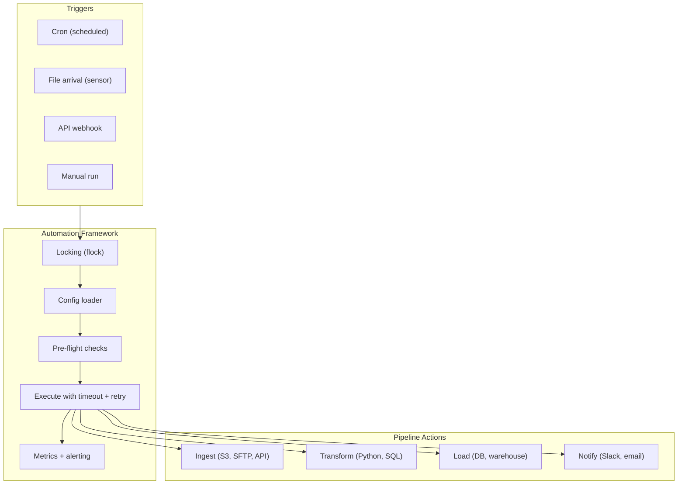

# Bash Automation Patterns — Senior-Level Deep Dive

## Production Automation Architecture



This shows the layered automation architecture: any trigger → shared framework (locking, config, validation, monitoring) → specific actions. The framework provides reliability; the actions provide business logic.

---

## Infrastructure Automation for DE

### Server Setup Automation

```bash
#!/bin/bash
# Bootstrap a new ETL server from scratch (run once on new VM)
set -euo pipefail

echo "=== ETL Server Setup ==="

# Install dependencies
apt-get update && apt-get install -y \
    python3 python3-pip python3-venv \
    postgresql-client \
    awscli jq flock \
    pigz mawk

# Create ETL user and directories
useradd -m -s /bin/bash etl_user
mkdir -p /opt/etl/{scripts,lib,config,bin}
mkdir -p /data/{landing,processing,archive,errors,output}
mkdir -p /var/log/etl
chown -R etl_user:etl_user /opt/etl /data /var/log/etl

# Install Python dependencies
su - etl_user -c "
    python3 -m venv /opt/etl/venv
    source /opt/etl/venv/bin/activate
    pip install pandas sqlalchemy psycopg2-binary boto3 great-expectations
"

# Deploy cron jobs
cp /opt/setup/crontab.conf /etc/cron.d/etl-pipelines
chmod 644 /etc/cron.d/etl-pipelines

# Setup log rotation
cat > /etc/logrotate.d/etl << 'EOF'
/var/log/etl/*.log {
    daily
    rotate 14
    compress
    missingok
    notifempty
}
EOF

echo "=== Setup Complete ==="
```

### Self-Healing Infrastructure

```bash
#!/bin/bash
# Self-healing: detect and fix common infrastructure issues automatically

check_and_fix() {
    local issue="$1" check="$2" fix="$3"
    
    if ! eval "$check" 2>/dev/null; then
        echo "DETECTED: $issue — applying fix..."
        eval "$fix"
        
        # Verify fix worked
        if eval "$check" 2>/dev/null; then
            echo "  FIXED: $issue ✓"
        else
            echo "  UNFIXED: $issue — manual intervention needed!"
            alert "$issue could not be auto-fixed"
        fi
    fi
}

# Common self-healing checks:
check_and_fix "Disk >90% full" \
    "[ \$(df /data --output=pcent | tail -1 | tr -d '% ') -lt 90 ]" \
    "find /data/archive -mtime +7 -delete; find /tmp -mtime +1 -delete"

check_and_fix "ETL service stopped" \
    "systemctl is-active etl-watcher.service" \
    "systemctl restart etl-watcher.service"

check_and_fix "Stale lock file (>6 hours)" \
    "[ ! -f /tmp/daily_etl.lock ] || [ \$(( \$(date +%s) - \$(stat -c%Y /tmp/daily_etl.lock) )) -lt 21600 ]" \
    "rm -f /tmp/daily_etl.lock"

check_and_fix "Log directory permissions" \
    "[ -w /var/log/etl ]" \
    "chmod 755 /var/log/etl; chown etl_user:etl_user /var/log/etl"
```

---

## Backfill Automation

```bash
#!/bin/bash
# Automated backfill: re-process historical date range
# Usage: ./backfill.sh 2024-01-01 2024-03-15 [--parallel=4]

set -euo pipefail

START_DATE="$1"
END_DATE="$2"
PARALLEL="${3:-1}"
[[ "$PARALLEL" == --parallel=* ]] && PARALLEL="${PARALLEL#*=}"

echo "Backfill: $START_DATE to $END_DATE (parallelism: $PARALLEL)"

# Generate date range
dates=()
current="$START_DATE"
while [[ "$current" < "$END_DATE" ]] || [[ "$current" == "$END_DATE" ]]; do
    dates+=("$current")
    current=$(date -d "$current + 1 day" +%Y-%m-%d)
done
echo "Dates to process: ${#dates[@]}"

# Process with controlled parallelism
process_date() {
    local date="$1"
    echo "[$(date +%H:%M:%S)] Processing: $date"
    python /opt/etl/daily_pipeline.py --date="$date" --mode=backfill 2>&1 | \
        tee "/var/log/etl/backfill_${date}.log" > /dev/null
    echo "[$(date +%H:%M:%S)] Done: $date (exit: $?)"
}
export -f process_date

printf '%s\n' "${dates[@]}" | xargs -P "$PARALLEL" -I {} bash -c 'process_date "$@"' _ {}

echo "Backfill complete: ${#dates[@]} dates processed"
```

---

## Automated Testing for ETL Scripts

```bash
#!/bin/bash
# Test harness for ETL bash scripts (CI/CD integration)

TEST_DIR="/opt/etl/tests"
FAILURES=0
TOTAL=0

run_test() {
    local test_name="$1"
    local test_script="$2"
    TOTAL=$((TOTAL + 1))
    
    echo -n "  Testing: $test_name... "
    if bash "$test_script" > /tmp/test_output_$$ 2>&1; then
        echo "✓"
    else
        echo "✗ FAILED"
        echo "    Output: $(head -3 /tmp/test_output_$$)"
        FAILURES=$((FAILURES + 1))
    fi
    rm -f /tmp/test_output_$$
}

echo "=== ETL Script Tests ==="

# Test: utils library loads without error
run_test "utils.sh loads" "$TEST_DIR/test_utils_load.sh"

# Test: validate_csv function works
run_test "validate_csv passes valid file" "$TEST_DIR/test_validate_csv_valid.sh"
run_test "validate_csv rejects empty file" "$TEST_DIR/test_validate_csv_empty.sh"

# Test: retry function works
run_test "retry succeeds on 2nd attempt" "$TEST_DIR/test_retry_success.sh"
run_test "retry fails after max attempts" "$TEST_DIR/test_retry_failure.sh"

# Test: config loading
run_test "config loads production" "$TEST_DIR/test_config_production.sh"
run_test "config rejects missing vars" "$TEST_DIR/test_config_missing.sh"

echo ""
echo "Results: $((TOTAL - FAILURES))/$TOTAL passed, $FAILURES failed"
[ $FAILURES -eq 0 ] && exit 0 || exit 1

# Run in CI: bash /opt/etl/tests/run_all_tests.sh
# Gates: deployment blocked if any test fails
```

---

## Disaster Recovery Automation

```bash
#!/bin/bash
# Automated DR: detect primary failure, switch to secondary, alert
set -euo pipefail

PRIMARY_DB="prod-db.us-east-1.rds.amazonaws.com"
SECONDARY_DB="replica-db.us-west-2.rds.amazonaws.com"
CONFIG_FILE="/opt/etl/.env"
HEALTH_LOG="/var/log/dr/health.log"
FAILOVER_LOG="/var/log/dr/failover.log"

check_primary() {
    pg_isready -h "$PRIMARY_DB" -p 5432 -t 5 -q
}

failover_to_secondary() {
    echo "[$(date)] FAILOVER: Primary unreachable, switching to secondary" >> "$FAILOVER_LOG"
    
    # Update config to point to secondary
    sed -i "s|DB_HOST=.*|DB_HOST=$SECONDARY_DB|" "$CONFIG_FILE"
    
    # Restart services that use the DB connection
    systemctl restart etl-watcher.service
    
    # Alert
    alert "🚨 DATABASE FAILOVER: Primary $PRIMARY_DB unreachable! Switched to $SECONDARY_DB" "critical"
    
    echo "[$(date)] Failover complete: now using $SECONDARY_DB" >> "$FAILOVER_LOG"
}

# Health check loop (run as a service)
CONSECUTIVE_FAILURES=0
MAX_FAILURES=3

while true; do
    if check_primary; then
        CONSECUTIVE_FAILURES=0
        echo "[$(date)] Primary: healthy" >> "$HEALTH_LOG"
    else
        CONSECUTIVE_FAILURES=$((CONSECUTIVE_FAILURES + 1))
        echo "[$(date)] Primary: UNREACHABLE ($CONSECUTIVE_FAILURES/$MAX_FAILURES)" >> "$HEALTH_LOG"
        
        if [ $CONSECUTIVE_FAILURES -ge $MAX_FAILURES ]; then
            failover_to_secondary
            break  # Stop checking (manual intervention to fail back)
        fi
    fi
    
    sleep 30
done
```

---

## Interview Tips

> **Tip 1:** "How do you automate backfills?" — Generate date range, process each date with the same pipeline script (passing --date parameter). Control parallelism with xargs -P N (don't overwhelm the database). Log per-date output separately. Same code as daily run — just parameterized with historical dates.

> **Tip 2:** "Self-healing automation?" — Scripts that: detect common issues (disk full, stale locks, stopped services) → apply automated fixes → verify fix worked → alert if unfixable. Run every 5 minutes. Handles 80% of incidents without human intervention. Only pages on-call for issues that can't be auto-fixed.

> **Tip 3:** "How do you test bash ETL scripts?" — Test harness: run test scripts that exercise functions with known inputs, check exit codes and outputs. Test in CI: `bash run_tests.sh` gates deployment. Test categories: library functions (unit), config loading (integration), full pipeline (smoke test on sample data). Not as rich as pytest, but catches most regressions.
