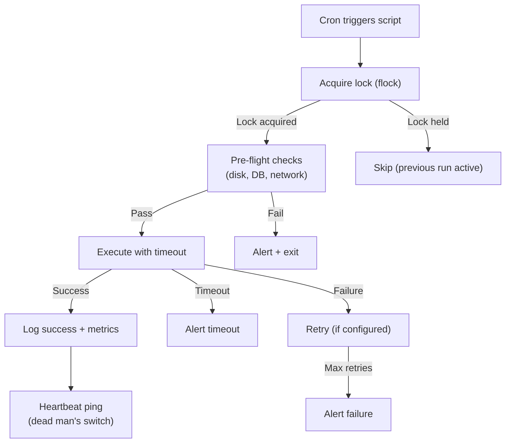

# Cron Jobs — Senior-Level Deep Dive

## Reliable Cron Architecture



This architecture ensures: no overlap (flock), pre-validation (don't waste compute if dependencies are down), bounded execution (timeout), failure handling (retry + alert), and positive confirmation (heartbeat on success).

---

## Dead Man's Switch (Alert on Missing Execution)

```bash
# Problem: how do you alert when a cron job DOESN'T run?
# (crashed silently, server down, cron daemon stopped)

# Solution: "Dead Man's Switch" — ping an external service on SUCCESS
# If the service doesn't receive a ping within expected interval → alerts YOU

# Pattern: last line of script pings the monitoring endpoint
#!/bin/bash
# /opt/etl/daily_pipeline.sh

# ... your ETL logic ...
python /opt/etl/transform.py

# If we get here: job succeeded! Ping the health check endpoint:
curl -fsS "https://hc-ping.com/your-unique-uuid" > /dev/null
# OR: curl -fsS "https://cronitor.io/ping/abc123" > /dev/null
# OR: curl -fsS "https://healthchecks.io/ping/uuid" > /dev/null

# If script FAILS or DOESN'T RUN:
# → No ping sent → monitoring service alerts after expected interval
# Free services: healthchecks.io, cronitor.io, deadmanssnitch.com

# Crontab:
# 0 6 * * * /opt/etl/daily_pipeline.sh >> /var/log/etl/daily.log 2>&1
# Expected: ping received daily at ~6:05 AM
# If no ping by 7:00 AM → alert: "daily_pipeline has not reported in!"
```

---

## Cron Job Observability Stack

```bash
#!/bin/bash
# Emit structured metrics from cron jobs (for dashboards/alerting)

METRICS_FILE="/var/log/metrics/cron_metrics.json"

emit_metric() {
    local job="$1" status="$2" duration="$3" rows="${4:-0}"
    echo "{\"job\":\"$job\",\"status\":\"$status\",\"duration_s\":$duration,\"rows\":$rows,\"timestamp\":\"$(date -Iseconds)\"}" >> "$METRICS_FILE"
}

# In your cron scripts:
start=$(date +%s)
python /opt/etl/daily_orders.py
exit_code=$?
duration=$(( $(date +%s) - start ))

if [ $exit_code -eq 0 ]; then
    rows=$(python -c "import json; print(json.load(open('/tmp/last_run.json'))['rows'])" 2>/dev/null || echo 0)
    emit_metric "daily_orders" "success" "$duration" "$rows"
else
    emit_metric "daily_orders" "failed" "$duration" "0"
fi

# Metrics consumed by: Prometheus node_exporter textfile collector,
# Datadog custom metrics, or a simple Grafana JSON datasource
# Dashboard shows: job success rate, duration trends, row counts over time
```

---

## Cron Job Testing Framework

```bash
#!/bin/bash
# Test cron jobs locally before deploying (simulate cron environment)

simulate_cron_env() {
    # Cron runs with minimal environment — simulate that!
    env -i \
        HOME=/home/dataeng \
        SHELL=/bin/bash \
        PATH=/usr/local/bin:/usr/bin:/bin \
        LANG=en_US.UTF-8 \
        bash -c "$1"
}

# Test your script in cron-like environment:
echo "Testing in simulated cron environment..."
simulate_cron_env "/opt/etl/daily_pipeline.sh"
exit_code=$?

if [ $exit_code -eq 0 ]; then
    echo "✓ Script works in cron environment"
else
    echo "✗ Script FAILS in cron environment (exit: $exit_code)"
    echo "  Likely causes: missing PATH, env vars, or relative paths"
fi

# Run all cron scripts through the simulator:
for script in /opt/etl/*.sh; do
    echo -n "Testing $(basename $script)... "
    if simulate_cron_env "$script --dry-run" > /dev/null 2>&1; then
        echo "✓"
    else
        echo "✗ FAILS in cron env!"
    fi
done
```

---

## Handling Cron at Scale (50+ Jobs)

```bash
# PROBLEM: 50 cron jobs on one server become unmaintainable
# SOLUTION: Structured cron management system

# Directory-based organization:
/opt/etl/
├── cron.d/                    # Cron definitions (deployed as files)
│   ├── 00-ingestion.cron      # Grouped by domain
│   ├── 10-transformation.cron
│   ├── 20-reporting.cron
│   └── 90-maintenance.cron
├── scripts/
│   ├── ingestion/
│   ├── transformation/
│   └── reporting/
└── deploy_crons.sh            # Deploys all cron definitions

# deploy_crons.sh: combines all .cron files into one crontab
cat /opt/etl/cron.d/*.cron | crontab -
echo "Deployed $(crontab -l | grep -cv '^#\|^$') active cron entries"

# Benefits:
# - Each domain/team manages their own .cron file
# - Git-tracked (review changes, rollback if broken)
# - Numbered prefix controls ordering in combined file
# - deploy_crons.sh called by CI/CD on merge to main
```

---

## Cron Job Dependency Management (Poor Man's DAG)

```bash
#!/bin/bash
# Simple dependency: job B only runs if job A succeeded

# Job A writes a success marker on completion:
# In daily_ingest.sh:
# ... ingestion logic ...
# touch /tmp/markers/ingest_$(date +%Y%m%d)_done

# Job B checks for marker before running:
# Cron: 30 6 * * * /opt/etl/transform_with_deps.sh

MARKER="/tmp/markers/ingest_$(date +%Y%m%d)_done"
MAX_WAIT=3600  # Wait up to 1 hour for dependency

waited=0
while [ ! -f "$MARKER" ]; do
    sleep 60
    waited=$((waited + 60))
    if [ $waited -ge $MAX_WAIT ]; then
        echo "TIMEOUT: Dependency (ingest) not complete after $MAX_WAIT seconds!"
        # Alert and exit
        exit 1
    fi
    echo "Waiting for ingest to complete... (${waited}s)"
done

echo "Dependency satisfied! Starting transformation..."
python /opt/etl/transform.py

# Cleanup old markers:
find /tmp/markers -name "*_done" -mtime +7 -delete
```

---

## Interview Tips

> **Tip 1:** "How do you know a cron job stopped running?" — Dead Man's Switch: script pings an external service (healthchecks.io) on success. If no ping received within expected window → service alerts you. This catches: script failures, server outages, cron daemon crashes, and any other reason the job didn't complete.

> **Tip 2:** "How do you manage 50+ cron jobs?" — Directory-based config files (per-domain .cron files), git-tracked, deployed via CI/CD script that combines them into one crontab. Benefits: version control, code review for schedule changes, easy rollback, team ownership per domain file.

> **Tip 3:** "How do you implement job dependencies with cron?" — Marker files: Job A writes a "done" file on completion. Job B polls for the marker before starting (with timeout). Simple but effective for 2-5 step chains. For complex dependencies (10+ steps with fan-in/out): use Airflow instead (cron dependency patterns don't scale well).

## ⚡ Cheat Sheet

**Cron syntax**
```
MIN  HOUR  DAY  MONTH  WEEKDAY
*    *     *    *      *        # every minute
0    8     *    *      1-5      # 8am Mon-Fri
0    0     1    *      *        # midnight 1st of month
*/15 *     *    *      *        # every 15 minutes
0    6,18  *    *      *        # 6am and 6pm daily
```

**Crontab best practices**
```bash
# Always set PATH and environment in crontab
PATH=/usr/local/sbin:/usr/local/bin:/usr/sbin:/usr/bin:/sbin:/bin
MAILTO=alerts@company.com
# Redirect output explicitly
0 8 * * * /scripts/etl.sh >> /var/log/etl.log 2>&1
# Silence cron mail for expected no-output jobs
0 8 * * * /scripts/etl.sh > /dev/null 2>&1
```

**Prevent overlapping runs**
```bash
# Use flock in cron
0 * * * * flock -n /tmp/etl.lock /scripts/etl.sh
# Or check PID file
[ -f /tmp/etl.pid ] && kill -0 $(cat /tmp/etl.pid) 2>/dev/null && exit 0
echo $$ > /tmp/etl.pid; trap "rm /tmp/etl.pid" EXIT
```

**Monitoring cron jobs**
```bash
# Healthchecks.io / Dead Man's Snitch pattern
0 8 * * * /scripts/etl.sh && curl -s https://hc-ping.com/UUID > /dev/null
# Log duration
START=$(date +%s); /scripts/etl.sh; echo "Duration: $(($(date +%s)-START))s"
```

**Systemd timers (modern alternative)**
```ini
# /etc/systemd/system/etl.timer
[Timer]
OnCalendar=*-*-* 08:00:00
Persistent=true   # runs missed jobs after downtime
[Install]
WantedBy=timers.target
```

**Key gotchas**
- Cron environment is minimal — no `~/.bashrc`; always use full paths
- `MAILTO=""` disables email; set to alerting address in prod
- `@reboot` runs once at boot — useful for startup scripts
- Test with `run-parts --test /etc/cron.daily`
