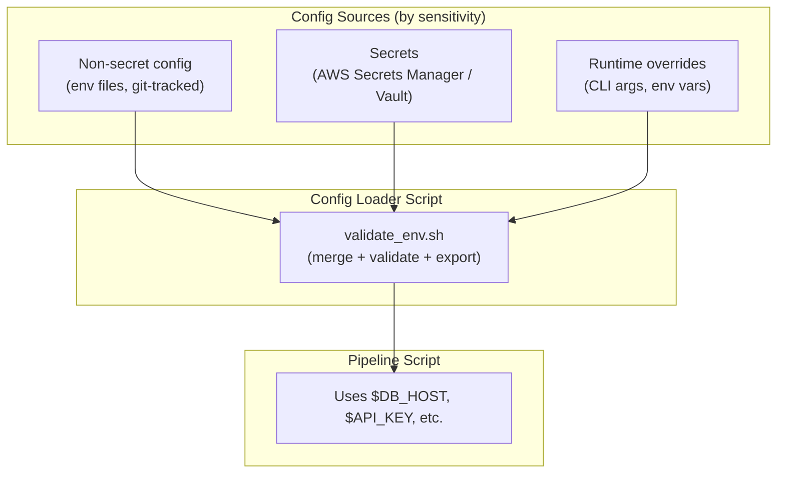

# Environment Variables — Senior-Level Deep Dive

## Production Configuration Architecture



```bash
#!/bin/bash
# /opt/etl/lib/load_config.sh — unified config loader
# Sources: .env file (base) + secrets manager (secrets) + CLI overrides

load_config() {
    local env="${ENVIRONMENT:-production}"
    
    # Layer 1: Base config (non-secret, version-controlled)
    local base_config="/opt/etl/config/${env}.env"
    if [ -f "$base_config" ]; then
        set -a; source "$base_config"; set +a
    fi
    
    # Layer 2: Secrets (fetched from secrets manager)
    if command -v aws &>/dev/null; then
        export DB_PASSWORD=$(aws secretsmanager get-secret-value \
            --secret-id "${env}/etl/db_password" --query SecretString --output text 2>/dev/null || echo "")
        export API_KEY=$(aws secretsmanager get-secret-value \
            --secret-id "${env}/etl/api_key" --query SecretString --output text 2>/dev/null || echo "")
    fi
    
    # Layer 3: CLI overrides (highest priority)
    # Any explicitly-set env vars before calling this script take precedence
    # (they were already set, source won't overwrite them with set -a)
    
    # Validation
    local required=(DB_HOST DB_PORT DB_USER DB_PASSWORD S3_BUCKET)
    local missing=()
    for var in "${required[@]}"; do
        [ -z "${!var:-}" ] && missing+=("$var")
    done
    
    if [ ${#missing[@]} -gt 0 ]; then
        echo "ERROR: Missing required config: ${missing[*]}" >&2
        return 1
    fi
    
    echo "Config loaded: env=$env, db=$DB_HOST, s3=$S3_BUCKET"
}

# Usage in any script:
source /opt/etl/lib/load_config.sh
load_config || exit 1
```

---

## Secret Rotation Handling

```bash
#!/bin/bash
# Handle secret rotation gracefully (cached secrets may expire)

CACHE_DIR="/tmp/secret_cache"
CACHE_TTL=3600  # 1 hour cache

get_secret() {
    local name="$1"
    local cache_file="$CACHE_DIR/${name//\//_}"
    
    # Check cache (avoid API call on every invocation)
    if [ -f "$cache_file" ]; then
        local age=$(( $(date +%s) - $(stat -c %Y "$cache_file") ))
        if [ $age -lt $CACHE_TTL ]; then
            cat "$cache_file"
            return 0
        fi
    fi
    
    # Cache miss or expired — fetch fresh
    mkdir -p "$CACHE_DIR"
    chmod 700 "$CACHE_DIR"
    
    local value=$(aws secretsmanager get-secret-value \
        --secret-id "$name" --query SecretString --output text)
    
    if [ -n "$value" ]; then
        echo "$value" > "$cache_file"
        chmod 600 "$cache_file"
        echo "$value"
    else
        # Fetch failed — try to use stale cache as fallback
        [ -f "$cache_file" ] && cat "$cache_file" || return 1
    fi
}

# Handle rotation mid-pipeline:
connect_to_db() {
    export DB_PASSWORD=$(get_secret "prod/db/password")
    
    if ! psql -h "$DB_HOST" -U "$DB_USER" -c "SELECT 1" 2>/dev/null; then
        # Connection failed — secret may have rotated
        rm -f "$CACHE_DIR/prod_db_password"  # Invalidate cache
        export DB_PASSWORD=$(get_secret "prod/db/password")  # Fetch fresh
        
        psql -h "$DB_HOST" -U "$DB_USER" -c "SELECT 1" || {
            echo "ERROR: Cannot connect even with fresh credentials!"
            return 1
        }
    fi
}
```

---

## Configuration Drift Detection

```bash
#!/bin/bash
# Detect when config differs between environments (prevents "works in staging, breaks in prod")

compare_environments() {
    local env1_file="/opt/etl/config/$1.env"
    local env2_file="/opt/etl/config/$2.env"
    
    echo "=== Config differences: $1 vs $2 ==="
    
    # Extract variable names from each
    local vars1=$(grep -oP '^\w+' "$env1_file" | sort)
    local vars2=$(grep -oP '^\w+' "$env2_file" | sort)
    
    # Variables in env1 but not env2:
    local only_in_1=$(comm -23 <(echo "$vars1") <(echo "$vars2"))
    [ -n "$only_in_1" ] && echo "Only in $1: $only_in_1"
    
    # Variables in env2 but not env1:
    local only_in_2=$(comm -13 <(echo "$vars1") <(echo "$vars2"))
    [ -n "$only_in_2" ] && echo "Only in $2: $only_in_2"
    
    # Variables with different values (excluding secrets):
    while IFS='=' read -r key value; do
        [[ "$key" =~ PASSWORD|SECRET|KEY|TOKEN ]] && continue  # Skip secrets
        local val2=$(grep "^${key}=" "$env2_file" | cut -d'=' -f2-)
        [ "$value" != "$val2" ] && [ -n "$val2" ] && \
            echo "  DIFF: $key = '$value' ($1) vs '$val2' ($2)"
    done < "$env1_file"
}

# Usage: detect drift before deploying to production
compare_environments "staging" "production"
# Shows: what's different between staging and prod config
# Catches: "Oh, staging has a new FEATURE_FLAG that prod doesn't!"
```

---

## CI/CD Environment Variable Management

```bash
# In CI/CD (GitHub Actions), secrets come from the platform:
# GitHub: Settings → Secrets → add DB_PASSWORD, API_KEY, etc.
# In workflow: ${{ secrets.DB_PASSWORD }}

# Pattern: CI/CD injects secrets at deploy time into the runtime environment

# GitHub Actions workflow snippet:
# env:
#   DB_HOST: ${{ vars.DB_HOST }}        # Non-secret (vars)
#   DB_PASSWORD: ${{ secrets.DB_PASSWORD }}  # Secret (masked in logs!)
#   ENVIRONMENT: production
#
# run: |
#   /opt/etl/deploy.sh
#   # DB_HOST, DB_PASSWORD, ENVIRONMENT all available as env vars

# Terraform/IaC pattern: inject env vars into the compute resource
# aws_ecs_task_definition.env:
#   environment {
#     name  = "DB_HOST"
#     value = var.db_host
#   }
#   secrets {
#     name      = "DB_PASSWORD"
#     valueFrom = "arn:aws:secretsmanager:..."
#   }
```

---

## Interview Tips

> **Tip 1:** "How do you handle configuration across dev/staging/prod?" — Layered approach: (1) Base config in git-tracked env files (non-secrets), (2) Secrets from a secrets manager (fetched at runtime), (3) CLI overrides for one-off changes. Validation function checks all required vars are present before pipeline starts. Same code, different config = same behavior guarantees.

> **Tip 2:** "What if a secret rotates during a running pipeline?" — Cache secrets with TTL (1 hour). On connection failure: invalidate cache, re-fetch secret, retry connection. If still fails after fresh fetch: alert (indicates actual auth issue, not rotation). Pattern: cache → use → on error: refresh → retry → alert.

> **Tip 3:** "How do you prevent config drift between environments?" — Compare script: extract var names from each env file, diff them. Check before deployment: "staging has var X that production doesn't" → catch missing config before it causes production failures. Automate in CI: block deployment if environments have structural differences.

## ⚡ Cheat Sheet

**Variable types**
```bash
VAR=value           # shell variable (not exported)
export VAR=value    # environment variable (exported to child processes)
local VAR=value     # function-local variable
readonly VAR=value  # immutable variable
declare -i VAR=0    # integer variable
declare -a ARR=()   # indexed array
declare -A MAP=()   # associative array
```

**Safe variable usage**
```bash
${VAR:-default}     # use default if VAR unset or empty
${VAR:=default}     # set VAR to default if unset, then use it
${VAR:?error msg}   # error and exit if VAR unset
${VAR:+alt}         # use alt if VAR is set (test for presence)
${#VAR}             # length of VAR
${VAR%suffix}       # remove shortest suffix match
${VAR%%suffix}      # remove longest suffix match
${VAR#prefix}       # remove shortest prefix match
${VAR/old/new}      # replace first occurrence
${VAR//old/new}     # replace all occurrences
```

**Secrets and credentials**
```bash
# Never hardcode — always load from environment or secrets manager
DB_PASS=$(aws secretsmanager get-secret-value --secret-id db/prod --query SecretString --output text | jq -r .password)
# Mask in logs
set +x  # disable trace before loading secrets
source .env  # or use direnv / dotenv
set -x  # re-enable if needed
# Clear after use
unset DB_PASS
```

**`.env` file pattern**
```bash
# .env (never commit — add to .gitignore)
export DB_HOST=prod-db.company.com
export DB_PASS=secret
# Load: source .env or use direnv (.envrc)
```

**Scoping rules**
- Exported vars are inherited by child processes but changes in children don't propagate up
- `env -i bash` starts a clean shell with no inherited vars (useful for testing)
- `printenv` shows all exported vars; `set` shows all shell vars including unexported

**Defensive patterns**
```bash
: "${REQUIRED_VAR:?REQUIRED_VAR must be set}"  # fail fast if missing
[ "${ENV:-}" = "prod" ] && readonly IMMUTABLE=true  # lock prod config
```
