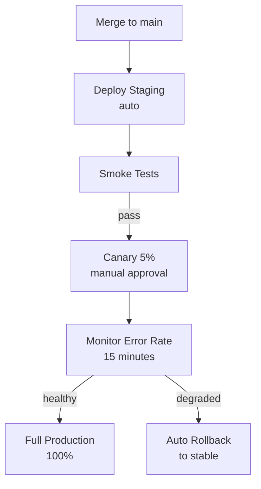

# Deployment Strategies — Senior Deep Dive

## Progressive Delivery Architecture



## Argo Rollouts for Canary

```yaml
apiVersion: argoproj.io/v1alpha1
kind: Rollout
metadata:
  name: revenue-pipeline
spec:
  strategy:
    canary:
      steps:
        - setWeight: 5     # 5% to canary
        - pause: {duration: 10m}
        - setWeight: 20
        - pause: {duration: 10m}
        - setWeight: 100
      analysis:
        templates:
          - templateName: error-rate-check
        args:
          - name: service-name
            value: revenue-pipeline
```

## ⚡ Cheat Sheet

```bash
# Rolling rollback
kubectl rollout undo deployment/pipeline
kubectl rollout undo deployment/pipeline --to-revision=3

# Blue-green: switch service selector
kubectl patch service pipeline   -p '{"spec":{"selector":{"version":"green"}}}'

# Canary: scale replicas
kubectl scale deployment pipeline-canary --replicas=1
kubectl scale deployment pipeline-stable --replicas=9

# Feature flag: no code deploy needed
aws ssm put-parameter --name /pipeline/ff/revenue_v2 --value true --overwrite

# dbt: selective deploy
dbt run --select state:modified+ --defer --state prod-artifacts/
```
