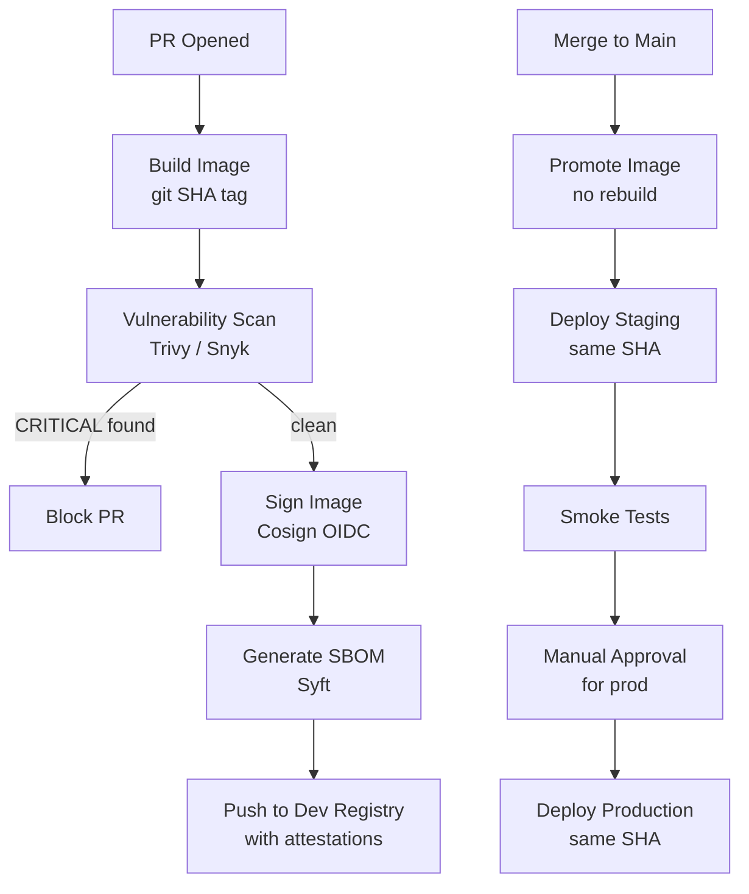

# Docker Builds — Senior Deep Dive

## Build System Architecture



---

## Build Provenance and Attestations

```yaml
# Full supply chain security workflow
- name: Build with provenance
  uses: docker/build-push-action@v6
  with:
    context: .
    push: true
    tags: registry/pipeline:${{ github.sha }}
    # Provenance: proves where/how the image was built
    provenance: true
    # SBOM: lists all packages in the image
    sbom: true

- name: Sign with Cosign (OIDC — no keys needed)
  run: |
    cosign sign --yes \
      registry/pipeline:${{ github.sha }}@${{ steps.build.outputs.digest }}
```

```bash
# Consumer verifies before deploying:
cosign verify \
  --certificate-identity "https://github.com/org/repo/.github/workflows/build.yml@refs/heads/main" \
  --certificate-oidc-issuer "https://token.actions.githubusercontent.com" \
  registry/pipeline:${{ github.sha }}
```

---

## Kaniko: Build in Kubernetes Without Docker Daemon

```yaml
# Airflow DAG: build image as part of data pipeline (rare but useful)
# Or: build in K8s CI without privileged Docker socket access

# Kubernetes Job using Kaniko
apiVersion: batch/v1
kind: Job
metadata:
  name: build-pipeline-image
spec:
  template:
    spec:
      containers:
        - name: kaniko
          image: gcr.io/kaniko-project/executor:latest
          args:
            - "--context=git://github.com/org/repo"
            - "--dockerfile=Dockerfile"
            - "--destination=registry/pipeline:latest"
            - "--cache=true"
            - "--cache-repo=registry/pipeline/cache"
      restartPolicy: Never
```

---

## Build Performance at Scale

```yaml
# Parallelized build with BuildKit
DOCKER_BUILDKIT=1 docker build \
  --build-arg BUILDKIT_INLINE_CACHE=1 \
  --cache-from type=registry,ref=registry/pipeline:buildcache \
  --cache-to type=registry,ref=registry/pipeline:buildcache,mode=max \
  --output type=image,name=registry/pipeline:$SHA,push=true \
  .

# Build Farm: distribute builds across multiple runners
jobs:
  build:
    strategy:
      matrix:
        runner: [ubuntu-latest, self-hosted-arm64]
    steps:
      - uses: docker/build-push-action@v6
        with:
          platforms: ${{ matrix.runner == 'self-hosted-arm64' && 'linux/arm64' || 'linux/amd64' }}
```

---

## ⚡ Cheat Sheet

```bash
# Build
docker build -t image:tag .
docker buildx build --platform linux/amd64,linux/arm64 --push -t registry/image:tag .

# GitHub Actions cache
cache-from: type=gha
cache-to: type=gha,mode=max

# Registry cache
cache-from: type=registry,ref=registry/image:buildcache
cache-to: type=registry,ref=registry/image:buildcache,mode=max

# Tagging
docker tag image:build image:$GIT_SHA
docker tag image:$GIT_SHA image:v2.0.0

# Scan
trivy image image:tag --exit-code 1 --severity CRITICAL

# Sign
cosign sign --yes registry/image:tag@sha256:<digest>

# Verify
cosign verify --certificate-identity <ci-url> --certificate-oidc-issuer <issuer> registry/image:tag

# SBOM
syft registry/image:tag -o spdx-json > sbom.json

# Inspect
docker manifest inspect registry/image:tag  # see platforms
docker buildx imagetools inspect registry/image:tag  # detailed

# Promote (no rebuild)
docker pull dev-registry/image:$SHA
docker tag dev-registry/image:$SHA prod-registry/image:$SHA
docker push prod-registry/image:$SHA

# Clean up old images (ECR)
aws ecr list-images --repository-name pipeline
aws ecr batch-delete-image --repository-name pipeline --image-ids imageTag=old-tag
```
