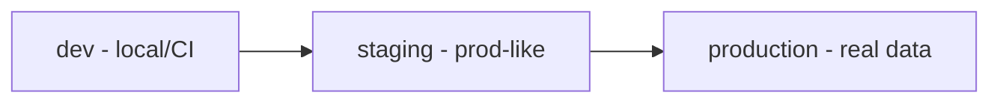

# Environment Management — Fundamentals


## 🎯 Analogy

Think of environment management like separate stages in a movie production: dev is the rehearsal room, staging is the dress rehearsal, production is opening night. Each has identical infrastructure but different data and access levels.

---
## The Stage Kitchen Analogy

A restaurant has a prep kitchen (staging) and main kitchen (production). Same recipes, same equipment — but mistakes in prep don't reach paying customers. Dev, staging, and prod work the same way: identical code and infrastructure shape, but separate databases, credentials, and data.

---

## The Three-Environment Model



---

## Environment Config Pattern

```python
import os

ENVIRONMENT = os.environ.get("ENVIRONMENT", "dev")

CONFIG = {
    "dev": {
        "db_url": "postgresql://localhost:5432/dev_db",
        "s3_bucket": "my-bucket-dev",
        "log_level": "DEBUG",
    },
    "staging": {
        "db_url": os.environ["STAGING_DB_URL"],
        "s3_bucket": "my-bucket-staging",
        "log_level": "INFO",
    },
    "production": {
        "db_url": os.environ["PROD_DB_URL"],
        "s3_bucket": "my-bucket-prod",
        "log_level": "WARNING",
    },
}[ENVIRONMENT]
```

---

## Secrets Management

```bash
# ❌ Never: hardcode or commit to git
DB_PASSWORD = "supersecret"

# ✅ Dev: local .env (in .gitignore)
# ✅ CI: GitHub Actions Secrets
# ✅ Production: AWS Secrets Manager

import boto3, json
def get_secret(name):
    client = boto3.client("secretsmanager", region_name="us-east-1")
    return json.loads(client.get_secret_value(SecretId=name)["SecretString"])
```

---

## dbt Profiles by Environment

```yaml
de_project:
  outputs:
    dev:
      type: snowflake
      database: DEV_DB
      password: "{{ env_var('DBT_PASSWORD') }}"
    prod:
      type: snowflake
      database: PROD_DB
      password: "{{ env_var('DBT_PASSWORD') }}"
```

```bash
dbt run --target dev   # local dev
dbt run --target prod  # production
```

---

## Environment Parity Principle

If staging uses SQLite but prod uses PostgreSQL, staging stops being useful. **Keep environments as similar as possible** — same database engine, same infrastructure shape, different data and credentials only.

## ▶️ Try It Yourself

```yaml
# .github/workflows/deploy.yml — environment promotion
name: Deploy Pipeline
on:
  push:
    branches: [main]

jobs:
  deploy-staging:
    runs-on: ubuntu-latest
    environment: staging
    steps:
      - uses: actions/checkout@v4
      - name: Deploy to staging
        run: ./deploy.sh staging
        env:
          DB_HOST: ${{ vars.STAGING_DB_HOST }}
          DB_PASSWORD: ${{ secrets.STAGING_DB_PASSWORD }}

  deploy-prod:
    runs-on: ubuntu-latest
    needs: deploy-staging
    environment:
      name: production
      url: https://data.mycompany.com
    steps:
      - name: Deploy to production
        run: ./deploy.sh production
        env:
          DB_HOST: ${{ vars.PROD_DB_HOST }}
          DB_PASSWORD: ${{ secrets.PROD_DB_PASSWORD }}
    # Production environment has 'required reviewers' configured in GitHub Settings
```

> **Run it:** Copy the snippet into a REPL or file — no external services needed for the basic example.

---
